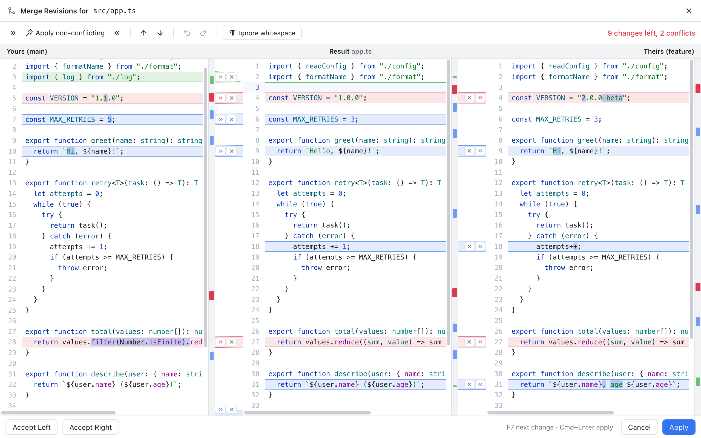
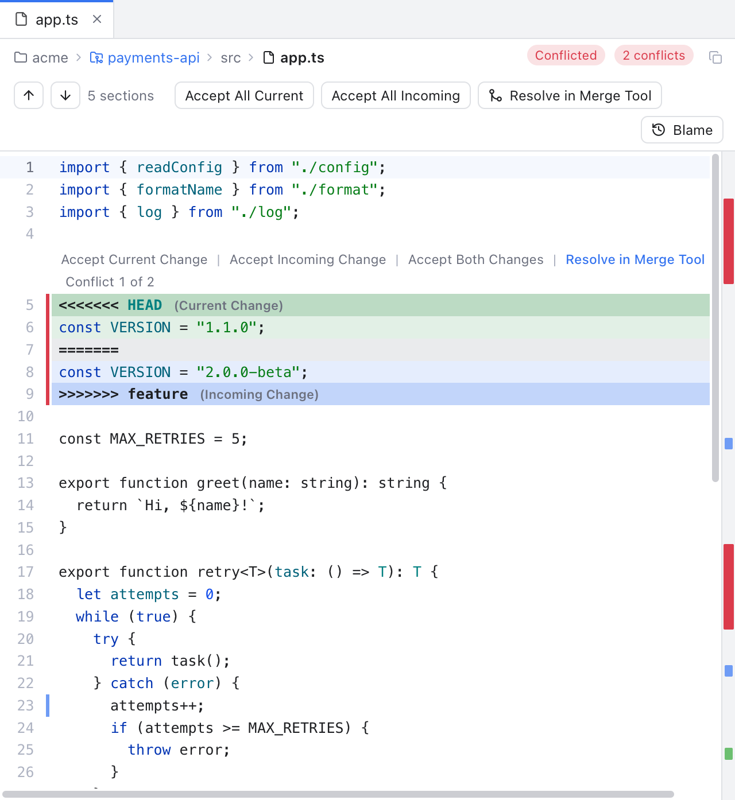
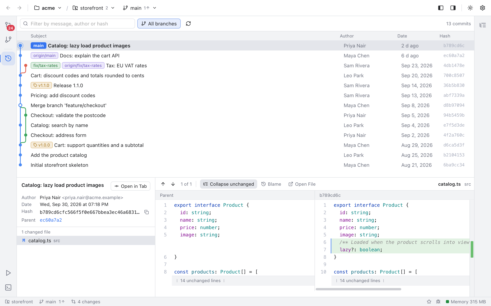
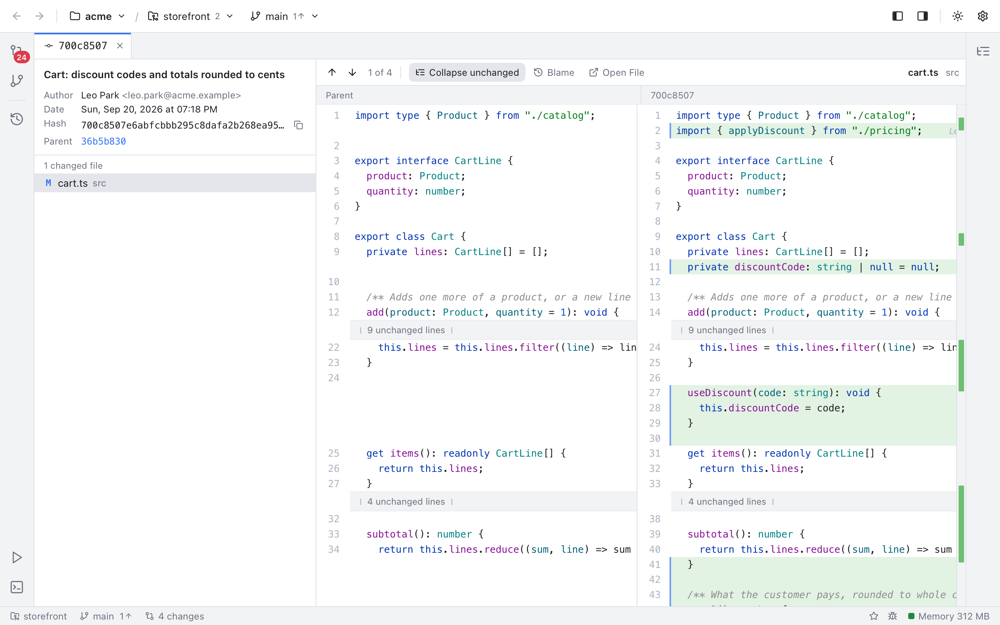
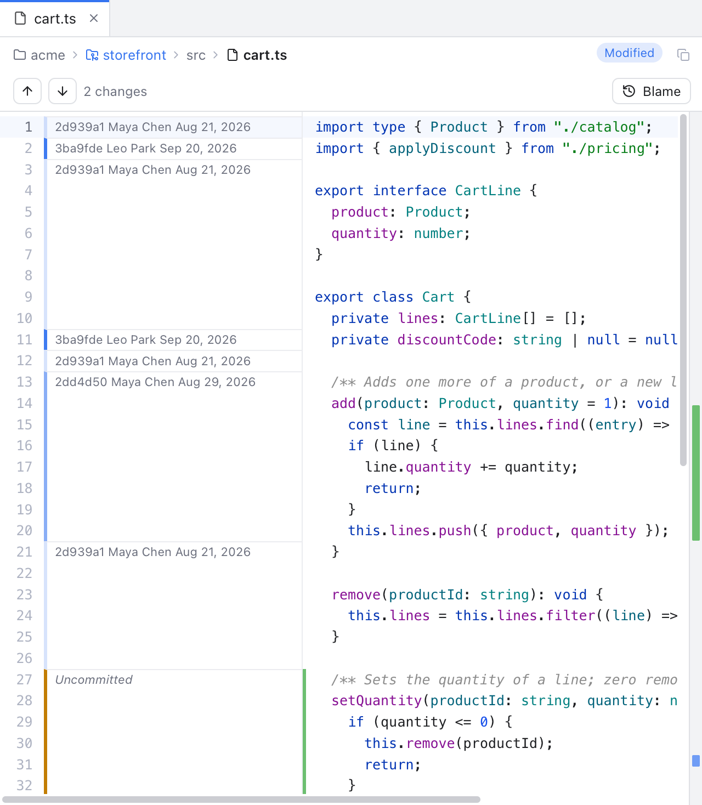
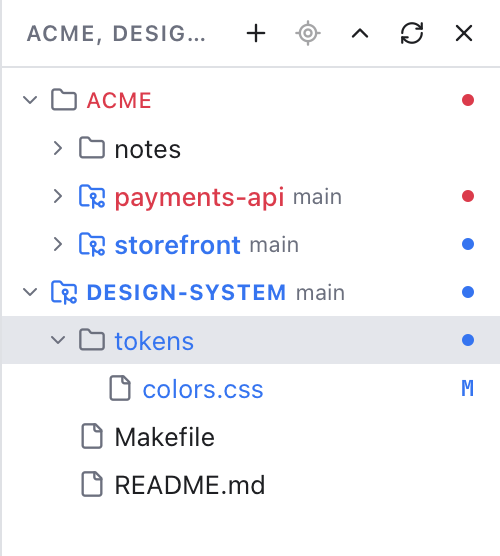

# Git Manager

A native desktop Git client with a JetBrains-style 3-way merge tool, VS Code-style workspaces, tabs, blame and history. Built with Rust (Tauri 2) and a small Svelte 5 UI running in the system web view, so it starts fast and stays light on memory.


**[Download the latest release](https://github.com/shibbirweb/git-manager/releases)** (macOS, Apple Silicon and Intel) · **[User guide and developer docs](https://github.com/shibbirweb/git-manager/wiki)** · **[Report a bug or request a feature](https://github.com/shibbirweb/git-manager/issues/new/choose)**

## Screenshots

<table>
  <tr>
    <td width="50%"><br><b>Merge tool</b>: Yours, Result and Theirs with per-change arrows</td>
    <td width="50%"><br><b>Conflicts in the editor</b>: Accept Current, Incoming or Both</td>
  </tr>
  <tr>
    <td><br><b>Log</b>: branch graph, tags and commit details</td>
    <td><br><b>Commit tabs</b>: a commit's diff in the whole editor area</td>
  </tr>
  <tr>
    <td><br><b>Changes</b>: grouped by repository, stage and commit</td>
    <td><br><b>Blame</b>: who changed each line, click to see the commit</td>
  </tr>
  <tr>
    <td><br><b>Workspaces</b>: many folders and repositories in one window</td>
    <td><br><b>Light and dark themes</b>, following the system by default</td>
  </tr>
</table>

Every feature has its own page with screenshots in the [wiki](https://github.com/shibbirweb/git-manager/wiki).

## Features

- **Workspaces like VS Code**: open any folder, whether it is one repository, many (nested ones included) or no git at all (initialize one from the app). Add more folders to the same window, save the set to a `.gitmanager-workspace` file, or open a VS Code `.code-workspace` file. Repositories you clone or create inside an open folder show up on their own.
- **3-way merge tool**: Yours | Result | Theirs panes with connectors, per-change apply and ignore buttons, "apply both" for conflicts, one-click *Apply non-conflicting*, word-level highlights, synchronized scrolling, F7 navigation, full undo and an ignore-whitespace mode.
- **Conflicts made easy**: a Conflicts dialog to take Yours or Theirs for whole files (binary and deleted files too), inline *Accept Current / Incoming / Both* actions in the editor, and Continue or Abort for merge, rebase, cherry-pick and revert.
- **Editor and tabs**: preview tabs (italic, like VS Code), breadcrumbs, change markers in the gutter and on the scrollbar, next and previous change, syntax highlighting, font ligatures and zoom with Ctrl + mouse wheel.
- **Changes**: staged and unstaged files grouped by repository, side-by-side diffs, stage or unstage whole files or single hunks, discard, commit and amend.
- **Blame**: GitLens-style blame for the current line and a blame gutter; click it to open that commit in the Log on the same line.
- **Log**: paged history with a branch graph, commit details and per-file diffs. Double-click a commit (or use *Open in Tab*) to read it full size in its own tab. Cherry-pick, revert, reset and checkout from the right-click menu.
- **Branches, tags, remotes and stashes**: checkout, create, rename, delete, merge and rebase; fetch, pull and push with live progress; stash, apply, pop and drop.
- **Back and Forward** across files, diffs and commits, like a browser.
- **Settings** saved in `~/.gitmanager` like VS Code's folder, a status bar with the app's memory use, and update checks with a stable and a beta channel.
- **Works as `git mergetool`** (see below).

## How it works

```
Svelte UI (system WKWebView)  --invoke/events-->  Rust (Tauri commands)
                                                    git2 (libgit2): fast reads (status, index stages, diff, log, refs)
                                                    git CLI: every write, so hooks, credentials, signing and config behave as in the terminal
                                                    merge engine: 3-way chunking with imara-diff (histogram)
                                                    watcher: debounced file events -> "repo-changed"
```

Memory is kept low by design:
- No bundled browser engine; the OS web view is used.
- Rust opens the repository per command and keeps no file contents between calls.
- Diffs load only for the selected file; CodeMirror renders only the visible lines; the log is paged and virtualized.
- Language grammars load on demand.
- The merge tool is an overlay in the main window, not a second web view.
- Release builds use `opt-level = "s"`, LTO, `panic = "abort"` and stripped symbols.

## Development

Requirements: Rust (stable), [Bun](https://bun.sh), and git. Bun runs every frontend tool on its own runtime (`bun --bun`), so no Node.js install is needed.

```sh
bun install          # frontend dependencies
bun tauri dev        # run the app with hot reload
bun run check        # svelte-check / TypeScript
bun run test         # frontend unit tests (Vitest)
cd src-tauri && cargo test   # Rust unit and git integration tests
bun tauri build      # release .app and .dmg in src-tauri/target/release/bundle
```

Open a repository from the welcome screen, or pass it on the command line:

```sh
src-tauri/target/release/git-manager /path/to/repo
```

To try the merge tool on a throwaway repository full of conflicts:

```sh
scripts/make-conflict-repo.sh /tmp/conflict-demo
```

To try a folder holding several repositories (one nested, one mid-merge, one clean, plus a plain folder):

```sh
scripts/make-workspace-demo.sh /tmp/workspace-demo
```

## Documentation

The [wiki](https://github.com/shibbirweb/git-manager/wiki) has a user guide with screenshots of every feature and developer docs with a chapter per feature (why it exists, how it works, the bugs we fixed). Its source is `docs/wiki/`: edit it there, never in the wiki. CI checks it with `bun scripts/build-wiki.ts --check`, and `.github/workflows/wiki.yml` publishes it when `master` changes. Screenshots are regenerated with `bun scripts/screenshots.ts` (see `docs/wiki/developer/Docs-and-Screenshots.md`).

## Continuous integration and releases

- **Branches**: work merges into `develop` by pull request; `develop` is the beta line and `master` is stable. Nothing is pushed to either directly.
- **CI** (`.github/workflows/ci.yml`) runs on every push to `develop` and `master` and every pull request, on macOS: the version check, `bun run check`, `bun run test`, `cargo test` and `cargo clippy -D warnings`.
- **The version** lives in `src-tauri/Cargo.toml` (also mirrored in `package.json` and `Cargo.lock`). Nobody edits it by hand: the release workflows move it. `scripts/version.ts` has `show`, `check`, `set x.y.z`, `notes [x.y.z]`, `pending`, `bump <level>`, `untried` and `next-ticket`.
- **Release notes** come from `CHANGELOG.md`. Write changes under `## [Unreleased]` as they land, in the same pull request.

### A beta in two clicks

1. **Actions, Beta release, Run workflow** on `develop` (tick *dry run* to preview). It checks CI passed on `develop` and no release is under way, works out the next version (the first beta of the next minor release, a patch when only fixes landed, or the next `-beta.N`), and opens a release pull request `chore:[GM-N] release x.y.z-beta.N` with the notes in its description.
2. **Merge it.** Once CI passes on `develop`, **Publish beta** publishes the GitHub pre-release `vx.y.z-beta.N` with the Unreleased notes and builds and attaches the macOS app.

### A stable release in two merges

1. **Actions, Stable release, Run workflow** on `develop`. It only finishes a published beta with nothing untried on top (anything but `docs`, `test` or `chore` commits needs another beta first). It moves `x.y.z-beta.N` to `x.y.z`, dates the changelog, and opens the release pull request.
2. **Merge it.** Once CI passes on `develop`, **Promote stable** opens the `develop` to `master` pull request.
3. **Merge that one with a merge commit** (not squash). Once CI passes on `master`, **Publish stable** publishes `vx.y.z` as the latest release and builds and attaches the app.

`release.yml` does the building for both: it checks that the tag, the pre-release flag and the code agree, and builds a universal macOS app (Apple Silicon and Intel), attaching the `.dmg` and zipped `.app`. It also runs for a release published by hand, and **Run workflow** on it rebuilds an existing release from its tag.

### One-time repository setup

- Push `develop` and `master` (both can start at the same commit) and make `develop` the default branch: `workflow_run` workflows only run from the default branch, and **Run workflow** starts there.
- **Settings, Actions, General, Workflow permissions**: *Read and write permissions* and *Allow GitHub Actions to create and approve pull requests*. Without the second, the release pull requests cannot be opened.
- Optionally protect `develop` and `master` (pull requests only, CI required). The release branches get their CI run started by the workflow, so the checks show on the release pull request.
- The repository must be public for the in-app update check to see releases.

### Beta and stable channels

- A beta is a GitHub pre-release. GitHub never counts it as the latest release, and the app only offers it to installs on the **beta channel**, so stable users are never moved to a beta.
- **Settings, Updates, Update channel**: Automatic (a beta build follows betas, a stable build follows stable), Stable, or Beta to opt in to testing.
- The app checks GitHub about 30 seconds after start and every 6 hours (Settings can turn this off). An available update shows in the status bar with its notes and a Download button; nothing is installed automatically. After an update, What's New shows the version's changelog, built into the app.

### Signing

Builds are unsigned by default, so macOS shows an "unidentified developer" warning (right-click the app and choose Open). To sign and notarize, add the `APPLE_*` repository secrets listed at the top of `release.yml` and uncomment the matching lines.

## Using it as `git mergetool`

After building, point git at the binary inside the app bundle:

```sh
APP="/Applications/Git Manager.app/Contents/MacOS/git-manager"
git config --global mergetool.gitmanager.cmd "\"$APP\" merge \"\$BASE\" \"\$LOCAL\" \"\$REMOTE\" \"\$MERGED\""
git config --global mergetool.gitmanager.trustExitCode true
git config --global merge.tool gitmanager
```

Then `git mergetool` opens each conflicted file. **Apply** (or Cmd+Enter) writes the result and exits with status 0, so git marks the file resolved. **Cancel**, Esc or closing the window asks first if you changed the result, then exits with status 1 and the file stays unresolved. Cmd+Q quits with status 1 without asking.

## Settings

Open **Settings** with the gear button in the header or **Cmd+,**. Changes apply immediately and are saved, like VS Code's `~/.vscode`, in a folder in your home directory:

```
~/.gitmanager/
  settings.json   preferences (theme, font sizes, tab size, word wrap, merge and log defaults); safe to edit by hand
  state.json      recent folders, active repository per folder, sidebar layout and widths
```

The folder is created the first time a setting is saved. If `settings.json` or `state.json` contains invalid JSON, the app uses defaults for that file only, shows the error in Settings, and never overwrites it: fix it and click **Try Again**, or **Reset** it. The [Settings page](https://github.com/shibbirweb/git-manager/wiki/Settings) lists every setting.

## Keyboard shortcuts (merge view)

| Key | Action |
| --- | --- |
| F7 / Shift+F7 | Next / previous unresolved change |
| Cmd+Z / Shift+Cmd+Z | Undo / redo in the result (also restores chunk state) |
| Cmd+Enter | Apply (save the result and mark resolved), from any pane |
| Esc | Cancel (asks first if you changed the result) |

Every other shortcut is on the [Keyboard Shortcuts page](https://github.com/shibbirweb/git-manager/wiki/Keyboard-Shortcuts).

## Project layout

```
src/                     Svelte UI
  lib/merge/             3-way merge view: model.ts (pure logic), extensions.ts (CodeMirror), MergeEditor.svelte
  lib/diff/              2-way diff view
  lib/log/               commit graph, commit details and commit tabs
  lib/editor/            CodeMirror setup, blame, conflict markers, change markers
  lib/stores/            app state: repositories, tabs, settings, navigation
  lib/views/             workspace, header, sidebars, changes, files, settings
  lib/update/            update check and What's New
  lib/api.ts, types.ts   typed bridge to the Rust commands
src-tauri/src/
  merge/                 3-way merge engine
  git/                   git2 readers and the git CLI runner
  commands/              Tauri commands
  watcher.rs             repository file watcher
docs/wiki/               the wiki: user guide, developer docs and screenshots
scripts/                 versioning, wiki build, screenshots and demo repositories
```

The [Project Layout page](https://github.com/shibbirweb/git-manager/wiki/Project-Layout) explains every folder.

## License

[MIT](LICENSE) © 2026 [MD. Shibbir Ahmed](https://github.com/shibbirweb)
