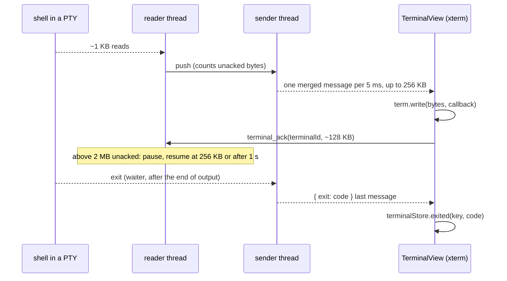
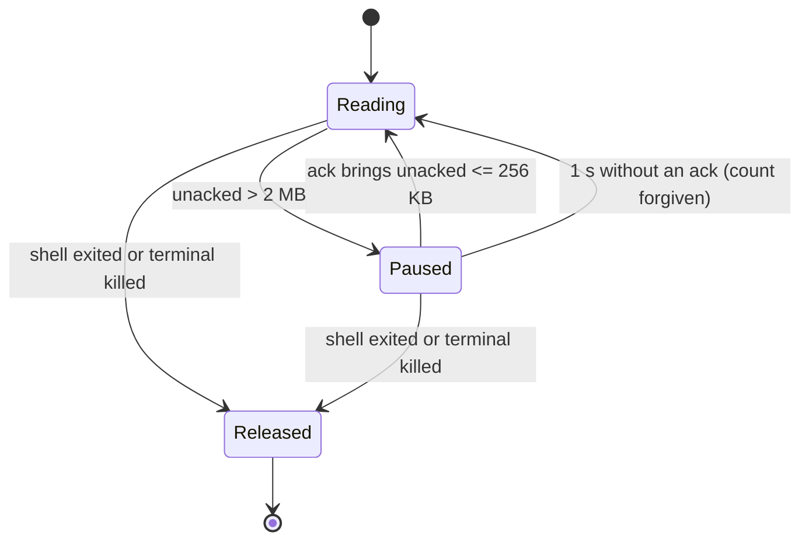

# O4 doc notes: terminal output merging, flow control, exit in the channel

Code (uncommitted, worktree wt/o4): `src-tauri/src/terminal_flow.rs` (new), `terminal.rs`, `commands/terminal.rs`
(new `terminal_ack`, `send_output`, `send_exit`), `commands/scripts.rs`, `run_process.rs`, `lib.rs`;
`src/lib/terminal/outputFlow.ts` (+ test, new), `TerminalView.svelte`, `terminalStore.svelte.ts`, `api.ts`, `types.ts`,
`dev/ipcBridge.ts`, `views/SettingsDialog.svelte`.

## Pages to update

### developer/How-the-Terminal-Works.md
- "Backend: one PTY and three threads per terminal" is now FOUR threads: writer, reader (pauses while the view is
  behind), sender `terminal-output` (merges reads into messages, sends the exit last), waiter (exit; releases flow
  control, waits up to 500 ms for the end of output, then hands the exit code to the sender).
- Reader still reads with a 16 KB buffer, but PTY reads are about 1 KB (a few bytes for `yes`). Explain merging:
  output after a quiet 5 ms goes at once (typing echo), inside a burst at most one message per 5 ms (`MERGE_WINDOW`),
  up to 256 KB (`MAX_MESSAGE_BYTES`); a full 256 KB message goes at once.
- Explain Tauri 2.12 channel routes (tauri `ipc/channel.rs`): Raw < 1024 B goes by `webview.eval` of a JSON number
  array (`new Uint8Array([..]).buffer`); Raw >= 1024 B is queued and fetched as binary (`plugin:__TAURI_CHANNEL__|fetch`)
  then `runCallback`. JSON < 8192 B goes by eval. So merged messages take the binary fetch route; only idle echo uses
  the number array, which is fine for a few bytes. No better Raw path exists in Tauri 2.12.
- Flow control section: unacked = bytes read minus bytes acked. Pause above 2 MB (`HIGH_WATERMARK`), resume at or below
  256 KB (`LOW_WATERMARK`); a pause with no ack for 1 s (`ACK_TIMEOUT`) ends and forgives the count; released for good
  when the shell exits (only the PTY buffer is left) or the terminal is killed.
- JS side: `OutputAcks` in `outputFlow.ts`: counts received (in flight) and written (from `term.write(bytes, callback)`),
  sends `terminal_ack(terminalId, byteCount)` about every 128 KB (`ACK_CHUNK_BYTES`); waits for the terminal id
  (`connect`) since output can arrive before `terminal_spawn` returns; `flush()` on hide acks everything received
  (prepaid bytes are not acked again by their write callbacks); `stop()` on dispose/retry acks everything and every later
  message at once (the old channel handler only acks).
- Exit: the `terminal-exited` event is GONE. The exit is the last channel message, a JSON `{ exit: number | null }`
  (`TerminalExitMessage` in types.ts, serialized in `commands/terminal.rs`, test `the_exit_message_matches_the_view`).
  Channel messages are ordered by index on the JS side, so the exit always follows every output byte. TerminalView calls
  `terminalStore.exited(terminalKey, exit)`, keyed by terminal key, so the early-exit map is gone and an exit before
  spawn returns just works. The 250 ms `EXIT_CLOSE_DELAY_MS` (store) and the 200 ms `EXIT_NOTE_DELAY_MS` (view) are gone:
  a clean exit closes at once and the exit note is written right away.
- Update the sequence diagram (see mermaid below), the commands list (add `terminal_ack`), "Where the code lives"
  (add `terminal_flow.rs`, `outputFlow.ts`; `commands/terminal.rs` no longer has "the exit event"), Tests
  (`terminal_flow.rs` unit tests, `output_pauses_without_acks_and_every_byte_arrives_before_the_exit`, `outputFlow.test.ts`).
- Design decisions to add: "Merge in Rust, not JS" (the cost is per message in the webview, so fewer messages is the
  fix); "Flow control like VS Code" (bounded backlog, Ctrl+C at once, `yes` stops eating CPU); "Count bytes read, not
  bytes sent" (bounds the Rust buffer too); "Forgive after 1 s" (a lost ack or a view that stopped writing never stalls a
  shell for good, worst case about 2 MB per second); "Exit in the channel" (order guaranteed, no timers).
- "Keeping this page in sync": the event row goes; `terminal_ack` and the channel message type are new.

### developer/How-Scripts-Work.md
- Diagram line 58 `Proc-->>Store: "terminal-exited"` becomes `Proc-->>View: { exit } as the last message on the Channel`
  and View->>Store `exited(key, code)`. Runs share the same pump and acks (they use `TerminalRegistry::spawn`).

### developer/Commands-and-Events.md
- Remove the `terminal-exited` row (`onTerminalExited`, `TerminalExitedEvent` are deleted).

### developer/Commands-App-and-Tools.md
- Line 64: "the end as a `terminal-exited` event" becomes "then `{ exit }` as the last message"; add a `terminal_ack` row:
  `terminalAck(terminalId, byteCount)` | `void` | app | the view wrote that many more output bytes; synchronous, cheap.

### developer/Frontend.md
- Line 74: drop `onTerminalExited` from the listener list.

### developer/Architecture.md (line 174, IPC bridge)
- Bridge relays only `git-command` now; the terminal exit travels on the channel (JSON passes the bridge as is).

### developer/How-Terminal-Features-Work.md
- "Drops, rename and bell": the visual bell ignores BEL while a flash is on its way or showing (`bellPending`), so
  binary output that rings thousands of times shows one flash per 180 ms instead of restarting it each time.

### usage/Settings-Terminal-and-Automation.md (line 45) and usage/Terminal.md (line 84)
- Scrollback hint now reads: "Lines kept for scrolling back, 1,000 to 100,000. Each terminal uses about 15 MB at 5,000
  lines and up to 270 MB at 100,000." Copy that into the table. Retake `terminal-settings.png`.

### usage/Terminal.md "When a shell ends"
- Still true; a clean exit now closes right away (no visible change worth a sentence beyond maybe "at once").
- Optional new short paragraph (usage/Terminal-Features.md or Terminal.md): "Big outputs. A command that prints a lot
  (a long `cat`, `yes`) scrolls smoothly, and Ctrl+C stops it at once: Git Manager reads output only as fast as the
  terminal can show it."

## "Bugs we fixed" drafts (How-the-Terminal-Works.md)

**Ctrl+C on a noisy command kept scrolling for seconds.**
- **The issue:** after Ctrl+C on `yes` or a big `cat`, the terminal went on printing for a long time, and the app used a
  lot of CPU and memory meanwhile.
- **Why it happened:** every PTY read (about 1 KB, a few bytes for `yes`) became its own Channel message, and each message
  costs the webview an eval (and for 1 KB or more a fetch too), so the webview managed only a few MB per second while the
  PTY gave about 170 MB per second. Nothing held the reader back, so the backlog grew without limit and Ctrl+C had to
  wait until it was all shown.
- **The fix and why we chose it:** the sender merges reads (one message per 5 ms during a burst, up to 256 KB) and the
  view acks what xterm wrote; the reader pauses above 2 MB unacked. Measured: 50 MB through `base64` went from 65,105
  messages to 256, and `yes | head -n 2000000` from 871,619 to 356. With a view that writes 10 MB/s, closing after 2 s
  left 1.35 MB in flight, delivered in 151 ms. Before, an estimated 300 MB would have been queued. This is VS Code's
  design (ack watermarks), and keeping the emulator in xterm.js avoided a risky rewrite.

**The last output could land after "[Process exited]".**
- **The issue (latent):** small and big output chunks took different routes (eval versus fetch), so the
  `terminal-exited` event could beat the last chunk; timers of 200 ms and 250 ms papered over it.
- **Why it happened:** the exit was a separate event, not ordered with the Channel.
- **The fix and why we chose it:** the exit is now the last message on the same Channel, which Tauri orders by index,
  so no timers are needed and a clean exit closes at once.

(How-Terminal-Features-Work.md) **The visual bell flickered under binary output.**
- **The issue:** `cat` of a binary file could ring the bell thousands of times; the flash restarted on every BEL.
- **Why it happened:** each BEL cleared the timer and scheduled a new frame.
- **The fix and why we chose it:** BEL is ignored while a flash is pending or showing; one flash per 180 ms is all a
  person can see anyway.

## Mermaid ideas

Output flow (replace the end of the terminal sequence diagram):

Flow-control states:

## Screenshots
- `terminal-settings.png` (the Scrollback hint text changed). Nothing else changes visually.
