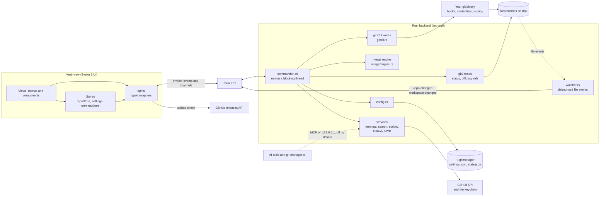
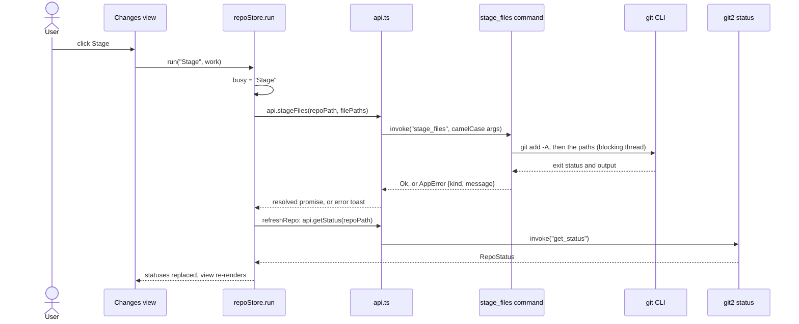
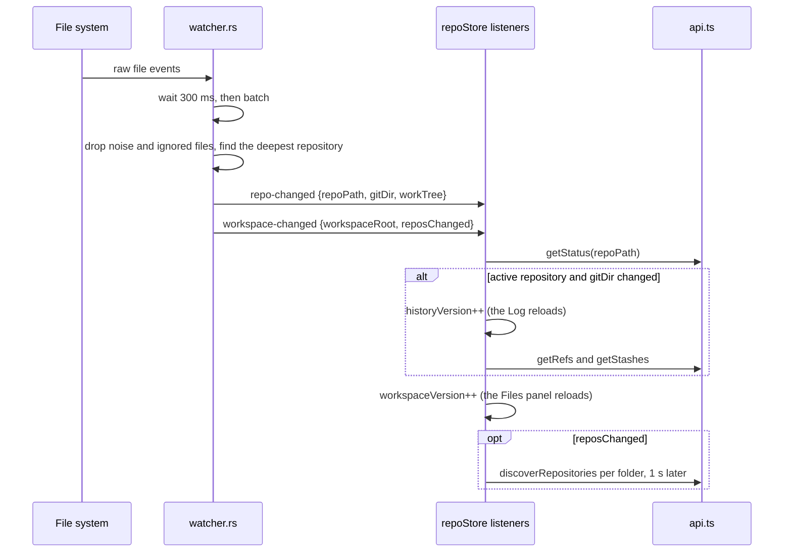
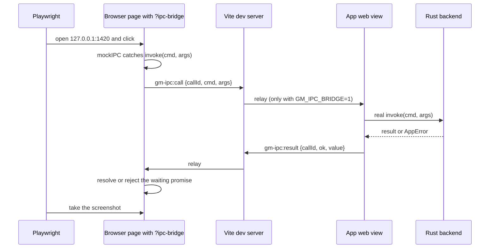

# Architecture

This page shows how the pieces of Git Manager fit together. Most rules in this project come from the choices on this page.

## The big picture

Git Manager has two halves that talk over Tauri's IPC.

- **The UI** is a Svelte 5 single page app in the macOS web view (WKWebView), not a bundled browser.
- **The backend** is Rust. It exposes Tauri commands, reads repositories with git2 (libgit2), writes through the git command line, runs the 3-way merge engine and watches folders. It also runs terminals, search indexes, script runs, the GitHub client and the optional MCP server (see [Backend Services](Backend-Services.md)).

Two rules shape everything:

1. **Writes go through the git CLI.** Every change runs your own `git` binary, so hooks, credential helpers, commit signing and your config behave exactly as in the terminal. Reimplementing those in libgit2 would be a long list of subtle differences.
2. **Reads use git2.** Status, diffs, the log, refs and index stages are read in process: fast and typed, with no output parsing. A few reads use the CLI anyway: blame (much faster in git), and file and line history (`--follow`, `-L`), which libgit2 cannot do.

## One typical call

Here is what happens when you stage a file. Almost every action follows this shape.

The store owns the busy flag, the error toast and the refresh, so a view never forgets one. See [Frontend](Frontend.md).

## When files change on disk

The UI never polls git. The backend watches each workspace folder and tells the UI what changed.

Refreshes are coalesced per key: if a status read is already running for a repository, one more run is queued instead of a second one. The quiet rescan after `reposChanged` changes nothing unless the list of repositories did.

## Memory is a feature

Low memory use is a goal, not an accident. The rules:

- No bundled browser engine: the app uses the system web view.
- Rust opens a repository per command and keeps no file contents or caches between calls.
- The Files panel loads one folder level at a time; diffs load only for the selected file; CodeMirror renders only visible lines and views are destroyed on unmount.
- Grammars and big libraries load on first use with dynamic `import()`: xterm.js with the first terminal, markdown-it, DOMPurify, mermaid and Milkdown with the first Markdown preview, the theme catalog only for a non-default theme.
- Features that are off cost nothing: the Git Console records nothing and its view never loads, the MCP server and the memory log start no thread, and the search indexes are dropped after 2 minutes without use.
- The log is paged (300 commits at a time) and virtualized. The merge tool is an overlay, not a second web view. Hidden Markdown tabs unmount their preview.
- Polling happens only while the window is visible.
- Release builds use `opt-level = "s"`, LTO, one codegen unit, `panic = "abort"` and stripped symbols (`src-tauri/Cargo.toml`).

After a big change, check the `cargo build --release` size and the memory readout in the status bar.

## Two kinds of paths

A workspace can hold several folders, and each folder can hold several repositories, even nested ones. So the app uses two path models, on purpose:

- **Absolute paths** identify files in the UI: file tabs, the Files panel, Back and Forward, breadcrumbs. They are unique across all folders.
- **Repo-relative paths plus a repository root** are what git operations take.

Convert between them only with `src/lib/stores/workspacePaths.ts`: `folderFor`, `locateAbsolute`, `relativeTo` and `joinPath`. Never glue strings by hand. On the Rust side, `commands::safe_join` refuses any repo-relative path that is absolute or contains `..`, so the UI can never reach outside a work tree.

Windows paths: [Windows Support](Windows-Support.md#paths).

## Security

- **Capabilities.** `src-tauri/capabilities/default.json` grants the main window a short list: `core:default`, setting the window title, the open, save, ask and message dialogs (ask and message are granted but unused today), opening URLs and revealing a file in Finder. Everything else goes through our own commands.
- **Content Security Policy.** `src-tauri/tauri.conf.json` sets `default-src 'self'`, allows `data:` images, inline styles and the `gmpreview` scheme for images and frames ([How the Preview Scheme Works](How-the-Preview-Scheme-Works.md)), and limits connections to IPC and `https://api.github.com`. No remote scripts.
- **Untrusted Markdown.** The preview sanitizes HTML with DOMPurify and blocks remote images; local images come from `read_image_data_url`, only from the document's workspace folder.
- **Narrow file access.** `load_config` and `save_config` accept only the names `settings` and `state`. Worktree reads and writes go through `safe_join`.
- **Secrets.** The GitHub token lives only in the system keychain, and git output in the Git Console is masked before it is stored.
- **The MCP server** is off by default, listens only on `127.0.0.1`, needs the bearer token in `~/.gitmanager/mcp.json`, rejects requests with an `Origin` header (web pages) and only reaches the open workspace folders. See [How MCP and CLI Work](How-MCP-and-CLI-Work.md).
- **Dev tools stay dev only.** The IPC bridge below exists only in dev builds and only relays with `GM_IPC_BRIDGE=1`.

## The dev-only IPC bridge

The wiki screenshots need the real app, but a script cannot click inside a Tauri window. So a normal browser page borrows the backend of a running `bun tauri dev`:

- **`src/lib/dev/ipcBridge.ts`** runs on both sides. In a page opened with `?ipc-bridge`, it replaces Tauri's IPC with `mockIPC` and sends each command over Vite's hot reload socket. In the app window, it listens for those commands, runs them with the real `invoke` and sends the result back. The page can answer some commands itself through `window.__GM_IPC_OVERRIDES__`.
- **`src/hooks.client.ts`** starts the bridge only when `import.meta.env.DEV` is true, so a release build never contains it.
- **The `gm-ipc-bridge` plugin in `vite.config.js`** relays the `gm-ipc:*` messages: commands and results, Channel messages, backend events, and `hello` and `here` to find an app window. It exists only for the dev server (`apply: "serve"`) and does nothing unless `GM_IPC_BRIDGE=1` is set.
- **One app window answers.** If an older `bun tauri dev` window is still connected, the page says hello and talks to the app whose process id the URL names (`?ipc-bridge=<pid>`; `scripts/screenshots.ts` finds the newest one), else to the first that answers.

**Channels and events.** A Tauri Channel in the arguments, such as terminal output or search progress, gets a real Channel in the app window, and each of its messages travels back as `gm-ipc:channel` to the page's Channel. Raw bytes go as base64, since they do not survive JSON. The backend events the page needs, `terminal-exited` and `git-command` (`RELAYED_EVENTS`), are relayed as `gm-ipc:event` once the page subscribes. Other events, such as `repo-changed`, stay inside the app window.

**Why it is off by default.** With the relay on, any page open on the dev server can run git commands on your repositories and change your settings. So it needs an explicit `GM_IPC_BRIDGE=1`. How the screenshot script stays inside a demo folder is in [Docs and Screenshots](Docs-and-Screenshots.md).

## Where to go next

- [Backend](Backend.md) for commands, errors, the CLI runner and the watcher, and [Backend Services](Backend-Services.md) for everything else in Rust.
- [Frontend](Frontend.md) for stores, runes and CodeMirror, and [Frontend Modules](Frontend-Modules.md) for the feature folders.
- [How Workspaces Work](How-Workspaces-Work.md) for repository discovery.
