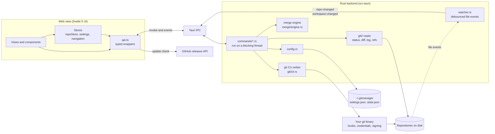
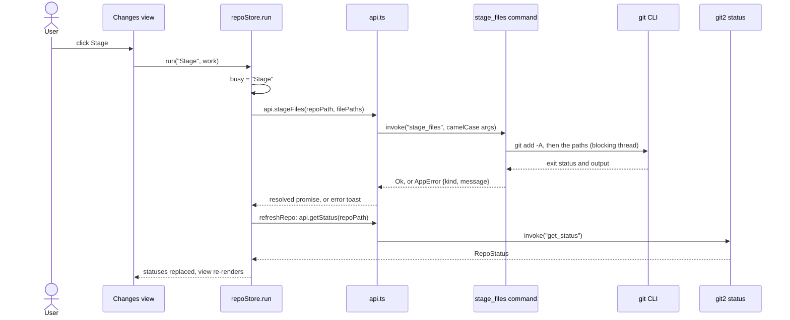
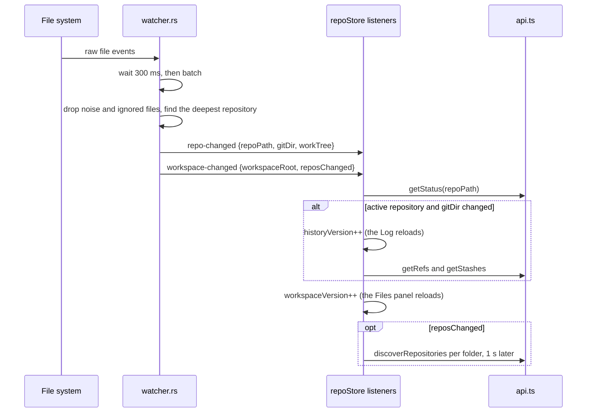
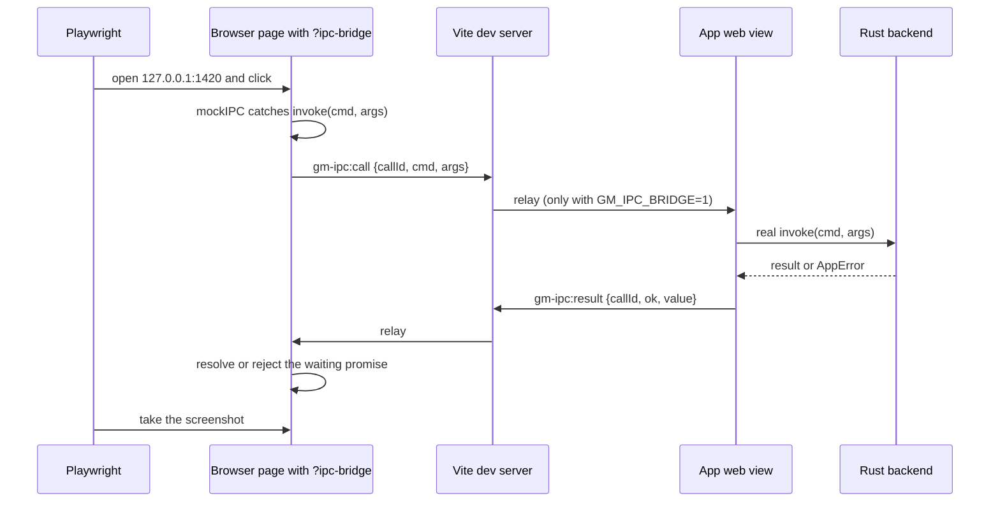

# Architecture

This page shows how the pieces of Git Manager fit together. Read it before you add a command or a store: most rules in this project come from the choices on this page.

## The big picture

Git Manager has two halves that talk over Tauri's IPC.

- **The UI** is a Svelte 5 single page app. It runs in the macOS web view (WKWebView), not in a bundled browser.
- **The backend** is Rust. It exposes Tauri commands, reads repositories with git2 (libgit2), writes through the git command line, runs the 3-way merge engine and watches folders for changes.

Two rules shape everything:

1. **Writes go through the git CLI.** Staging, commits, merges, pushes and every other change run your own `git` binary. Hooks, credential helpers, commit signing and your config then behave exactly as they do in the terminal. Reimplementing those in libgit2 would be a long list of subtle differences.
2. **Reads use git2.** Status, diffs, the log, refs and index stages are read in process. That is fast and gives typed data, with no output parsing. Blame is the one read that uses the CLI (`git blame --porcelain`), because it is much faster than libgit2 on long histories.

## One typical call

Here is what happens when you stage a file. Almost every action follows this shape.

The store owns the busy flag, the error toast and the refresh, so a view never has to remember them. See [Frontend](Frontend.md) for `run` and `runOp`.

## When files change on disk

The UI never polls git. The backend watches each workspace folder and tells the UI what changed.

Refreshes are coalesced per key: if a status read is already running for a repository, one more run is queued instead of starting a second one. `reposChanged` means a repository may have appeared or disappeared; the quiet rescan changes nothing unless the list of repositories did.

## Memory is a feature

Low memory use is a goal, not an accident. The rules:

- No bundled browser engine: the app uses the system web view.
- Rust opens a repository per command (`git::repo::open`) and keeps no file contents or caches between calls.
- Directories in the Files panel load lazily, one level at a time.
- Diffs load only for the selected file. CodeMirror renders only visible lines, and views are destroyed on unmount.
- Language grammars load on demand with dynamic `import()`.
- The log is paged (300 commits at a time) and virtualized.
- The merge tool is an overlay in the main window, not a second web view.
- Polling happens only while the window is visible (the status bar memory readout stops when the document is hidden).
- Release builds are small: the `[profile.release]` in `src-tauri/Cargo.toml` sets `opt-level = "s"`, `lto = true`, `codegen-units = 1`, `panic = "abort"` and `strip = true`.

After a big change, check the `cargo build --release` size and the memory readout in the status bar.

## Two kinds of paths

A workspace can hold several folders, and each folder can hold several repositories, even nested ones. So the app uses two path models, on purpose:

- **Absolute paths** identify files in the UI: file tabs, the Files panel, Back and Forward, breadcrumbs. An absolute path is unique across all folders.
- **Repo-relative paths plus a repository root** are what git operations take. That is what git itself understands.

Convert between them only with `src/lib/stores/workspacePaths.ts`: `folderFor`, `locateAbsolute`, `relativeTo` and `joinPath`. Never glue strings by hand; a missing or doubled slash is an easy bug to write and a hard one to spot. On the Rust side, `commands::safe_join` refuses any repo-relative path that is absolute or contains `..`, so the UI can never reach outside a work tree.

## Security

- **Capabilities.** `src-tauri/capabilities/default.json` grants the main window only what it needs: `core:default`, setting the window title, the open, save, ask and message dialogs, and opening URLs. Everything else goes through our own commands.
- **Content Security Policy.** `src-tauri/tauri.conf.json` sets `default-src 'self'`, allows `data:` images and inline styles, and limits connections to the IPC channel and `https://api.github.com` (the update check). The UI cannot load remote scripts.
- **Narrow file access.** `load_config` and `save_config` accept only the names `settings` and `state`. Worktree reads and writes go through `safe_join`.
- **Dev tools stay dev only.** The IPC bridge below exists only in dev builds and only relays with `GM_IPC_BRIDGE=1`.

## The dev-only IPC bridge

The wiki screenshots need the real app, but a script cannot click inside a Tauri window. So a normal browser page can borrow the backend of a running `bun tauri dev`. Three small pieces make this work:

- **`src/lib/dev/ipcBridge.ts`** runs on both sides. In a page opened with `?ipc-bridge`, it replaces Tauri's IPC with `mockIPC` and sends each command over Vite's hot reload socket. In the app window, it listens for those commands, runs them with the real `invoke` and sends the result back. The page can answer some commands itself through `window.__GM_IPC_OVERRIDES__`.
- **`src/hooks.client.ts`** starts the bridge only when `import.meta.env.DEV` is true, so a release build never contains it.
- **The `gm-ipc-bridge` plugin in `vite.config.js`** relays the `gm-ipc:call` and `gm-ipc:result` messages. It exists only for the dev server (`apply: "serve"`) and does nothing unless `GM_IPC_BRIDGE=1` is set.

Events are mocked inside the page, so backend events such as `repo-changed` never reach it.

**Why it is off by default.** With the relay on, any page open on the dev server can run git commands through your app, on your repositories, and read or write your settings. So it needs an explicit `GM_IPC_BRIDGE=1`, and a normal `bun tauri dev` ignores the messages. How the screenshot script keeps itself inside a demo folder is in [Docs and Screenshots](Docs-and-Screenshots.md).

## Where to go next

- [Backend](Backend.md) for commands, errors, the CLI runner and the watcher.
- [Frontend](Frontend.md) for stores, runes and CodeMirror.
- [How Workspaces Work](How-Workspaces-Work.md) for repository discovery in detail.
