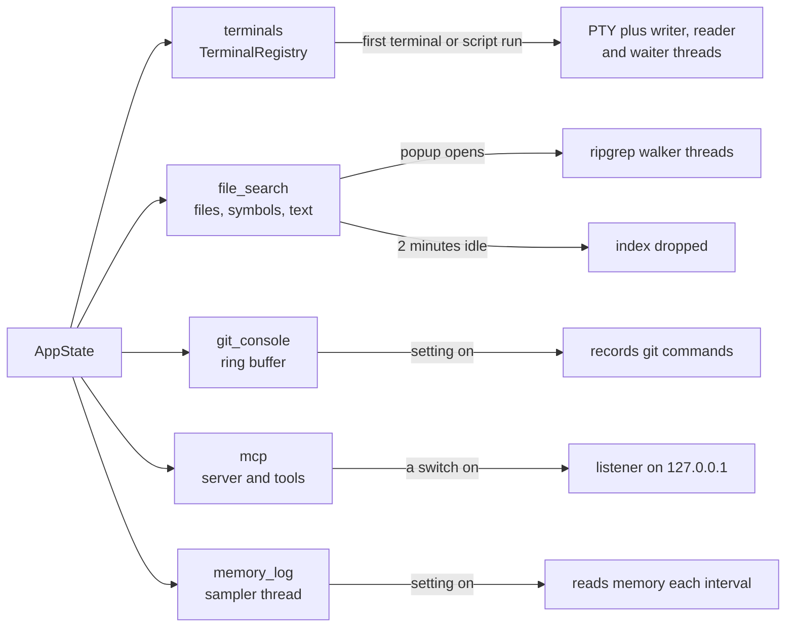

# Backend Services

[Backend](Backend.md) covers commands, errors, the git CLI runner and the watcher. This page maps everything else in `src-tauri/src/`. Each service has a feature chapter with the details; this page shows how they fit the backend's rules.

## One rule for all of them: nothing runs until it is used

Memory is a feature (see [Architecture](Architecture.md)), so every service starts empty and starts threads only when a feature asks. When the feature closes or is switched off, the threads stop and the memory is given back.

## Terminal and script runs

- **`terminal.rs`** finds the installed shells (`/etc/shells` on macOS and Linux; PowerShell, Command Prompt and Git Bash on Windows) and runs them in pseudo terminals with `portable-pty`. Each terminal has a writer, a reader and a waiter thread. Closing hangs up the shell's process group and kills it after a grace period; app exit kills every shell, so none is left behind.
- **`run_process.rs`** runs a project script as its own process in a PTY, with no shell typed into. It uses the login shell's environment (read once with `$SHELL -l -i -c`, cached, refreshed when the Scripts panel refreshes) and puts the chosen Node version first on `PATH`. Runs share the terminal registry.

See [How the Terminal Works](How-the-Terminal-Works.md) and [How Scripts Work](How-Scripts-Work.md).

## Scripts and Node versions

- **`scripts/`** reads `package.json` (npm, yarn, pnpm or bun), `composer.json`, `Makefile`, `deno.json` and `justfile`; `node_wanted.rs` finds the Node version a package asks for. Nothing is cached; every call rescans.
- **`node_versions.rs`** lists Node versions installed by version managers and Homebrew by reading folders only; it never starts `node`. The Windows layouts are not compile checked on Windows yet.

## Search

All search shares one file list, so it follows one set of walker rules (`.gitignore` respected), and the watcher marks it stale when files change.

- **`file_search.rs`**: an in-memory index built by the `ignore` crate (ripgrep's walker), matched with `nucleo-matcher`. Queries answer from a partly built index and never wait. At most 500,000 files; dropped after 2 minutes without use.
- **`symbols/`**: definitions found by small line scanners per language, like universal ctags, stored compactly beside the file index.
- **`text_search.rs`**: Find in Files with ripgrep's `grep-searcher`, streamed in batches and capped at 2,000 lines or 300 files. `text_search/replace.rs` writes atomically and never touches files with unsaved edits. See [How Search Everywhere Works](How-Search-Everywhere-Works.md) and [How Find and Replace Works](How-Find-and-Replace-Works.md).

## Git features beyond the basics

- **`git_console.rs`** records every command `git/cli.rs` runs (at most 500, with 16 KB of output each and 4 MB in all), masking tokens and passwords first. It starts off and records nothing until the Git Console setting is on. See [How the Git Console Works](How-the-Git-Console-Works.md).
- **`shelf/`** keeps shelved changes as `<id>.patch` and `<id>.json` in `<git dir>/gitmanager-shelf/`, so they stay with the repository and are never committed. See [How the Shelf Works](How-the-Shelf-Works.md).
- **`git/worktree.rs`, `git/submodule.rs`, `git/lfs.rs`** read with git2 where it can (submodules, LFS patterns) and change everything through the git CLI. See [How Worktrees Work](How-Worktrees-Work.md), [How Submodules Work](How-Submodules-Work.md) and [How Git LFS Works](How-Git-LFS-Works.md).
- **`git/history.rs`** runs `git log --follow` and `git log -L` for file and line history, which libgit2 cannot do.
- **`git/cancel.rs`** runs a long command (clone) in its own process group under a cancel id, so Cancel stops git and its helpers together.
- **`commands/rebase_merges.rs`** lays out an interactive rebase todo that keeps merge commits. See [How Interactive Rebase Works](How-Interactive-Rebase-Works.md).

## GitHub: `github/`

The token lives only in the system keychain (`secrets.rs`, the `keyring` crate) or comes from `gh auth token` when needed (`gh.rs`); `~/.gitmanager/github.json` keeps only the login. The REST client uses a blocking `ureq` agent on the system TLS stack, so no async runtime or bundled certificates enter the binary. Network, keychain and `gh` sit behind traits, so the tests use fakes. See [How GitHub Works](How-GitHub-Works.md).

## MCP server and command line tool: `mcp/`

A local MCP (Model Context Protocol) server lets AI tools and `git-manager cli` use the app. It is off by default; while both switches are off nothing listens and no thread runs.

- `http.rs` serves Streamable HTTP on `127.0.0.1` only, with our own loop around `httparse`, at most 8 connections and 1 MB bodies, so it can stop every thread when switched off.
- `token.rs` keeps the bearer token in `~/.gitmanager/mcp.json`, readable by you only; `paths.rs` limits tools to the workspace folders open in the app.
- `tools/` holds the backend tools, which call the same Rust functions as the app's own commands. `bridge.rs` sends tools the window must run as `mcp-ui-request` events and waits up to 30 seconds for `mcp_ui_respond`.
- `cli.rs` is the command line client in the same binary: `lib.rs` hands `git-manager cli ...` to it before any window opens. `install.rs` links it into `~/.local/bin`.

See [How MCP and CLI Work](How-MCP-and-CLI-Work.md).

## Small helpers

- **`memory_log.rs`**: the debug memory log (Settings > Automation). While on, a thread writes a line to `~/.gitmanager/logs/memory.log` when memory changes by the threshold, plus the UI events the window reports; past 5 MB it keeps the old file as `memory.log.1`. See [Debugging](Debugging.md).
- **`images.rs`**: local images for the Markdown preview as data URLs (the CSP allows no other images), only from the document's workspace folder. See [How the Markdown Editor Works](How-the-Markdown-Editor-Works.md).
- **`memory.rs`**: the memory readout of the status bar, also used by the memory log and the MCP performance tools.

## Adding a service

Keep it behind a field in `AppState` (or a module with no state at all), start threads only on first use, stop them when the feature closes, and put anything that talks to the network, the keychain or another program behind a trait so the tests can replace it. Add its commands to the right Commands page and its tests to [Test Suites](Test-Suites.md).
