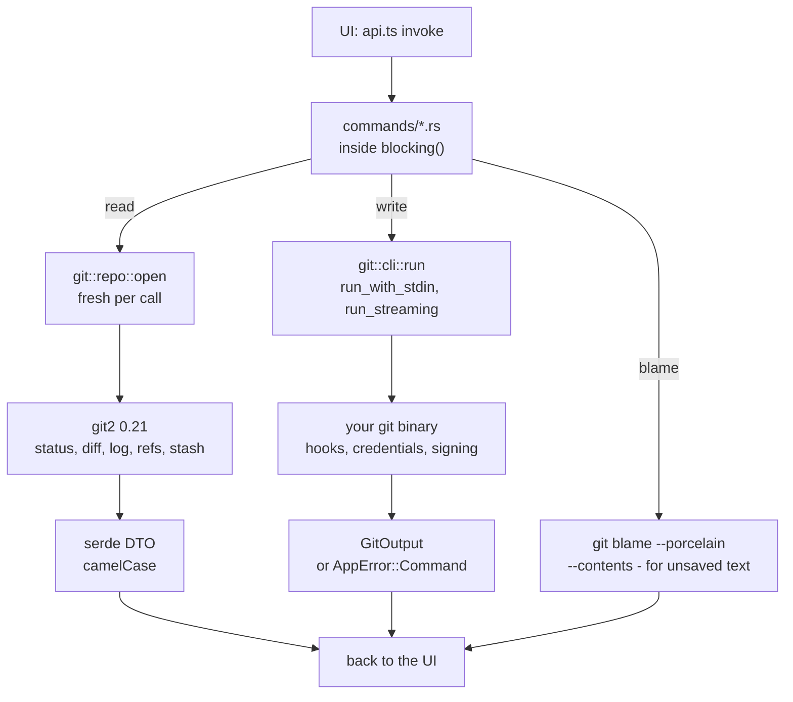

# Backend

The backend is the Rust crate in `src-tauri/`. It owns everything that touches git and the disk. For the big picture, read [Architecture](Architecture.md) first.

## Reads and writes take different roads



Why two roads? git2 reads are fast and typed. A write through libgit2 would skip your hooks, credential helpers, signing and config, so writes use the CLI, exactly like your terminal.

## Commands

Every command lives in `src-tauri/src/commands/<area>.rs` and is listed in the `tauri::generate_handler!` block in `src-tauri/src/lib.rs`. Unlisted commands do not exist for the UI.

A typical command:

```rust
#[tauri::command]
pub async fn get_status(repo_path: String) -> AppResult<RepoStatus> {
    blocking(move || status::read(&git_repo::open(&repo_path)?)).await
}
```

**Naming.** Arguments are snake_case in Rust and camelCase in JS (`repo_path` is `repoPath`); Tauri converts them. DTOs use `#[serde(rename_all = "camelCase")]`. Name arguments after what they hold (`commit_id`, `stash_index`), never just `id` or `path`.

**Adding a command, step by step:**

1. Write it in the right `commands/*.rs` file, doing the work inside `blocking`.
2. Register it in `lib.rs`.
3. Add a typed wrapper in `src/lib/api.ts` and any DTO mirror in `src/lib/types.ts`.
4. Add a test in `commands/tests.rs` or `git/tests.rs` (see [Testing](Testing.md)).

### Why `commands::blocking`

Git work blocks on files or child processes. `blocking` runs the closure on Tauri's blocking thread pool (`spawn_blocking`), so the IPC runtime stays free and the UI never stalls while a push runs. If the background task cannot finish, the UI gets an `AppError::Invalid` ("Background task failed").

### Operations that may stop on conflicts

Merge, rebase, pull, cherry-pick and revert return `OpOutcome { output, conflicts }`. `commands::outcome` treats a failed git command that left conflicts behind as a normal result, so the UI opens the conflicts dialog instead of a red toast. Use `run_op` for these.

### Paths from the UI

`commands::safe_join(repo_path, file_path)` joins a repo-relative path onto the root and refuses empty or absolute paths and any `..` part. Use it for every path from the UI. `with_paths` builds `git <args> -- <paths>`, so a file name is never read as an option.

## Errors: `AppError`

`src-tauri/src/error.rs` defines one error type with four kinds:

| Kind | When |
| --- | --- |
| `git` | a git2 call failed |
| `io` | a file system call failed |
| `command` | the git CLI exited with a non-zero status; the message is git's own output |
| `invalid` | bad input or a state we refuse, like an unknown config name |

It serializes as `{ kind, message }`, mirrored in `types.ts`. Use `?` for git2 and io errors and `AppError::invalid("...")` for your own.

## `AppState`

`src-tauri/src/state.rs` holds the little state the backend keeps between calls:

- `launch`: `LaunchMode::App { repo_path }` or `LaunchMode::MergeTool { base, local, remote, merged }`, parsed from the command line (Finder's `-psn_` argument is ignored).
- `mergetool_exit_code`: starts at 1 (unresolved) and becomes 0 only after an explicit save, because `git mergetool` trusts the exit code. See [How Mergetool Mode Works](How-Mergetool-Mode-Works.md).
- `watchers`: one file watcher per workspace folder, keyed by folder root.

There is no repository cache on purpose.

## The git CLI runner: `git/cli.rs`

`cli::command(repo_path)` builds every git process the app starts:

- **The git binary** is the first of `/opt/homebrew/bin/git`, `/usr/local/bin/git` and `/usr/bin/git` that exists, or `git`.
- **`PATH` comes from your login shell.** Apps started from Finder get a tiny `PATH`, which breaks hooks that need `node` or `husky`, so the runner asks `$SHELL -l -c` once for the real `PATH` (3 second limit, Homebrew fallback) and caches it.
- **`GIT_TERMINAL_PROMPT=0`**, so git never waits for a password prompt that a GUI cannot answer. It fails with a message instead.
- **`GIT_EDITOR=true` and `GIT_SEQUENCE_EDITOR=true`**, so `--continue` and similar accept the prepared message instead of opening an editor.
- **stdin is closed** unless the command sends input.

Three ways to run it: `run` (error on non-zero exit), `run_with_stdin` (for example a commit message) and `run_streaming`, which reports each progress line through a callback. `fetch_all`, `pull` and `push` forward those lines as `git-progress` events.

## git2 notes

- The crate uses git2 0.21 with `default-features = false`. Network and auth features are not needed, because fetch, pull and push go through the CLI.
- Open with `git::repo::open` (exactly that work tree); `git::repo::discover` is only for a path somewhere inside one.
- In 0.21 many accessors return a `Result`, often of an `Option`. The pattern here is `.ok().flatten()` with a default, for example `commit.summary().ok().flatten().unwrap_or_default()`.

## The watcher: `watcher.rs`

`watch_workspace(workspaceRoot, repoRoots)` starts one recursive watcher per workspace folder and replaces that folder's old one. `unwatch_workspace` drops it when a folder is removed. It uses `notify-debouncer-full` with a 300 ms debounce. For each batch it:

- drops noise inside `.git`: `objects/`, `logs/`, `lfs/` and `*.lock` files;
- drops work tree paths that the repository ignores (`status_should_ignore`);
- gives each path to the deepest repository that contains it;
- emits `repo-changed { repoPath, gitDir, workTree }` per repository, and `workspace-changed` when visible files or any `.git` folder appear or vanish, with `reposChanged` when a repository may have appeared or disappeared.

A repository enclosing the folder gets its `.git` watched too. The attribution logic is a pure, tested function, `attribute`.

## Config files: `config.rs`

`load_config` and `save_config` read and write `~/.gitmanager/settings.json` and `state.json`, and no other names. A missing or empty file loads as `None`, and invalid JSON in either file is an error, not a silent reset. The frontend reports a broken file and leaves it alone until you fix it or reset it (see [How settings work](How-Settings-Work.md)). Writes go to `.settings.json.tmp` first and are renamed over the real file, so a crash never leaves half a file. `commands/config.rs` also has `memory_usage` and `os_info` (the OS name and version for bug reports).

## Workspace files: `workspace_file.rs`

Reads `.gitmanager-workspace` and VS Code `.code-workspace` files (JSON with comments), returning the folders that exist plus the `missing` ones. Writing stores paths relative to the file, keeps other keys, folder entries and comments, and goes through a temporary file. See [How Workspaces Work](How-Workspaces-Work.md).

## Memory readout: `memory.rs`

Reports memory like Activity Monitor: the physical footprint of the app plus its WebKit helpers. Started from a terminal, the terminal is the macOS "responsible" process, so helpers are also matched by start time and the result is `approximate`. Other platforms get a stub behind `cfg`. See [How the Status Bar Works](How-the-Status-Bar-Works.md).

## Test support

`test_support.rs` builds real temporary repositories with an isolated git config. See [Testing](Testing.md).

## Lessons learned

**git2 0.21 changed its accessors.** After upgrading, accessors like `commit.summary()` returned a `Result` instead of an `Option<&str>`. We handled each with `.ok()`, `.flatten()` and `filter_map`, not `unwrap`, so a strange ref name or a non UTF-8 summary shows as empty instead of crashing.

**A capability file broke the build.** When the opener plugin was removed for a while, `capabilities/default.json` still listed its permission. `tauri-build` checks capabilities at compile time and failed with "Permission opener:default not found". Keep capabilities in step with the plugins in `lib.rs` and `Cargo.toml`: remove the permission in the same change as the plugin.
