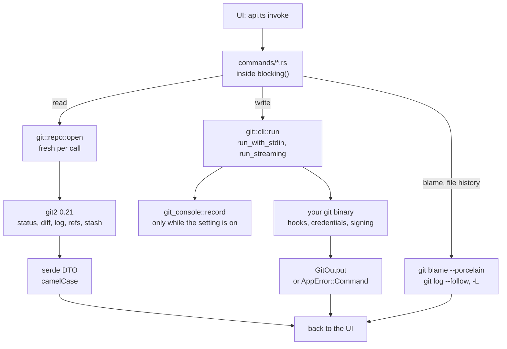

# Backend

The backend is the Rust crate in `src-tauri/`. It owns everything that touches git and the disk. Read [Architecture](Architecture.md) first; the terminal, search, scripts, GitHub, MCP and other services are on [Backend Services](Backend-Services.md).

## Reads and writes take different roads



Why two roads? git2 reads are fast and typed. A write through libgit2 would skip your hooks, credential helpers, signing and config, so writes use the CLI. A few reads use it too: blame (much faster in git), and file and line history, which libgit2 cannot do.

## Commands

Every command lives in `src-tauri/src/commands/<area>.rs` (the GitHub ones in `github/commands.rs`) and is listed in the `tauri::generate_handler!` block in `src-tauri/src/lib.rs`. Unlisted commands do not exist for the UI. The full list is in [Commands and Events](Commands-and-Events.md).

A typical command:

```rust
#[tauri::command]
pub async fn get_status(repo_path: String) -> AppResult<RepoStatus> {
    blocking(move || status::read(&git_repo::open(&repo_path)?)).await
}
```

**Naming.** Arguments are snake_case in Rust and camelCase in JS (`repo_path` is `repoPath`); Tauri converts them. DTOs use `#[serde(rename_all = "camelCase")]`. Name arguments after what they hold (`commit_id`, `stash_index`, `terminal_id`), never just `id` or `path`.

**Adding a command, step by step:**

1. Write it in the right `commands/*.rs` file as an `async fn`, doing the work inside `blocking`.
2. Register it in `lib.rs`.
3. Add a typed wrapper in `src/lib/api.ts` and any DTO mirror in `src/lib/types.ts`.
4. Add a test next to it or in `commands/tests.rs` (see [Testing](Testing.md)).
5. Add its row to the right Commands page.

### Why `async` and `commands::blocking`

A Tauri command without `async` runs on the main thread, where anything slow freezes the window. So every command that does real work is `async`, and `blocking` runs the closure on Tauri's blocking thread pool (`spawn_blocking`); if it cannot finish, the UI gets "Background task failed". Only tiny commands stay synchronous, such as `get_launch_mode` and `terminal_write`, which only queues bytes so keystrokes keep their order.

### Operations that may stop on conflicts

Merge, rebase, pull, cherry-pick, revert, unshelve and apply patch return `OpOutcome { output, conflicts }`. `commands::outcome` treats a failed command that left conflicts as a normal result, so the UI opens the conflicts dialog instead of a toast. Use `run_op` for these.

### Input from the UI

- `commands::safe_join(repo_path, file_path)` refuses empty or absolute paths and any `..` part. Use it for every path from the UI.
- `with_paths` builds `git <args> -- <paths>`, so a file name is never read as an option.
- `reject_option(value, what)` refuses a name or revision starting with `-` where it cannot go after `--`.

## Errors: `AppError`

`src-tauri/src/error.rs` defines one error type with four kinds:

| Kind | When |
| --- | --- |
| `git` | a git2 call failed |
| `io` | a file system call failed |
| `command` | the git CLI exited with a non-zero status; the message is git's own output |
| `invalid` | bad input or a state we refuse, like an unknown config name |

It serializes as `{ kind, message }`, mirrored in `types.ts`. Use `?` for git2 and io errors and `AppError::invalid("...")` for your own.

## `AppState`

`src-tauri/src/state.rs` holds the little state the backend keeps between calls:

- `launch`: `LaunchMode::App { repo_path }` or `LaunchMode::MergeTool { base, local, remote, merged }`, from the command line.
- `mergetool_exit_code`: 1 (unresolved) until an explicit save, because `git mergetool` trusts it.
- `watchers`: one file watcher per workspace folder.
- `terminals`, `file_search`, `git_console`, `mcp` and `memory_log`: the services on [Backend Services](Backend-Services.md), each empty until its feature is used.

There is no repository cache on purpose. On exit, `lib.rs` stops the terminals, the MCP server and the memory log.

## The git CLI runner: `git/cli.rs`

`cli::command(repo_path)` builds every git process the app starts:

- **The git binary** is the first of `/opt/homebrew/bin/git`, `/usr/local/bin/git` and `/usr/bin/git` that exists, or `git`.
- **`PATH` comes from your login shell** (`$SHELL -l -c`, asked once with a 3 second limit), because apps started from Finder get a tiny `PATH` that breaks hooks needing `node` or `husky`.
- **`GIT_TERMINAL_PROMPT=0`**, so git never waits for a password prompt a GUI cannot answer, and **`GIT_EDITOR=true`, `GIT_SEQUENCE_EDITOR=true`**, so `--continue` never opens an editor.
- **stdin is closed** unless the command sends input.

It runs as `run`, `run_with_stdin`, `run_raw` (no error on a non-zero exit), `run_bytes` (binary output, for patches), the `*_with_env` variants and `run_streaming` (each progress line to a callback). All of them call `git_console::record`, which records nothing while the Git Console is off. Cancellable commands like clone go through `git/cancel.rs`.

## git2 notes

- git2 0.21 with `default-features = false`: no network or auth features, because the network goes through the CLI.
- Open with `git::repo::open` (exactly that work tree); `git::repo::discover` is only for a path inside one.
- Many accessors return a `Result` of an `Option`; the pattern is `.ok().flatten()` with a default.

## The watcher: `watcher.rs`

`watch_workspace` starts one recursive watcher per workspace folder (`notify-debouncer-full`, 300 ms debounce) on a blocking thread, and `unwatch_workspace` stops it off the main thread too, because stopping waits for the watcher's threads. It uses `NoCache`: the default file id cache walked every file under the folder when watching started. Each batch drops noise inside `.git` and ignored work tree paths, maps worktree and submodule git folders back to their repository, gives each path to the deepest repository, emits `repo-changed` and `workspace-changed`, and marks the search indexes stale. The attribution logic is a pure, tested function, `attribute`. See [How Folder Watching Works](How-Folder-Watching-Works.md).

## Config files: `config.rs`

`load_config` and `save_config` read and write `~/.gitmanager/settings.json` and `state.json`, and no other names. A missing file loads as `None`; invalid JSON is an error, not a silent reset (see [How Settings Work](How-Settings-Work.md)). Writes go through a temporary file. `github.json`, `mcp.json` and `logs/memory.log` belong to their features.

`workspace_file.rs` reads and writes workspace files, `memory.rs` reports memory like Activity Monitor (see [How the Status Bar Works](How-the-Status-Bar-Works.md)), and `test_support.rs` builds temporary repositories for the tests.

## Lessons learned

**git2 0.21 changed its accessors.** `commit.summary()` and others started returning a `Result`. We handled each with `.ok()` and `.flatten()`, not `unwrap`, so a strange ref name shows as empty instead of crashing.

**A capability file broke the build.** With the opener plugin removed, `capabilities/default.json` still listed its permission and `tauri-build` failed ("Permission opener:default not found"). Change a permission in the same commit as its plugin.

**A command without `async` froze the window.** `watch_workspace` was a plain `fn`, so it ran on the main thread, and watching a big folder blocked the UI for seconds. Commands that do real work are now `async` with the slow part in `blocking` (details in [How Workspaces Work](How-Workspaces-Work.md)).
