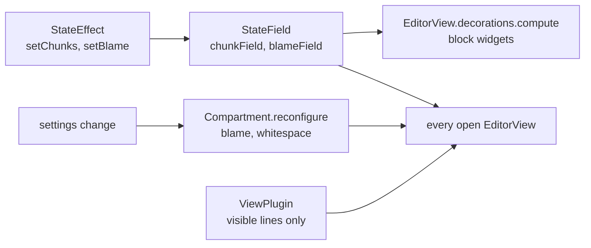

# CodeMirror Patterns

Every text pane in Git Manager is a CodeMirror 6 view: the file editor, both sides of every diff, the three merge tool panes and the Markdown source. They share their setup in `src/lib/editor/setup.ts`, where `languageFor(path)` loads a grammar with a dynamic `import()` only when a file needs it. This page collects the patterns that keep those views fast, correct and cheap. Read it before you add an extension. The editor feature itself is in [How the Editor Works](How-the-Editor-Works.md), and the rest of the UI in [Frontend](Frontend.md).

## State and undo

**State lives in a `StateField`, changed by effects.** The merge tool keeps its chunk list in `chunkField` (`merge/extensions.ts`), set with the `setChunks` effect and mapped through edits. Blame (`blameField`), change markers (`changeMarkField`) and conflict regions (`conflictField`) follow the same pattern. The state then travels with the document, not beside it.

**Undo restores that state too.** `invertedEffects` records the previous chunk list for each transaction, so Cmd+Z brings back both the text and which changes were applied.

## Settings and features

**Compartments switch features without rebuilding.** Inline blame, the blame gutter and Render whitespace (`editor/whitespace.ts`) each sit in a `Compartment`, reconfigured in every open editor when a setting changes, keeping the cursor, scroll and undo history. Line spacing is the CSS variable `--code-line-height`, shared by editors, diffs and the merge tool.

**Decorate only what is visible.** Render whitespace is a `ViewPlugin` that decorates the visible lines only, so a long file costs nothing extra. With Render whitespace set to `none` the extension adds nothing at all.

## Widgets and layers

**Block widgets come from state, not from a `ViewPlugin`.** Widgets that change line heights, like the "Accept Current | Accept Incoming" row above a conflict, come from `EditorView.decorations.compute([conflictField], ...)`, because CodeMirror needs block decorations before layout. `ViewPlugin`s are fine for things that do not move lines: the inline blame note, the scrollbar markers, diff chunk classes, measuring the conflict row width (`barWidth`).

**A layer drawn behind the text can be hidden.** CodeMirror draws the selection behind the text, so an opaque line background covers it. That is why `editor/activeLine.ts` highlights the current line only while nothing is selected, like VS Code and JetBrains.

## Keys and panels

**A key the editor needs must win inside CodeMirror.** The merge tool's Cmd+Enter is a `Prec.highest` keymap (`applyKeymap`), so it beats the default insert-blank-line.

**The editor binds its own menu keys.** The Edit and Code menu commands (`editor/editorCommands.ts`) are bound inside CodeMirror with the keys in `editor/editorShortcuts.ts`, so they work in every editor, the merge tool included, and the menu shows the same keys. macOS hands a key to the web view first, so a key and its menu item never both run. Commands CodeMirror does not ship (Duplicate, Join Lines, Toggle Case, Sort Lines) are written against the state alone in `editor/textCommands.ts`, so they are tested without a view.

**Panels can be Svelte.** The find and replace bar is `FindBar.svelte` mounted as a CodeMirror panel by `editor/findPanel.svelte.ts`; matching, Next, Previous and Replace still come from `@codemirror/search`.

## Updates

**Never dispatch to a view from its own update listener.** It throws, because the view is still in the middle of an update. The merge editor's listener only reads state and updates the other two panes, and anything that must touch the same view is scheduled with `requestAnimationFrame`.

**Destroy what you create.** A view is destroyed in the `$effect` cleanup of the component that made it, and hidden Markdown tabs unmount their preview, so closed or hidden panes free their memory.
