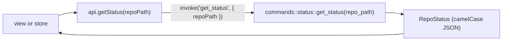

# Commands and Events

This is the reference for everything the UI can ask the backend, and everything the backend sends on its own. Every command below is registered in `src-tauri/src/lib.rs` and has a typed wrapper in `src/lib/api.ts`. Return types are the DTOs in `src/lib/types.ts`.

How to read the tables:

- **Wrapper** is the `api.ts` function with its camelCase arguments; the command is the same name in snake_case.
- **Kind**: **git2** reads in process, **CLI** runs your git binary (writes, and blame), **file** touches the disk directly, **app** uses app state.
- Every command can fail with `AppError { kind, message }`. See [Backend](Backend.md).
- `OpOutcome { output, conflicts }` comes back from anything that can stop on conflicts. `conflicts: true` is a normal result, not an error.

## Repository

| Command | Wrapper | Returns | Kind | What it does |
| --- | --- | --- | --- | --- |
| `get_launch_mode` | `getLaunchMode()` | `LaunchMode` | app | app mode (optional folder) or mergetool mode |
| `open_repo` | `openRepo(repoPath)` | `RepoInfo` | git2 | finds the repository containing a path |

## Workspace

| Command | Wrapper | Returns | Kind | What it does |
| --- | --- | --- | --- | --- |
| `open_workspace` | `openWorkspace(folderPath)` | `WorkspaceInfo` | file | opens a folder and scans it for repositories |
| `discover_repositories` | `discoverRepositories(workspaceRoot)` | `RepoInfo[]` | file | rescans one folder (Scan for Repositories, `reposChanged`) |
| `init_repository` | `initRepository(folderPath)` | `RepoInfo` | CLI | `git init` in a plain folder |
| `watch_workspace` | `watchWorkspace(workspaceRoot, repoRoots)` | `void` | app | starts the file watcher for one folder |
| `unwatch_workspace` | `unwatchWorkspace(workspaceRoot)` | `void` | app | stops it |
| `read_workspace_file` | `readWorkspaceFile(filePath)` | `WorkspaceFile` | file | reads a `.gitmanager-workspace` or `.code-workspace` file |
| `write_workspace_file` | `writeWorkspaceFile(filePath, folders)` | `void` | file | saves the folders atomically, keeping other keys, entries and comments |

## Status

| Command | Wrapper | Returns | Kind | What it does |
| --- | --- | --- | --- | --- |
| `get_status` | `getStatus(repoPath)` | `RepoStatus` | git2 | HEAD and upstream, the operation in progress, changed files |
| `get_head_message` | `getHeadMessage(repoPath)` | `string` | git2 | the last commit message, for amend |

## Staging and commit

| Command | Wrapper | Returns | Kind | What it does |
| --- | --- | --- | --- | --- |
| `stage_files` | `stageFiles(repoPath, filePaths)` | `void` | CLI | `git add -A` |
| `unstage_files` | `unstageFiles(repoPath, filePaths)` | `void` | CLI | `git restore --staged`, or `git rm --cached` before the first commit |
| `discard_files` | `discardFiles(repoPath, trackedPaths, untrackedPaths)` | `void` | CLI | `git restore --worktree`; deletes untracked files |
| `stage_content` | `stageContent(repoPath, filePath, content, eol)` | `void` | CLI | writes text into the index (hunk staging) |
| `write_worktree_file` | `writeWorktreeFile(repoPath, filePath, content, eol)` | `void` | file | overwrites a work tree file |
| `commit` | `commit(repoPath, message, amend)` | `GitOutput` | CLI | `git commit -F -`, optionally `--amend` |

## Diff

| Command | Wrapper | Returns | Kind | What it does |
| --- | --- | --- | --- | --- |
| `get_file_diff` | `getFileDiff(repoPath, filePath, origPath, area)` | `FileDiff` | git2 | both sides of a staged or unstaged change |
| `get_commit_file_diff` | `getCommitFileDiff(repoPath, commitId, filePath, origPath)` | `FileDiff` | git2 | both sides of one file in a commit |

## Merge and conflicts

| Command | Wrapper | Returns | Kind | What it does |
| --- | --- | --- | --- | --- |
| `list_conflicts` | `listConflicts(repoPath)` | `ConflictSummary` | git2 | the operation in progress and every conflicted file |
| `load_conflict` | `loadConflict(repoPath, conflictPath, ignoreWhitespace)` | `MergeDocument` | git2 | base, ours, theirs and chunks |
| `save_resolution` | `saveResolution(repoPath, conflictPath, content, eol)` | `void` | CLI | writes the result, then `git add` |
| `accept_side` | `acceptSide(repoPath, conflictPaths, side)` | `void` | CLI | takes `ours` or `theirs` for whole files, or removes them |
| `continue_operation` | `continueOperation(repoPath)` | `OpOutcome` | CLI | `--continue` for the merge, rebase, cherry-pick or revert |
| `abort_operation` | `abortOperation(repoPath)` | `OpOutcome` | CLI | `--abort` for the same |
| `skip_rebase_commit` | `skipRebaseCommit(repoPath)` | `OpOutcome` | CLI | `git rebase --skip` |

## Branches

| Command | Wrapper | Returns | Kind | What it does |
| --- | --- | --- | --- | --- |
| `get_refs` | `getRefs(repoPath)` | `Refs` | git2 | local and remote branches, tags and remotes |
| `checkout_branch` | `checkoutBranch(repoPath, branchName)` | `void` | CLI | `git switch` |
| `checkout_remote_branch` | `checkoutRemoteBranch(repoPath, remoteBranch, localName)` | `void` | CLI | switches to or creates a tracking branch |
| `create_branch` | `createBranch(repoPath, branchName, startPoint, checkout)` | `void` | CLI | `git switch -c` or `git branch` |
| `rename_branch` | `renameBranch(repoPath, branchName, newName)` | `void` | CLI | `git branch -m` |
| `delete_branch` | `deleteBranch(repoPath, branchName, force)` | `void` | CLI | `git branch -d`, or `-D` when forced |
| `merge_branch` | `mergeBranch(repoPath, branchName)` | `OpOutcome` | CLI | `git merge --no-edit` into the current branch |
| `rebase_onto` | `rebaseOnto(repoPath, branchName)` | `OpOutcome` | CLI | `git rebase` onto the branch |

## Remotes

| Command | Wrapper | Returns | Kind | What it does |
| --- | --- | --- | --- | --- |
| `fetch_all` | `fetchAll(repoPath)` | `OpOutcome` | CLI | `git fetch --all --prune`, with progress |
| `pull` | `pull(repoPath)` | `OpOutcome` | CLI | `git pull`, with progress |
| `push` | `push(repoPath, force)` | `OpOutcome` | CLI | `git push`, `--force-with-lease` when forced, sets the upstream |

## History and blame

| Command | Wrapper | Returns | Kind | What it does |
| --- | --- | --- | --- | --- |
| `get_log` | `getLog(repoPath, offset, limit, allRefs)` | `CommitSummary[]` | git2 | one page of history (at most 1000) |
| `get_commit_details` | `getCommitDetails(repoPath, commitId)` | `CommitDetails` | git2 | message, parents and changed files |
| `blame_file` | `blameFile(repoPath, filePath, revision, contents)` | `BlameInfo` | CLI | `git blame --porcelain` (of `contents` when set), with `originalLines` |
| `cherry_pick` | `cherryPick(repoPath, commitId)` | `OpOutcome` | CLI | `git cherry-pick` |
| `revert_commit` | `revertCommit(repoPath, commitId)` | `OpOutcome` | CLI | `git revert --no-edit` |
| `reset_to` | `resetTo(repoPath, commitId, mode)` | `void` | CLI | `git reset` with `soft`, `mixed` or `hard` |
| `checkout_commit` | `checkoutCommit(repoPath, commitId)` | `void` | CLI | `git switch --detach` |

## Stash

| Command | Wrapper | Returns | Kind | What it does |
| --- | --- | --- | --- | --- |
| `get_stashes` | `getStashes(repoPath)` | `StashEntry[]` | git2 | the stash list |
| `stash_push` | `stashPush(repoPath, message, includeUntracked)` | `void` | CLI | `git stash push`; error "No local changes to stash" if nothing was stashed |
| `stash_apply` | `stashApply(repoPath, stashIndex, pop)` | `OpOutcome` | CLI | `git stash apply`, or `pop` |
| `stash_drop` | `stashDrop(repoPath, stashIndex)` | `void` | CLI | `git stash drop` |

## Files

| Command | Wrapper | Returns | Kind | What it does |
| --- | --- | --- | --- | --- |
| `list_directory` | `listDirectory(rootPath, dirPath, repoRoots)` | `DirListing` | file | one folder level for the Files panel, the first 5000 in sort order |
| `read_worktree_file` | `readWorktreeFile(repoPath, filePath)` | `FileContent` | file | a file's text for the editor |

## Config

| Command | Wrapper | Returns | Kind | What it does |
| --- | --- | --- | --- | --- |
| `load_config` | `loadConfig(configName)` | `unknown` | file | `settings` or `state` from `~/.gitmanager`; null when missing |
| `save_config` | `saveConfig(configName, value)` | `void` | file | atomic write of the same |
| `config_dir` | `configDir()` | `string` | app | the `~/.gitmanager` path |
| `memory_usage` | `memoryUsage()` | `MemoryUsage` | app | memory of the app and its web view helpers |
| `os_info` | `osInfo()` | `OsInfo` | app | OS name and version for bug reports (`sw_vers`, os-release) |

`OsInfo` is `{ name: string, version: string | null }`.

## Mergetool

These only work when the app was started as `git mergetool`. See [How Mergetool Mode Works](How-Mergetool-Mode-Works.md).

| Command | Wrapper | Returns | Kind | What it does |
| --- | --- | --- | --- | --- |
| `load_mergetool` | `loadMergetool(ignoreWhitespace)` | `MergeDocument` | file | reads BASE, LOCAL, REMOTE and MERGED |
| `save_mergetool` | `saveMergetool(content, eol)` | `void` | file | writes MERGED and exits with status 0 |
| `cancel_mergetool` | `cancelMergetool()` | `void` | app | exits with status 1 |

## Events

The backend emits three events. The `api.ts` helpers return an unlisten function.

| Event | Helper | Payload | Sent by |
| --- | --- | --- | --- |
| `repo-changed` | `onRepoChanged` | `RepoChangedEvent { repoPath, gitDir, workTree }` | `watcher.rs`, once per changed repository per 300 ms batch |
| `workspace-changed` | `onWorkspaceChanged` | `WorkspaceChangedEvent { workspaceRoot, reposChanged }` | `watcher.rs`, when visible files or a `.git` folder appear or vanish |
| `git-progress` | `onGitProgress` | `GitProgressEvent { repoPath, line }` | `commands/remote.rs`, each progress line of fetch, pull and push |

`gitDir: true` means HEAD, refs, the index or the operation state changed, so branches and the log need a reload too. `workTree: true` means only files changed. `reposChanged: true` asks the store to rescan. See [Architecture](Architecture.md) for the refresh flow.

## Not in `lib.rs`

A few calls go straight to Tauri APIs and plugins, allowed by `src-tauri/capabilities/default.json`: file pickers (`open`, `save` from `@tauri-apps/plugin-dialog` in `views/repoPicker.ts`), `openUrl` from `@tauri-apps/plugin-opener`, `getVersion` from `@tauri-apps/api/app`, and `getCurrentWindow().setTitle` and `onCloseRequested` in mergetool mode.

## Adding one

Follow the steps in [Backend](Backend.md), then add a row here.
