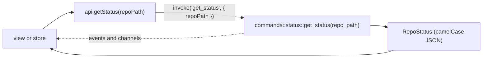

# Commands and Events

This is the reference for everything the UI can ask the backend, and everything the backend sends on its own. Every command is registered in `src-tauri/src/lib.rs` and has a typed wrapper in `src/lib/api.ts`. Return types are the DTOs in `src/lib/types.ts`. There are 167 commands today, so the tables are split over four pages:

| Page | Commands |
| --- | --- |
| [Commands: Workspace and Changes](Commands-Workspace-and-Changes.md) | launch mode, workspace folders, status, staging, commits, diffs, conflicts, the mergetool, stashes, the shelf and `.gitignore` |
| [Commands: Branches and Remotes](Commands-Branches-and-Remotes.md) | branches, the Branches popup, the Merge and Rebase dialogs, interactive rebase, fetch, pull, push, remotes, clone, patches and tags |
| [Commands: History and Extras](Commands-History-and-Extras.md) | the log, blame, file and line history, reset, worktrees, submodules, Git LFS and the GitHub account |
| [Commands: App and Tools](Commands-App-and-Tools.md) | files, config, the memory log, Search Everywhere and Replace in Files, scripts, the terminal, the Git Console, the MCP server and the command line tool |

How to read the tables:

- **Wrapper** is the `api.ts` function with its camelCase arguments; the command is the same name in snake_case.
- **Kind**: **git2** reads in process, **CLI** runs your git binary (writes, and a few reads libgit2 cannot do), **file** touches the disk directly, **app** uses app state or another program, **net** calls the GitHub API.
- Every command can fail with `AppError { kind, message }`. See [Backend](Backend.md).
- `OpOutcome { output, conflicts }` comes back from anything that can stop on conflicts. `conflicts: true` is a normal result, not an error.

## Events

The backend emits seven events. The `api.ts` helpers return an unlisten function.

| Event | Helper | Payload | Sent by |
| --- | --- | --- | --- |
| `repo-changed` | `onRepoChanged` | `RepoChangedEvent { repoPath, gitDir, workTree }` | `watcher.rs`, once per changed repository per 300 ms batch |
| `workspace-changed` | `onWorkspaceChanged` | `WorkspaceChangedEvent { workspaceRoot, reposChanged }` | `watcher.rs`, when visible files or a `.git` folder appear or vanish |
| `open-files-changed` | `onOpenFilesChanged` | `OpenFilesChangedEvent { filePaths }` | `watcher.rs`, when a file open in a tab changes while git ignores it |
| `git-progress` | `onGitProgress` | `GitProgressEvent { repoPath, line }` | each progress line of fetch, pull, push, Update and Push in the Branches popup, submodule update and LFS pull or fetch |
| `terminal-exited` | `onTerminalExited` | `TerminalExitedEvent { terminalId, exitCode }` | `commands/terminal.rs` and `commands/scripts.rs`, when a shell or a script run ends; `exitCode` is null when killed |
| `git-command` | `onGitCommand` | `GitCommandEntry` | `commands/console.rs`, when a git command starts and when it ends, only after `git_console_entries` was called once |
| `mcp-ui-request` | `onMcpUiRequest` | `McpUiRequest { requestId, tool, arguments }` | `mcp/bridge.rs`, for a tool the window runs; answer every one with `mcp_ui_respond` |
| `mcp-open-folder` | `onMcpOpenFolder` | `McpOpenFolderRequest { folderPath, mode }` | `mcp/tools/git_write.rs`, when `clone_repository` should open the clone (`window`) or add it (`workspace`) |
| `mcp-activity` | `onMcpActivity` | `McpActivity { tool, at, durationMs, ok, error, client }` | `mcp/mod.rs`, after each MCP or command line tool call |

`gitDir: true` means HEAD, refs, the index or the operation state changed, so branches and the log need a reload too. `workTree: true` means only files changed. `reposChanged: true` asks the store to rescan. See [Architecture](Architecture.md) for the refresh flow.

## Channels

Streams that belong to one call use a Tauri `Channel` argument instead of a global event. Only the caller hears it, and it ends with the call or the session.

| Command | Channel argument | Messages |
| --- | --- | --- |
| `terminal_spawn`, `run_script` | `output: Channel<ArrayBuffer>` | raw output bytes of the shell or script |
| `clone_repository` | `progress: Channel<string>` | one line of `git clone --progress` |
| `file_search_open` | `progress: Channel<FileSearchProgress>` | files indexed so far, until the popup closes |
| `symbol_search_open` | `progress: Channel<SymbolSearchProgress>` | files and symbols indexed so far |
| `text_search` | `results: Channel<TextSearchBatch>` | matches in small batches; the last one has `done: true` |

The dev-only IPC bridge relays channel messages too, so screenshots can show live terminal output and search progress (see [Architecture](Architecture.md#the-dev-only-ipc-bridge)).

## Not in `lib.rs`

A few calls go straight to Tauri APIs and plugins, allowed by `src-tauri/capabilities/default.json`: file pickers (`open`, `save` from `@tauri-apps/plugin-dialog`), `openUrl` and `revealItemInDir` (Reveal in Finder) from `@tauri-apps/plugin-opener`, `getVersion` from `@tauri-apps/api/app`, `homeDir` from `@tauri-apps/api/path` (the Clone dialog), the native menu bar from `@tauri-apps/api/menu` (built in `src/lib/menu/appMenu.svelte.ts`), and `getCurrentWindow().setTitle` and `onCloseRequested` in mergetool mode.

## Adding one

Follow the steps in [Backend](Backend.md), then add a row to the right page. A command that streams gets a `Channel` argument; an event is only for news that any part of the UI may want, like a changed repository.
