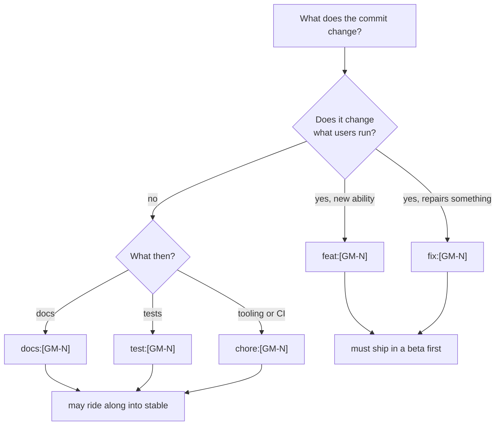

# Contributing

Thank you for helping! This page lists the rules for code, commits and pull requests. Each rule has a short reason, because a rule you understand is easier to follow. The same rules are in `CLAUDE.md` at the repository root, which is worth reading once.

## Before you start

- Set up the project with the [Developer Guide](Developer-Guide.md).
- Branch from `develop`. It is the default branch, and all work lands there by pull request.
- Read the developer page for the area you are changing, and the feature's `How-...-Works.md` chapter if there is one. Its "Bugs we fixed" section tells you what went wrong before.

## Code style

These are organization rules and apply to TypeScript, Svelte, JavaScript and Rust alike.

- **Every `if` has braces.** No single-line `if` without a block. When someone later adds a second line, it can never fall outside the condition by accident.
- **End statements with semicolons** in TS and JS. Relying on automatic semicolon insertion causes rare but confusing bugs.
- **Put a trailing comma after the last item** of multi-line objects, arrays and argument lists. Adding an item then changes one line in the diff, not two.
- **Name parameters after the thing they hold:** `repoPath`, `filePath`, `commitId`, `branchName`, `stashIndex`, never just `id` or `path`. A workspace has many repositories, paths and ids at once, and the name should say which one you have. In Rust the same names are snake_case (`repo_path`).
- **Default missing values so they never throw:** `?? null`, `?? []`, `unwrap_or_default()`. Data from GitHub, from a hand-edited settings file or from an odd repository can be missing, and a missing field should show as empty, not crash the app.
- **Never use the em-dash character**, anywhere: code, comments, UI text, commits, docs. Use a colon, a comma or a hyphen. It keeps text consistent and easy to type, and the wiki check rejects it.
- **Comments are sparse and explain why.** The code already says what it does.
- **Svelte 5 runes only** (`$state`, `$derived`, `$effect`, `$props`), `onclick`-style attributes and no `export let`. Use `$state.raw` for big arrays and objects that are replaced. See [Frontend](Frontend.md).
- **Colors come from the CSS tokens** in `src/app.css`, so light and dark themes both keep working.
- **UI text is short and plain.** Destructive actions ask first with `dialogs.confirm({ danger: true })`.
- **Put tricky logic in a pure `.ts` module with a test.** See [Testing](Testing.md).
- **Keep platform-specific code behind `cfg` or runtime checks.** Windows and Linux builds are planned.

## Commits

### The message format

```text
type:[GM-N] one-line summary
```

The ticket goes in square brackets right after the colon, with no space before the bracket. Then comes a single-line summary. For example:

```text
feat:[GM-21] reopen closed tabs with Shift+Cmd+T
fix:[GM-22] keep the blame gutter after an undo
docs:[GM-23] explain the IPC bridge
```

| Type | Use it for | Needs a new beta before stable? |
| --- | --- | --- |
| `feat` | a new feature | yes |
| `fix` | a bug fix | yes |
| `feat!` or `fix!` | a breaking change (suggests a major version) | yes |
| `docs` | documentation only | no |
| `test` | tests only | no |
| `chore` | tooling, CI, dependencies, release commits | no |



Why does the type matter so much? The release tools read it. `feat` and `fix` decide the next version number, and any commit that is not `docs`, `test` or `chore` counts as "untried": a stable release refuses to ship it until it has been in a beta. See [Versioning and Changelog](Versioning-and-Changelog.md).

**The ticket.** Ask the maintainer for a ticket number if you do not have one. `bun scripts/version.ts next-ticket` prints the next free `GM` number.

### Other commit rules

- **Author identity.** For this repository, the maintainer commits as `Md. Shibbir Ahmed <shibbirweb@gmail.com>`, set in the repository's local git config. If you commit on the maintainer's behalf, and that config is missing, pass `-c user.name="Md. Shibbir Ahmed" -c user.email="shibbirweb@gmail.com"`. Never commit with some other global identity by accident: check `git config user.email` first.
- **No `Co-Authored-By` lines.** Keep the message to the format above.
- **User-visible changes add a changelog line** under `## [Unreleased]` in `CHANGELOG.md`, in the same commit.
- **Never commit build output:** `node_modules`, `build`, `.svelte-kit`, `src-tauri/target`, `src-tauri/gen`.
- **Do commit lockfiles:** `bun.lock` and `src-tauri/Cargo.lock`. CI installs with `--frozen-lockfile` and `--locked` and fails without them.
- **Never edit the version or create release tags by hand.** The release workflows do both.
- **Commit or push only when asked** is the rule for tools and AI assistants working in this repository, as `CLAUDE.md` says.

## Issues and triage

Issues use the forms in `.github/ISSUE_TEMPLATE/`:

- **`bug_report.yml`** (labeled `bug`, titled `[Bug]: ...`) asks what happened, the steps to reproduce, the Git Manager version, the operating system, the `git --version` output and any screenshots. Report a Bug in the app (Settings, About, the status bar help menu or the welcome screen) opens this form with the version and operating system already filled in, using the field ids `version` and `platform` (see `bugReportUrl` in `src/lib/update/releases.ts`). Keep those ids if you edit the form, or the pre-filling stops working.
- **`feature_request.yml`** (labeled `enhancement`, titled `[Feature]: ...`) asks what the person wants to do, how it should work and what they tried instead. The app links to it from the same places.
- **`config.yml`** keeps blank issues allowed and adds a link to the releases page, for people looking for release notes.

When you triage a bug, first reproduce it with a demo script (see [Debugging](Debugging.md)). Ask for the missing steps or versions if you cannot. A confirmed bug gets a `GM` ticket before work starts.

## Pull requests

- Open them against `develop`.
- Keep each one focused on one change. Small pull requests get reviewed faster and are easier to undo.
- Fill in the three sections of `.github/pull_request_template.md`: **What and why**, **Test plan** (it starts with one empty bullet) and **Docs**, the checklist below.
- Write the test plan as plain bullet points, never checkboxes. Say what you ran and what you checked by hand, and say plainly what you could not check, such as a visual detail.
- CI must pass. Run the checks locally first: `bun run check`, `bun run test`, `cargo test` and `cargo clippy --all-targets`, all clean.

A good test plan looks like this:

```text
## Test plan

- bun run check, bun run test, cargo test and cargo clippy are clean
- Opened scripts/make-conflict-repo.sh output and resolved both.txt in the merge tool
- Not checked: the dark theme colors of the new button
```

## The docs checklist

The **Docs** section of the pull request template asks four things:

- The user page and developer chapter in `docs/wiki` are updated, or there is no user-visible change.
- Screenshots are retaken with `bun scripts/screenshots.ts <name>` if the UI changed.
- A bug fix is recorded under "Bugs we fixed" in the feature's developer chapter: the issue, why it happened, and why this fix.
- `CHANGELOG.md` has a line under Unreleased for anything user-visible.

Two more are not in the template but matter just as much: a new feature is in `features.json` with both pages and its screenshots, and `bun scripts/build-wiki.ts --check` passes (CI runs it too).

Step by step recipes for each of these are in [Docs and Screenshots](Docs-and-Screenshots.md).
