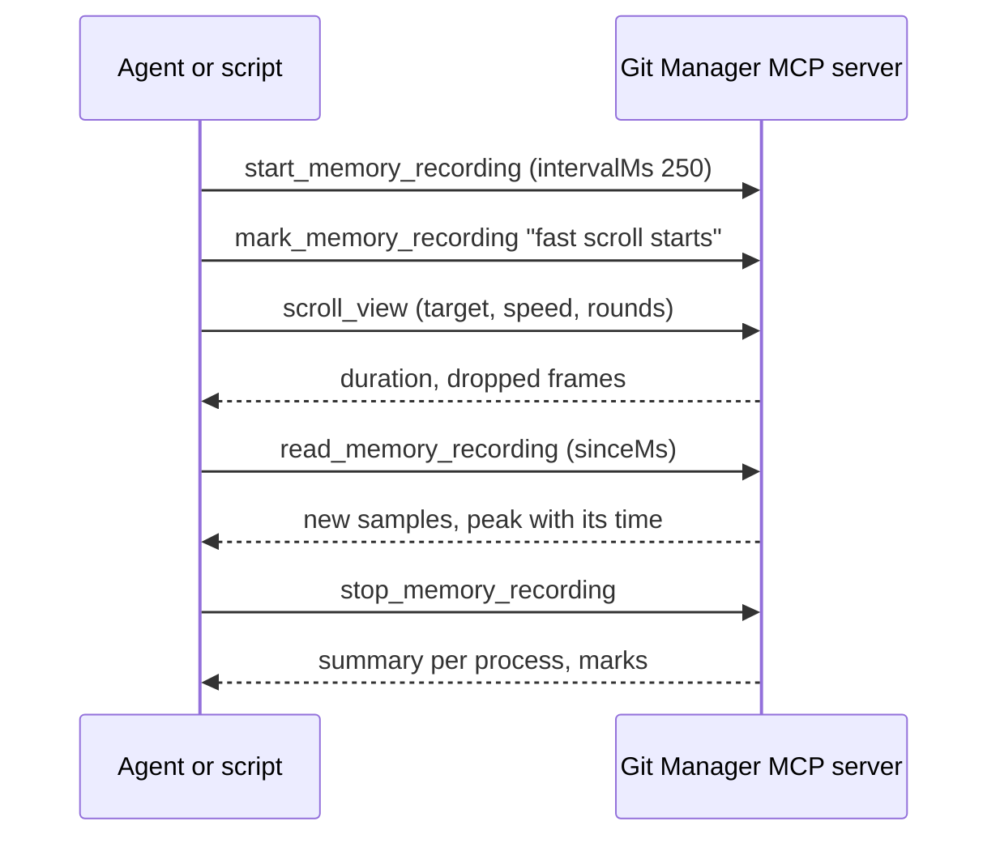

# Debugging with MCP

Some problems only show in the real app: a color that hides a selection, memory that grows while you scroll, a panel that is drawn but empty. The Web Inspector helps (see [Debugging](Debugging.md)), but an AI agent connected through the MCP server, or a script using `git-manager cli`, can look at the running window, measure it and repeat the same steps many times. This page shows how. How the server works is in [How MCP and the CLI work](How-MCP-and-CLI-Work.md).

## Set it up

1. Start the app, the dev build (`bun tauri dev`) or a release.
2. In Settings, Automation, turn on **MCP server** (for an agent) or **Command line tool** (for scripts).
3. Connect Claude Code with the command under **Connect Claude Code**, or use `git-manager cli`.
4. In Help > Available MCP Tools, check that the Performance tools are on (they are by default).

The dev build and a release share `~/.gitmanager`, so they share the token too. Run only one of them with the server on: both use the same port.

## See what the user sees

- `get_app_state`: the workspace, active repository, tabs, panels, terminals, theme and any open dialog. Start here.
- `take_screenshot`: a PNG of the window, even when other windows cover it (macOS only; macOS asks for Screen Recording permission once). From a terminal: `git-manager cli screenshot /tmp/gm.png`.
- `inspect_elements`: elements by CSS selector, with their text, position, size, visibility and the computed styles you ask for.

```sh
git-manager cli call inspect_elements selector=".cm-editor .cm-activeLine" styles='["background-color","z-index"]'
```

To reproduce a problem, drive the UI with `run_menu_command` (any menu item, see `list_menu_commands`), `open_file`, `show_panel`, `show_commit` and `scroll_view`.

### Example: the invisible selection

A selection inside one line showed nothing. `inspect_elements` on `.cm-selectionBackground` showed the selection was drawn, with the right color, and on `.cm-activeLine` showed an opaque background on the same line, above it. CodeMirror draws the selection behind the text, so the current line highlight covered it. The fix is in [How the editor works](How-the-Editor-Works.md#bugs-we-fixed).

## Measure memory



- `get_memory_usage`: one reading, per process (app, Web content, Graphics, Networking).
- `sample_memory`: readings for up to 60 seconds in one call, with minimum, maximum and average.
- The recorder (`start_memory_recording`, `mark_memory_recording`, `read_memory_recording`, `stop_memory_recording`): runs in the background while you or the agent act. Marks label the moments, so a peak can be matched to an action. Ask the user to scroll by hand and read the recording afterwards.
- `get_ui_performance`: DOM element counts per area, open tabs, mounted editors, terminals, drawn Markdown diagrams, long tasks since the last call and frame timing.
- `git-manager cli memory --interval 250 --duration 30`: live lines in a terminal, then the minimum, average and peak.

For a problem the user meets by hand, turn on the memory log (Settings, Automation, Memory log). It writes every change with what was on screen and when scrolling started and stopped. Read it with `read_memory_log` or open `~/.gitmanager/logs/memory.log`. See [How memory is measured](How-Memory-Is-Measured.md).

### Example: fast scrolling a long Markdown file

Scrolling a 35 KB README fast made WebKit's Web content process peak at 400 to 650 MB, then settle at 60 to 200 MB. A plain HTML page without our code did the same, and the same setup gave 98 MB in one run and 444 MB in the next. So the peak is WebKit's, runs are noisy, and no change was made. Measure several runs and compare marks, not single numbers.

## Read what git did

`git_console_entries` lists the git commands the app ran, with arguments, exit codes, timing and the start of their output. It is empty unless Settings, Git, Git Console is on (see [Git Console](../usage/Git-Console.md)). `git_status`, `git_conflicts` and `git_log` show the repository as the app sees it.

## Rules

- Use demo repositories (`scripts/make-conflict-repo.sh`, `scripts/make-workspace-demo.sh`) for anything that changes files; the tools only reach the open folders.
- Keep destructive tools off unless the test needs them.
- Turn the server and the memory log off when you are done.

## Related

- [Debugging](Debugging.md)
- [How MCP and the CLI work](How-MCP-and-CLI-Work.md)
- [How memory is measured](How-Memory-Is-Measured.md)
- [MCP Server and Command Line Tool](../usage/MCP-and-CLI.md)
