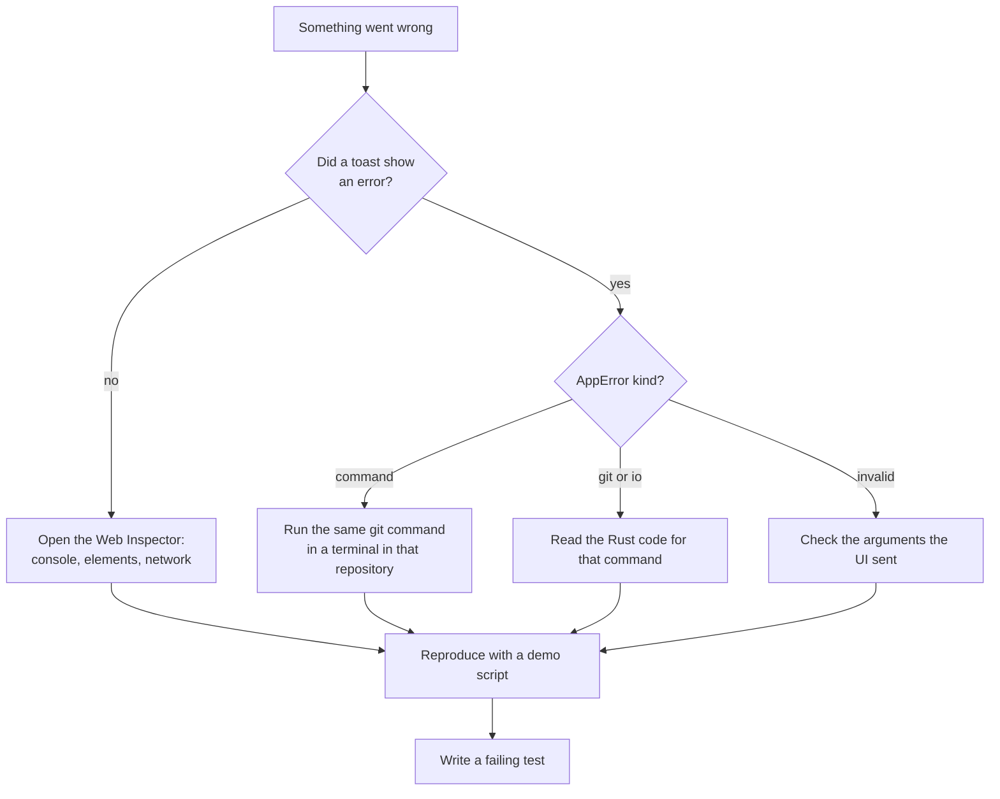

# Debugging

Something is wrong and you want to know why. This page shows where to look, in the order that usually finds the problem fastest: the error message, the web view tools, the Rust side, and a reproduction you can run again. It ends with the dead ends that cost us time before.



## Read the error first

Every failed command reaches the UI as `AppError { kind, message }` (see [Backend](Backend.md)). `repoStore.run` shows it as a toast titled `<label> failed` with the message below it. The kind tells you which layer failed:

| Kind | Meaning | Where to look |
| --- | --- | --- |
| `command` | the git CLI exited with an error; the message is git's own output | run the same command in a terminal, in the same repository |
| `git` | a git2 (libgit2) call failed | the reader in `src-tauri/src/git/` behind that command |
| `io` | a file could not be read or written | permissions, a missing folder, a path that changed |
| `invalid` | the backend refused the input, like a path with `..` or an unknown config name | the arguments the UI passed |

For `command` errors, the terminal is your best friend. If `git push` fails the same way there, the problem is in the repository or your git setup, not in the app. The exact git arguments for each command are listed in [Commands and Events](Commands-and-Events.md).

## The Web Inspector

Debug builds (everything `bun tauri dev` runs) include the Safari Web Inspector. Open it with Cmd+Option+I, or right-click an area that has no custom menu and choose Inspect Element. Release builds leave it out, because the `tauri` crate is built without its `devtools` feature.

What it is good for:

- **Console:** uncaught errors and failed promises from the UI.
- **Elements:** check which CSS token a color comes from, or why a layout wraps.
- **Network:** the update check's call to `api.github.com`.
- **Trying a command by hand:** `await window.__TAURI_INTERNALS__.invoke("get_status", { repoPath: "/tmp/conflict-demo" })` calls the backend directly. This is Tauri's internal object, so use it only for poking around, never in app code (that is what `api.ts` is for).

Svelte changes reload instantly, so you can add a temporary `console.log`, look, and remove it. Never commit one.

## The Rust side

The terminal running `bun tauri dev` shows Rust compile errors and any panic, with the file and line. The backend has no logging of its own: errors travel to the UI as `AppError`. While you debug, a temporary `eprintln!("{repo_path}")` prints to that terminal. Remove it before you commit.

- **Backtraces:** start with `RUST_BACKTRACE=1 bun tauri dev`.
- **Panics in dev** inside `commands::blocking` come back as an `invalid` error, "Background task failed", instead of killing the app.
- **Panics in release** abort the whole app, because the release profile sets `panic = "abort"`. That is why the code never calls `unwrap` on data from users or repositories: use `?`, `.ok()` or a default instead.

## Reproduce it

A bug you can repeat is half fixed. Build a throwaway repository instead of testing on real work:

```sh
scripts/make-conflict-repo.sh /tmp/conflicts           # every conflict type, stopped in a merge
scripts/make-conflict-repo.sh /tmp/rebase --rebase     # the same, stopped in a rebase
scripts/make-workspace-demo.sh /tmp/workspace          # nested, conflicted and clean repositories
bun tauri dev -- -- /tmp/conflicts
```

Once you know the steps, turn them into a failing test with `TestRepo` (Rust) or a pure `.ts` module (Vitest), then fix it. See [Testing](Testing.md).

## Driving the UI from a browser

Sometimes a normal browser's devtools are easier, or you want a script to click through the UI. The dev-only IPC bridge lets a browser page use the backend of the running app:

```sh
GM_IPC_BRIDGE=1 bun tauri dev
# keep the app window open, then visit http://127.0.0.1:1420/?ipc-bridge in a browser
```

Be careful: every command the page sends runs in the app for real. Without the overrides that `scripts/screenshots.ts` installs, the page reads and saves your own `~/.gitmanager` settings and runs git on whatever it opens. So open only demo repositories, and stop the app when you are done. Backend events such as `repo-changed` do not reach the page, so reload it after changes on disk. How the bridge works is in [Architecture](Architecture.md).

## Common dead ends

**"Port 1420 is already in use".** An old dev session left Vite running. Vite uses `strictPort` because Tauri loads the UI from exactly that address. Find the process with `lsof -i :1420`, stop it, and start again.

**Strange errors from Vite or svelte-kit.** You probably ran `npm`, `npx` or `node`. The system Node is too old. Use `bun` and the scripts in `package.json`, which run on `bun --bun`.

**A hook fails with "command not found", or git is not found.** Apps started from Finder get a tiny `PATH`. `git/cli.rs` asks your login shell for the real one (`$SHELL -l -c`), with a 3 second limit. If your shell startup is slow or prints errors, it falls back to Homebrew paths plus the current `PATH`. Check with `$SHELL -l -c 'echo $PATH'`. The git binary is the first of `/opt/homebrew/bin/git`, `/usr/local/bin/git` and `/usr/bin/git` that exists.

**Push or fetch fails with "terminal prompts disabled".** That is on purpose: `GIT_TERMINAL_PROMPT=0`, because a GUI cannot answer a password prompt and git would wait forever. Set up a credential helper (for example the macOS keychain) or an SSH agent, and check that `git push` works in a terminal without asking anything.

**An action seems to hang.** A slow hook (a pre-commit linter, for example) runs exactly as in the terminal, so the busy label stays until it finishes. Editors never open: `GIT_EDITOR` and `GIT_SEQUENCE_EDITOR` are `true`.

**The UI does not refresh after a change.** The watcher drops paths the repository ignores and noise inside `.git` (`objects/`, `logs/`, `lfs/`, `*.lock`). Check that the file is not ignored and that it belongs to the repository you expect: with nested repositories, the deepest one wins.

**Settings do not stick.** If `~/.gitmanager/settings.json` has invalid JSON, the app uses defaults, shows the error in Settings and never overwrites the file. Fix the JSON by hand.

**The memory readout says approximate.** Expected when the app is started from a terminal: macOS then treats the terminal as the app's "responsible" process, so helpers are matched by start time instead.

## Lessons learned

**Port 1420 cost us restarts more than once.** The tempting fix is a different port, but Tauri's `devUrl` and Vite's `strictPort` are set to 1420 on purpose, so a mismatch fails in a more confusing way. Stopping the stale process is the real fix, and it is now listed in `CLAUDE.md` under Gotchas.

**The memory readout found no helpers in a dev build.** Helpers are matched by their macOS "responsible" process. A probe showed that a Finder launch makes the app responsible for itself, but a terminal launch makes the terminal responsible, so matching on the app found nothing, and matching on the terminal would also count its other web views. `memory.rs` now matches on whatever process is responsible, also requires helpers to start after the app when that is not the app itself, and marks the result approximate. Keep this in mind when a number from `bun tauri dev` looks different from the built app.
