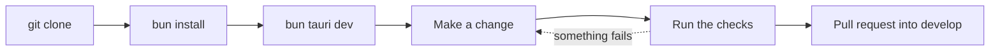

# Developer Guide

Welcome! This page gets you from an empty folder to a running Git Manager, and then points you to the page you need next.

Git Manager is a native macOS Git client. The backend is Rust on [Tauri 2](https://v2.tauri.app) in `src-tauri/`. The UI is Svelte 5 and TypeScript in `src/`, and every text pane is a CodeMirror 6 editor. The app uses the web view that macOS already ships, so it starts fast and stays small.

## What you need

- **macOS.** The app targets macOS today. Some backend code (the memory readout) is macOS only.
- **Rust (stable)**, installed with [rustup](https://rustup.rs). You also get `cargo` and `clippy`.
- **Xcode Command Line Tools** (`xcode-select --install`), for the linker and a system git.
- **[Bun](https://bun.sh)**, the only JavaScript tool in this project.
- **git**, any recent version. The app runs your own git binary for every write.

### Why Bun and never npm, npx or node

The system Node on the main development machine is v16, and Vite 8 needs a much newer Node. Instead of asking everyone to manage Node versions, every script in `package.json` runs on Bun's own runtime with `bun --bun`. So please never type `npm`, `npx` or `node`: they would pick up the old Node and fail in confusing ways.

## First run

```sh
git clone https://github.com/shibbirweb/git-manager.git
cd git-manager
bun install                    # dependencies (commit bun.lock if it changes)
bun tauri dev                  # run the app with hot reload
bun tauri dev -- -- /path/to/folder   # open a folder straight away
```

The first `bun tauri dev` compiles every Rust crate, so it takes a few minutes. After that, Svelte changes reload instantly and Rust changes rebuild only what changed.



## Demo data

You rarely want to test on a real project. Three scripts build throwaway repositories for you. Each one refuses a folder that is not empty, so it can never overwrite your work.

| Script | What it builds |
| --- | --- |
| `scripts/make-conflict-repo.sh <dir> [--rebase]` | A repository stopped in a merge (or a rebase) with every conflict type, long files and M, A, U, D and R samples. Use it for the merge tool and the conflicts dialog. |
| `scripts/make-workspace-demo.sh <dir>` | A folder with several repositories: one nested, one mid-merge, one clean, plus a plain folder with no git. Use it for workspaces. |
| `scripts/make-docs-demo.sh <dir>` | The workspace the wiki screenshots are taken in: a shop repository with four authors, branches, tags, a stash and a remote, a repository with conflicts and a second folder. See [Docs and Screenshots](Docs-and-Screenshots.md). |

```sh
scripts/make-conflict-repo.sh /tmp/conflict-demo
bun tauri dev -- -- /tmp/conflict-demo
```

The Rust tests run `make-conflict-repo.sh` and check its exact output. If you change that script, update `src-tauri/src/git/tests.rs` too.

## The checks

Run all four before you say a change is done. CI runs the same ones, so a clean local run means a green pull request.

```sh
bun run check                  # svelte-check + TypeScript: 0 errors and 0 warnings
bun run test                   # Vitest unit tests
cd src-tauri && cargo test     # Rust unit and git integration tests
cd src-tauri && cargo clippy --all-targets   # no warnings
```

CI also runs `bun scripts/version.ts check` and `bun scripts/build-wiki.ts --check`, so run those too when you touch versions or docs. To build a release app locally, run `bun tauri build --bundles app`; it lands in `src-tauri/target/release/bundle/macos`.

## Map of the developer pages

### Platform pages

| Page | What it covers |
| --- | --- |
| [Architecture](Architecture.md) | The big picture: UI, IPC, commands, git reads and writes, events, memory and the dev IPC bridge. |
| [Project Layout](Project-Layout.md) | What lives in which folder and file. |
| [Backend](Backend.md) | Tauri commands, errors, the git CLI runner, git2, the watcher and config files. |
| [Frontend](Frontend.md) | Stores, Svelte 5 runes, the API bridge and CodeMirror patterns. |
| [Commands and Events](Commands-and-Events.md) | Every backend command and event, with its arguments and return type. |
| [Testing](Testing.md) | Rust tests with real repositories, the Vitest suites and what "done" means. |
| [Debugging](Debugging.md) | Web view devtools, Rust panics, reading IPC errors and common dead ends. |
| [Releases and CI](Releases-and-CI.md) | CI, the beta and stable release workflows and the wiki deploy. |
| [Versioning and Changelog](Versioning-and-Changelog.md) | Where the version lives, `scripts/version.ts` and the changelog rules. |
| [Platforms and Signing](Platforms-and-Signing.md) | The universal macOS build, signing and notarization, and the Windows and Linux plan. |
| [Docs and Screenshots](Docs-and-Screenshots.md) | How this wiki is checked, how screenshots are taken, and recipes for keeping docs in sync. |
| [Contributing](Contributing.md) | Code style, commits, pull requests and the docs checklist. |

### Feature chapters

Each chapter explains why a feature exists, how it works, the decisions behind it and the bugs we fixed.

| Chapter | Feature |
| --- | --- |
| [How Workspaces Work](How-Workspaces-Work.md) | Folders, nested repositories and workspace files. |
| [How the Files Panel Works](How-the-Files-Panel-Works.md) | The lazy file tree and its git status colors. |
| [How the Editor Works](How-the-Editor-Works.md) | Tabs, preview tabs and change markers. |
| [How Changes and Commits Work](How-Changes-and-Commits-Work.md) | Staging, hunks, discard, commit and amend. |
| [How Diffs Work](How-Diffs-Work.md) | The side by side diff view. |
| [How Conflict Resolution Works](How-Conflict-Resolution-Works.md) | The operation banner, conflicts dialog and inline actions. |
| [How the Merge Tool Works](How-the-Merge-Tool-Works.md) | The three pane merge tool and its engine. |
| [How Blame Works](How-Blame-Works.md) | Inline blame and the blame gutter. |
| [How the Log Works](How-the-Log-Works.md) | The paged commit graph and commit details. |
| [How Branches and Tags Work](How-Branches-and-Tags-Work.md) | The branches sidebar and its actions. |
| [How Remotes Work](How-Remotes-Work.md) | Fetch, pull and push with progress. |
| [How Stashes Work](How-Stashes-Work.md) | Stash, apply, pop and drop. |
| [How Navigation Works](How-Navigation-Works.md) | Back and Forward history. |
| [How Settings Work](How-Settings-Work.md) | `~/.gitmanager` and validated preferences. |
| [How Updates Work](How-Updates-Work.md) | The notify-only update check and channels. |
| [How the Status Bar Works](How-the-Status-Bar-Works.md) | Status bar items and the memory readout. |
| [How Mergetool Mode Works](How-Mergetool-Mode-Works.md) | Running as `git mergetool`. |

If you want to know how the app looks to its users, start with [Getting Started](../usage/Getting-Started.md).

## Lessons learned

**Node v16 was too old for Vite 8.** Early on, `vite` and `svelte-kit` crashed under the system Node. We could have required a newer Node, but Bun was already installed and can run these tools itself. So every script became `bun --bun <tool>`, which forces Bun's runtime even when a tool's first line asks for `node`.

**`bun --bun tauri` called itself.** The first `tauri` script in `package.json` was `bun --bun tauri`. Bun looks for a script named `tauri` before it looks for a binary, so the script ran itself again and again until macOS refused to start more processes (`EAGAIN`). The script is now `bunx --bun tauri`, which always runs the Tauri CLI binary.

**Port 1420 was already in use.** `bun tauri dev` starts Vite on port 1420, and Vite is set to `strictPort`, because Tauri loads the UI from that exact address. When a dev session dies badly, the old Vite process can keep the port. The fix is to stop the old `bun` or `vite` process before starting again, not to change the port.
