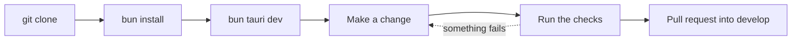

# Developer Guide

Welcome! This page gets you from an empty folder to a running Git Manager, and then points you to the page you need next.

Git Manager is a native macOS Git client. The backend is Rust on [Tauri 2](https://v2.tauri.app) in `src-tauri/`. The UI is Svelte 5 and TypeScript in `src/`, and every text pane is a CodeMirror 6 editor. The app uses the web view that macOS already ships, so it starts fast and stays small.

## What you need

- **macOS.** The app targets macOS today. Some backend code (the memory readout, the MCP screenshot) is macOS only.
- **Rust (stable)**, installed with [rustup](https://rustup.rs). You also get `cargo` and `clippy`.
- **Xcode Command Line Tools** (`xcode-select --install`), for the linker and a system git.
- **[Bun](https://bun.sh)**, the only JavaScript tool in this project.
- **git**, any recent version. The app runs your own git binary for every write.

### Why Bun and never npm, npx or node

The system Node on the main development machine is v16, and Vite 8 needs a much newer Node. Instead of asking everyone to manage Node versions, every script in `package.json` runs on Bun's own runtime with `bun --bun`. So please never type `npm`, `npx` or `node`: they would pick up the old Node and fail in confusing ways.

## First run

```sh
git clone https://github.com/shibbirweb/git-manager.git
cd git-manager
bun install                    # dependencies (commit bun.lock if it changes)
bun tauri dev                  # run the app with hot reload
bun tauri dev -- -- /path/to/folder   # open a folder straight away
```

The first `bun tauri dev` compiles every Rust crate, so it takes a few minutes. After that, Svelte changes reload instantly and Rust changes rebuild only what changed.



## Demo data

You rarely want to test on a real project. Three scripts build throwaway repositories for you. Each one refuses a folder that is not empty, so it can never overwrite your work.

| Script | What it builds |
| --- | --- |
| `scripts/make-conflict-repo.sh <dir> [--rebase]` | A repository stopped in a merge (or a rebase) with every conflict type, long files and M, A, U, D and R samples. Use it for the merge tool and the conflicts dialog. |
| `scripts/make-workspace-demo.sh <dir>` | A folder with several repositories: one nested, one mid-merge, one clean, plus a plain folder with no git. Use it for workspaces. |
| `scripts/make-docs-demo.sh <dir>` | The workspace the wiki screenshots are taken in: a shop repository with four authors, branches, tags, a stash and a remote, a repository with conflicts, a plain `notes/` folder, a second folder, and `extras/` with a submodule and Git LFS images. See [Docs and Screenshots](Docs-and-Screenshots.md). |

```sh
scripts/make-conflict-repo.sh /tmp/conflict-demo
bun tauri dev -- -- /tmp/conflict-demo
```

The Rust tests run `make-conflict-repo.sh` and check its exact output. If you change that script, update `src-tauri/src/git/tests.rs` too.

## The checks

Before you say a change is done, run the checks listed in [Testing](Testing.md#what-done-means): `bun run check`, `bun run test`, `cargo test` and `cargo clippy --all-targets -- -D warnings`, plus the docs and version checks when you touch those. CI runs the same ones, so a clean local run means a green pull request. To build a release app locally, run `bun tauri build --bundles app`; it lands in `src-tauri/target/release/bundle/macos`.

## Map of the developer pages

### Platform pages

| Page | What it covers |
| --- | --- |
| [Architecture](Architecture.md) | The big picture: UI, IPC, commands, git reads and writes, events, memory, security and the dev IPC bridge. |
| [Project Layout](Project-Layout.md) | What lives in which folder and file. |
| [Backend](Backend.md) | Tauri commands, errors, the git CLI runner, git2, the watcher and config files. |
| [Backend Services](Backend-Services.md) | Terminal, search, scripts, Git Console, GitHub, MCP and other Rust services. |
| [Frontend](Frontend.md) | The shell, stores, Svelte 5 runes, the API bridge, keys, menus and colors. |
| [Menu Keys and Routing](Menu-Keys-and-Routing.md) | How a key reaches the editor, the window or the native menu. |
| [Frontend Modules](Frontend-Modules.md) | The feature folders in `src/lib` and what loads lazily. |
| [CodeMirror Patterns](CodeMirror-Patterns.md) | State fields, compartments, widgets and keymaps in every text pane. |
| [Commands and Events](Commands-and-Events.md) | Every backend command and event, with its arguments and return type, over four pages. |
| [Testing](Testing.md) | Rust tests with real repositories, Vitest and what "done" means. |
| [Test Suites](Test-Suites.md) | Every test file and what it covers. |
| [Settings Reference](Settings-Reference.md) | Every key in `settings.json` and `state.json`. |
| [Debugging](Debugging.md) | Web view devtools, Rust panics, IPC errors, the memory log and common dead ends. |
| [Releases and CI](Releases-and-CI.md) | CI, the beta and stable release workflows and the wiki deploy. |
| [Versioning and Changelog](Versioning-and-Changelog.md) | Where the version lives, `scripts/version.ts` and the changelog rules. |
| [Platforms and Signing](Platforms-and-Signing.md) | The universal macOS build, signing, and the Windows and Linux plan. |
| [Docs and Screenshots](Docs-and-Screenshots.md) | How this wiki is checked, how screenshots are taken, and recipes for keeping docs in sync. |
| [Contributing](Contributing.md) | Code style, commits, pull requests and the docs checklist. |

### Feature chapters

Each chapter explains why a feature exists, how it works, the decisions behind it and the bugs we fixed.

- **Window and files:** [How Workspaces Work](How-Workspaces-Work.md), [How Workspace Files Work](How-Workspace-Files-Work.md), [How Folder Watching Works](How-Folder-Watching-Works.md), [How the Files Panel Works](How-the-Files-Panel-Works.md), [How the Menus Work](How-the-Menus-Work.md), [How the Status Bar Works](How-the-Status-Bar-Works.md), [How Memory Is Measured](How-Memory-Is-Measured.md), [How Navigation Works](How-Navigation-Works.md), [How Settings Work](How-Settings-Work.md), [How Color Themes Work](How-Color-Themes-Work.md), [How Updates Work](How-Updates-Work.md).
- **Editing:** [How the Editor Works](How-the-Editor-Works.md), [How Editing Code Works](How-Editing-Code-Works.md), [How Commit Tabs Work](How-Commit-Tabs-Work.md), [How the Markdown Editor Works](How-the-Markdown-Editor-Works.md), [How the Rich Markdown Editor Works](How-the-Rich-Markdown-Editor-Works.md), [How Search Everywhere Works](How-Search-Everywhere-Works.md), [How Recent Files Works](How-Recent-Files-Work.md), [How Find and Replace Works](How-Find-and-Replace-Works.md), [How Diffs Work](How-Diffs-Work.md).
- **Git:** [How Changes and Commits Work](How-Changes-and-Commits-Work.md), [How Repository Actions Work](How-Repository-Actions-Work.md), [How the Git Menu Works](How-the-Git-Menu-Works.md), [How the Git Dialogs Work](How-the-Git-Dialogs-Work.md), [How Branches and Tags Work](How-Branches-and-Tags-Work.md), [How Remotes Work](How-Remotes-Work.md), [How Stashes Work](How-Stashes-Work.md), [How the Shelf Works](How-the-Shelf-Works.md), [How the Log Works](How-the-Log-Works.md), [How Blame Works](How-Blame-Works.md), [How Interactive Rebase Works](How-Interactive-Rebase-Works.md), [How Worktrees Work](How-Worktrees-Work.md), [How Submodules Work](How-Submodules-Work.md), [How Git LFS Works](How-Git-LFS-Works.md), [How the Git Console Works](How-the-Git-Console-Works.md), [How GitHub Works](How-GitHub-Works.md).
- **Conflicts:** [How Conflict Resolution Works](How-Conflict-Resolution-Works.md), [How the Merge Tool Works](How-the-Merge-Tool-Works.md), [How Mergetool Mode Works](How-Mergetool-Mode-Works.md).
- **Tools:** [How the Terminal Works](How-the-Terminal-Works.md), [How Scripts Work](How-Scripts-Work.md), [How MCP and CLI Work](How-MCP-and-CLI-Work.md).

If you want to know how the app looks to its users, start with [Getting Started](../usage/Getting-Started.md).

## Lessons learned

**Node v16 was too old for Vite 8.** Early on, `vite` and `svelte-kit` crashed under the system Node. We could have required a newer Node, but Bun was already installed and can run these tools itself. So every script became `bun --bun <tool>`, which forces Bun's runtime even when a tool's first line asks for `node`.

**`bun --bun tauri` called itself.** The first `tauri` script in `package.json` was `bun --bun tauri`. Bun looks for a script named `tauri` before it looks for a binary, so the script ran itself again and again until macOS refused to start more processes (`EAGAIN`). The script is now `bunx --bun tauri`, which always runs the Tauri CLI binary.

**Port 1420 was already in use.** `bun tauri dev` starts Vite on port 1420, and Vite is set to `strictPort`, because Tauri loads the UI from that exact address. When a dev session dies badly, the old Vite process can keep the port. The fix is to stop the old `bun` or `vite` process before starting again, not to change the port.
