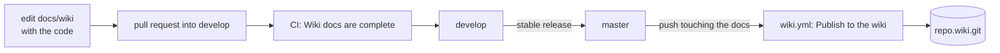

# Docs and Screenshots

This wiki is written in the main repository, in `docs/wiki/`, and published to the GitHub wiki by a workflow. Docs live next to the code, so a change and its docs are reviewed together. This page explains how the docs are checked and how screenshots are taken, then gives step by step recipes.

## How `docs/wiki` is organized

- **`usage/`** has pages for people who use the app, like [Merge Tool](../usage/Merge-Tool.md). No code, plain words, lots of screenshots.
- **`developer/`** has platform pages like this one, and one chapter per feature, like [How the Merge Tool Works](How-the-Merge-Tool-Works.md).
- **`images/`** holds the screenshots, as PNG files.
- **`features.json`** is the map: every usage page, every developer page, and every feature with its pages and screenshots. Its order is the sidebar order.

A feature entry looks like this:

```json
{
  "id": "merge-tool",
  "title": "Merge tool",
  "usage": "usage/Merge-Tool.md",
  "developer": "developer/How-the-Merge-Tool-Works.md",
  "screenshots": ["merge-tool.png", "merge-tool-resolved.png"]
}
```

## The check

```sh
bun scripts/build-wiki.ts --check
```

CI runs this on every push and pull request, in the step "Wiki docs are complete" of `ci.yml`. It fails when:

- a listed page is missing, a page is not listed, two pages share a wiki name, or a feature id repeats;
- a feature's usage page is not listed under `usage`, or it has no screenshots;
- a screenshot is missing (the message prints the command that takes it), not shown on its usage page, or an image is unused;
- a link points to a missing file or to a page not in the manifest;
- a page does not start with a `# Title` line, contains the em-dash character, has more than `MAX_WORDS` (1200) words of prose, or has a `mermaid` block that does not start with a diagram type.

Code blocks and diagrams do not count as words. The pure helpers are in `scripts/wiki.ts`, tested by `scripts/wiki.test.ts`. How pages become the wiki is in [Releases and CI](Releases-and-CI.md).



## How screenshots are taken

Screenshots show the real app, because a mocked backend drifts from the truth. So `scripts/screenshots.ts` drives a WebKit page (Playwright) that talks to the real Rust backend of a running `bun tauri dev`, through the dev-only IPC bridge explained in [Architecture](Architecture.md). The bridge relays commands, Channel messages (terminal output, search progress) and a few backend events, so terminal, Run tab and search shots show real output.

What the script does, and why:

- **It rebuilds the demo on every run.** It deletes `/tmp/gitmanager-docs` and runs `scripts/make-docs-demo.sh` there: a shop repository with four authors, branches, tags, a stash and a remote, a repository stopped in a merge, a plain folder, a second folder, a repository with a submodule and one with Git LFS images. Dates are relative to today, so blame always reads "2 days ago" and paths never change.
- **It keeps your own setup out.** The page answers some commands itself: settings and state live in memory, the launch mode points at the demo, and folder pickers return a fixed answer. Dialog, opener and window calls never reach the app, and GitHub's API gets canned releases.
- **It refuses anything outside the demo.** Any other command with an absolute path argument outside the demo folder fails with a "blocked" error, so a shot can never touch a real repository.
- **It retries once.** A dev server reload can break a single attempt, so each shot gets a second try before it counts as failed. Any failure makes the script exit with an error.

You need, once, `bunx --bun playwright install webkit`.

## Recipes

### Retake one screenshot

1. Start the app with the bridge on and leave it running: `GM_IPC_BRIDGE=1 bun tauri dev`. Vite prints "IPC bridge on" when it works. Keep the app window visible, not minimized or behind a full-screen app: macOS pauses a hidden web view, and every shot then fails with "No app window answered".
2. In a second terminal, find the name: `bun scripts/screenshots.ts --list`. Names are the image file names without `.png`.
3. Take it: `bun scripts/screenshots.ts merge-tool`. You can pass several names, with or without `.png`. With no names, it retakes all of them.
4. Look at the new image before you commit: a script can say "done" for a picture of the wrong thing.

### Add a new screenshot

1. In `scripts/screenshots.ts`, add a `define("my-shot", async (shot) => { ... })` next to similar ones. Use the helpers on `shot`, like `openFile`, `activateRepo`, `showLog`, `clipAround` and `save`. The optional third argument is a scenario: settings, state, color scheme, window size, releases and more.
2. If it needs new data, add it to `scripts/make-docs-demo.sh`, with relative dates.
3. Add `my-shot.png` to the feature's `screenshots` in `features.json`.
4. Show it on the feature's usage page: ``.
5. Take it (`bun scripts/screenshots.ts my-shot`), look at it, and run the check.

### Add a new feature to the docs

1. Add the feature to `features` in `features.json`. A new usage page also goes in the `usage` list, with a one-line summary.
2. Write the usage page in `usage/`: a `# Title` line, plain words, every screenshot shown.
3. Write the chapter `developer/How-...-Works.md`: why we need it, how it works (with mermaid diagrams), where the code lives, design decisions, tests, keeping it in sync, and an empty "Bugs we fixed" section.
4. Add its screenshots (recipe above).
5. Add a line under `## [Unreleased]` in `CHANGELOG.md`.
6. Run `bun scripts/build-wiki.ts --check`.

### Update the docs after a change

1. Look up the feature in `features.json` to find its pages and screenshots.
2. Update the usage page. Check every label, setting and shortcut against the code.
3. Update the developer chapter: how it works, where the code lives, the decisions.
4. Retake the screenshots that show the change.
5. For platform changes, update the matching page: builds in [Developer Guide](Developer-Guide.md), CI and releases in [Releases and CI](Releases-and-CI.md), versions in [Versioning and Changelog](Versioning-and-Changelog.md), tests in [Testing](Testing.md), and commands in [Commands and Events](Commands-and-Events.md).
6. Run the check.

### Record a bug fix

Add an entry under "Bugs we fixed" in the feature's chapter. The next person to touch that code needs exactly this:

```markdown
**Blame vanished after an undo.**
- **The issue:** what the user saw.
- **Why it happened:** the real cause, not the symptom.
- **The fix and why we chose it:** what changed, and why this fix over the others.
```

Also add a test that fails without the fix, and a `### Fixed` line in the changelog if users could see the bug.

### Preview the wiki locally

```sh
rm -rf /tmp/wiki-preview
bun scripts/build-wiki.ts /tmp/wiki-preview
```

It checks first and writes nothing on a problem. You get the flat wiki: one `Page-Name.md` per page, `images/`, and the generated `Home.md`, `_Sidebar.md` and `_Footer.md`. Links between pages are wiki names without `.md`, so they only work on GitHub. The build does not empty the folder, which is why the first line clears it.

Running the Wiki workflow by hand publishes to the live wiki for everyone, so do not use it as a preview.

## Writing style

- Simple, friendly English and short sentences. Explain the why, and explain git terms on first use.
- Aim for 300 to 1000 words. Split a big topic rather than grow a page.
- Relative links only, like `Architecture.md` or `../usage/Getting-Started.md`.
- Diagrams in `mermaid` blocks: flowchart, sequenceDiagram, stateDiagram-v2, classDiagram or gitGraph. Quote labels with punctuation.
- Never the em-dash character. Use a colon, a comma or a hyphen.
- Never point the bridge at a real repository or at your own `~/.gitmanager`.

The pull request template repeats the docs checklist. See [Contributing](Contributing.md).
