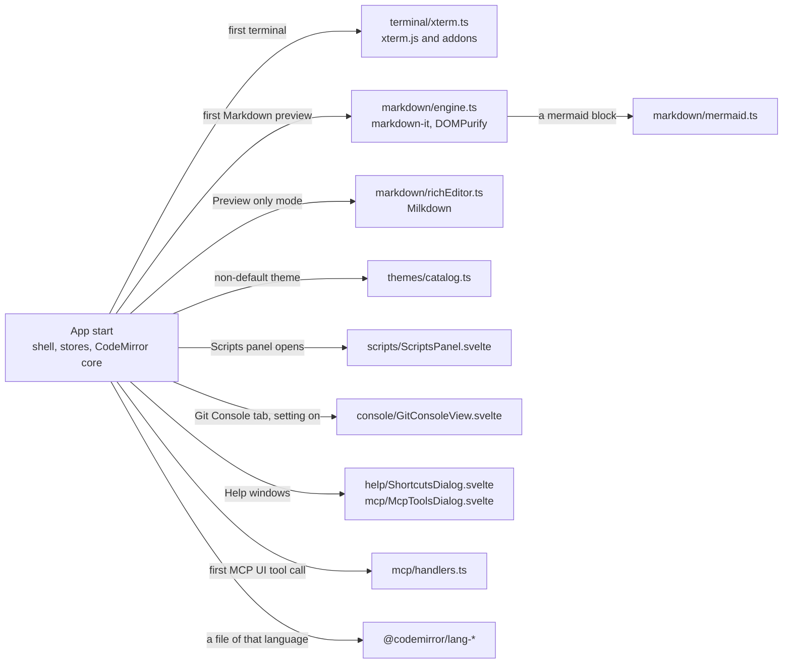

# Frontend Modules

[Frontend](Frontend.md) explains the shell, the stores and the rules every component follows. This page is the map of the feature folders in `src/lib/`: what each one holds, which store owns its state, and what loads only on first use. Each feature has a developer chapter with the details.

## The pattern in every folder

Most folders look the same:

- a **store** in a `*.svelte.ts` file with rune fields, exported as a singleton (for example `terminalStore`);
- **pure logic** in plain `.ts` files with a `*.test.ts` beside them (for example `terminals.ts`, `runs.ts`);
- **components** in `.svelte` files that read the store and call `api.ts`;
- **heavy parts imported lazily** with `import()`, so the app pays for them only when the feature is used.

## What loads on first use

`vite.config.js` lists xterm, the Markdown libraries and the Milkdown entry points in `optimizeDeps.include`. Without that, Vite in dev found them only when first imported, bundled them and reloaded the window.

## Feature folders

| Folder | What it holds | Chapter |
| --- | --- | --- |
| `menu/` | the native menu bar: `menuSpec.ts` (pure data), `menuState.ts` (enabled and checked), `appMenu.svelte.ts` (Tauri menus), `menuActions.ts`, `editorFocus.svelte.ts` | [How the Menus Work](How-the-Menus-Work.md) |
| `help/` | Help > Keyboard Shortcuts, built from `menuSpec` plus a hand-written list of the keys no menu shows (`shortcuts.ts`) | [How the Menus Work](How-the-Menus-Work.md) |
| `terminal/` | `terminalStore` (terminals, the bottom panel, the Run tab), xterm glue, fonts, keys, themes, terminals in editor tabs (`terminalTabs.ts`) and script runs (`runs.ts`) | [How the Terminal Works](How-the-Terminal-Works.md) |
| `scripts/` | the Scripts tool window, its model, Node version matching (`nodeVersion.ts`) and session-only Run With choices | [How Scripts Work](How-Scripts-Work.md) |
| `search/` | the Search Everywhere popup with its tabs, double Shift detection, file, symbol and text result models, and Replace in Files (`replaceModel.ts`) | [How Search Everywhere Works](How-Search-Everywhere-Works.md), [How Find and Replace Works](How-Find-and-Replace-Works.md) |
| `editor/` | CodeMirror setup plus the find bar, Edit and Code menu commands, Render whitespace, the current-line highlight and selection info | [How the Editor Works](How-the-Editor-Works.md) |
| `markdown/` | rendering, sanitizing, scroll sync, mermaid, the rich editor (Milkdown) and its block-by-block write back (`richSync.ts`), drawing only near the screen (`nearScreen.ts`) | [How the Markdown Editor Works](How-the-Markdown-Editor-Works.md) |
| `themes/` | the theme list (`themeIndex.ts`), lazy palettes (`catalog.ts`), color math with contrast checks, applying and watching themes | [How Color Themes Work](How-Color-Themes-Work.md) |
| `console/` | the Git Console list model and its virtualized view | [How the Git Console Works](How-the-Git-Console-Works.md) |
| `shelf/` | the Shelf panel, Shelve dialog, shelved diff tab and actions | [How the Shelf Works](How-the-Shelf-Works.md) |
| `ignore/` | Add to .gitignore: escaped patterns for a file or folder and the submenu | [How Changes and Commits Work](How-Changes-and-Commits-Work.md) |
| `mcp/` | the UI side of the MCP server: tool definitions, the request bridge and handlers, tool switches, performance sampling, `mcpStore` | [How MCP and CLI Work](How-MCP-and-CLI-Work.md) |
| `debug/` | the memory log's UI events (view changes, scroll start and stop) and its Settings state | [Debugging](Debugging.md) |
| `views/git/` | the Git menu's actions and dialogs (Push, Pull, Merge, Rebase, Reset HEAD, Clone, Manage Remotes, Interactive Rebase), the Branches popup, history and compare tabs, and the `worktrees/`, `submodules/` and `lfs/` subfolders | [How the Git Menu Works](How-the-Git-Menu-Works.md) |
| `views/github/` | GitHub sign in, Share Project, Create Gist and their results | [How GitHub Works](How-GitHub-Works.md) |
| `views/changes/` | the Changes sidebar with the per-repository actions row (`RepoActions.svelte`, `repoMenu.ts`), Sync Changes (`sync.ts`) and commit options | [How Changes and Commits Work](How-Changes-and-Commits-Work.md) |
| `views/settings/` | the color theme picker | [How Settings Work](How-Settings-Work.md) |

## Shared helpers worth knowing

- `views/gitActions.ts`: Fetch, Pull, Push, Stash, Sync, Tags and Show Log for a repository root, shared by the Git menu and the Changes view.
- `views/workspaceActions.ts`: what each window shortcut does, shared by the key handler and the View and Edit menus.
- `stores/pseudoTabs.ts`: the one check for tab paths that are not files (commit, Git, branch and terminal tabs), used by folder lookups, the Files panel and Back and Forward.
- `ui/pickList.ts` and `ui/menuNav.ts`: the filterable pick dialog and keyboard navigation for context menus and submenus.
- `diff/split.ts`: the resizable split of side-by-side diffs.

## Adding a feature folder

Give it a store only if several components share state, keep the logic that decides things in pure `.ts` files with tests, import anything big lazily, and destroy what the feature creates (views, timers, listeners) when it unmounts. Then add a row here and its tests to [Test Suites](Test-Suites.md).
