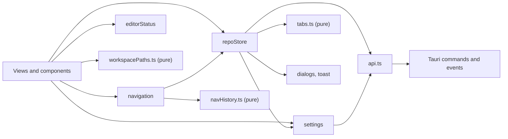

# Frontend

The UI is a Svelte 5 app written in TypeScript, in `src/`. It runs inside the macOS web view and talks to Rust only through `src/lib/api.ts`. This page covers the shell, the stores, the rules for runes, and the CodeMirror patterns used everywhere.

## A static single page app

SvelteKit builds the UI with `@sveltejs/adapter-static` and an `index.html` fallback, and `src/routes/+layout.ts` sets `ssr = false`. There is no server: Tauri loads the built files from `build/`, or from Vite on port 1420 during `bun tauri dev`. The only route, `+page.svelte`, renders `src/lib/App.svelte`. `src/hooks.client.ts` starts the dev-only IPC bridge in dev builds, and nothing in a release build (see [Architecture](Architecture.md)).

## The shell: `App.svelte`

On start, `App.svelte`:

1. loads settings from `~/.gitmanager` (`settings.init()`) and starts the update check;
2. asks Rust for the launch mode (`api.getLaunchMode()`);
3. in mergetool mode shows `MergeToolApp`; otherwise opens the folder or workspace file passed on the command line, or restores the last session (`sessionSteps`).

Then it shows `Workspace` when a workspace is open, or `Welcome`. The hosts for toasts, dialogs and the context menu are mounted once here, as are the Settings, Update and What's New dialogs.

## Stores

State lives in small classes with rune fields, exported as singletons. Pure logic sits in plain `.ts` files that the stores call, so it can be tested without Svelte.

| Store | File | Owns |
| --- | --- | --- |
| `repoStore` | `stores/repo.svelte.ts` | the workspace and its folders, repositories, per-repository statuses, the active repository, refs, stashes, tabs, the main view, busy state |
| `settings` | `stores/settings.svelte.ts` | preferences (`settings.json`) and UI state (`state.json`), saved 200 ms after the last change; a file that failed to parse is never overwritten |
| settings data | `stores/settingsData.ts` | pure validation (`parsePreferences`, `parseState`), `writableConfigs`, `sessionSteps` |
| tabs | `stores/tabs.ts` | pure functions for tabs and the preview tab: `openTab`, `pinTab`, `closeTabs` |
| `navigation` | `stores/navigation.svelte.ts` | Back and Forward, wrapping the pure `NavigationHistory` in `stores/navHistory.ts` |
| paths | `stores/workspacePaths.ts` | pure path helpers: `folderFor`, `locateAbsolute`, `relativeTo`, `joinPath` |
| `editorStatus` | `stores/editorStatus.svelte.ts` | the cursor line, column, selection and language for the status bar |



### `run` and `runOp`

Every mutation goes through `repoStore.run(label, work, { success, repoPath })`. It sets `busy` to the label, runs `work(repoPath)`, shows a success toast or an error toast (`"<label> failed"`), and then refreshes that repository. Views never handle these steps themselves, so they cannot forget one.

`runOp(label, work, successMessage, repoPath)` is the same for operations that can stop on conflicts (merge, rebase, pull, cherry-pick, revert, stash apply and pop). When the result says `conflicts`, it switches to that repository and opens the conflicts dialog.

```ts
await repoStore.run("Stage", (repoPath) => api.stageFiles(repoPath, filePaths), { repoPath: repoRoot });
```

Refreshes are coalesced by key. `refreshRepo` rereads status, and for the active repository also refs and stashes and bumps `historyVersion`, which tells the Log to reload.

## Svelte 5 conventions

- **Runes only:** `$state`, `$derived`, `$effect`, `$props`. No `export let`, no stores from `svelte/store`.
- **Event attributes** are `onclick={...}` style, not `on:click`.
- **`$state.raw` for big data that is replaced, not mutated:** `repos`, `statuses`, `tabs`, `editorStatus.info`. A plain `$state` would wrap every item in a deep proxy, which costs memory and time for arrays that are thrown away on the next refresh. Replace them with a new value (`this.statuses = { ...this.statuses, [repoRoot]: status }`).
- **`$effect` cleanup destroys what it creates**, such as CodeMirror views, timers and listeners.

## The bridge: `api.ts` and `types.ts`

`api.ts` has one typed wrapper per Tauri command and the event listeners `onRepoChanged`, `onWorkspaceChanged` and `onGitProgress`. `types.ts` mirrors every Rust DTO in camelCase. Keep both in step with Rust in the same change: a renamed field that only one side knows about fails silently at run time, because the value just arrives as `undefined`. Views never call `invoke` directly.

## CodeMirror patterns

Every text pane is a CodeMirror 6 view. Shared setup is in `src/lib/editor/setup.ts`; `languageFor(path)` loads a grammar with a dynamic `import()` only when a file needs it.

**State lives in a `StateField`, changed by effects.** The merge tool keeps its chunk list in `chunkField` (`merge/extensions.ts`), set with the `setChunks` effect and mapped through edits. Blame (`blameField`), change markers (`changeMarkField`) and conflict regions (`conflictField`) follow the same pattern. The state then travels with the document, not beside it.

**Undo restores that state too.** `invertedEffects` records the previous chunk list for each transaction, so Cmd+Z brings back both the text and which changes were applied.

**Compartments switch features without rebuilding.** Inline blame and the blame gutter each sit in a `Compartment`; `setBlameDisplay` reconfigures them when a setting changes, keeping the cursor, scroll and undo history.

**Block widgets come from state, not from a `ViewPlugin`.** Widgets that change line heights, like the "Accept Current | Accept Incoming" row above a conflict, come from `EditorView.decorations.compute([conflictField], ...)`, because CodeMirror needs block decorations before layout. `ViewPlugin`s are fine for things that do not move lines: the inline blame note, the scrollbar markers, diff chunk classes, measuring the conflict row width (`barWidth`).

**A key the editor needs must win inside CodeMirror.** The merge tool's Cmd+Enter is a `Prec.highest` keymap (`applyKeymap`), so it beats the default insert-blank-line.

**Never dispatch to a view from its own update listener.** It throws, because the view is still in the middle of an update. The merge editor's listener only reads state and updates the other two panes, and anything that must touch the same view is scheduled with `requestAnimationFrame`.

## Dialogs, toasts and menus

- `dialogs.confirm`, `dialogs.prompt` and `dialogs.choose` (`ui/dialog.svelte.ts`) return promises. Destructive actions always ask first with `danger: true`.
- `toast.info`, `toast.success` and `toast.error` (`ui/toast.svelte.ts`) show short notes; errors stay longer.
- `contextMenu.open(event, items)` (`ui/menu.svelte.ts`) shows the custom right-click menu.

Window-level key handlers must skip when `dialogs.active` is set or `event.defaultPrevented` is true, or a key would be handled twice; the main window's shortcuts are decided by the pure `workspaceShortcut` in `views/workspaceShortcuts.ts`. Shortcuts with Option must match `event.code`, because on macOS Option changes the typed character in `event.key`.

## Colors and themes

All colors are CSS tokens in `src/app.css`: `--bg`, `--panel`, `--text`, `--accent`, `--danger`, the `--diff-*` and `--tok-*` families, and more. Dark values apply with `prefers-color-scheme` unless the user picked a theme, which sets `data-theme` on `<html>`. Components never hard-code a color, so both themes always work. Add a new token for both themes when you need one.

## Lessons learned

**Svelte a11y warnings.** `bun run check` must end with 0 warnings, and svelte-check flagged a few elements that are correct on purpose: the resize handle (a focusable `role="separator"`, which is the ARIA pattern for a window splitter), interactive rows and drag handles, and the release notes box that catches clicks on the links inside it. Turning them into buttons would have broken their layout and focus behavior. So each got a targeted `<!-- svelte-ignore ... -->` comment naming the exact warning, directly above that element. Never ignore a warning for a whole file.
