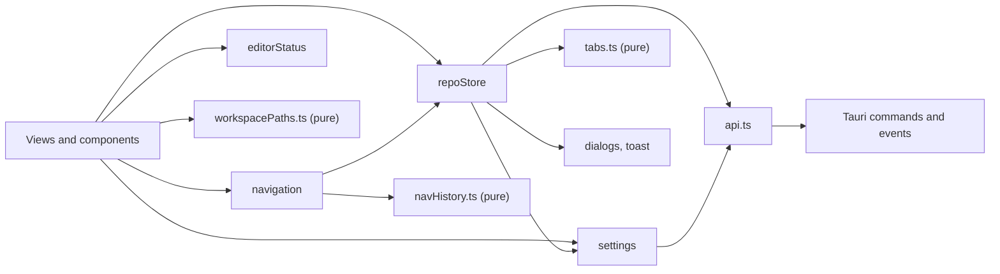

# Frontend

The UI is a Svelte 5 app written in TypeScript, in `src/`. It runs inside the macOS web view and talks to Rust only through `src/lib/api.ts`. This page covers the shell, the stores, the rules for runes, keys and menus, and the CodeMirror patterns used everywhere. The feature folders (terminal, search, Markdown, themes, MCP and more) are mapped on [Frontend Modules](Frontend-Modules.md).

## A static single page app

SvelteKit builds the UI with `@sveltejs/adapter-static` and an `index.html` fallback, and `src/routes/+layout.ts` sets `ssr = false`. There is no server: Tauri loads the built files from `build/`, or from Vite on port 1420 during `bun tauri dev`. The only route, `+page.svelte`, renders `src/lib/App.svelte`. `src/hooks.client.ts` starts the dev-only IPC bridge in dev builds, and nothing in a release build (see [Architecture](Architecture.md)).

## The shell: `App.svelte`

On start, `App.svelte`:

1. loads settings from `~/.gitmanager` (`settings.init()`) and starts the update check;
2. asks Rust for the launch mode (`api.getLaunchMode()`) and builds the native menu bar (`appMenu`);
3. in mergetool mode shows `MergeToolApp`; otherwise opens the folder or workspace file passed on the command line, or restores the last session (`sessionSteps`).

Then it shows `Workspace` or `Welcome`. The hosts for toasts, dialogs, Git dialogs and the context menu are mounted once here, with the Settings, Update, What's New and opening progress views. Small effects keep the backend in step with settings: the Git Console, the MCP server and the memory log.

## Stores

State lives in small classes with rune fields, exported as singletons. Pure logic sits in plain `.ts` files that the stores call, so it can be tested without Svelte.

| Store | File | Owns |
| --- | --- | --- |
| `repoStore` | `stores/repo.svelte.ts` | the workspace and its folders, repositories, per-repository statuses, the active repository, refs, stashes, tabs, the main view, busy state |
| `settings` | `stores/settings.svelte.ts` | preferences (`settings.json`) and UI state (`state.json`), saved 200 ms after the last change; a file that failed to parse is never overwritten |
| settings data | `stores/settingsData.ts` | pure validation (`parsePreferences`, `parseState`), `writableConfigs`, `sessionSteps` |
| tabs | `stores/tabs.ts` | pure functions for tabs and the preview tab: `openTab`, `pinTab`, `closeTabs` |
| `navigation` | `stores/navigation.svelte.ts` | Back and Forward, wrapping the pure `NavigationHistory` in `stores/navHistory.ts` |
| paths | `stores/workspacePaths.ts` | pure path helpers: `folderFor`, `locateAbsolute`, `relativeTo`, `joinPath` |
| `editorStatus` | `stores/editorStatus.svelte.ts` | the cursor line, column, selection and language for the status bar |
| `fileCommands` | `stores/fileCommands.svelte.ts` | Save, Revert and the Markdown view mode of each open file editor, for the File and View menus |
| pseudo tabs | `stores/pseudoTabs.ts` | tabs that are not files: commits (`commitTabs.ts`), Git history and compare (`gitTabs.ts`, `branchTabs.ts`) and terminals in the editor area |
| opening progress | `stores/openingProgress.ts` | the "Opening acme" card and the "Reading changes 2 of 5" counter |



### `run` and `runOp`

Every mutation goes through `repoStore.run(label, work, { success, repoPath })`. It sets `busy` to the label, runs `work(repoPath)`, shows a success toast or an error toast (`"<label> failed"`), and then refreshes that repository. Views never handle these steps themselves, so they cannot forget one.

`runOp(label, work, successMessage, repoPath)` is the same for operations that can stop on conflicts (merge, rebase, pull, cherry-pick, revert, stash apply and pop). When the result says `conflicts`, it switches to that repository and opens the conflicts dialog.

```ts
await repoStore.run("Stage", (repoPath) => api.stageFiles(repoPath, filePaths), { repoPath: repoRoot });
```

Refreshes are coalesced by key. `refreshRepo` rereads status, and for the active repository also refs and stashes, and bumps `historyVersion` so the Log reloads.

## Svelte 5 conventions

- **Runes only:** `$state`, `$derived`, `$effect`, `$props`. No `export let`, no stores from `svelte/store`.
- **Event attributes** are `onclick={...}` style, not `on:click`.
- **`$state.raw` for big data that is replaced, not mutated:** `repos`, `statuses`, `tabs`, `editorStatus.info`. A plain `$state` would wrap every item in a deep proxy, which costs memory and time for arrays that are thrown away on the next refresh. Replace them with a new value (`this.statuses = { ...this.statuses, [repoRoot]: status }`).
- **`$effect` cleanup destroys what it creates**, such as CodeMirror views, timers and listeners.

## The bridge: `api.ts` and `types.ts`

`api.ts` has one typed wrapper per Tauri command and a listener per event (`onRepoChanged`, `onWorkspaceChanged`, `onGitProgress`, `onTerminalExited`, `onGitCommand`, `onMcpUiRequest`, `onMcpActivity`). Streaming commands take a `Channel` from `@tauri-apps/api/core`. `types.ts` mirrors every Rust DTO in camelCase. Keep both in step with Rust in the same change: a renamed field that only one side knows about arrives as `undefined` and fails silently. Views never call `invoke` directly.

## CodeMirror

Every text pane is a CodeMirror 6 view, set up in `src/lib/editor/setup.ts`; `languageFor(path)` loads a grammar only when a file needs it. The rules for state fields, compartments, widgets, keymaps and update listeners are on [CodeMirror Patterns](CodeMirror-Patterns.md).

## Dialogs, toasts and menus

- `dialogs.confirm`, `dialogs.prompt`, `dialogs.choose` and `dialogs.pick` (a filterable list, `ui/pickList.ts`) in `ui/dialog.svelte.ts` return promises. Destructive actions always ask first with `danger: true`. The Git menu's bigger dialogs (Push, Pull, Reset HEAD, Clone...) go through `views/git/gitDialogs.svelte.ts`, one at a time.
- `toast.info`, `toast.success` and `toast.error` (`ui/toast.svelte.ts`) show short notes; errors stay longer.
- `contextMenu.open(event, items)` (`ui/menu.svelte.ts`) shows the custom right-click menu.

## Keys and the native menu

The menu bar is plain data in `menu/menuSpec.ts`, turned into Tauri menus by `menu/appMenu.svelte.ts` and run by `menu/menuActions.ts`. macOS gives a key to the web view first and passes it to the menu only when the page leaves it unhandled. So a key the page handles (the editor keymaps in `editor/editorShortcuts.ts`, the window shortcuts in `views/workspaceShortcuts.ts`) never also runs its menu item, and a key only the menu knows still reaches it. Both routes call the same functions (`views/workspaceActions.ts`, `views/gitActions.ts`). Help > Keyboard Shortcuts reads its menu rows from the same `menuSpec` (`help/shortcuts.ts`), so those cannot drift; the other rows are written by hand. See [How the Menus Work](How-the-Menus-Work.md) and [Menu Keys and Routing](Menu-Keys-and-Routing.md).

Window-level key handlers must skip when `dialogs.active` is set or `event.defaultPrevented` is true, or a key would be handled twice. Shortcuts with Option must match `event.code`, because on macOS Option changes the typed character in `event.key`.

## Colors and themes

All colors are CSS tokens in `src/app.css`: `--bg`, `--panel`, `--text`, `--accent`, `--danger`, the `--diff-*`, `--tok-*` and terminal families, and more. The Git Manager Light and Dark themes are the sets in `app.css`; any other color theme is one generated `<style>` element (`themes/apply.ts`) with values from the lazy catalog. `settings.svelte.ts` sets `data-theme` and `data-color-theme` on `<html>`, and code that copies colors out of CSS (xterm, mermaid) rereads them through `themes/watch.ts`. Components never hard-code a color. A new token goes in `app.css`, `themes/tokens.ts` and the catalog's derived colors. See [How Color Themes Work](How-Color-Themes-Work.md).

## Lessons learned

**Svelte a11y warnings.** `bun run check` must end with 0 warnings, and svelte-check flagged a few elements that are correct on purpose: the resize handle (a focusable `role="separator"`, the ARIA pattern for a splitter), interactive rows and drag handles, and the release notes box that catches clicks on its links. Buttons would have broken their layout and focus. So each got a `<!-- svelte-ignore ... -->` comment naming the exact warning, directly above that element. Never ignore a warning for a whole file.
