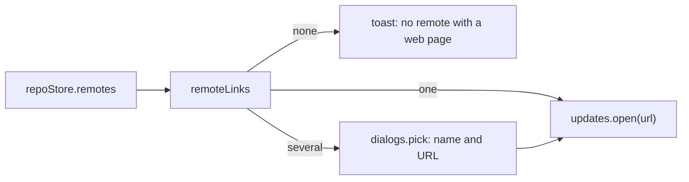

# Git Menu Links

Some Git menu items only open a web page: **Open Repository in Browser** for any host, and the GitHub submenu's **Open on GitHub**, **Create Pull Request**, **View Pull Requests** and **Copy GitHub Link**. None of them calls an API or needs a sign-in. They read the remote URLs that `repoStore.remotes` already holds and build the address. The menu itself is in [How the Git Menu Works](How-the-Git-Menu-Works.md); the user side is in [Git Menu](../usage/Git-Menu.md).

## Why we need it

People often want to jump from the code to the project's page: to read issues, open a pull request or share a link. Remote URLs are often SSH addresses such as `git@gitlab.com:team/app.git`, which a browser cannot open, so the app turns them into web addresses. Not every project lives on GitHub, so the plain "open the repository" item works for any host.

## How it works

### Open Repository in Browser

**Open Repository in Browser** works for every host. `views/git/remoteLinks.ts` is pure: `remoteWebUrl` turns a remote URL into its web page (https stays, credentials and `.git` go; ssh, `git://` and scp-like addresses become https without their port; Azure DevOps `v3/ORG/PROJECT/REPO` becomes `dev.azure.com/ORG/PROJECT/_git/REPO`; local paths and `file://` give null). `remoteLinks` keeps one link per distinct page, from each remote's fetch and push URL, ordered upstream remote, then `origin`, then the rest.

`gitMenuInputs` counts the links (`remoteLinks`), and the item is enabled when there is at least one. It is not blocked while git is busy, since it only opens a page.

### GitHub links

`views/git/github.ts` is pure: it reads https, ssh, `git://` and scp-like remote URLs, picks the upstream's remote, then `origin`, and builds file, compare and pull request URLs. No API and no sign-in are used. `linkRevision` uses the branch name only when the branch is pushed as it is, else the commit.

## Where the code lives

| File | What it does |
| --- | --- |
| `src/lib/views/git/remoteLinks.ts` | `remoteWebUrl`, `remoteLinks`, `remoteLinkPickItems` |
| `src/lib/views/git/github.ts` | GitHub remotes, file, compare and pull request URLs, `linkRevision` |
| `src/lib/views/git/gitMenuActions.ts` | `openRemoteInBrowser`, `openOnGitHub`, `copyGitHubLink`, `createPullRequest` |
| `src/lib/views/git/gitMenuInputs.ts` | Counts the links and spots a github.com remote for the menu state |
| `src/lib/menu/menuState.ts` | Enables the items |

## Design decisions

**Any host, by convention.** Open Repository in Browser guesses the page from the URL instead of asking each host's API. GitHub, GitLab, Bitbucket, Gitea and most servers serve the repository at the same path as the clone URL, so one rule covers them, with Azure DevOps SSH as the one special case.

**Drop credentials and SSH ports.** A token in an https remote must never reach the browser's history, and an SSH port (such as 2222) is not where the web server listens. An https port is kept, since a self-hosted server may serve both on it.

**One link per page.** A remote whose fetch and push URLs point at the same page appears once, and two remotes for the same page are not listed twice, so the list only asks when there is a real choice.

**Ask only when needed.** With one link the page opens at once; with several, the quick pick lists the remote your branch tracks first, so Enter opens the likely one.

## Tests

- `src/lib/views/git/remoteLinks.test.ts`: https, ssh, `git://` and scp-like URLs, credentials and ports, Azure DevOps, local paths and Windows drives, the remote order and duplicate pages.
- `src/lib/views/git/github.test.ts`: GitHub URL parsing, the remote choice and every link.
- `src/lib/menu/menuState.test.ts`, "Git menu": the items are enabled only with a link.

## Keeping this page in sync

- Update this page when `remoteLinks.ts`, `github.ts` or their menu items change, and [Git Menu](../usage/Git-Menu.md) for visible changes.
- Related: [How the Git Menu Works](How-the-Git-Menu-Works.md), [How GitHub Works](How-GitHub-Works.md), [How Remotes Work](How-Remotes-Work.md).
