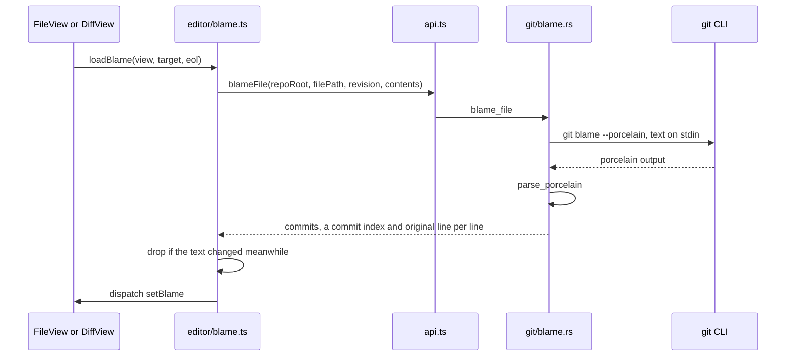
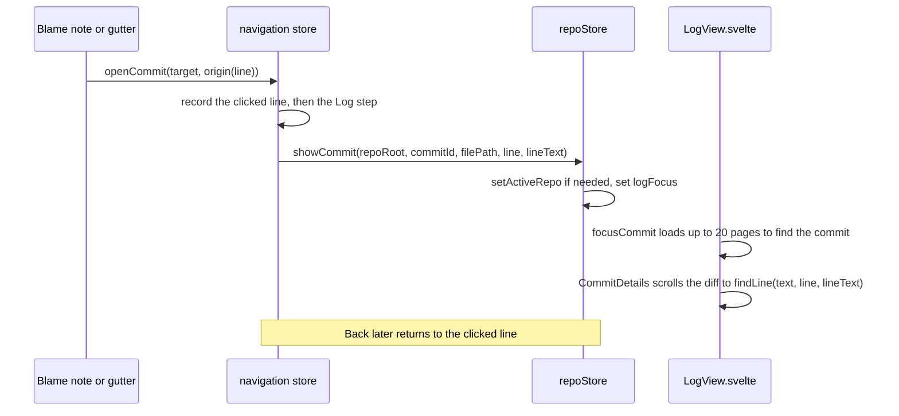

# How blame works

Blame shows who last changed each line, when and in which commit, like GitLens in VS Code: a faint note at the end of the cursor line and an optional gutter, and a click on either opens that commit in the Log. The user side is in [Blame](../usage/Blame.md).

## Why we need it

When a line looks wrong, the first question is "who changed this and why?". The user asked for GitLens: the answer next to the code, and one click to the commit that explains it.

We run the git CLI (`git blame --porcelain`) instead of libgit2's blame, for three reasons:

- It is much faster on long histories.
- It honours `blame.ignoreRevsFile`, so formatting commits can be skipped as in the terminal.
- `--contents -` blames the exact text on screen, **unsaved edits included**, so the notes stay correct while you type.

## How it works

### Loading blame

`blame::blame` adds `--contents -` for text and the revision if any. `parse_porcelain` reads git's porcelain format, where commit details appear only the first time a commit is seen. It returns a `BlameInfo` with the `commits` and, for every line, an index into them, plus `originalLines`, its 0-based line in the commit that last changed it. The all-zero commit id marks lines that are not committed.

`loadBlame` sends the editor text (with CRLF restored if the file uses it) when the target has no revision. If git fails, typically for an untracked file, every line becomes uncommitted (`allUncommitted`). A result for text that changed meanwhile is dropped, and the caller asks again later.

The result lives in `blameField`, a StateField. `fromInfo` in `blameModel.ts` keeps `originalLines` as `origins`. On every edit, `mapBlame` moves line owners and origins through the change and marks touched lines as `LOCAL_EDIT`, so new typing shows "You, Uncommitted changes" at once, without calling git.

### Where blame is used

| Place | Target |
| --- | --- |
| File editor (`FileView.svelte`) | The working text, reloaded after saves, commits and outside changes |
| Changes diff (`ChangesDiff.svelte`) | The right side: the working tree or the staged text |
| Log commit diff (`CommitDetails.svelte`) | The file at that commit (`revision` is the commit id), skipped when the new side is empty, as after a deletion |

`blameExtension` wraps the inline note and the gutter in two Compartments. `setBlameDisplay` switches them when the `currentLineBlame` (on by default) or `blameGutter` settings change, without rebuilding the editor. The gutter tints blocks by age using `ageRanks`, and uncommitted lines are marked separately.

### Clicking through to the Log

`openBlame` sends uncommitted lines to the Changes sidebar, and Option-click copies the hash. Each blame target passes an `origin` function that turns the clicked line into a Back and Forward step: a file line, a Changes diff line, or a Log commit and file. The Log selects the commit and opens the same file's diff on the clicked line: `commitLineTarget` sends the commit's own line when known, else the same line number plus its text for `findLine`. If the commit is not in the first 20 pages, a toast says so and suggests showing all branches. For the history, see [How navigation works](How-Navigation-Works.md).

## Where the code lives

| File | What it does |
| --- | --- |
| `src-tauri/src/git/blame.rs` | `blame` and `parse_porcelain` |
| `src-tauri/src/commands/history.rs` | The `blame_file` command |
| `src/lib/editor/blame.ts` | `blameField`, inline note, gutter, `loadBlame`, click handling |
| `src/lib/editor/blameModel.ts` | Pure line ownership: `fromInfo`, `mapBlame`, `ageRanks`, `commitLineTarget` |
| `src/lib/log/lineMatch.ts` | `findLine`: the nearest line with the same text in the commit's file |
| `src/lib/stores/navigation.svelte.ts` | `openCommit`, which records the jump |
| `src/lib/stores/navHistory.ts` | File, diff and Log history steps |
| `src/lib/views/LogView.svelte` | `focusCommit`, which finds the commit |

## Design decisions

**Blame the text, not the file.** Sending the buffer with `--contents -` keeps blame right for unsaved edits; blaming the file on disk would make the notes wrong after every edit.

**Map edits locally.** `mapBlame` updates owners on every keystroke; calling git each time would be slow, and a refresh after saving corrects any drift.

**Compartments for the switches.** Turning the note or gutter on or off reconfigures the open editor. Rebuilding it would lose the cursor and undo history.

**Click opens the Log, Option-click copies.** The first version copied the hash on click; the user asked for the GitLens behavior.

## Bugs we fixed

**Blame never appeared on first open.**
- **The issue:** on first open, a file could show no blame at all.
- **Why it happened:** the only blame call was in `loadHead`, which starts before `createEditor`. With no editor yet, `refreshBlame` did nothing.
- **The fix and why we chose it:** `createEditor` in `FileView.svelte` also calls `refreshBlame`, so blame loads as soon as the editor exists, whatever order the two steps finish in.

**Back did not return to where you clicked blame.**
- **The issue:** after clicking a blame note and landing in the Log, Back skipped your spot and went to an older one.
- **Why it happened:** the history only recorded file locations, so the jump to the Log was never a step.
- **The fix and why we chose it:** history steps can now be Log commits, and `openCommit` records the exact clicked line first. That matters for gutter clicks, which may not be on the cursor line. Diffs became steps too, so Back works from blame in any view.

**The Log did not open on the line you clicked.**
- **The issue:** clicking a blame note opened the right commit and file in the Log, but the diff stayed at the top or the first change, not at your line.
- **Why it happened:** `openBlame` never passed a line to `openCommit`, so the commit diff had nothing to scroll to. The backend also dropped the original line number that `git blame --porcelain` reports, so blame knew no lines of the commit's version.
- **The fix and why we chose it:** the backend now keeps git's original line numbers (`originalLines` in `BlameInfo`), and a blame click sends the line as it is in that commit. When that is unknown (for example a line typed since), it sends the same line number plus the line's text, and `findLine` in `log/lineMatch.ts` picks the nearest line with that exact text in the commit's file. Using git's own number is exact; the text search keeps it working when lines have moved.

## Tests

- `src-tauri/src/git/blame.rs`: `parses_porcelain_with_repeated_commits` (also checks `original_lines`), `blames_committed_lines_and_unsaved_edits`, `blames_a_file_at_an_older_revision` and `untracked_files_are_an_error`.
- `src/lib/editor/blameModel.test.ts`: padding and trimming lines, `mapBlame` for edits, inserts and deletes, age ranks, and commit-side lines (`commitLineAt`, `commitLineTarget`).
- `src/lib/log/lineMatch.test.ts`: `findLine` with moved lines, ties, no match and CRLF.
- `src/lib/stores/navHistory.test.ts`: Log and diff steps after a blame jump.

Keep line ownership rules in `blameModel.ts` with a test. Clicking through to the Log and landing on the line need a manual check. See [Testing](Testing.md).

## Keeping this page in sync

- Update this page when the blame command, the targets, the display settings or the click behavior change.
- Update [Blame](../usage/Blame.md) for visible changes.
- Retake `blame-inline.png` and `blame-gutter.png`. See [Docs and Screenshots](Docs-and-Screenshots.md).
