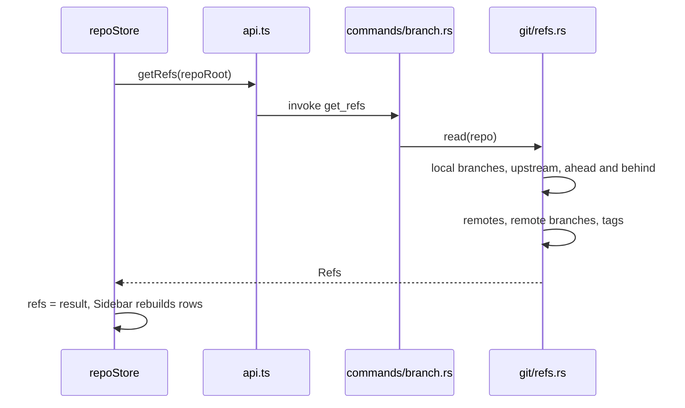
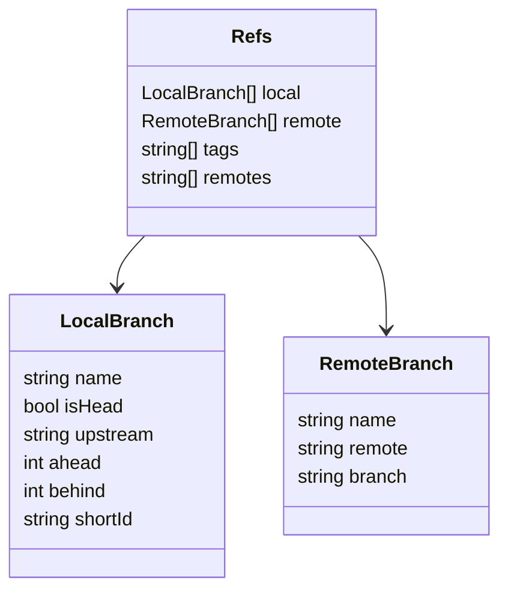
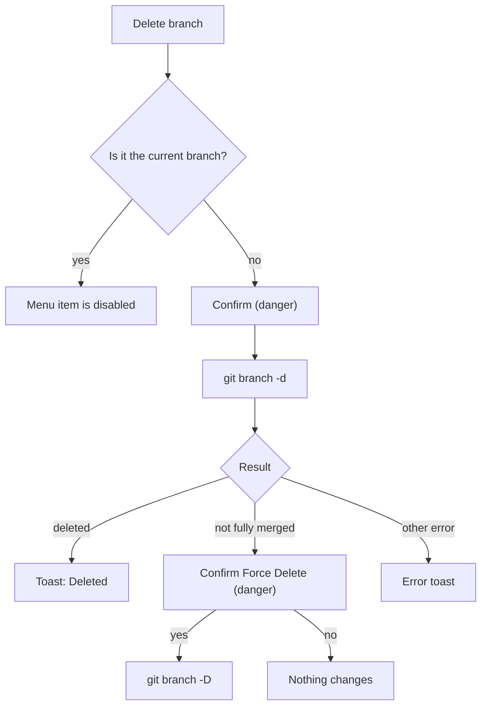

# How branches and tags work

The Branches panel lists local branches, remote branches, tags and stashes of the active repository, and every branch action starts from its context menus. For the user side, see [Branches and Tags](../usage/Branches-and-Tags.md).

## Why we need it

Switching, creating and merging branches is the daily bread of Git. People also want to see what exists on the remote and jump to a tag. The panel must stay fast with hundreds of branches, group `feature/...` style names into folders, and never let a click destroy work by surprise.

## How it works

The panel is `Sidebar.svelte`, opened from the activity bar or Shift+Cmd+E. It shows data that `repoStore` keeps for the **active** repository only: `repoStore.refs` and `repoStore.stashes`. `refreshActive()` reloads both whenever the active repository changes, after every mutation, and when the watcher reports a change inside `.git`.

`refs::read` uses git2, as all reads do. For each local branch it finds the upstream and counts ahead and behind with `graph_ahead_behind`. Remote branch names are split into remote and branch by matching the longest configured remote name, because a remote can itself contain a slash. The symbolic `origin/HEAD` is skipped.

### From refs to rows

`buildRows` in `src/lib/views/sidebar/tree.ts` turns `Refs` and stashes into a flat list of `SidebarRow`s: sections, folder groups, branches, tags and stashes. Names are split on `/` into folders. Remote branches are grouped per remote. Only rows inside expanded sections and folders are produced, so collapsed content never reaches the DOM.

`collapse.svelte.ts` remembers which sections and folders are collapsed (in local storage; Tags start collapsed). While you type in the filter, everything starts expanded and toggles go to a temporary set, so filtering never scrambles your saved layout.

### Actions

The menus come from `src/lib/views/sidebar/actions.ts`: `localBranchMenu`, `remoteBranchMenu`, `tagMenu` and `stashMenu`. Each item calls `repoStore.run` or `repoStore.runOp`, and each Rust command runs the git CLI:

| Action | Command | git |
| --- | --- | --- |
| Checkout | `checkout_branch` | `switch <name>` |
| Checkout remote | `checkout_remote_branch` | `switch <name>` if it exists, else `switch -c <name> --track <remote>` |
| New branch | `create_branch` | `switch -c`, or `branch` when Checkout branch is unticked, with an optional start point |
| Rename | `rename_branch` | `branch -m` |
| Delete | `delete_branch` | `branch -d`, or `-D` when forced |
| Merge into current | `merge_branch` | `merge --no-edit` |
| Rebase current onto | `rebase_onto` | `rebase` |
| Checkout tag | `checkout_commit` | `switch --detach refs/tags/<tag>`, after a confirm that HEAD will be detached |

Merge and rebase use `run_op`, which returns an `OpOutcome`. When git stops on conflicts, that is a normal outcome: `runOp` shows a toast, makes that repository active and opens the Conflicts dialog. Both are disabled while any operation (merge, rebase, cherry-pick, revert) is in progress, and on the current branch itself.

Deleting asks first. If git refuses because the branch is not fully merged, a second, clearly worded dialog offers a force delete:

New and renamed branch names are checked by `validateBranchName` before git ever sees them: no spaces, `..`, `~^:?*[\`, `@{`, `//`, and no leading `-` or `/`, or trailing `/`, `.` or `.lock`. Names that already exist are refused too.

## Where the code lives

| File | What it does |
| --- | --- |
| `src/lib/views/Sidebar.svelte` | The Branches panel: filter, rows, keyboard, menus |
| `src/lib/views/sidebar/tree.ts` | `buildRows`: flat row model with folder grouping |
| `src/lib/views/sidebar/collapse.svelte.ts` | Saved and temporary collapse state |
| `src/lib/views/sidebar/RowContent.svelte` | One row: icon, label, ahead and behind |
| `src/lib/views/sidebar/actions.ts` | Menus, confirmations, `validateBranchName` |
| `src/lib/ui/menu.svelte.ts`, `src/lib/ui/ContextMenuHost.svelte` | `contextMenu.open` and the right-click menu itself |
| `src/lib/ui/dialog.svelte.ts`, `src/lib/ui/DialogHost.svelte` | `dialogs.confirm` and `dialogs.prompt`, used for every branch dialog |
| `src/lib/stores/repo.svelte.ts` | `refs`, `stashes`, `refreshActive`, `run`, `runOp` |
| `src-tauri/src/commands/branch.rs` | Branch commands |
| `src-tauri/src/git/refs.rs` | git2 reader for branches, remotes and tags |

## Design decisions

**Only the active repository's refs are loaded.** A workspace can hold dozens of repositories. Loading every branch list would cost time and memory for panels nobody looks at. The status bar and Changes view show per-repository branch names from the cheaper status call instead.

**Branch writes go through the git CLI.** Hooks such as `post-checkout`, and the user's config, then behave exactly as in the terminal. Using git2 for `switch` would skip them.

**Flat rows, built only for expanded parts.** A nested component tree is easier to write, but a flat list keeps the DOM small and makes arrow-key navigation simple.

**One branch name validator.** The header once had its own, weaker copy. It now calls `newBranchFrom(null)`, so every dialog applies the same rules.

## Bugs we fixed

**A long branch name hid the Back and Forward buttons.**
- **The issue:** a long branch name in the header overlapped the Back and Forward buttons, and hovering the cut-off name only said "Branches".
- **Why it happened:** the header's left side could not shrink, and the tooltip was a fixed word.
- **The fix and why we chose it:** names now shorten with an ellipsis and the tooltip shows the full branch name, so nothing is hidden and nothing overlaps. The buttons moved too; see [How Navigation Works](How-Navigation-Works.md).

## Tests

- `src-tauri/src/commands/tests.rs`: `branch_create_switch_rename_delete`, `checkout_remote_branch_tracks_or_switches`, `merge_branch_reports_conflicts_and_failures`, `rebase_conflict_continue_after_resolution`, `rebase_abort_restores_branch`.
- `src-tauri/src/git/tests.rs`: `refs_read_local_remote_and_tags`, `status_head_ahead_and_behind_upstream`.

There are no frontend tests for `tree.ts` or `validateBranchName` yet. Both are pure, so a `tree.test.ts` (folder grouping, filtering, collapsed sections) is the first thing to add when you change them.

## Keeping this page in sync

- Update this page when `commands/branch.rs`, `git/refs.rs`, `sidebar/tree.ts` or `sidebar/actions.ts` change.
- Update [Branches and Tags](../usage/Branches-and-Tags.md) for new menu items or dialogs.
- Retake `branches-panel.png` and `branch-context-menu.png` when the panel or its menu changes.
- Related: [How Stashes Work](How-Stashes-Work.md), [How Remotes Work](How-Remotes-Work.md), [Backend](Backend.md).
