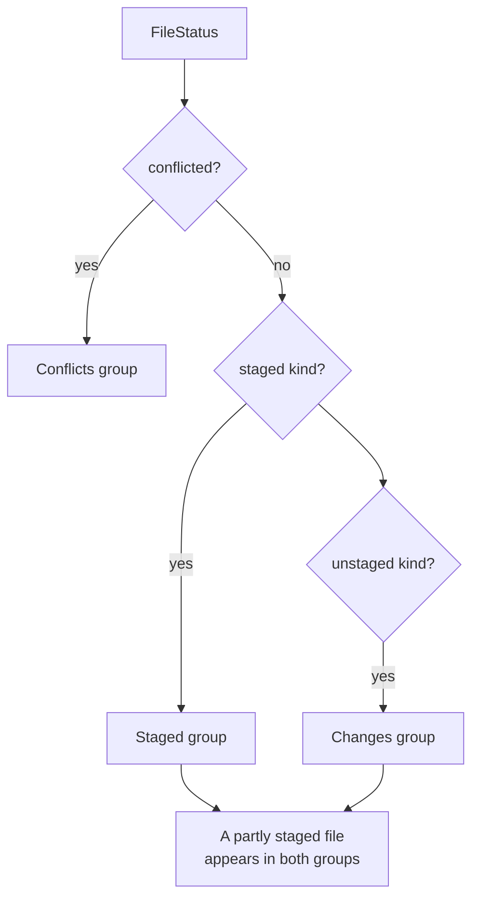

# How changes and commits work

The Changes sidebar lists what changed in every repository of the workspace (Conflicts, Staged and Changes), where you stage, unstage, discard and commit. The user side is in [Changes and Commits](../usage/Changes-and-Commits.md). Repository row buttons are in [How Repository Actions Work](How-Repository-Actions-Work.md), the Commit arrow and gear in [How Commit Options Work](How-Commit-Options-Work.md).

## Why we need it

This is the daily loop of any git client, so it must be quick and predictable. Like VS Code's Source Control, it is grouped by repository, so one window manages many projects.

Two rules shape the code:

- **Every write goes through the git CLI** (`git/cli.rs`), so hooks, signing and config behave as in the terminal. Reads use git2.
- **Every action names its repository**: every mutation takes `repoRoot` first.

## How it works

### From status to sections

`repoStore.statuses` holds one `RepoStatus` per repository, loaded by `get_status`, which calls `status::read` (git2, untracked folders recursed, renames detected between HEAD and the index). `buildSections` in `sections.ts` turns them into one section per repository:

`groupFiles` and `buildSection` cache their results in a `WeakMap` keyed by the status object; a refresh replaces only the changed repository's status, so other sections are reused. `splitSections` moves clean repositories to `CleanRepoList.svelte`.

The selected row is a `FileSelection` (`repoRoot`, `path`, `area`) in `changesSelection`; picking one opens its diff (see [How diffs work](How-Diffs-Work.md)). After every refresh, `resolveSelection` keeps it valid: the same row, else the same file in the other area, else the nearest row.

### Stage, unstage, discard, commit

Every action in `mutations.ts`, and `commitRepo` in `repoActions.ts` that the commit box calls, runs through `repoStore.run`, which sets the busy label, shows errors and refreshes that repository.

- `stage_files` runs `git add -A -- <paths>`, so deletions are staged too.
- `unstage_files` runs `git restore --staged`, or `git rm --cached -r -q` in a repository with no commits yet. `unstagePaths` adds the old path of a staged rename.
- `discard()` asks first, then `discard_files` restores tracked files (`git restore --worktree`) and deletes untracked ones through `safe_join`.
- `commit` passes the message on stdin with `git commit -F -`, so multi-line messages arrive exactly as typed; amend with an empty message uses `--no-edit`. `run_commit` adds the Commit Options arguments, and `--all` for `commit_all`. Turning on Amend fills an empty box from `get_head_message`; turning it off clears that text again if unchanged.

There is one commit box. `changesLayout.commitTargetRoot` follows the repository you last worked in (`focusRepo`), and `resolveCommitTarget` falls back to the active repository, then the first. Each repository keeps its message and Amend flag in `commitDraft.for(repoRoot)`, built on `DraftBook`.

### Rows and menus

`RepoSection.svelte` draws the repository header (name, `submodule` or `worktree` tag, change count, operation badge) with `RepoActions.svelte` on its right; with one repository, `ChangesView.svelte` shows `RepoActions` in the panel title instead. Stage All, Unstage All and Discard All live in the **...** menu. Right-clicking the header opens that menu (`repoMenuFor`) plus Resolve Conflicts, Set as Active Repository (only when it is not active) and Copy Repository Path.

File row menus add **Add to .gitignore** (`ignoreMenu`, see [How Ignoring Files Works](How-Ignoring-Files-Works.md)) and **Shelve Changes...**. `FileRow.svelte` takes an optional `badge` (`LFS`, `submodule`) and `note` (a submodule's change).

Arrow keys move across all expanded sections, Space or Enter stages or unstages the selected row, and Delete discards an unstaged row; the list keeps the focus. Cmd+Enter in the message box commits.

## Where the code lives

| File | What it does |
| --- | --- |
| `src/lib/views/ChangesView.svelte` | The sidebar panel, keyboard handling, empty states |
| `src/lib/views/changes/RepoSection.svelte` | One repository: header, badges, groups, row menus |
| `src/lib/views/changes/RepoActions.svelte` | The repository buttons, see [How Repository Actions Work](How-Repository-Actions-Work.md) |
| `src/lib/views/changes/FileRow.svelte` | One file row |
| `src/lib/views/changes/CleanRepoList.svelte` | Repositories with no changes |
| `src/lib/views/changes/CommitBox.svelte` | Message, Amend, target picker, Commit and its arrow, Sync Changes |
| `src/lib/views/changes/sections.ts` | Pure grouping, rows, selection and labels |
| `src/lib/views/changes/selection.svelte.ts`, `layout.svelte.ts` | Selected change; collapse state and commit target |
| `src/lib/views/changes/mutations.ts` | Stage, unstage, discard |
| `src/lib/views/changes/commitDraft.svelte.ts`, `drafts.ts` | Per-repository drafts |
| `src/lib/views/changes/fileStatus.ts` | Letters, `unstagePaths`, `discardPaths`, `rowElementId` |
| `src-tauri/src/commands/status.rs` | Status, stage, unstage, discard, `commit`, `commit_all` |
| `src-tauri/src/git/status.rs` | `status::read` and `head_info` |

## Design decisions

**One commit box for all repositories.** A box per section would make the layout jump on every stage, and text fields inside the list would clash with its arrow and Space keys.

**Selecting a file does not change the active repository.** Switching reloads branches and history, too heavy for every click. Set as active, opening a conflict and Resolve do switch it.

**Repository actions on the row, not on hover.** Hover-only buttons were hard to find and to reach from the keyboard. VS Code's always visible row shrinks through container queries instead.

**Commit messages go through stdin.** `-F -` keeps the text exact, with no quoting or length limits, and `GIT_EDITOR=true` in `cli.rs` means git never waits for an editor.

**Confirm every discard.** It cannot be undone, so the dialog names or counts the files, untracked ones included.

## Bugs we fixed

**Staged renames showed the old name.**
- **The issue:** after `git mv old new`, the list showed the old name and never the new one.
- **Why it happened:** git2's `StatusEntry::path` names the old side of a rename.
- **The fix and why we chose it:** for a staged rename, `status::read` takes `path` from the new side and `orig_path` from the old side of `head_to_index()`, which matches how the UI reads `path`.

**Space on a header button also staged the selected row.**
- **The issue:** pressing Space on a focused section button such as Stage All also staged or unstaged the selected file.
- **Why it happened:** the list's keyboard handler saw the same key press.
- **The fix and why we chose it:** for Space, Enter and Delete, `ChangesView.svelte` ignores keys whose target is a button, select, input or textarea, so the focused control keeps its behavior.

**Enter did not stage the selected file.**
- **The issue:** after clicking a file in the Changes list, Enter did nothing. Only Space and double-click staged or unstaged it.
- **Why it happened:** clicking focuses the list, but Enter was only handled on the row itself, which never has the focus.
- **The fix and why we chose it:** `ChangesView.svelte` handles Enter like Space, with the same rule that a focused button keeps its own behavior. Rows no longer take the focus on click, and `aria-activedescendant` points screen readers at the selected row. One keyboard owner means no key runs twice.

## Tests

- `src-tauri/src/commands/tests.rs`: `stage_files_stages_modifications_and_deletions`, `unstage_files_in_unborn_and_normal_repo`, `discard_files_restores_tracked_and_deletes_untracked`, `commit_with_multiline_message_and_amend` and `get_status_and_file_diff_commands`.
- `src-tauri/src/git/tests.rs`: `status_reports_staged_unstaged_and_untracked_changes` and the `status_head_*` tests.
- `src/lib/views/changes/sections.test.ts` (grouping, cache reuse, selection fallback, commit target), `drafts.test.ts` (`DraftBook`) and `fileStatus.test.ts` (`rowElementId`).

Add a Rust test with `TestRepo` for every new git command, and keep grouping or selection rules in `sections.ts`, tested. See [Testing](Testing.md).

## Keeping this page in sync

- Update this page when a stage, discard or commit command, grouping, selection, keys, row menus or the commit target change.
- Update [Changes and Commits](../usage/Changes-and-Commits.md) for visible changes.
- Retake `changes-sidebar.png` and `commit-box.png`. See [Docs and Screenshots](Docs-and-Screenshots.md).
