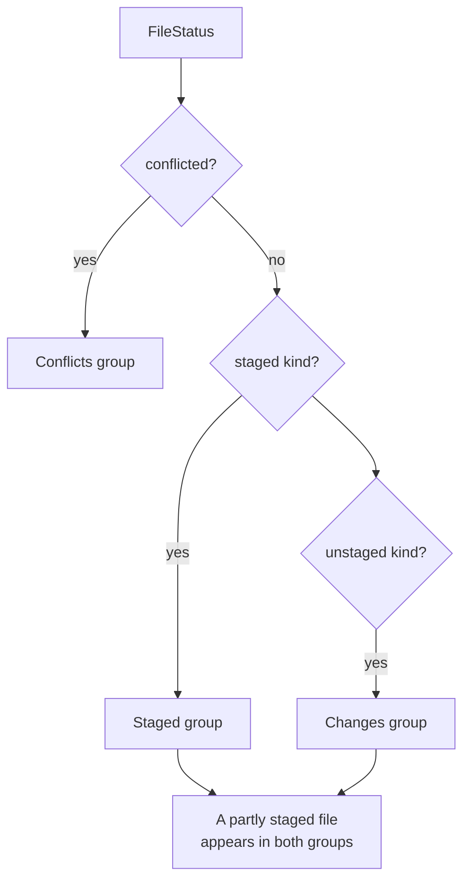
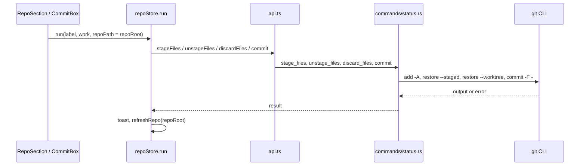

# How changes and commits work

The Changes sidebar lists what changed in every repository of the workspace (Conflicts, Staged and Changes), where you stage, unstage, discard and commit. The user side is in [Changes and Commits](../usage/Changes-and-Commits.md).

## Why we need it

This is the daily loop of any git client, so it has to be quick and predictable. It started as a full-width tab; the user asked for a sidebar like VS Code's Source Control, grouped by repository, so one window can manage many projects.

Two rules shape the code:

- **Every write goes through the git CLI** (`src-tauri/src/git/cli.rs`), so hooks, signing, credentials and your config behave as in the terminal. Reads use git2, which is fast and needs no process.
- **Every action names its repository.** With several repositories open, every mutation takes `repoRoot` first.

## How it works

### From status to sections

`repoStore.statuses` holds one `RepoStatus` per repository, loaded by `get_status`, which calls `status::read` (git2, untracked folders recursed, renames detected between HEAD and the index). `buildSections` in `sections.ts` turns them into one section per repository:

`groupFiles` and `buildSection` cache their results in a `WeakMap` keyed by the status object, and a refresh replaces only the changed repository's status, so other sections are reused. `splitSections` separates repositories with changes from clean ones, which `CleanRepoList.svelte` shows compactly.

The selected row is a `FileSelection` (`repoRoot`, `path`, `area`) in `changesSelection`. Picking a row opens its diff in the main area (see [How diffs work](How-Diffs-Work.md)). After every refresh, `resolveSelection` keeps the selection valid: the same row, else the same file in the other area, else the nearest row of the same repository.

### Stage, unstage, discard, commit

Every action in `mutations.ts` and `CommitBox.svelte` runs through `repoStore.run`, which sets the busy label, shows errors and refreshes that repository.

- `stage_files` runs `git add -A -- <paths>`, so deletions are staged too.
- `unstage_files` runs `git restore --staged`, or `git rm --cached -r -q` in a repository with no commits yet. `unstagePaths` adds the old path of a staged rename.
- `discard()` in `mutations.ts` asks first, then `discard_files` restores tracked files with `git restore --worktree` and deletes untracked files through `safe_join`.
- `commit` passes the message on stdin with `git commit -F -`, so multi-line messages arrive exactly as typed. Amend with an empty message uses `--no-edit`. Turning on Amend fills an empty box from `get_head_message`, and turning it off clears that text again if you did not change it.

There is one commit box. `changesLayout.commitTargetRoot` follows the repository you last worked in (`focusRepo` runs when you select a row, stage, unstage or discard, and when the active repository changes), and `resolveCommitTarget` falls back to the active repository, then the first. Each repository keeps its own message and Amend flag in `commitDraft.for(repoRoot)`, built on the small `DraftBook` class.

From the keyboard, arrow keys move across all expanded sections, Space or Enter stages or unstages the selected row, and Delete or Backspace discards an unstaged row. The list keeps the focus and uses `aria-activedescendant` for the selected row. Clicking or double-clicking a conflict opens the merge tool. Cmd+Enter in the message box commits.

## Where the code lives

| File | What it does |
| --- | --- |
| `src/lib/views/ChangesView.svelte` | The sidebar panel, keyboard handling, empty states |
| `src/lib/views/ActivityBar.svelte` | The left activity bar: Changes, Branches and the Log toggle |
| `src/lib/views/changes/RepoSection.svelte` | One repository: header, badges, groups, hover actions |
| `src/lib/views/changes/FileRow.svelte` | One file row |
| `src/lib/views/changes/CleanRepoList.svelte` | Repositories with no changes |
| `src/lib/views/changes/CommitBox.svelte` | Message, Amend, target picker, commit |
| `src/lib/views/changes/sections.ts` | Pure grouping, rows, selection and labels |
| `src/lib/views/changes/selection.svelte.ts` | Selected change and its diff |
| `src/lib/views/changes/mutations.ts` | Stage, unstage, discard |
| `src/lib/views/changes/layout.svelte.ts` | Collapse state and commit target |
| `src/lib/views/changes/commitDraft.svelte.ts`, `drafts.ts` | Per-repository drafts |
| `src/lib/views/changes/fileStatus.ts` | Letters, `unstagePaths`, `discardPaths`, `rowElementId` |
| `src-tauri/src/commands/status.rs` | Status, stage, unstage, discard, commit commands |
| `src-tauri/src/git/status.rs` | `status::read` and `head_info` |

## Design decisions

**One commit box for all repositories.** A box per section would make the layout jump whenever you stage something, and text fields inside the list would clash with its arrow and Space keys.

**Selecting a file does not change the active repository.** Switching reloads branches and history, too heavy for every click. Set as active, opening a conflict and Resolve do switch it.

**Commit messages go through stdin.** `-F -` keeps the text exact, with no quoting or length limits, and `GIT_EDITOR=true` in `cli.rs` means git never waits for an editor.

**Confirm every discard.** It cannot be undone, so the dialog names the file (or counts the files) and says how many untracked ones will be deleted.

## Bugs we fixed

**Staged renames showed the old name.**
- **The issue:** after `git mv old new`, the list showed the old name and never the new one.
- **Why it happened:** git2's `StatusEntry::path` names the old side of a rename.
- **The fix and why we chose it:** for a staged rename, `status::read` takes `path` from the new side and `orig_path` from the old side of `head_to_index()`. The UI already treated `path` as the new name.

**Space on a header button also staged the selected row.**
- **The issue:** focusing a section button such as Stage All and pressing Space ran that button and also staged or unstaged the selected file.
- **Why it happened:** the list's keyboard handler saw the same key press.
- **The fix and why we chose it:** for Space, Enter and Delete, `ChangesView.svelte` ignores keys whose target is inside a button, select, input or textarea. The focused control keeps its normal behavior.

**Enter did not stage the selected file.**
- **The issue:** after clicking a file in the Changes list, Enter did nothing. Only Space and double-click staged or unstaged it.
- **Why it happened:** clicking moves the keyboard focus to the list, but Enter was only handled on the row itself, which never has the focus. The list's own handler only knew Space.
- **The fix and why we chose it:** `ChangesView.svelte` now handles Enter exactly like Space, with the same rule that a focused header button keeps its own behavior. Rows no longer take the focus on click. The list points screen readers at the selected row with `aria-activedescendant`. One keyboard owner means no key runs twice.

## Tests

- `src-tauri/src/commands/tests.rs`: `stage_files_stages_modifications_and_deletions`, `unstage_files_in_unborn_and_normal_repo`, `discard_files_restores_tracked_and_deletes_untracked`, `commit_with_multiline_message_and_amend` and `get_status_and_file_diff_commands`.
- `src-tauri/src/git/tests.rs`: `status_reports_staged_unstaged_and_untracked_changes` and the `status_head_*` tests.
- `src/lib/views/changes/sections.test.ts`: grouping, cache reuse, rows, selection fallback, labels and commit target.
- `src/lib/views/changes/drafts.test.ts`: `DraftBook`.
- `src/lib/views/changes/fileStatus.test.ts`: `rowElementId` gives one valid id per repository, area and path.

Add a Rust test with `TestRepo` for every new git command, and keep grouping or selection rules in `sections.ts` with a test. See [Testing](Testing.md).

## Keeping this page in sync

- Update this page when a stage, discard or commit command changes, or when grouping, selection, keys or the commit target rules change.
- Update [Changes and Commits](../usage/Changes-and-Commits.md) for visible changes.
- Retake `changes-sidebar.png` and `commit-box.png`. See [Docs and Screenshots](Docs-and-Screenshots.md).
