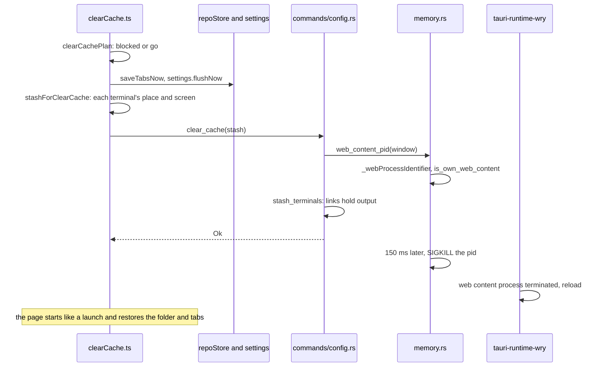

# How Clear Cache works

This chapter explains the Clear Cache button and command, which restart a window's page in a new WebKit process. The user side is in [Clear Cache](../usage/Clear-Cache.md).

## Why we need it

The interface runs in a WebKit web content process (see [How Memory Is Measured](How-Memory-Is-Measured.md)). Closing a tab drops our references, but WebKit keeps much of the freed memory for reuse instead of returning it to macOS. Measured on the release app: a project at 124 MB, 435 MB with four Markdown files with diagrams, and still 328 MB after closing them all. It stayed there after three minutes.

We tried the cheaper ways first:

- **Waiting**: no change between one and three minutes.
- **`location.reload()`**: 260 MB before, 253 MB after. A reload keeps the same process and most of its memory.
- **A simulated memory pressure warning** (`memory_pressure -S`): needs root, so it is not something the app can do.

Ending the web content process does work: Tauri notices and reloads the page in a new process, which measured 127 MB. Clear Cache does that on purpose, after saving everything.

## How it works

- **The rules** are pure, in `src/lib/debug/clearCachePlan.ts`: unsaved files (counted only while Remember unsaved changes is off; with it on, `repoStore.keepUnsaved` writes them first, see [How New File and unsaved changes work](How-New-Files-and-Unsaved-Changes-Work.md)), a running git operation (`repoStore.busy`) or the open merge tool block it with a message; otherwise it goes.
- **Saving first.** `repoStore.saveTabsNow` writes the tab session at once instead of after its one second delay, and `settings.flushNow` writes `settings.json` and `state.json` and waits for both.
- **One command, in order.** `clear_cache` first finds the process to end; only then does it hand the terminals to their links and end the process. A failure before that leaves every terminal connected.
- **Only our own process.** `web_content_pid` asks the window's `WKWebView` for `_webProcessIdentifier` on the main thread, then `is_own_web_content` checks that the pid is a `com.apple.WebKit.WebContent` process that `memory::usage` already counts as ours. Anything else is refused. The kill waits 150 ms so the command's answer still reaches the page.
- **The restart** is Tauri's own: `tauri-runtime-wry` registers a handler for `webViewWebContentProcessDidTerminate` that reloads the webview. The new page goes through the normal start, which reopens the window's folder and, with Reopen tabs on start, its tabs as dormant tabs.

## Terminals keep running

A terminal's shell lives in the backend, but what it shows lives in the page, and a starting page closes the shells its window left (`terminal_close_all`). Clear Cache hands them over instead:

- **Before.** `terminalStore.stashForClearCache` writes each terminal's place (`terminalStash.ts`: key, name, location, split group, Run spec, exit state) and its screen as text, from xterm's serialize addon, loaded only then. The panel layout (open, tab, shown terminal, split sizes) goes along.
- **Holding.** Every terminal and Run session sends its output through a link (`src-tauri/src/terminal_link.rs`). `stash_terminals` switches the window's links from the page's channel to a buffer of up to 4 MB, and keeps an exit that happens meanwhile. Flow control resumes by itself after a second without acks, so a shell never stalls.
- **After.** `terminalStore.init` takes the stash (`terminal_unstash`) before `terminal_close_all`, which skips terminals waiting for a page. Once the workspace is open, `restoreAfterClearCache` rebuilds the entries with their old keys, groups and layout and reopens terminal editor tabs. Each `TerminalView` writes its old screen, then `terminal_reattach` sends the held output and switches the link back to the new channel.
- **Never orphaned.** A terminal nobody reconnects to within two minutes is closed (`DETACHED_TIMEOUT`); closing the window drops its stash.

## Where the code lives

| File | What it does |
| --- | --- |
| `src/lib/debug/clearCachePlan.ts` | Blocked, confirm or go |
| `src/lib/debug/clearCache.ts` | Asks, saves, closes terminals, calls the command |
| `src/lib/views/StatusBar.svelte` | The button beside Memory |
| `src/lib/menu/menuSpec.ts`, `menuActions.ts` | View > Clear Cache |
| `src-tauri/src/memory.rs` | `web_content_pid`, `end_web_content`, `is_own_web_content` |
| `src-tauri/src/commands/config.rs` | The `clear_cache` command |
| `src-tauri/src/terminal_link.rs` | Links: output to the page or held, the stash, reattach, expiry |
| `src-tauri/src/commands/terminal.rs` | `stash_terminals`, `terminal_unstash`, `terminal_reattach`, `terminal_close_all` |
| `src/lib/terminal/terminalStash.ts` | What a terminal keeps across the restart, checked when read back |
| `src/lib/terminal/terminalStore.svelte.ts`, `TerminalView.svelte` | Saving, rebuilding, the screen, reconnecting |

## Design decisions

**Restart the process, not the page.** Only a new process gives the memory back; a reload alone did not.

**A button, not an automatic restart.** The screen blinks, so the user decides when. The readout next to the button shows when it is worth it.

**The page keeps the screen, the backend only the gap.** Keeping all output in the backend for every terminal would cost memory all the time. The serialized screen is taken only at Clear Cache, and the backend holds only what is printed during the restart.

**A private WebKit getter.** `_webProcessIdentifier` is not public API, but WebKit has had it for years and the app is not sold through the App Store. If it ever returns nothing, the pid check refuses and the user sees an error instead of a wrong process being ended.

## Tests

- `src/lib/debug/clearCachePlan.test.ts`: going at once, waiting for unsaved files, a git operation and the merge tool.
- `src/lib/terminal/terminalStash.test.ts`: descriptors and layout round-trip, bad ones are refused, the shown terminals exist.
- `src-tauri/src/terminal_link.rs`: output held and replayed in order, an exit while waiting, the 4 MB limit, expiry, unknown terminals. `src-tauri/src/terminal.rs`: `a_restarted_page_keeps_the_shells_waiting_for_it`.
- `src-tauri/src/memory.rs`: `clear_cache_only_ends_our_web_content_process` checks that our own pid, launchd and invalid pids are refused.
- Measured end to end on the release app with the MCP tools: 328 MB with every tab closed, 127 MB after Clear Cache, folder restored; with one diagram file open it came back too.
- A terminal across Clear Cache, on the release app: the same terminal came back running in the panel, the shell kept its pid, a counter it ran in the background wrote every second without a gap, and typing after the restart reached it. The old screen was checked by hand in the app and stays.

## Keeping this page in sync

- Update this page and [Clear Cache](../usage/Clear-Cache.md) when the rules, the restart or terminals change.
- Retake `status-bar-clear-cache.png` and `status-bar.png` when the button changes.
