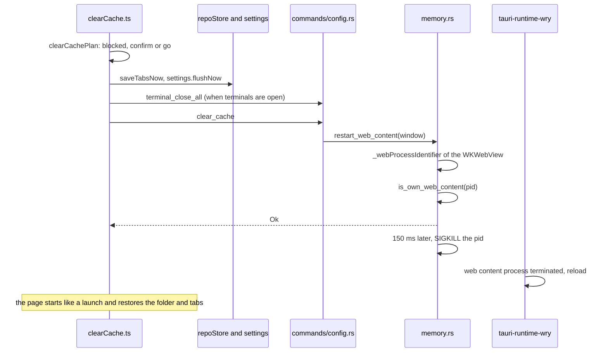

# How Clear Cache works

This chapter explains the Clear Cache button and command, which restart a window's page in a new WebKit process. The user side is in [Clear Cache](../usage/Clear-Cache.md).

## Why we need it

The interface runs in a WebKit web content process (see [How Memory Is Measured](How-Memory-Is-Measured.md)). Closing a tab drops our references, but WebKit keeps much of the freed memory for reuse instead of returning it to macOS. Measured on the release app: a project at 124 MB, 435 MB with four Markdown files with diagrams, and still 328 MB after closing them all. It stayed there after three minutes.

We tried the cheaper ways first:

- **Waiting**: no change between one and three minutes.
- **`location.reload()`**: 260 MB before, 253 MB after. A reload keeps the same process and most of its memory.
- **A simulated memory pressure warning** (`memory_pressure -S`): needs root, so it is not something the app can do.

Ending the web content process does work: Tauri notices and reloads the page in a new process, which measured 127 MB. Clear Cache does that on purpose, after saving everything.

## How it works

- **The rules** are pure, in `src/lib/debug/clearCachePlan.ts`: unsaved files, a running git operation (`repoStore.busy`) or the open merge tool block it with a message; open terminals or Run sessions make it ask with `dialogs.confirm({ danger: true })`; otherwise it goes.
- **Saving first.** `repoStore.saveTabsNow` writes the tab session at once instead of after its one second delay, and `settings.flushNow` writes `settings.json` and `state.json` and waits for both.
- **Only our own process.** `restart_web_content` asks the window's `WKWebView` for `_webProcessIdentifier` on the main thread, then `is_own_web_content` checks that the pid is a `com.apple.WebKit.WebContent` process that `memory::usage` already counts as ours. Anything else is refused. The kill waits 150 ms so the command's answer still reaches the page.
- **The restart** is Tauri's own: `tauri-runtime-wry` registers a handler for `webViewWebContentProcessDidTerminate` that reloads the webview. The new page goes through the normal start, which reopens the window's folder and, with Reopen tabs on start, its tabs as dormant tabs.

## Where the code lives

| File | What it does |
| --- | --- |
| `src/lib/debug/clearCachePlan.ts` | Blocked, confirm or go |
| `src/lib/debug/clearCache.ts` | Asks, saves, closes terminals, calls the command |
| `src/lib/views/StatusBar.svelte` | The button beside Memory |
| `src/lib/menu/menuSpec.ts`, `menuActions.ts` | View > Clear Cache |
| `src-tauri/src/memory.rs` | `restart_web_content`, `is_own_web_content` |
| `src-tauri/src/commands/config.rs` | The `clear_cache` command |

## Design decisions

**Restart the process, not the page.** Only a new process gives the memory back; a reload alone did not.

**A button, not an automatic restart.** The screen blinks and terminals close, so the user decides when. The readout next to the button shows when it is worth it.

**Terminals close.** A terminal's screen lives in the page, and the page closes its old shells when it starts (`terminal_close_all`). Keeping them would need the backend to keep recent output and hand it to the new page; that is possible future work.

**A private WebKit getter.** `_webProcessIdentifier` is not public API, but WebKit has had it for years and the app is not sold through the App Store. If it ever returns nothing, the pid check refuses and the user sees an error instead of a wrong process being ended.

## Tests

- `src/lib/debug/clearCachePlan.test.ts`: going at once, asking for terminals, waiting for unsaved files, a git operation and the merge tool.
- `src-tauri/src/memory.rs`: `clear_cache_only_ends_our_web_content_process` checks that our own pid, launchd and invalid pids are refused.
- Measured end to end on the release app with the MCP tools: 328 MB with every tab closed, 127 MB after Clear Cache, folder restored; with one diagram file open it came back too.

## Keeping this page in sync

- Update this page and [Clear Cache](../usage/Clear-Cache.md) when the rules, the restart or terminals change.
- Retake `status-bar-clear-cache.png` and `status-bar.png` when the button changes.
