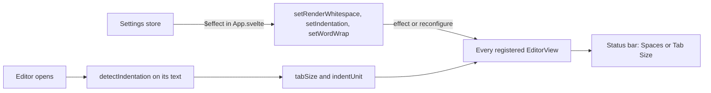

# How code appearance works

This chapter covers the settings that change how code looks in every editor, diff side and merge pane: font weight, line spacing, render whitespace, the current line, indentation, zoom and ligatures. The cursor has its own chapter, [How the Cursor Works](How-the-Cursor-Works.md). The commands and keys are in [How editing code works](How-Editing-Code-Works.md). The user side is in [Code Appearance](../usage/Code-Appearance.md).

## Why we need it

People read code here all day next to their IDE, so it should look like their IDE: the same spacing, the same visible whitespace and the same indentation. A file indented with 2 spaces must not get 4 when you press Tab, and a look setting must reach the editors that are already open.

## How it works

**Line spacing.** `settings.editorLineHeight` (default 1.25, from 1.0 to 2.5) is validated by `pickNumber` and rounded in `settingsData.ts`. `applyAppearance` writes it to `--code-line-height` on the root element, and `editorTheme` reads it for `.cm-scroller`. Every editor, diff side and merge pane uses `editorTheme`, and Markdown code blocks read the same variable, so one CSS variable changes them all without rebuilding a view.

**Font weight.** `settings.editorFontWeight` (default 400, from 100 to 900) is validated by `pickNumber` and rounded to a step of 100, and `fontWeightName` gives the style name the slider shows (300 is Light). It works like line spacing: `applyAppearance` writes `--code-weight`, and `editorTheme` (`.cm-scroller`), the sticky scroll header and Markdown code blocks read it. `.tok-heading` and `.tok-strong` in `src/app.css` use `calc(var(--code-weight) + 200)`, so bold text stays bolder than the code around it at every weight.

**Render whitespace.** `whitespace.ts` has a pure part and a view part. `whitespaceRuns(text, mode)` finds the stretches of spaces and the tabs one line draws for a mode (`none`, `boundary`, `selection`, `trailing`, `all`), and `clipRuns` cuts them to the selection. A ViewPlugin decorates only `view.visibleRanges` with mark decorations: a dotted background for spaces and a drawn arrow for tabs. The text itself never changes, so copying gives real spaces. With `none` the extension adds nothing at all.

The mode sits in a `Compartment`. A tiny ViewPlugin registers every live view in a `Set`, and `App.svelte` calls `setRenderWhitespace` from an effect when the setting changes, which reconfigures the compartment in each registered view. Open editors follow at once.

**Indentation.** `indentDetect.ts` is pure: `detectIndentation(lines)` reads up to 10,000 lines and answers tabs when more lines start with a tab, else the most common step by which the indentation grows from one line with code to the next. It skips blank lines, one-space steps (comment stars) and steps wider than 8 (alignment), and returns null when there is nothing to follow. `indentation.ts` keeps the answer in a `StateField` that is filled from the document when the editor state is created, and `EditorState.tabSize` and `indentUnit` are computed from it. `App.svelte` calls `setIndentation` when `detectIndentation` or `tabSize` changes, which sends an effect to every registered view so each reads its text again. The status bar reads `editorIndent(state)`.

**The current line.** `activeLine.ts` replaces CodeMirror's `highlightActiveLine` with `highlightActiveLineWhenEmpty`: the cursor lines get `cm-activeLine` only while every selection range is empty. Read-only panes have no current line highlight. Why this matters is in the bug below.

**Zoom and ligatures.** Ctrl or Cmd plus the mouse wheel zooms, only over a `.cm-editor`: `App.svelte` listens and asks a `WheelZoom` (`src/lib/editor/wheelZoom.ts`) for the next size. View > Zoom In and Zoom Out call `steppedFontSize` from the same module through `menuActions.ts`. Font ligatures are a `data-ligatures` root attribute set by `applyAppearance` and styled in `src/app.css`.

## Where the code lives

| File | What it does |
| --- | --- |
| `src/lib/editor/whitespace.ts` | Render whitespace |
| `src/lib/editor/indentDetect.ts` | `detectIndentation`, pure |
| `src/lib/editor/indentation.ts` | The editor's tab size and indent unit, `setIndentation`, `editorIndent` |
| `src/lib/editor/activeLine.ts` | The current line highlight |
| `src/lib/editor/setup.ts` | `editorTheme` and `baseExtensions` |
| `src/lib/editor/wheelZoom.ts` | Wheel zoom steps and `steppedFontSize` |
| `src/lib/stores/settingsData.ts` | `editorFontWeight`, `fontWeightName`, `editorLineHeight`, `renderWhitespace`, `tabSize`, `detectIndentation` and their checks |
| `src/lib/views/StatusBar.svelte` | Spaces or Tab Size for the file on screen |

## Design decisions

**Font weight in steps of 100.** Fonts name their weights in hundreds (Light, Regular, Medium), so the slider shows a name instead of a bare number, like the font picker of JetBrains IDEs. Weights in between only work with variable fonts, so they would look the same as a step for most fonts.

**Selection by default.** Drawing every space is noisy, and drawing none hides trailing spaces. VS Code's default, dots only inside the selection, shows them exactly when you look.

**Detect only on open.** Indentation is read when an editor opens and when a setting changes, not while you type, so the indent unit never jumps under the cursor. Steps into a deeper level count, steps back out do not, because closing several blocks at once makes a step of many levels.

**Only visible lines.** Decorating the whole document would cost memory on big files. The plugin rebuilds on scroll, edits and, in Selection mode, selection changes.

## Tests

- `src/lib/editor/whitespace.test.ts`: the runs of each mode and clipping to selections.
- `src/lib/editor/activeLine.test.ts`: the highlight shows only without a selection.
- `src/lib/editor/indentDetect.test.ts`: 2 and 4 spaces, tabs, mixed files, comment stars, alignment and the line limit.
- `src/lib/stores/settingsData.test.ts` and `src/lib/editor/wheelZoom.test.ts`: setting checks and zoom steps.
- `src/lib/menu/menuState.test.ts`: View > Detect Indentation follows the setting.

## Keeping this page in sync

- A new look setting: follow `--code-line-height` (a CSS variable) or `renderWhitespace` (a compartment), and update [Code Appearance](../usage/Code-Appearance.md), [Settings](../usage/Settings.md) and [Settings Reference](Settings-Reference.md).
- Retake `editor-whitespace.png` when whitespace drawing changes.

## Bugs we fixed

The selection hidden by the current line highlight is recorded in [How the editor works](How-the-Editor-Works.md#bugs-we-fixed).
