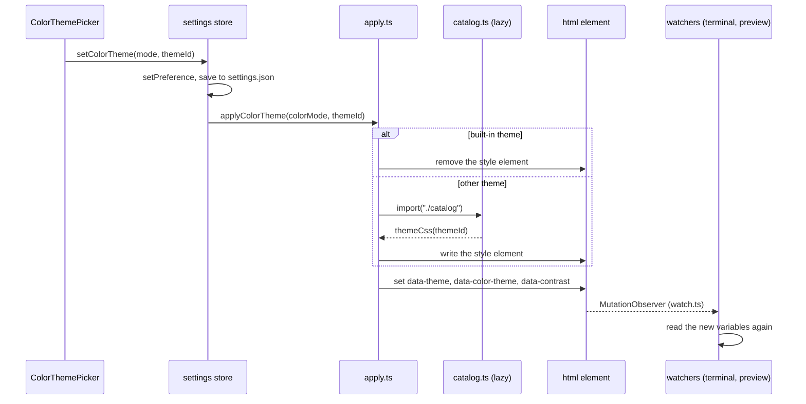

# How color themes work

Git Manager has 41 color themes: the built-in Git Manager Light and Dark, 12 more light, 22 more dark and 5 high contrast themes. The user picks one for light mode and one for dark mode. For the user side, see [Color Themes](../usage/Color-Themes.md).

## Why we need it

People spend hours a day in an editor, and they care a lot about its colors. Most already have a favorite theme from VS Code or JetBrains, and a git client that looks different from their editor feels foreign. High contrast themes also matter for people with low vision. Picking one theme per mode, like VS Code's "preferred light and dark color theme", keeps the app right when macOS switches appearance at sunset.

## How it works

Every color in the app is a CSS variable from `src/app.css`, such as `--panel`, `--text`, `--editor-bg`, `--diff-added`, `--tok-keyword` and `--term-red`. `src/lib/themes/tokens.ts` lists all 67 of them in `COLOR_TOKENS`. A theme is one value for each token.

- The **built-in themes** are the sets in `app.css`: `:root` for light, and the dark set twice, under `@media (prefers-color-scheme: dark) :root:not([data-theme="light"])` and `:root[data-theme="dark"]`. They need no JavaScript.
- **Every other theme** is one generated `<style id="gm-color-theme">` element with the rule `html:root[data-color-theme="<id>"] { ... }`. `html:root` outranks `:root[data-theme]`, and the attribute scope means the rule only applies together with its attribute.

### The index and the catalog

`themeIndex.ts` is small and always loaded: every theme's `id`, `name` and `kind` (`light`, `dark`, `high-contrast-light`, `high-contrast-dark`). Settings validation (`pickThemeId`) and the pickers (`themeGroups`) use it without loading any palette.

`catalog.ts` is a lazy chunk with the palettes. Each `ThemeSpec` holds the theme's published colors: editor background and foreground, accent, selection, the 16 ANSI colors, syntax colors and, where the theme has them, UI colors. `deriveColors` builds all 67 tokens from that with the helpers in `color.ts` (`mix`, `composite`, `ensureContrast`, `fitTint`):

- Hints, accent and status colors are pushed until they reach their contrast target on every surface they sit on.
- Diff tints are faded (`fitTint`) until text on them stays readable.
- High contrast themes get 7:1 text targets, syntax colors pushed to 7:1 and stronger diff tints.

Values are computed on demand and never cached, so only the applied CSS variables stay in memory.

### Applying

`settings.applyAppearance()` runs on every preference change. It works out `colorMode` (`effectiveMode`: the Appearance setting, or macOS while it is System, watched with `matchMedia`) and calls `applyColorTheme(mode, themeId)` in `apply.ts`:

- `appliedKey` skips the work when mode and theme did not change, because font sliders call `applyAppearance` many times a second.
- A request counter lets the newest call win over one still loading the catalog.
- The `<html>` attributes change only after the new variables are in place, so watchers read the new colors. `data-theme` is now always set, also for System, so code reads one attribute.
- If the catalog fails to load, the built-in theme of that mode is applied.

### Who follows a theme

Most of the app reads the variables directly, so it follows at once: panels, CodeMirror (its `tok-*` classes), diffs and the merge tool. Code that copies colors out of CSS listens with `watchTheme` (`watch.ts`, a `MutationObserver` on `data-theme`, `data-color-theme` and `data-contrast`):

- The terminal (`TerminalView.svelte`) sets xterm's theme from `currentTerminalTheme()`.
- The Markdown preview redraws its diagrams. `mermaid.ts` uses mermaid's own themes for the built-ins and the theme's variables for the others.

### The picker

`views/settings/ColorThemePicker.svelte` is a listbox per mode with grouped options ("Light" or "Dark", then "High contrast"). It imports the catalog on mount for the swatches (`themeSwatch`); the swatches live in the component's state, and a `cancelled` flag ignores an import that finishes after unmount. `pickerMove` handles the arrows, Home, End and the page keys. The "In use" badge shows on the picker of `settings.colorMode`.

## Where the code lives

| File | What it does |
| --- | --- |
| `src/lib/themes/themeIndex.ts` | Ids, names, kinds, defaults, modes, groups, picker keys |
| `src/lib/themes/catalog.ts` | Palettes, `deriveColors`, `themeCss`, `themeSwatch` |
| `src/lib/themes/color.ts` | Parsing, mixing, WCAG contrast, Lab distance |
| `src/lib/themes/tokens.ts` | The 67 color tokens |
| `src/lib/themes/apply.ts`, `watch.ts` | Putting a theme on the page; theme change watcher |
| `src/lib/stores/settings.svelte.ts` | `lightColorTheme`, `darkColorTheme`, `colorMode`, `setColorTheme` |
| `src/lib/views/settings/ColorThemePicker.svelte` | The pickers in Settings > Editor |
| `src/app.css` | The built-in themes |

## Design decisions

**Two settings, not one.** `lightColorTheme` and `darkColorTheme` follow macOS without asking. A light theme can never be saved as the dark one: `pickThemeId` falls back to the mode's default.

**Derive, do not hand-write.** 39 themes times 67 tokens would be thousands of values to keep right. Specs hold only what the theme publishes, and the derivation guarantees readable text.

**The defaults cost nothing.** The built-in themes live in `app.css`, so the catalog chunk loads only for another theme or when Settings > Editor shows.

**Colors come from the theme's own files.** Islands Light and Dark use JetBrains' `ManyIslandsLight.theme.json`, `ManyIslandsDark.theme.json` and their editor schemes in intellij-community (selection and console colors inherited from the parent schemes). VS Code Light+ and Dark+ use `light_plus.json` and `dark_plus.json` in microsoft/vscode plus VS Code's built-in workbench defaults. Islands' rounded, spaced panels are a layout, not colors, so only the colors are used.

**Contrast is tested, not hoped for.** Every theme must pass the same checks as the built-ins.

## Known gaps

- `src/lib/log/GraphCell.svelte` has eight hard-coded lane colors.
- The Settings switch knob is a hard-coded white (`.switch` in `SettingsDialog.svelte`).
- The rich Markdown editor does not redraw its diagrams on a theme change; `richEditor.ts` has no `watchTheme`.
- At startup, `app.css` shows the built-in theme of the macOS appearance until `settings.init()` has read settings.json, and another theme waits for the catalog chunk, so the default colors can flash.

## Tests

- `src/lib/themes/catalog.test.ts`: every listed theme has a palette and every token; the built-ins match `app.css` exactly, and its two dark blocks match each other. For every theme: text at 4.5:1 (7:1 for high contrast) on the editor, panels and background, a visible selection that text stays readable on, diff tints that stand out and keep text readable, and button text at 3:1.
- `themeIndex.test.ts` (counts, unique ids, modes, `pickThemeId`, groups, `pickerMove`), `apply.test.ts` and `color.test.ts`.

## Keeping this page in sync

- A new color token goes in `app.css` (all three blocks), `tokens.ts` and `deriveColors`; the tests fail until it does.
- A new theme goes in `THEME_INDEX` and `SPECS`, then in the list on [Color Themes](../usage/Color-Themes.md).
- Retake `color-theme-pickers.png`, `color-theme-dracula.png`, `color-theme-solarized-light.png` and `color-theme-high-contrast.png` when the look changes.
- Settings keys are listed in [Settings Reference](Settings-Reference.md).

## Bugs we fixed

None yet.
