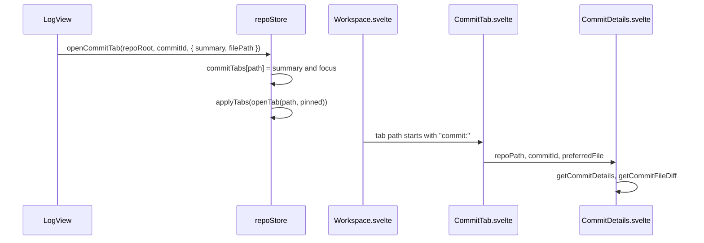

# How commit tabs work

A commit from the Log can open in its own editor tab, so its diff gets the whole editor area instead of the small pane under the list. For the user side, see [History and Log](../usage/History-and-Log.md#open-a-commit-in-a-tab).

## Why we need it

The details pane under the Log is good for a quick look, but it shares the height with the commit list. A big change is hard to read there. VS Code opens a commit's changes as an editor tab, and people coming from it expect the same: double-click, read it full size, close the tab when done, keep the Log where it was.

## How it works

A commit tab lives in the same tab strip as file tabs, so it gets every tab behavior for free: it sits next to files, closes with the tab menus, and is reused when you open the same commit again. The tab rules in `stores/tabs.ts` only know a tab by its `path`, so a commit tab gets a pseudo path from `commitTabPath(repoRoot, commitId)`, such as `commit:0f32e433...@/work/acme/storefront`. It never starts with `/`, so no folder or repository lookup can mistake it for a file.

The Log calls `openCommitTab` from four places: a double-click on a commit row, Enter in the list, **Open in Tab** in the details pane (and its right-click menu), and a double-click on a changed file. `CommitDetails` shows the button and the file double-click only when it gets an `onOpenInTab` callback, so inside the tab itself they are hidden.

`Workspace.svelte` renders `CommitTab` instead of `FileView` for a commit tab path. `CommitTab` parses the path back with `parseCommitTabPath` and renders the same `CommitDetails` the Log uses, at full size. A **Parent** link opens that commit in another tab. Because the tab can show any commit, not only loaded ones, every parent is clickable.

What the path cannot hold lives in `repoStore.commitTabs`: the subject for the tooltip, and `focus`, the file to show. `focus` carries a `token` that changes on every request, so asking for the same file again still switches to it. `applyTabs` drops the entry when its tab closes.

Code that treats a tab path as a file asks `isPseudoTab` (`stores/pseudoTabs.ts`), which knows every kind below, so a new kind is added in one place:

- `EditorTabs.svelte`: icon, label (`tabLabels`), tooltip and menu per kind; a commit tab has **Copy Commit Hash**.
- `StatusBar.svelte` and `FileExplorer.svelte`: cursor items and file selection only for real files.
- `navHistory.ts`: `record` refuses pseudo tabs, and Recent Files skips them.
- `repoStore.removeFolder`: `tabsInFolder` closes the folder's files and its repositories' commit, Git and branch tabs. Terminal tabs stay.

## Other tabs that are not files

Later features reuse the idea. Each kind has a prefix and a pure module that builds and parses its path (parts URI-encoded, joined by `|`), and opens pinned through `repoStore.openPseudoTab`.

| Path | Shows | Opened from | View |
| --- | --- | --- | --- |
| `commit:<id>@<repo>` | A commit | The Log | `log/CommitTab.svelte` |
| `git-fileHistory:<repo>\|<file>` | A file's history | Git > Current File > Show History | `views/git/FileHistoryTab.svelte` |
| `git-lineHistory:<repo>\|<file>\|<from>-<to>` | The history of some lines | Show History for Selection | `views/git/LineHistoryTab.svelte` |
| `git-compare:<repo>\|<file>\|<revision>` | A file against a revision or branch | Compare with Revision or Branch, a history row | `views/git/CompareTab.svelte` |
| `git-shelf:<repo>\|<file>\|<shelf>` | A file of a shelved change | Shelf > Show Diff | `shelf/ShelfDiffTab.svelte` |
| `branches-compare:<repo>\|<branch>\|<base>` | Two branches compared | Branches popup > Compare with 'current branch' | `views/git/BranchCompareTab.svelte` |
| `branches-worktree:<repo>\|<revision>` | A branch against the working tree | Branches popup > Show Diff with Working Tree | `views/git/WorktreeDiffTab.svelte` |
| `terminal:<key>` | A terminal | Move Terminal into Editor Area, New Terminal in Editor Area | `terminal/TerminalSlot.svelte` |

The Git kinds live in `stores/gitTabs.ts` and render through `views/git/GitTab.svelte`, the branch kinds in `stores/branchTabs.ts` and `views/git/BranchTab.svelte`. A terminal tab's path holds only the terminal's key (`terminal/terminalTabs.ts`). Its `TerminalSlot` stays empty: the terminal store moves the live xterm element into it, so the shell keeps running between the panel and the editor. Closing the tab reaches the terminal store through `repoStore.onTabsClosed` and stops the shell. See [How the terminal works](How-the-Terminal-Works.md).

## Where the code lives

| File | What it does |
| --- | --- |
| `src/lib/stores/commitTabs.ts` | Pseudo paths: `commitTabPath`, `parseCommitTabPath`, `isCommitTab`, `commitTabsInFolder` |
| `src/lib/stores/pseudoTabs.ts` | `isPseudoTab`: every kind of tab that is not a file |
| `src/lib/stores/repo.svelte.ts` | `openCommitTab`, `openPseudoTab`, `commitTabs`, `onTabsClosed` |
| `src/lib/stores/tabs.ts` | `tabLabels` for every kind, `tabsInFolder` |
| `src/lib/log/CommitTab.svelte` | The tab's content: `CommitDetails` at full size |
| `src/lib/log/CommitDetails.svelte` | **Open in Tab** and the file double-click (`onOpenInTab`) |
| `src/lib/views/LogView.svelte` | Double-click, Enter and the menu item call `openInTab` |
| `src/lib/views/Workspace.svelte` | Picks the view for each tab |
| `src/lib/views/EditorTabs.svelte` | Icon, label, tooltip and menu for each kind |

## Design decisions

**A pseudo path instead of a second kind of tab.** Opening, preview rules, closing, Close Others and the scroll-into-view all work on paths; a path that can never be a file reused them all. The rejected alternative was a separate list of commit tabs with its own strip logic. Seven more kinds joined later without changing the tab rules.

**One `isPseudoTab` check.** Places that need a real file ask one helper, so a new kind cannot be forgotten in one of them.

**Reuse `CommitDetails`.** The tab and the Log pane show the same thing, so they share one component. A fix to one is a fix to both.

**Commit tabs open pinned.** A double-click or a button is a deliberate open, like a double-click in the Files panel, so the tab never replaces itself the way a preview tab does.

**No Back and Forward steps for pseudo tabs.** History stops are files, diffs and Log positions. A pseudo tab is never recorded (`record` refuses it), because a stop must be checkable when you go back to it, and that needs its own rule in `navHistory.ts`.

## Bugs we fixed

None are recorded yet. When you fix one, add it here with the issue, why it happened, and the fix and why you chose it.

## Tests

- `src/lib/stores/commitTabs.test.ts`: pseudo paths round-trip, files are never mistaken for commits, `commitTabsInFolder`, and the short hash label.
- `src/lib/stores/gitTabs.test.ts`, `branchTabs.test.ts` and `src/lib/terminal/terminalTabs.test.ts`: the other kinds round-trip and reject broken paths; Git and branch tabs close with their folder, terminal tabs stay.
- `src/lib/stores/navHistory.test.ts`: "never records a terminal or commit tab as a stop".
- The tab views are Svelte glue; check them by hand: double-click a commit, Enter, **Open in Tab**, a file double-click, a parent link, and closing.

## Keeping this page in sync

- Changing how a commit tab opens, looks or closes: update this page, [History and Log](../usage/History-and-Log.md), [Keyboard Shortcuts](../usage/Keyboard-Shortcuts.md) and `commit-tab.png`.
- Adding Back and Forward steps for pseudo tabs: update the decision above and [How navigation works](How-Navigation-Works.md).
- New code that walks `repoStore.tabs` must handle pseudo tabs (`isPseudoTab`).
- A new kind: a prefix that never starts with `/`, then `isPseudoTab`, `tabLabels`, `EditorTabs.svelte`, `Workspace.svelte`, `tabsInFolder` if it belongs to a repository, and a row in the table above.
