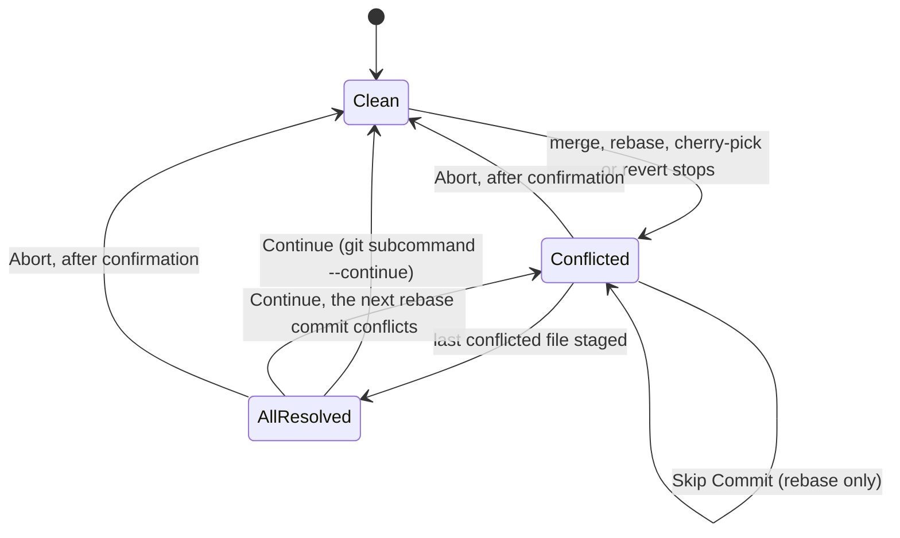
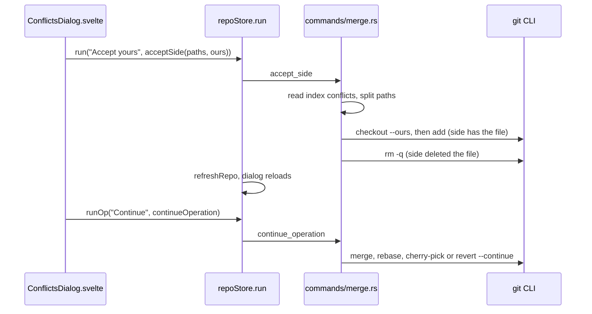

# How conflict resolution works

When a merge, rebase, cherry-pick or revert stops on conflicts, Git Manager shows a banner, a Conflicts dialog and inline editor actions, and lets you continue or abort. The merge tool has its own page, [How the merge tool works](How-the-Merge-Tool-Works.md). The user side is in [Resolving Conflicts](../usage/Resolving-Conflicts.md).

## Why we need it

Resolving conflicts is the reason this app exists, and different conflicts need different tools: **whole files** (yours or theirs, the only option for binary and "deleted on one side" conflicts), **inline markers** in the editor, like VS Code, and **the merge tool** for real conflicts in a file.

Git stays in charge: we read its state and run its own `--continue`, `--abort` and `--skip`, so the result matches the terminal.

## How it works

### Knowing an operation is running

`opstate::read` in `src-tauri/src/git/opstate.rs` looks at git2's `repo.state()` and returns an `OpState`: the `kind` (`merge`, `rebase`, `cherryPick`, `revert`, `other` or `none`), a short `description` such as "Merging feature into main", and labels for the two sides. It is part of every `RepoStatus`, so the banner updates with each status refresh.

Commands that may stop on conflicts return an `OpOutcome`. `commands::outcome` treats a failed git command that left conflicts behind as a normal result with `conflicts: true`, not an error. `repoStore.runOp` then makes that repository active and opens the Conflicts dialog.

`OpBanner.svelte` shows the description and conflicted file count, with Resolve Conflicts, Continue (once nothing is left), Skip Commit (rebase only) and Abort. Abort asks first. For an `other` state, such as `git am` or a bisect, it offers neither Continue nor Abort. The banner acts on the active repository.

The three actions live in `views/git/operationActions.ts` (`continueOperation`, `abortOperation`, `skipRebaseCommit`), shared by the banner and the Git menu. `menuState.ts` shows the menu items only while they apply and names them after the operation, such as "Continue Merge". After `--continue`, `--abort` or `--skip`, the backend calls `cleanup_rebase_files`, which removes the message files of an [interactive rebase](How-Interactive-Rebase-Works.md) once no rebase is in progress.

### The Conflicts dialog

`ConflictsDialog.svelte` calls `listConflicts`, which reads the conflict entries of the index in `conflicts::list`. Each file gets a `FileConflictKind` from which stages exist: `bothModified`, `bothAdded`, `deletedByUs` or `deletedByThem`, plus a `binary` flag. It reloads on every status change.

`operation_subcommand` picks the git subcommand from the `OpKind`. The git runner sets `GIT_EDITOR=true`, so `--continue` accepts the prepared message instead of waiting for an editor. Double click or Enter on a text file opens the merge tool (`repoStore.openMerge`).

### Inline conflict actions

`src/lib/editor/conflictMarkers.ts` is pure. `findConflicts` scans for complete `<<<<<<<`, `=======` and `>>>>>>>` regions, understands the `|||||||` base section of the diff3 and zdiff3 styles, keeps the branch labels and skips incomplete regions. `resolveEdit` and `resolveAllEdits` build the edits for a choice.

`src/lib/editor/conflictDecorations.ts` keeps the regions in `conflictField`, a StateField recomputed when the document changes. `EditorView.decorations.compute` turns it into colored lines, "(Current Change)" and "(Incoming Change)" labels, and a block widget with the action links above each region. `barWidth` caps the row at the visible width so it wraps, keeping the "Conflict 1 of 2" counter in view. Clicking a link dispatches the edit, so Cmd+Z undoes it.

In `FileView.svelte`, a file with markers or one git lists as conflicted gets a tinted strip under the path bar (toolbar "Conflict actions") with Accept All Current and Accept All Incoming, Resolve in Merge Tool (asking first about unsaved edits, since the merge tool starts from git's versions), and Mark as Resolved once no markers are left. Mark as Resolved calls `saveResolution`, which writes the file and runs `git add`.

## Where the code lives

| File | What it does |
| --- | --- |
| `src-tauri/src/git/opstate.rs` | `OpKind`, `OpState`, side labels |
| `src-tauri/src/git/conflicts.rs` | `list`, `classify`, loading the three stages |
| `src-tauri/src/commands/merge.rs` | `list_conflicts`, `accept_side`, `save_resolution`, `continue_operation`, `abort_operation`, `skip_rebase_commit` |
| `src-tauri/src/commands/mod.rs` | `outcome` and `run_op` |
| `src/lib/views/OpBanner.svelte` | The banner and its buttons |
| `src/lib/views/git/operationActions.ts` | Continue, Abort and Skip Commit, shared with the Git menu |
| `src/lib/merge/ConflictsDialog.svelte` | The file list, Accept Yours or Theirs, Merge, and Continue once all are resolved |
| `src/lib/editor/conflictMarkers.ts` | Pure marker parser and resolution edits |
| `src/lib/editor/conflictDecorations.ts` | CodeMirror field, decorations, action widgets, `barWidth` |
| `src/lib/views/files/FileView.svelte` | Accept All, Resolve in Merge Tool, Mark as Resolved |

## Design decisions

**Let git run the operation.** We never reimplement continue or abort. Git's own commands keep hooks, rerere and the sequencer state correct.

**Name the sides for what they are.** During a rebase, HEAD is the branch you rebase onto, so "ours" is the upstream and "theirs" is your replayed commit. `opstate::read` labels them "Upstream" and "Your commit" instead of a confusing "Yours" and "Theirs".

**Conflicts are an outcome, not an error.** A merge that stops on conflicts did its job, so `outcome` reports `conflicts: true` and the UI opens the dialog, not an error toast.

**Block widgets from a StateField.** CodeMirror does not allow block decorations from a ViewPlugin, so the action bars come from `conflictField` through a decorations facet.

**Mark as Resolved is explicit.** Cmd+S only saves, so you can stop halfway. Staging waits until you say the file is done.

## Bugs we fixed

**Escape closed two dialogs at once.**
- **The issue:** pressing Escape on a confirmation shown over the Conflicts dialog closed both.
- **Why it happened:** its window Escape handler also got the key meant for the confirmation.
- **The fix and why we chose it:** its `onKeydown` returns early when `event.defaultPrevented` or `dialogs.active` is set. The same check is now a project rule for every window-level key handler.

**The conflict counter was hidden.**
- **The issue:** in a file with several conflicts, the "Conflict 1 of 2" counter at the end of the inline actions row never showed at normal window sizes.
- **Why it happened:** the actions row is a block inside the editor content, which is as wide as its longest line, so the row never wrapped and the counter sat past the visible edge.
- **The fix and why we chose it:** the ViewPlugin `barWidth` in `conflictDecorations.ts` measures the visible editor width on every geometry change and sets `--cm-conflict-bar-width`. The row is capped at that width and wraps, so the counter moves to a second line instead of disappearing.

## Tests

- `src-tauri/src/git/tests.rs`: `merge_conflicts_are_listed_with_kinds_and_binary_flags`, `merge_labels_fall_back_to_merge_head_branch_without_merge_msg`, `rebase_conflict_labels_upstream_as_ours`, `cherry_pick_and_revert_conflicts_are_detected`, and the demo script tests.
- `src-tauri/src/commands/tests.rs`: `accept_side_*`, `save_resolution_writes_content_and_stages_it`, `continue_operation_completes_merge`, `abort_operation_restores_pre_merge_state`, the rebase, cherry-pick and revert flows, and `skip_rebase_commit_drops_the_conflicting_commit`.
- `src/lib/editor/conflictMarkers.test.ts`: labels, diff3, look-alike markers and every resolution choice.

`scripts/make-conflict-repo.sh` builds every conflict type, and the Rust tests assert its exact output, so update `src-tauri/src/git/tests.rs` when you change it. See [Testing](Testing.md).

## Keeping this page in sync

- Update this page when an operation kind, a side label, the banner or Git menu actions or the marker parser change.
- Update [Resolving Conflicts](../usage/Resolving-Conflicts.md) for visible changes.
- Retake `operation-banner.png`, `conflicts-dialog.png`, `inline-conflict-actions.png` and `editor-conflict-toolbar.png`. See [Docs and Screenshots](Docs-and-Screenshots.md).
