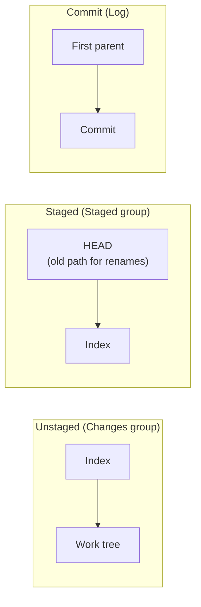
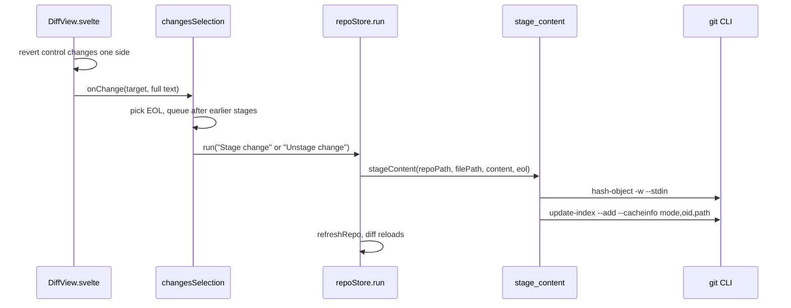

# How diffs work

The diff view shows one file side by side: the old version on the left, the new one on the right. The Changes sidebar uses it to stage or unstage single hunks, and the Log uses it read-only for commit diffs. The user side is in [Diffs](../usage/Diffs.md).

## Why we need it

Before you stage or commit, you want to see exactly what changed, and often you want only part of a file in the next commit. Staging single hunks is the feature people miss most in simple git GUIs.

The split of work is deliberate. Rust only loads the two texts of the selected file; the UI computes and draws the diff with `@codemirror/merge`. No patch text crosses the bridge, nothing is parsed twice, and only the file on screen is kept in memory.

## How it works

### The two sides

`src-tauri/src/git/diff.rs` returns a `FileDiff` (`original`, `modified`, both line endings, `binary`, `tooLarge`). Which versions it compares depends on the area:

`working_file` handles the first two and `commit_file` the third. `build` gives up on files over `MAX_DIFF_BYTES` (4 MB), flags binary content, and normalizes CRLF to LF while remembering each side's `Eol`.

`changesSelection.loadDiff` asks `getFileDiff` for the selected row. A token drops answers that arrive after you picked another file, and `sameDiff` skips rebuilding the editors when a refresh returns identical text. The diff reloads only when its own repository's status object changes, so a refresh in another repository leaves it alone.

### The view

`DiffView.svelte` takes `diff`, `path`, `mode` (`unstaged`, `staged` or `readonly`), two labels, an optional `onChange`, an optional `blame` target and an optional `revealLine` for Back and Forward. Its `build` function:

- loads the language with `languageFor`, then creates a `MergeView` with two read-only editors from `baseExtensions`,
- collapses unchanged lines (`margin: 3`, `minSize: 4`) when `diffPrefs.collapseUnchanged` is on (saved in local storage),
- adds `chunkKinds` and `diffTheme` from `mergeExtensions.ts`, so pure additions, pure deletions and mixed chunks get their own `--diff-*` colors from `src/app.css`,
- adds revert controls: `b-to-a` with a "Stage this change" button in unstaged mode, `a-to-b` with "Unstage this change" in staged mode, none when read-only,
- draws the overview ruler with `createStrip`, `layoutTicks` and `renderTicks` from `scrollMarkers.ts`, next to the merge view's scroll container,
- binds F7 and Shift+F7 to `goToChunk`, and restores the scroll position when the same file is rebuilt.

The effect's cleanup calls `teardown`, which destroys the `MergeView`, so no editor outlives its diff.

### Staging one hunk

A hunk button reverts one chunk of one side. That side's new full text is exactly what the index should contain, so we write it straight into the index:

In unstaged mode the left side is the index, so pulling a chunk into it stages the hunk. In staged mode the right side is the index, so pushing HEAD's lines into it unstages the hunk. Both call `stage_content`, which keeps the file mode of the existing index entry (or `100644` for a new file). The text is written back with that side's one detected line ending (`Eol::detect`, by majority), so staging a hunk of a file with mixed endings stores one ending for the whole file. For the same reason, a change that only touches line endings shows "No content changes".

In the Log, `CommitDetails.svelte` loads `getCommitFileDiff` and shows the view with `mode="readonly"`. Its blame target uses the commit as the revision, and is skipped when the new side is empty, as after a deletion.

## Where the code lives

| File | What it does |
| --- | --- |
| `src/lib/diff/DiffView.svelte` | The side by side view, hunk buttons, ruler, navigation |
| `src/lib/diff/mergeExtensions.ts` | `chunkKinds`, `diffTheme`, `revertButton` |
| `src/lib/diff/prefs.svelte.ts` | The Collapse unchanged preference |
| `src/lib/views/changes/ChangesDiff.svelte` | The Diff tab for the selected change |
| `src/lib/views/changes/selection.svelte.ts` | `loadDiff`, `applyDiffChange`, the stage queue |
| `src/lib/log/CommitDetails.svelte` | Read-only commit diffs |
| `src/lib/editor/scrollMarkers.ts` | Ruler layout shared with the editor |
| `src-tauri/src/git/diff.rs` | `working_file`, `commit_file`, size and binary checks |
| `src-tauri/src/commands/status.rs` | `get_file_diff`, `stage_content` |
| `src-tauri/src/commands/history.rs` | `get_commit_file_diff` |

## Design decisions

**Stage by writing the whole new index text.** The alternative was to build a patch and run `git apply --cached`. Patches break on context mismatches, whitespace and line endings. Writing the exact text the user sees is simple and always correct.

**Hash from stdin without `--path`.** Without a path, `git hash-object` applies no clean filters, so the stored bytes are exactly the index content we computed.

**Queue hunk stages.** `applyDiffChange` chains each stage on `stageQueue`, so fast clicks reach the index in order instead of racing.

**Read-only, not non-editable.** The editors use `readOnly` but not `EditorView.editable.of(false)`, so find, copy and F7 still work.

**Let the UI compute the diff.** One diff engine draws what you see, and the hunk buttons come for free with `@codemirror/merge`. Computing hunks in Rust would mean two diff engines that could disagree.

## Bugs we fixed

None are recorded for the diff view itself yet. The Diff tab that could not be closed is covered in [How the editor works](How-the-Editor-Works.md), and staged renames in [How changes and commits work](How-Changes-and-Commits-Work.md).

## Tests

- `src-tauri/src/git/tests.rs`: `diff_working_file_staged_and_unstaged`, `diff_working_file_staged_in_unborn_repo` and `diff_commit_file_sides`.
- `src-tauri/src/commands/tests.rs`: `stage_content_updates_index_for_tracked_file`, `stage_content_adds_new_file_and_keeps_executable_mode` and `get_status_and_file_diff_commands`.

The Svelte view has no unit tests. If you add logic to it (for example new chunk rules), move that logic into a pure `.ts` module and test it with Vitest. Hunk buttons need a manual check in the running app. See [Testing](Testing.md).

## Keeping this page in sync

- Update this page when a diff area, the size limit, the hunk staging path or the `DiffView` props change.
- Update [Diffs](../usage/Diffs.md) for visible changes.
- Retake `diff-view.png` and `diff-hunk-staging.png`. See [Docs and Screenshots](Docs-and-Screenshots.md).
