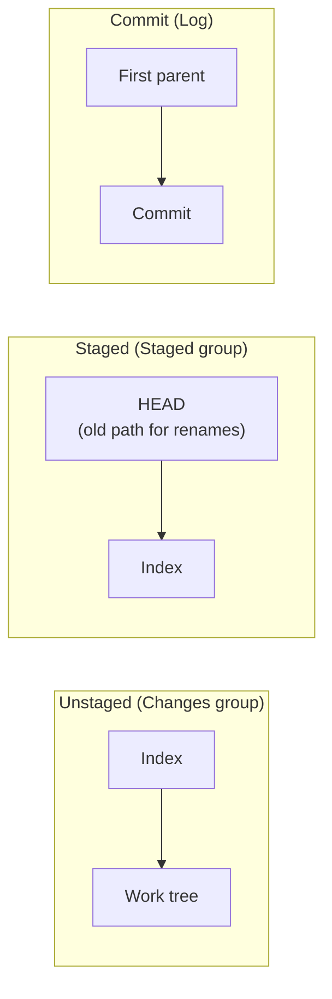
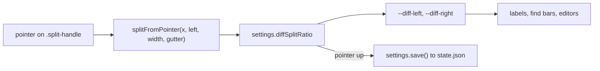
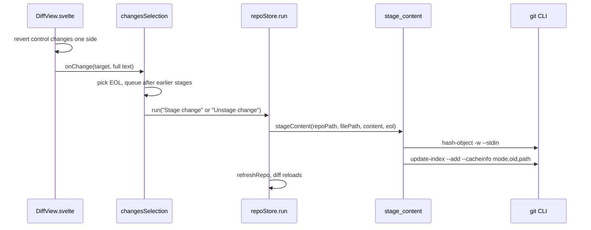

# How diffs work

The diff view shows one file side by side: the old version on the left, the new one on the right. The Changes sidebar uses it to stage or unstage single hunks; the Log, commit tabs, the Git and branch compare tabs and the shelf use it read-only. The user side is in [Diffs](../usage/Diffs.md).

## Why we need it

Before you stage or commit, you want to see exactly what changed, and often only part of a file belongs in the next commit. Staging single hunks is what people miss most in simple git GUIs.

The split of work is deliberate. Rust only loads the two texts of the selected file; the UI computes and draws the diff with `@codemirror/merge`. No patch text crosses the bridge and only the file on screen is kept in memory.

## How it works

### The two sides

`src-tauri/src/git/diff.rs` returns a `FileDiff` (`original`, `modified`, both line endings, `binary`, `tooLarge`). Which versions it compares depends on the area:

`working_file` handles the first two and `commit_file` the third. `build` gives up on files over `MAX_DIFF_BYTES` (4 MB), flags binary content, and normalizes CRLF to LF while remembering each side's `Eol`.

`changesSelection.loadDiff` asks `getFileDiff` for the selected row. A token drops answers that arrive after you picked another file, and `sameDiff` skips rebuilding the editors when a refresh returns identical text. The diff reloads only when its own repository's status object changes.

### The view

`DiffView.svelte` takes `diff`, `path`, `mode` (`unstaged`, `staged` or `readonly`), two labels, and optionally `onChange`, a `blame` target, `revealLine` (Back and Forward), `workingFile` (Open File) and `previewSides` (binary images and PDFs). Its `build` function:

- loads the language with `languageFor` and creates a `MergeView` with two read-only editors from `baseExtensions`,
- collapses unchanged lines (`margin: 3`, `minSize: 4`) when `diffPrefs.collapseUnchanged` is on (saved in local storage),
- adds `chunkKinds` and `diffTheme` from `mergeExtensions.ts`, so pure additions, pure deletions and mixed chunks get their own `--diff-*` colors from `src/app.css`,
- adds revert controls: `b-to-a` with a "Stage this change" button in unstaged mode, `a-to-b` with "Unstage this change" in staged mode, none when read-only,
- draws the overview ruler with `createStrip`, `layoutTicks` and `renderTicks` from `scrollMarkers.ts`, next to the merge view's scroll container,
- binds F7 and Shift+F7 to `goToChunk` and restores the scroll position on a rebuild.

**Open File** gets `workingFile` from every diff view: the work tree path, with `sameLines` when the right side is the work tree. `openWorkingFile` checks `navigation.fileExists`, then opens it with `navigation.openFileAt`, at the cursor or top visible line (`lineOnScreen`) when `sameLines` is set.

The effect's cleanup calls `teardown`, which destroys the `MergeView`, so no editor outlives its diff. A Git LFS pointer (`diff.lfs`) shows the two sizes instead of text (see [How Git LFS works](How-Git-LFS-Works.md)). With `previewSides`, a binary image or PDF shows both versions side by side ([How the Image and PDF Preview Works](How-the-Image-and-PDF-Preview-Works.md) lists every caller's sides).

### Resizing the sides

The split is `settings.diffSplitRatio` in `state.json` (default 0.5, kept between 0.15 and 0.85 by `clampDiffSplit` in `split.ts`). `DiffView` sets it as `--diff-left` and `--diff-right`, which the labels, the find bar hosts and both editors use as `flex-grow`, so the rows stay lined up.

The handle is a `role="separator"` that `placeSplitHandle` puts at the first editor's right edge after each layout. `splitFromPointer` leaves out the change arrows column (`.cm-merge-revert`, 24 px, matched by a 24 px gap in the labels and find bar rows), so it keeps its width. Double-click sets 0.5; Left and Right move 2% (6% with Shift). The setting is saved when the drag ends.

Each side's find bar goes into a host above the diff (`panels({ topContainer })`), since both sides share one scroller. See [How find and replace works](How-Find-and-Replace-Works.md).

### Staging one hunk

A hunk button reverts one chunk of one side. That side's new full text is exactly what the index should contain, so we write it straight into the index:

In unstaged mode the left side is the index, so pulling a chunk into it stages the hunk; in staged mode the right side is the index, so pushing HEAD's lines into it unstages it. Both call `stage_content`, which keeps the index entry's file mode (or `100644` for a new file). The text is written back with that side's majority line ending (`Eol::detect`), so a file with mixed endings gets one ending, and a change that only touches line endings shows "No content changes".

In the Log, `CommitDetails.svelte` loads `getCommitFileDiff` and shows the view with `mode="readonly"`. Its blame target uses the commit as the revision, and is skipped when the new side is empty, as after a deletion.

## Where the code lives

| File | What it does |
| --- | --- |
| `src/lib/diff/DiffView.svelte` | The side by side view, hunk buttons, ruler, navigation |
| `src/lib/diff/mergeExtensions.ts` | `chunkKinds`, `diffTheme`, `revertButton` |
| `src/lib/diff/prefs.svelte.ts` | The Collapse unchanged preference |
| `src/lib/diff/split.ts` | The split range, `clampDiffSplit`, `splitFromPointer` |
| `src/lib/views/changes/ChangesDiff.svelte` | The Diff tab for the selected change |
| `src/lib/views/changes/selection.svelte.ts` | `loadDiff`, `applyDiffChange`, the stage queue |
| `src/lib/log/CommitDetails.svelte` | Read-only commit diffs |
| `src/lib/editor/scrollMarkers.ts` | Ruler layout shared with the editor |
| `src-tauri/src/git/diff.rs` | `working_file`, `commit_file`, size and binary checks |
| `src-tauri/src/commands/status.rs` | `get_file_diff`, `stage_content` |
| `src-tauri/src/commands/history.rs` | `get_commit_file_diff` |

## Design decisions

**Stage by writing the whole new index text.** The alternative was to build a patch and run `git apply --cached`. Patches break on context mismatches, whitespace and line endings. Writing the exact text the user sees is simple and always correct.

**Hash from stdin without `--path`.** Without a path, `git hash-object` applies no clean filters, so the stored bytes are exactly the computed index content.

**Queue hunk stages.** `applyDiffChange` chains each stage on `stageQueue`, so fast clicks reach the index in order instead of racing.

**Read-only, not non-editable.** The editors use `readOnly` but not `EditorView.editable.of(false)`, so find, copy and F7 still work.

**Let the UI compute the diff.** One diff engine draws what you see, and the hunk buttons come free with `@codemirror/merge`. Hunks from Rust would mean two engines that could disagree.

**One split for every diff.** The ratio is layout state, like panel widths, so it lives in `state.json` and every diff shares it. A split per file would be lost with the next file.

## Bugs we fixed

See [Folder Watching Bugs We Fixed](Folder-Watching-Bugs-We-Fixed.md) (diffs not following edits), [How the editor works](How-the-Editor-Works.md) (the Diff tab that would not close) and [How changes and commits work](How-Changes-and-Commits-Work.md) (staged renames).

## Tests

- `src-tauri/src/git/tests.rs`: `diff_working_file_staged_and_unstaged`, `diff_working_file_staged_in_unborn_repo` and `diff_commit_file_sides`.
- `src-tauri/src/commands/tests.rs`: `stage_content_updates_index_for_tracked_file`, `stage_content_adds_new_file_and_keeps_executable_mode` and `get_status_and_file_diff_commands`.
- `src/lib/diff/split.test.ts`: the range, and the pointer math that leaves out the buttons column.

Hunk buttons, the drag and Open File need a manual check in the app. See [Testing](Testing.md).

## Keeping this page in sync

- Update this page when a diff area, the size limit, the hunk staging path or the `DiffView` props change.
- Update [Diffs](../usage/Diffs.md) for visible changes, and [How the Inline Diff Works](How-the-Inline-Diff-Works.md) for the inline layout.
- Retake `diff-view.png`, `diff-hunk-staging.png`, `diff-split-resize.png` and `diff-binary-image.png`. See [Docs and Screenshots](Docs-and-Screenshots.md).
