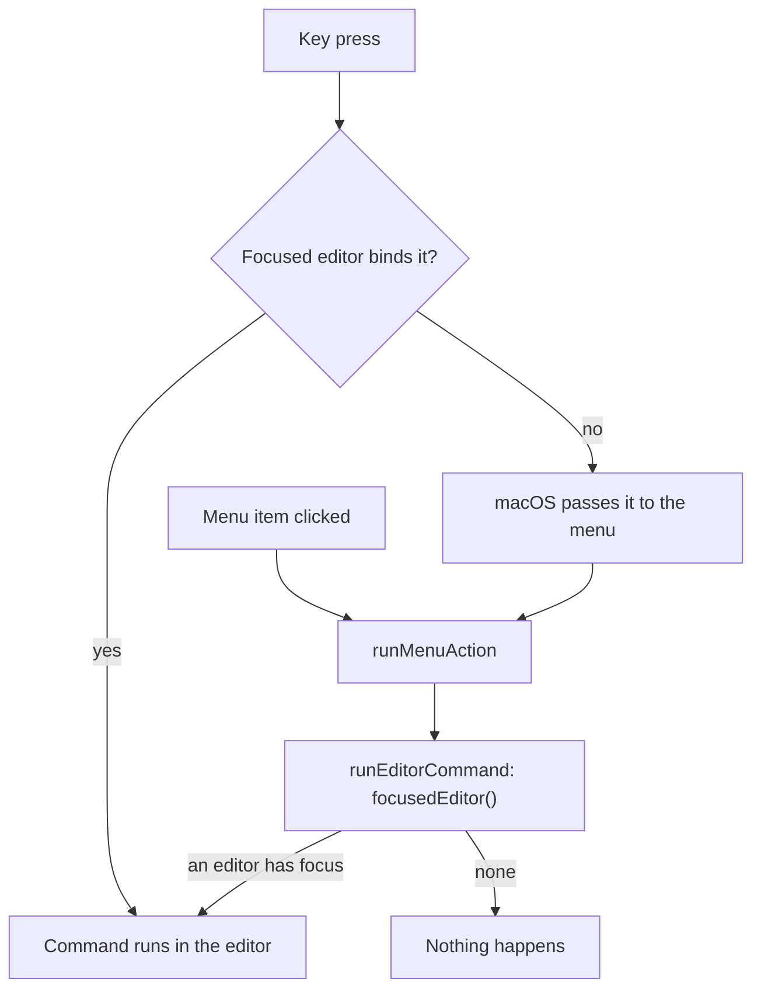

# How editing code works

This chapter covers what happens inside a CodeMirror editor once a file is open: the Edit and Code menu commands and their keys, multiple cursors, Go to Line, and the settings that change how code looks (line spacing, render whitespace, the current line, zoom). Tabs, loading and saving are in [How the editor works](How-the-Editor-Works.md). The user side is in [Editing Code](../usage/Editing-Code.md).

## Why we need it

People move between Git Manager and their IDE all day. If Cmd+/ comments a line there, it must comment a line here too, and the menu bar should list the commands so they can be found. Most users come from JetBrains or VS Code, so the keys follow JetBrains where the two differ, and VS Code where JetBrains has no answer.

## How it works

### One key table for the editor and the menu

`EDITOR_SHORTCUTS` in `src/lib/editor/editorShortcuts.ts` lists every Edit and Code menu command with its key in CodeMirror notation (`Mod-Shift-d`) and where it is bound:

- `default`: CodeMirror's `defaultKeymap` already binds it (Cmd+/, Shift+Cmd+K, Option+Up, Cmd+]).
- `find`: the find bar's `findKeymap` (see [How find and replace works](How-Find-and-Replace-Works.md)).
- `code`: our own `codeKeymap` in `editorCommands.ts`, listed before the default keymap so Shift+Cmd+U is Toggle Case rather than CodeMirror's Redo Selection.

`menuSpec.ts` builds the Edit and Code menus from the same table with `acceleratorFor`, so a menu always shows the key the editor really binds.

macOS gives a key to the web view first and only hands it to the menu when the page leaves it alone, so a key and its menu item never both run. A menu click goes through `runMenuAction`, which calls `runEditorCommand`: it finds the CodeMirror view that holds the focus (`focusedEditor`) and runs the entry from `EDITOR_COMMANDS`. Entries marked `inText` need the caret in the text; Find and friends also work from the find bar's fields.

`editorFocus` (`menu/editorFocus.svelte.ts`) follows `focusin` and `focusout` only, so typing costs nothing. `menuState.ts` uses it: the editing commands need a focused, writable editor; folding, Go to Line and Select Next Occurrence only a focused one. The menu routing in general is in [How the menus work](How-the-Menus-Work.md).

### The commands

Most commands are CodeMirror's own (`toggleComment`, `deleteLine`, `moveLineUp`, `foldCode`...). The ones it lacks live in `textCommands.ts` as pure functions from an `EditorState` to a transaction spec, so they are tested without a view:

- `duplicateSelection`: a selection is copied after itself, a caret copies its line below.
- `joinLines`: the break and the indentation around it become one space, none next to a blank line.
- `toggleCase`: upper case when the text has a lower case letter, otherwise lower case; a caret works on its word.
- `sortLines`: the selected lines, or the whole file, by character code so the order never depends on the system language.
- `parseLineTarget` and `lineTargetPosition` for Go to Line, which asks through `dialogs.prompt` ("Line[:column]") and checks that the editor still exists when the dialog closes.

`baseExtensions` in `setup.ts` turns on `allowMultipleSelections` and makes Option+Shift+click add a cursor (`clickAddsSelectionRange`), so Cmd+D and Select All Occurrences can leave many carets.

### How code looks

**Line spacing.** `settings.editorLineHeight` (default 1.55, from 1.0 to 2.5) is validated by `pickNumber` and rounded in `settingsData.ts`. `applyAppearance` writes it to `--code-line-height` on the root element, and `editorTheme` reads it for `.cm-scroller`. Every editor, diff side and merge pane uses `editorTheme`, and Markdown code blocks read the same variable, so one CSS variable changes them all without rebuilding a view.

**Render whitespace.** `whitespace.ts` has a pure part and a view part. `whitespaceRuns(text, mode)` finds the stretches of spaces and the tabs one line draws for a mode (`none`, `boundary`, `selection`, `trailing`, `all`), and `clipRuns` cuts them to the selection. A ViewPlugin decorates only `view.visibleRanges` with mark decorations: a dotted background for spaces and a drawn arrow for tabs. The text itself never changes, so copying gives real spaces. With `none` the extension adds nothing at all.

The mode sits in a `Compartment`. A tiny ViewPlugin registers every live view in a `Set`, and `App.svelte` calls `setRenderWhitespace` from an effect when the setting changes, which reconfigures the compartment in each registered view. Open editors follow at once, unlike Tab size, which is read when an editor is created.

**The current line.** `activeLine.ts` replaces CodeMirror's `highlightActiveLine` with `highlightActiveLineWhenEmpty`: the cursor lines get `cm-activeLine` only while every selection range is empty. Read-only panes have no current line highlight. Why this matters is in the bug below.

**Zoom and ligatures.** Ctrl or Cmd plus the mouse wheel zooms, only over a `.cm-editor`: `App.svelte` listens and asks a `WheelZoom` (`src/lib/editor/wheelZoom.ts`) for the next size. View > Zoom In and Zoom Out call `steppedFontSize` from the same module through `menuActions.ts`. Font ligatures are a `data-ligatures` root attribute set by `applyAppearance` and styled in `src/app.css`.

## Where the code lives

| File | What it does |
| --- | --- |
| `src/lib/editor/editorShortcuts.ts` | The key of every Edit and Code command, `acceleratorFor` |
| `src/lib/editor/editorCommands.ts` | `EDITOR_COMMANDS`, `codeKeymap`, `focusedEditor`, `runEditorCommand`, Go to Line |
| `src/lib/editor/textCommands.ts` | Duplicate, Join Lines, Toggle Case, Sort Lines, line targets |
| `src/lib/editor/whitespace.ts` | Render whitespace |
| `src/lib/editor/cursor.ts` | The cursor settings, see [How the Cursor Works](How-the-Cursor-Works.md) |
| `src/lib/editor/activeLine.ts` | The current line highlight |
| `src/lib/editor/setup.ts` | `editorTheme` and `baseExtensions` |
| `src/lib/editor/wheelZoom.ts` | Wheel zoom steps and `steppedFontSize` |
| `src/lib/menu/menuSpec.ts`, `menuActions.ts`, `menuState.ts` | The Edit and Code menus, their routing and enabling |
| `src/lib/menu/editorFocus.svelte.ts` | Which editor has the focus |
| `src/lib/stores/settingsData.ts` | `editorLineHeight`, `renderWhitespace` and their checks |

## Design decisions

**One table, two users.** The editor keymaps and the menu accelerators come from `EDITOR_SHORTCUTS`, and a test checks that each key is bound to the menu item's own command. A menu can never show a key that does something else.

**JetBrains keys where they clash.** Cmd+D adds the next occurrence, as in VS Code, so Duplicate takes Shift+Cmd+D. Cmd+L is Go to Line, as in JetBrains (CodeMirror's select line is Ctrl+L on macOS and stays). The fold keys use Option+Cmd+] and [ because Cmd+= and Cmd+- stay with zoom.

**Selection by default.** Drawing every space is noisy, and drawing none hides trailing spaces. VS Code's default, dots only inside the selection, shows them exactly when you look.

**Only visible lines.** Decorating the whole document would cost memory on big files. The plugin rebuilds on scroll, edits and, in Selection mode, selection changes.

## Tests

- `src/lib/editor/editorShortcuts.test.ts`: accelerators, every key bound to its command, no key used twice.
- `src/lib/editor/textCommands.test.ts`: Duplicate, Join Lines, Toggle Case, Sort Lines and Go to Line input.
- `src/lib/editor/whitespace.test.ts`: the runs of each mode and clipping to selections.
- `src/lib/editor/activeLine.test.ts`: the highlight shows only without a selection.
- `src/lib/menu/menuSpec.test.ts` and `menuState.test.ts`: the menu items, keys and enabled states.
- `src/lib/stores/settingsData.test.ts` and `src/lib/editor/wheelZoom.test.ts`: setting checks and zoom steps.

## Keeping this page in sync

- A new editor command: add it to `EditorAction`, `EDITOR_SHORTCUTS`, `EDITOR_COMMANDS` and the Code menu, then update [Editing Code](../usage/Editing-Code.md) and [Keyboard Shortcuts](../usage/Keyboard-Shortcuts.md).
- A new look setting: follow `--code-line-height` (a CSS variable) or `renderWhitespace` (a compartment), and update [Settings](../usage/Settings.md) and [Settings Reference](Settings-Reference.md).
- Retake `editor-whitespace.png` when whitespace drawing changes.

## Bugs we fixed

The selection hidden by the current line highlight is recorded in [How the editor works](How-the-Editor-Works.md#bugs-we-fixed).
