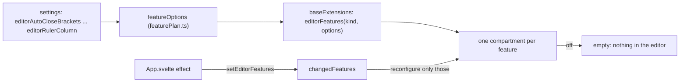
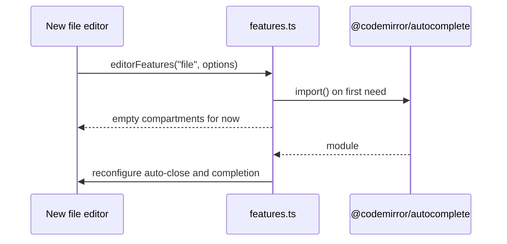

# How Editor Features Work

The editor has the IDE features people expect from JetBrains and VS Code: auto-close brackets, code completion, fold arrows, indent guides, the word at the cursor highlighted, scrolling past the end, column selection and a right margin line. Each one has a switch in Settings. This page also covers the languages the editor colors. The user side is in [Editing Code](../usage/Editing-Code.md#ide-features).

## Why we need it

Without these features the editor feels like a text box. But memory is a feature of this app, so every one of them can be turned off, and a feature that is off must cost nothing: no extension in any editor, no state, and for the biggest one no code loaded at all.

## How it works

`src/lib/editor/features.ts` gives every feature its own CodeMirror compartment (a slot in an editor's configuration that can be swapped later). `baseExtensions` in `setup.ts` adds them to every editor with `editorFeatures(kind, featureOptions(settings))`.

- **Kinds.** An editor is a `file` editor, a `diff` side or a `merge` pane. `baseExtensions` takes a `kind`; editable panes default to `file` and read-only ones to `diff`, and `MergeEditor.svelte` passes `merge`. `FEATURE_KINDS` in `featurePlan.ts` says where each feature applies.
- **Live changes.** A registry plugin remembers every open editor and a facet stores its kind, like `cursor.ts` and `whitespace.ts`. The effect in `App.svelte` calls `setEditorFeatures` with the new options. `changedFeatures` compares them with the last ones, so turning off fold arrows reconfigures only that compartment and the completion state of the others stays.
- **Lazy code.** Auto-close and completion come from `@codemirror/autocomplete`, about 38 KB. Nothing imports it statically. The first time an editor needs one of the two, `loadAutocomplete` imports it, and once it arrives both compartments are reconfigured in every open editor. Until then the compartments are empty. The other features use code that the editor already loads, so they only need the compartment.

### The features

| Feature | Extension | Kinds |
| --- | --- | --- |
| Auto-close brackets | `closeBrackets` and its Backspace keymap | file |
| Code completion | `autocompletion`, a word source and our keymap | file |
| Fold arrows | `foldGutter` with our chevron markers, at low precedence so it sits next to the text | file |
| Indent guides | `indentGuides.ts`, a layer | all |
| Word at the cursor | `highlightSelectionMatches({ highlightWordAroundCursor: true })` | all |
| Scroll past the end | `scrollPastEnd` | file |
| Column selection | `rectangularSelection` with Option, `crosshairCursor` | all |
| Right margin line | `ruler.ts`, a layer | all |

- **Completion.** The language packages bring their own sources (JavaScript keywords and local names, CSS properties, HTML tags) through language data. A word source adds the words of the file through `completeAnyWord`, which scans near the cursor and caches per document. Words have no type, so a word that is also a keyword is listed once. In Markdown and plain text the word source only answers Ctrl+Space (`wordsWhileTyping`). Our keymap is CodeMirror's minus Option+backtick and Option+I, which type characters on a Mac, plus Tab to accept. The popup is themed with tokens and letter badges like JetBrains.
- **Indent guides.** `guideLevels` counts the indent levels of the lines on screen; a blank line takes them from the code around it, like VS Code. `guideRuns` joins touching lines into one run per level, and each run is one `RectangleMarker` in a layer above the text. A wrapped line gets guides on its first row only, because CodeMirror starts the later rows at column 0.
- **Margin line.** One marker at `column * defaultCharacterWidth` from the start of the text. `layerGeometry.ts` finds that start for both layers.
- **Word highlight off** keeps plain `highlightSelectionMatches()`, so a selection still marks its other matches, as before.
- **Column selection.** Option+drag selects a rectangle. Option+Shift+click keeps adding a cursor through `clickAddsSelectionRange`, because the rectangle filter skips Shift.

### Languages

`src/lib/editor/languages.ts` maps a file to a display name (`languageName`) and a grammar (`grammarFor`), by special file name (Dockerfile, Gemfile) or extension. `languageFor` imports only that grammar. Go, Java, XML and C/C++ use the official `@codemirror/lang-*` packages. Kotlin, C#, Swift, Ruby, shell, TOML and Dockerfile use `@codemirror/legacy-modes`, one mode file each, wrapped in `LanguageSupport` so the Markdown preview can use the parser for fenced code too (`markdown/highlight.ts` maps the fence names).

## Where the code lives

| File | What it does |
| --- | --- |
| `src/lib/editor/featurePlan.ts` | Kinds, `FEATURE_KINDS`, `featureOptions`, `changedFeatures`, `wordsWhileTyping` (pure) |
| `src/lib/editor/features.ts` | Compartments, registry, lazy autocomplete, themes, `editorFeatures`, `setEditorFeatures` |
| `src/lib/editor/indentGuides.ts` | Guide levels, runs and the layer |
| `src/lib/editor/ruler.ts`, `layerGeometry.ts` | The margin line and the text origin |
| `src/lib/editor/languages.ts` | Names, grammars and lazy imports |
| `src/lib/stores/settingsData.ts` | The nine keys and `pickRulerColumn` |
| `src/lib/views/SettingsDialog.svelte` | The Editing features group |

## Design decisions

**One compartment per feature.** One shared compartment would rebuild every feature when one switch changes, dropping an open completion or a fold.

**Typing aids only in the file editor.** The merge tool's result pane is editable, but its text mostly comes from choosing sides; brackets and completion would get in the way.

**No folding or scrolling past the end in diffs and the merge tool.** A diff side lives in one shared scroller with its partner, and the merge panes are scrolled together. Folding one pane or padding its end would move its lines against the others.

**Layers for guides and the margin line.** Line backgrounds are already used by the active line and by diff and merge chunks, which would hide guides drawn as a line background. A layer above the text is never covered, and the guides only cross indentation, which is blank.

**JetBrains defaults.** All features start on except the margin line; turning it on picks column 120. Line spacing 1.25, 13 px and JetBrains Mono (falling back to Menlo) match JetBrains. Saved settings keep their values, because the store writes every key.

## Tests

- `featurePlan.test.ts`: defaults, kinds, the margin column, which changes rebuild what, words while typing.
- `indentGuides.test.ts`: indentation with tabs, levels, blank lines, runs and wrapped lines.
- `ruler.test.ts`, `languageName.test.ts` (names, grammars, lazy loading), `settingsData.test.ts` (keys and `pickRulerColumn`).

The look of the popup, the fold arrows and the guides needs a visual check in the app.

## Keeping this page in sync

- Update this page, [Editing Code](../usage/Editing-Code.md#ide-features), [Settings](../usage/Settings.md#editor) and [Settings Reference](Settings-Reference.md) when a feature, key or default changes.
- A new language needs entries in `languages.ts`, a test case, and its fence names in `markdown/highlight.ts`.

## Bugs we fixed

None yet.
