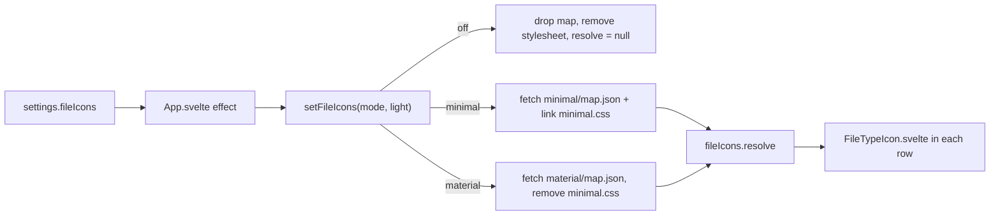

# How file icons work

This chapter explains how the three levels of file icons are loaded, matched and drawn, and how switching levels keeps only one icon set in memory. The user side is in [File Icons](../usage/File-Icons.md).

## Why we need it

PhpStorm and VS Code show an icon for each file type, and the user asked for the same in the Files panel and the file lists. Memory is a feature of Git Manager (see [Architecture](Architecture.md)), so the icons had to cost nothing when they are off, and only one set may be in memory at a time. That is why the setting has three levels instead of a switch: **No icons**, **Minimal** (simple shapes colored by theme tokens) and **Material Icons** (the colored icons of Material Icon Theme).

## How it works

### Icon sets are static files, not code

A JavaScript module that the app imports stays in the module cache until the app restarts. So neither icon set is code. Each set is a folder in `static/file-icons/`, served next to the app:

| Folder | Files |
| --- | --- |
| `minimal/` | `map.json` (file type map), `minimal.css` (one rule per glyph and color), one SVG per glyph |
| `material/` | `map.json`, about 630 SVGs, the MIT `LICENSE` of Material Icon Theme |

The only icon code in the app bundle is the matcher `iconMatch.ts` and the store `fileIcons.svelte.ts`, a few hundred bytes.

### Loading and dropping a set

`setFileIcons(mode, light)` in `src/lib/fileIcons/fileIcons.svelte.ts` runs whenever the setting or the light or dark mode changes:

- **off**: forgets the map, removes the `<link id="gm-file-icons-minimal">` stylesheet and sets `fileIcons.resolve` to null.
- **minimal** or **material**: if another set was loaded, it is forgotten first, so two sets are never in memory together. Then the map is fetched with `cache: "no-store"`, so the resolver is the only thing holding it, and `minimal.css` is linked or removed.
- A theme change keeps the loaded map and only builds a new resolver, because Material has light variants.
- A `generation` counter drops the result of a slow fetch when the user already picked another level.

`fileIcons.resolve` is `$state.raw`, so every row redraws when it changes and nothing else is tracked.

### Matching a file name

`iconFor(map, fileName, light)` in `iconMatch.ts` follows VS Code: the whole name in lowercase first (`names`, or `lightNames` in a light theme), then every extension from the longest (`app.spec.ts` tries `spec.ts`, then `ts`), and `map.file` when nothing matches. Lookups use `Object.hasOwn`, so a file called `constructor` never reads `Object.prototype`. `normalizeIconMap` defaults every part of a fetched map, so a damaged file gives plain icons instead of errors.

### Drawing a row

`FileTypeIcon.svelte` takes a file name or path and a `plain` flag:

- **Minimal**: one empty ``. `minimal.css` sets the glyph SVG as a CSS mask and the color as `background-color: var(--term-blue)`. The colors are tokens from `src/app.css`, so the icons follow every color theme. A long list holds no SVG nodes, and the web view decodes each glyph once.
- **Material Icons**: one ``. The web view loads a picture the first time a row shows it and shares it between all rows of that type.
- **No icons**: the Files panel (`plain`) shows the old plain `file` icon; the Changes list and commit file lists show nothing, as before.

Icon names are checked against `[a-z0-9_.-]` before they go into a URL or a class.

### Where the files come from

`scripts/file-icons.ts` writes both folders:

- Minimal comes from `src/lib/fileIcons/minimalSource.ts`: the glyph paths, the tones (each one a color token) and the type tables. Only the script and the tests import it.
- Material comes from the `material-icon-theme` package (a dev dependency). The script keeps the file extension and file name tables in lowercase and copies only the SVGs they use.

The output is committed, so a build needs nothing from `node_modules`. `bun scripts/file-icons.ts --check` fails when the folders are out of date; CI runs it.

The CSP in `tauri.conf.json` has `'self'` in `connect-src` so the app may fetch its own `map.json` files.

## Where the code lives

| File | What it does |
| --- | --- |
| `src/lib/fileIcons/fileIcons.svelte.ts` | `setFileIcons`, the store, fetching and dropping sets |
| `src/lib/fileIcons/iconMatch.ts` | `iconFor`, `normalizeIconMap` |
| `src/lib/fileIcons/FileTypeIcon.svelte` | One row's icon |
| `src/lib/fileIcons/minimalSource.ts` | The Minimal set as source (build time only) |
| `scripts/file-icons.ts` | Writes and checks `static/file-icons/` |
| `src/lib/stores/settingsData.ts` | `fileIcons`, `FILE_ICON_CHOICES` |
| `src/lib/menu/menuSpec.ts`, `menuState.ts`, `menuActions.ts` | View > File Icons |
| `src/lib/views/files/FileExplorer.svelte`, `views/changes/FileRow.svelte`, `log/CommitDetails.svelte` | The lists that show icons |

## Design decisions

**Three levels, off by default.** Material Icons is the nicest but the largest. Minimal gives most of the help (code, data, images, lock files at a glance) for a fraction of it, and No icons keeps the old cost of zero.

**Fetch, not import.** An imported module cannot be unloaded. A fetched map is ordinary data that the garbage collector frees when the resolver is replaced, and a removed stylesheet frees its rules.

**Material Icon Theme for the real icons.** It is MIT licensed, covers over 1,000 types and ships a type map we can reuse. JetBrains' own icons are not published with such a map.

**Masks for Minimal, images for Material.** Minimal glyphs are one color, so a mask lets theme tokens color them. Material icons have their own colors, so they are plain images.

## Tests

- `iconMatch.test.ts`: name before extension, the longest extension, light variants, fallbacks, prototype keys, damaged maps, the common Material and Minimal types, and that every Material icon in the map has its SVG.
- `minimalSource.test.ts`: the committed `minimal/` folder matches the source, every map value is a known glyph and tone, and every tone is a token in `app.css`.
- `settingsData.test.ts` and `menuState.test.ts`: the setting and the View menu ticks.

The memory of each level was measured in the real app with `git-manager cli memory` and `run_menu_command` on a repository with 2,400 changed files, three rounds of No icons, Minimal and Material Icons: Minimal added 2 to 10 MB of web content memory and Material Icons 10 to 15 MB more. Most of it is the extra row element per file in the Changes list and the decoded pictures. See [How Memory Is Measured](How-Memory-Is-Measured.md).

## Keeping in sync

- New Minimal type or glyph: edit `minimalSource.ts`, run `bun scripts/file-icons.ts`, commit `static/file-icons/minimal`.
- Newer Material Icon Theme: update the dev dependency, run the script, commit `static/file-icons/material`.
- A new list that shows files: use `<FileTypeIcon fileName={...} plain={false} />`.
