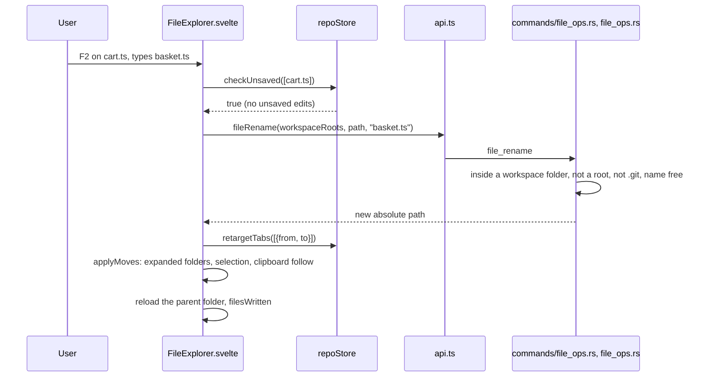
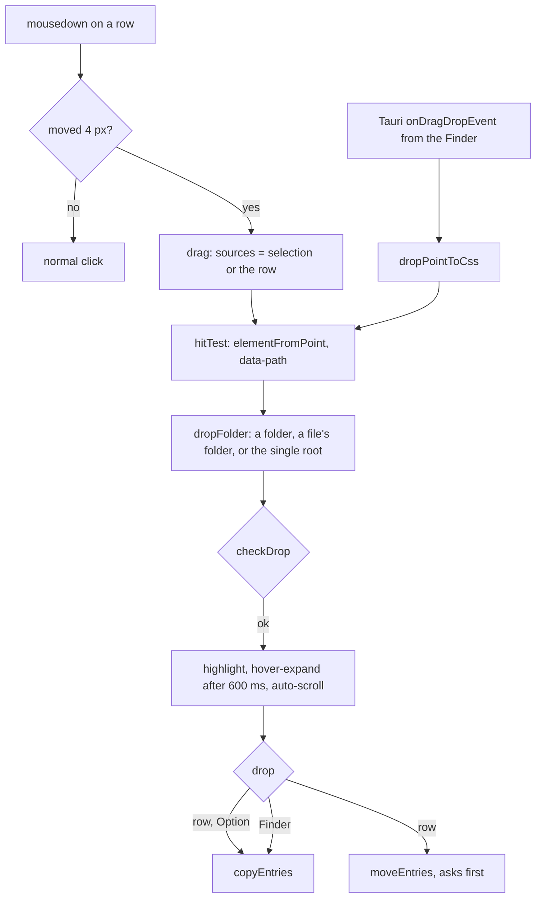

# How File Operations Work

New File, New Folder, Cut, Copy, Paste, Duplicate, Rename, Move to Trash and drag and drop in the Files panel. The user side is in [File Operations](../usage/File-Operations.md); the tree itself is in [How the Files panel works](How-the-Files-Panel-Works.md).

## Why we need it

People coming from VS Code or a JetBrains IDE expect to manage files where they browse them. Without it they switch to the Finder or a terminal for every rename, and the app then has to guess what happened to their open tabs.

## How it works

Every operation follows the same steps:

1. **Pick the targets.** `selectedEntries()` gives the visible selected rows, top down. `topLevel` (`selection.ts`) drops rows inside another selected folder, and `movableTargets` (`fileOps.ts`) drops workspace roots and deleted rows.
2. **Guard unsaved edits.** Rename, move and trash call `repoStore.checkUnsaved(paths)`. It uses `fileTabsUnder` (`tabs.ts`) to find dirty tabs of those files or of files inside those folders, and shows "Save or revert cart.ts first".
3. **Ask.** Names come from `dialogs.prompt` with `validate: nameProblem` (`fileNames.ts`). Rename passes `selection: renameSelection(name, isDir)`, which `DialogHost.svelte` applies with `setSelectionRange`. Trash asks with `dialogs.confirm({ danger: true })`; a drag and drop move asks while the `confirmDragAndDrop` setting is on. Before that question, `moveClash` (`dragDrop.ts`) refuses a move onto a taken name, using the folder's listing (or a fresh one for a closed folder).
4. **Write.** The `fileCreate`, `fileRename`, `fileCopy`, `fileMove` and `fileTrash` wrappers in `api.ts` take absolute paths plus the workspace roots. The backend checks every path again; see [Commands: app and tools](Commands-App-and-Tools.md#files).
5. **Follow up.** `applyMoves` re-points the tabs (`repoStore.retargetTabs`, which uses `retargetTabs` in `tabs.ts`), the clipboard, the expanded folders and the selection with `movedPath` (`workspacePaths.ts`). After a trash, `repoStore.closeTabsUnder` closes the tabs. `showEntries` opens the folders down to new entries and selects them. `afterWrite` reloads the touched folders at once and calls `repoStore.filesWritten`, so git status and the tree refresh without waiting for the watcher.

### Selection, menu and keys

`selection.ts` holds the multi-selection: `paths`, the Shift `anchor` and the keyboard `focus`. `selectRange` and `extendSelection` use `order`, the visible rows. The effect that follows the open tab only replaces the selection when the open file is not already in it, so a moved group stays selected while its tabs re-point.

`fileOpGroups` decides the menu: everything for one row, New File, New Folder and Paste for a workspace root, Cut, Copy, Paste, Move to Trash and Copy Paths for several rows. `fileKeyOp` maps key presses to the same operations, with Cmd on macOS and Ctrl elsewhere. The tree's `onKeydown` calls `preventDefault`, so the native Edit menu's Cut, Copy and Paste do not run too (see [Menu keys and routing](Menu-Keys-and-Routing.md)).

The clipboard (`fileClipboard.svelte.ts`) holds only a mode and paths. It outlives the panel being hidden, like VS Code's, and follows moves and trashes.

### Drag and drop

Rows drag with mouse events, not HTML5 drag and drop. Tauri's window takes native drags to report Finder files, and its macOS handler answers every native drag itself, so HTML5 drop events may never reach the page. Mouse events always do, and give us Option for copy, Escape to cancel and the pointer label for free. Window listeners are added on mousedown and removed when the drag ends; a `requestAnimationFrame` loop runs only while something is dragged over the list, for auto-scroll and the target.

Finder drops come from `getCurrentWebview().onDragDropEvent`, registered in `onMount` and removed on destroy. `dropPointToCss` turns the position into CSS pixels: wry reports macOS positions in points already, and other platforms in device pixels.

### AI agents and the CLI

The MCP UI tools `create_file`, `create_folder`, `rename_path`, `copy_paths`, `move_paths` and `trash_paths` (see [How MCP and the CLI work](How-MCP-and-CLI-Work.md)) live in `src/lib/mcp/fileTools.ts`. They take the same steps without the dialogs: `folderFor` refuses paths outside the workspace folders, `topLevel` and `checkDrop` pick and check the sources, `unsavedProblem` (built on `fileTabsUnder`) returns the panel's "Save or revert cart.ts first" as the tool's error, and after the write they call `repoStore.retargetTabs` or `closeTabsUnder`, the clipboard's `follow` or `forget`, and `repoStore.filesWritten`. The tree reloads through the `workspaceVersion` effect. `handlers.ts` passes the real `api` and stores in as `FileToolDeps`, so `fileTools.test.ts` checks every step with fakes. The panel could later call these functions too.

## Where the code lives

| File | What it does |
| --- | --- |
| `src/lib/views/files/FileExplorer.svelte` | Clicks, keys, menus, dialogs, drag and drop, calling the backend |
| `src/lib/views/files/selection.ts` | Multi-selection, `topLevel`, `rowAfterRemoval` |
| `src/lib/views/files/fileOps.ts` | Menu groups, labels, `targetFolder`, `fileKeyOp` |
| `src/lib/views/files/fileNames.ts` | `nameProblem`, `renameSelection` |
| `src/lib/views/files/dragDrop.ts` | `dropFolder`, `checkDrop`, `autoScrollStep`, `dropPointToCss` |
| `src/lib/views/files/fileClipboard.svelte.ts` | The internal clipboard |
| `src/lib/stores/tabs.ts`, `repo.svelte.ts` | `retargetTabs`, `fileTabsUnder`, `checkUnsaved`, `closeTabsUnder` |
| `src/lib/stores/workspacePaths.ts` | `movedPath`, `pathsUnder` |
| `src/lib/ui/DialogHost.svelte` | The prompt's initial `selection` |
| `src-tauri/src/file_ops.rs`, `commands/file_ops.rs` | The checked file system writes and the Trash |

## Design decisions

**Plain file system writes, not git.** `git mv` only works for tracked files and fails across repositories. Git finds renames itself when the change is staged.

**Refuse unsaved edits instead of moving them.** Saving first could write to the old path or overwrite the other side; asking to save or revert is honest and simple.

**Never overwrite.** A taken name stops the operation before anything moves; a copy gets VS Code's copy name.

**Roots stay put.** Workspace folders are what the workspace is made of, so they only take new files and pastes.

**A tab re-points, it does not reopen.** It keeps its place and preview state; the editor reloads from the new path.

**Copy from the Finder, never move.** Taking files away from the Finder by surprise would be worse than an extra copy.

## Tests

- `src/lib/views/files/selection.test.ts`: clicks, Cmd and Shift ranges, Shift+arrows, `topLevel`, re-pointing and the row after a trash.
- `src/lib/views/files/fileOps.test.ts`: menu groups per selection, targets and every key per platform.
- `src/lib/views/files/fileNames.test.ts`: name checks and the rename selection.
- `src/lib/views/files/dragDrop.test.ts`: drop folders, refusals, taken names, the drag threshold, auto-scroll steps and Finder positions.
- `src/lib/stores/tabs.test.ts` and `workspacePaths.test.ts`: `retargetTabs`, `fileTabsUnder`, `movedPath`, `pathsUnder`.
- `src/lib/help/shortcuts.test.ts`: the Files panel keys in the shortcuts window.
- `src/lib/mcp/fileTools.test.ts`: the MCP file tools, with refusals, tab and clipboard follow-ups and refreshes.
- The backend: unit tests in `src-tauri/src/file_ops.rs` and command tests with real temporary folders in `src-tauri/src/commands/tests.rs`.

Dragging, Finder drops, the menus and focus after a dialog need a check in the real app. See [Testing](Testing.md).

## Keeping this page in sync

- A new operation goes in `fileOpGroups`, `FILE_OP_LABELS` and, with a key, `fileKeyOp`, `fileOpAccelerator` and the Files panel section of `src/lib/help/shortcuts.ts`.
- A change to what an operation checks or follows up should reach `src/lib/mcp/fileTools.ts` too.
- Update [File Operations](../usage/File-Operations.md), [Keyboard Shortcuts](../usage/Keyboard-Shortcuts.md) and retake `file-ops-menu.png` and `file-ops-rename.png` when the menu or the dialogs change.

## Bugs we fixed

**A move onto a taken name asked first, then failed.**
- **The issue:** dragging `cart.ts` onto a folder that already had a `cart.ts` asked "Move cart.ts into docs?", and only after Move showed "cart.ts already exists".
- **Why it happened:** only the backend checked names, and it runs after the question.
- **The fix and why we chose it:** `moveEntries` checks the names with `moveClash` before asking, case-insensitively on macOS and Windows like their file systems. The backend still checks, since the folder can change in between.
