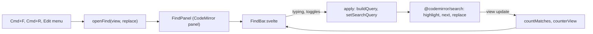
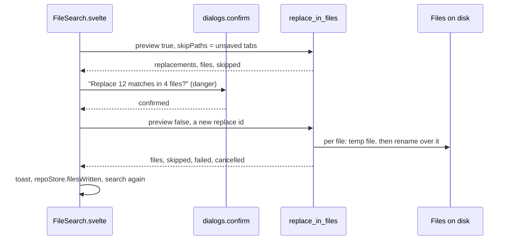

# How find and replace works

There are two tools: the find and replace bar inside every CodeMirror editor, and Replace in Files, which writes many files on disk from the Text tab of Search Everywhere. The user side is in [Find and Replace](../usage/Find-and-Replace.md).

## Why we need it

CodeMirror's own search panel has no match counter, no Exclude and no Select All Occurrences button, and does not match the app. People coming from JetBrains expect Cmd+R, Option+C, W and X and a "3/12" counter. Replace in Files renames a word across a project without leaving the app.

## How it works

### The find bar

`findBar()` in `src/lib/editor/findPanel.svelte.ts` is part of `baseExtensions`, so every editor, diff side and merge pane has it. It keeps `@codemirror/search` for matching, highlighting, Next, Previous and Replace, and swaps only the panel: `search({ createPanel })` builds a `FindPanel`, which mounts `FindBar.svelte` into the panel element with Svelte's `mount`.

`FindBarState` holds the fields with runes; the panel writes it and the component reads it, and the panel's `update` follows the editor's query.

- **Opening.** `openFind` seeds the field with the selection when it is one line of at most 500 characters (`selectionQuery`, escaped when Regex is on). Cmd+F while the bar has focus only selects the field.
- **Typing** dispatches `setSearchQuery` and selects the first match after `anchor`, where the caret was before the search moved it (the jump's user event `select.search.typing` leaves the anchor alone).
- **The query** comes from `buildQuery` in `findModel.ts`. Without Regex it is `literal`, so a typed `\n` stays two characters. With Regex the replacement understands `$1`, `$&` and `\n`.
- **Counting.** `countMatches` walks the matches up to `COUNT_CAP` (10,000) and finds the selected one; `counterView` turns that into "3/12", "12 results", "0 results" or "Invalid regex". Documents over 200,000 characters count 120 ms after the last change instead of on every key.
- **Exclude** adds the selected match to `excludedField`, a StateField of ranges mapped through edits. Every query gets the same test function, `notExcluded`, because CodeMirror compares a query's test by identity. Changing the search or closing the bar clears the exclusions.
- **Select All Occurrences** uses `selectMatches` while the bar is open, otherwise `occurrenceRanges` (the selection, or the whole word at the caret, case-sensitive), up to `SELECT_CAP` (1,000).
- **Keys.** `findKeymap` replaces CodeMirror's `searchKeymap` with the same keys plus Cmd+R and Ctrl+Cmd+G. Keys pressed in the bar's fields that the bar does not handle go through `runScopeHandlers(view, event, "search-panel")`, so Cmd+G and the merge tool's Cmd+Enter work from the fields.

Read-only editors get the find row only. In a diff, both sides share one scroller, so `DiffView.svelte` gives each side `panels({ topContainer })` with a host above the diff; a bar inside the editor would scroll away and push its side out of line.

The Edit menu items (Find, Replace, Find Next, Find Previous, Select All Occurrences) take their keys from `EDITOR_SHORTCUTS` with `source: "find"`. The editor sees a key before the menu, so a key never runs twice. See [How editing code works](How-Editing-Code-Works.md).

### Replace in Files

The Replace field is part of the Text tab in `FileSearch.svelte`. A replace is always two calls: a preview that only counts, then the write.

`src-tauri/src/text_search/replace.rs` reuses `build_matcher` from the text search, so a replace changes exactly what the Text tab showed. The replacement compiles once into a `Template` (`$1` groups, `$&`, `$$` and the escapes of `unquote`, the editor's rules). For each file it searches, builds the new bytes, and writes them with `write_atomic`: a temporary file next to the original with the same permissions, synced, then renamed over it. If the file's size or modified time changed since it was read, the write is refused and the file is reported as failed.

Files in `skipPaths` (open tabs with unsaved edits), symbolic links and read-only files are never written; they are reported with their match counts. Binary files and files over 5 MB are skipped like the search skips them. A newer `replace_id` or `replace_in_files_cancel` stops between files, so every file is either fully replaced or untouched. The texts of the dialog and the toast come from the pure `replaceModel.ts`.

After a write, `repoStore.filesWritten` refreshes the status of the touched repositories, and clean open tabs reload from disk like after any outside change.

## Where the code lives

| File | What it does |
| --- | --- |
| `src/lib/editor/findPanel.svelte.ts` | The panel, its commands (`openFind`, `closeFind`, `selectAllOccurrences`) and `findKeymap` |
| `src/lib/editor/FindBar.svelte` | The bar's fields and buttons |
| `src/lib/editor/findModel.ts` | `buildQuery`, `selectionQuery`, `countMatches`, `counterView`, `occurrenceRanges` |
| `src/lib/ui/SearchToggles.svelte` | The Cc, W and .\* toggles, shared with the Text tab |
| `src/lib/diff/DiffView.svelte` | Find bar hosts above each diff side |
| `src/lib/search/FileSearch.svelte` | The Replace field, the two-step replace |
| `src/lib/search/replaceModel.ts` | Confirmation and summary texts |
| `src-tauri/src/text_search/replace.rs` | Templates, the replace run, `write_atomic` |
| `src-tauri/src/commands/search.rs` | `replace_in_files`, `replace_in_files_cancel` |

## Design decisions

**Keep CodeMirror's search, replace its panel.** Matching and replace are well tested in `@codemirror/search`; `createPanel` swaps only the UI, without a fork.

**Literal by default.** JetBrains treats the field as plain text unless Regex is on, so `\n` and `$1` mean nothing until you ask for them.

**The editor's Replace All does not ask, Replace in Files does.** Replace All in one file only changes the editor buffer: nothing is saved and Cmd+Z undoes it. Replace in Files writes to disk and has no undo, so it confirms with `danger: true`, as the project rules ask for destructive actions.

**Count first, then write.** The preview gives the dialog exact numbers and the skipped files before anything changes, and the write gets its own id so it can be stopped.

**Skip unsaved files instead of editing their buffers.** Writing the file under an editor with unsaved edits would lose one of the two versions. Skipping and saying so is the safe choice.

**Atomic writes.** Other programs, the watcher and git see the old file or the new one, never half of it.

## Tests

- `src/lib/editor/findModel.test.ts`: query building, regex errors, selection seeding, counting, the counter text, occurrences, the first match after the anchor (the typing jump) and excluded spans.
- `src/lib/editor/editorShortcuts.test.ts`: every Edit and Code menu key is bound by the editor to the same command.
- `src/lib/search/replaceModel.test.ts`: the confirmation, skipped lists and summaries.
- `src-tauri/src/text_search/replace/tests.rs`: literal and regex replaces, group expansion and escapes, invalid regex, preview, skipping unsaved, binary, big, linked and read-only files, keeping the file mode, refusing a changed file, cancelling and the newest id.

The bar itself is Svelte glue: check it by hand in an editor, a diff (both sides) and the merge tool.

## Keeping this page in sync

- A new find key: `findKeymap`, `EDITOR_SHORTCUTS`, the Edit menu, the usage page and [Keyboard Shortcuts](../usage/Keyboard-Shortcuts.md).
- Changing the replacement rules: change `Template` and `buildQuery` together, so one file and many files replace alike.
- Retake `find-replace-bar.png` and `replace-in-files.png` when the bar or the Replace row changes.

## Bugs we fixed

None yet.
