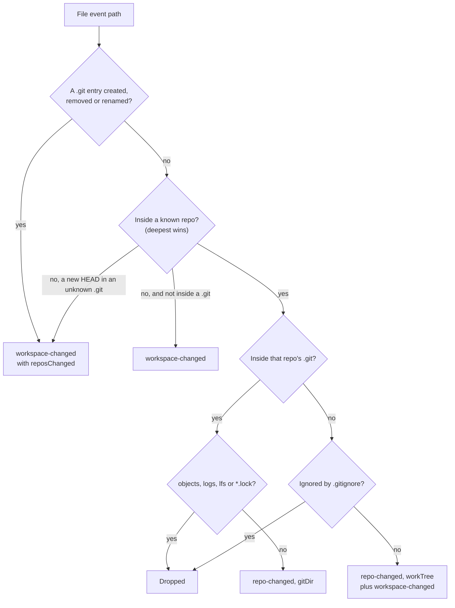

# How Folder Watching Works

Git Manager notices changes on its own: an edit in another editor, a commit in the terminal, a new repository after `git clone`. One file watcher per workspace folder sorts every file event into "this repository changed" or "the folder changed". The rest of the workspace is in [How workspaces work](How-Workspaces-Work.md).

## Why we need it

- **No refresh button hunting.** Changes, the Files panel, the Log and the branch names should follow what happens on disk, like VS Code.
- **No polling.** Asking git for every status every few seconds costs CPU and memory in big workspaces. The operating system's file events are free until something changes.
- **Only the right repository refreshes.** In a folder with fifty repositories, an edit in one must not reread the other forty-nine.

## How it works

`watcher::watch` puts one debounced (300 ms) recursive watcher on a folder, plus the `.git` of an enclosing repository outside it and the git folders that linked worktrees and absorbed submodules point to. Each batch goes through the pure function `attribute`:

Other paths inside an unknown `.git` are dropped. Removing or moving a folder that holds a known repository, or moving in a folder with a `.git` (`has_git_entry`), also sets `reposChanged`. A changed submodule also refreshes its parent repository (`with_submodule_parents`), since the parent's status shows it. Batches that add, remove or rename files mark the Go to File index stale, and edits to source files mark the symbol index, so search stays current (see [How Search Everywhere works](How-Search-Everywhere-Works.md)).

In the store, `repo-changed` calls `refreshRepo`. `workspace-changed` reloads the Files panel, and with `reposChanged` the store runs a quiet `rescan` one second later (`RESCAN_DELAY_MS`). That changes nothing unless the list of repositories changed; then it rewatches, refreshes and shows "Found repository NAME" (or "Found N new repositories"). Scan for Repositories (`rediscover`) still works too.

### Starting and stopping

`watch_workspace` and `unwatch_workspace` are `async` commands. They build and drop watchers through `commands::blocking`, because a Tauri command without `async` runs on the main thread, and dropping a watcher waits for its threads. Watchers live in `AppState.watchers`, keyed by folder root.

The watcher type is `Debouncer<RecommendedWatcher, NoCache>` (`state.rs`). The default file id cache walks every file under the folder when watching starts and keeps all their paths in memory. It is only needed to pair renames, and the watcher only asks which repository changed.

## Where the code lives

| File | What it does |
| --- | --- |
| `src-tauri/src/watcher.rs` | `watch`, `attribute`, `has_git_entry`, linked git folders, submodule parents |
| `src-tauri/src/state.rs` | `RepoWatcher` (with `NoCache`) and the `watchers` map |
| `src-tauri/src/commands/workspace.rs` | `watch_workspace`, `unwatch_workspace`, `stop_watcher` |
| `src/lib/stores/repo.svelte.ts` | `watchAll`, `refreshRepo`, `scheduleRescan`, `rescan` |

## Design decisions

**Sort events in a pure function.** `attribute` takes paths and two small lookups, so every case is tested without a real watcher.

**Drop git's noise.** Objects, logs, LFS files and lock files change on every git command and never change what the UI shows.

**Rescan only on a hint.** A rescan of a big folder is costly, so it runs only when a `.git` appeared, vanished or moved, once the burst settles.

**No file id cache.** Pairing renames is not worth a walk of every file and a copy of every path in memory.

## Bugs we fixed

**Adding a second folder stopped watching the first.**
- **The issue:** only the newest folder refreshed on its own.
- **Why it happened:** `watch_workspace` still called `watchers.clear()`.
- **The fix and why we chose it:** watchers are keyed by folder root, so each folder stays independent.

**A new repository only showed up after Scan for Repositories.**
- **The issue:** after `git init` or a clone in an open folder from outside the app, the repository did not appear.
- **Why it happened:** a new `.git` only reloaded the Files panel, and changes inside an unknown `.git` were dropped.
- **The fix and why we chose it:** `attribute` sets `reposChanged` in the cases above, and the store rescans only then, once the burst settles, doing nothing more if the list is the same.

The freeze when watching a big folder started is in [How workspaces work](How-Workspaces-Work.md#bugs-we-fixed).

## Tests

- `src-tauri/src/watcher.rs`: fifteen tests: `attribute` cases (noise, ignored paths, an enclosing repository, `reposChanged` for new, removed and moved repositories), the search index hints, linked git folders, submodule parents, and `has_git_entry` on a real folder.

Live watchers need a check by hand with `scripts/make-workspace-demo.sh`. See [Testing](Testing.md).

## Keeping this page in sync

- Update this page when `attribute`, the events or the watcher setup change.
- Events are listed in [Commands and Events](Commands-and-Events.md).
