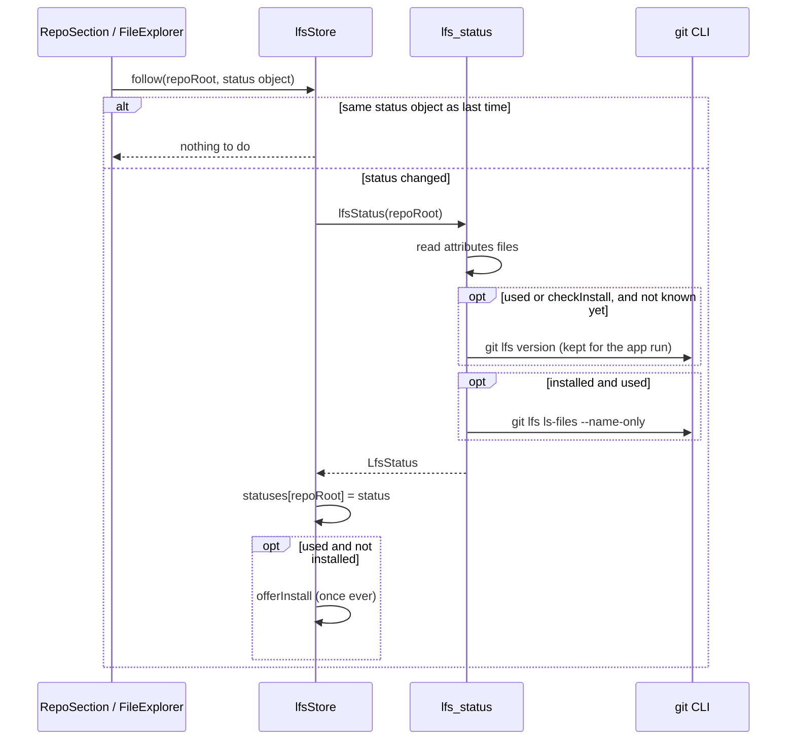
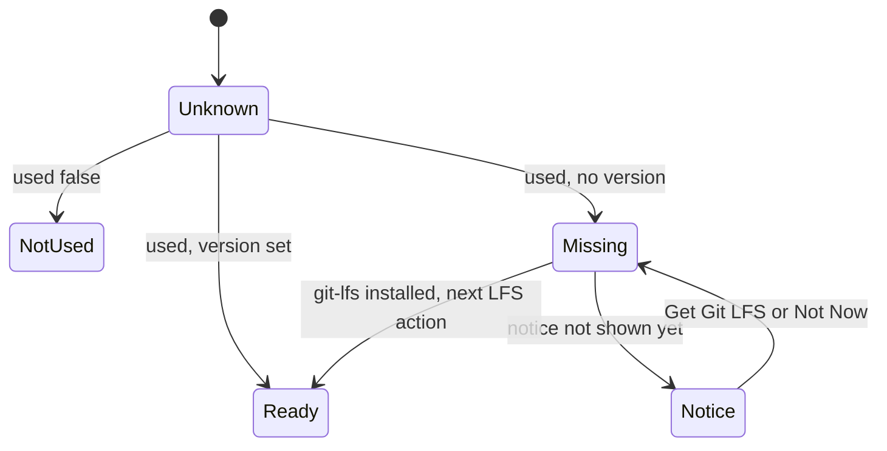

# How Git LFS Works

Git Manager detects Git LFS use per repository, tags LFS files in the Changes sidebar and the Files panel, shows sizes instead of pointer text in diffs, and runs `git lfs` commands through the git CLI. For the user side, see [Git LFS](../usage/Git-LFS.md).

## Why we need it

With LFS, git stores a pointer file for each large file:

```text
version https://git-lfs.github.com/spec/v1
oid sha256:4d7a2146...
size 12345
```

A diff of two pointers is three lines of noise, and when `git-lfs` is not installed the work tree holds only pointers, which looks like broken files. The app must say what is going on, and give the few LFS commands people need, without slowing down repositories that do not use LFS.

## How it works

### Reading the LFS state

`git/lfs.rs` builds an `LfsStatus { version, used, patterns, files }`:

- `used`: some attributes file routes paths through LFS (`filter=lfs`). It reads the root `.gitattributes`, `.git/info/attributes` and every tracked `*/.gitattributes` from the index, with plain file reads.
- `patterns`: the LFS patterns of the root `.gitattributes`, which is what Track and Untrack change.
- `version`: the output of `git lfs version`, or `None` when `git-lfs` is missing or was not checked yet. The answer is kept in memory (`InstallCache`) for the app run, and it is only asked for when the repository uses LFS, so a repository without LFS costs no git process. With `checkInstall` (`requireLfs`, before an LFS action) it asks again while `git-lfs` is not known to be installed, since you may have installed it since.
- `files`: `git lfs ls-files --name-only`, only when it is installed and used.



`lfsStore.follow` is called from the effects of each on-screen repository section and of the Files panel. It reads again only when the repository's status object was replaced (one read per refresh), runs at most one read per repository at a time and queues one more, and `retain` forgets repositories that left the workspace. `lfsFileSet` caches the file set per status object in a `WeakMap`, so the badges do not rebuild a `Set` per row.

### Pointers in diffs

`git/diff.rs` checks both sides with `lfs::parse_pointer`: at most 1024 bytes, a `version` line with the LFS spec URL (or the old hawser one), an `oid sha256:<64 hex>` and a `size`. When either side is a pointer, the `FileDiff` gets `lfs: { originalSize, modifiedSize, originalOid, modifiedOid }`; a side that is not a pointer (the real file in the work tree) gives its byte length. `DiffView.svelte` then shows "Stored in Git LFS" and `lfsSizeText`: `1.5 KB -> 2 MB`, `Added: 2 MB`, `Deleted: 1.5 KB`, or `Size: 10 B`, plus ", same content" when both object ids match.

### Commands

| Command | git |
| --- | --- |
| `lfs_status` | as above |
| `lfs_track(pattern)` | `lfs track <pattern>` |
| `lfs_untrack(pattern)` | `lfs untrack <pattern>` |
| `lfs_transfer(pull)` | `lfs pull` or `lfs fetch`, progress as "git-progress" |
| `lfs_prune` | `lfs prune` |
| `lfs_install` | `lfs install --local` |

Patterns are trimmed and refused when empty, starting with `-` or containing a line break.

### The UI

`lfsActions.ts` holds the actions for **Git > LFS** and the **LFS** submenu that `repoExtras.ts` adds to a repository row's **...** menu. Every action first calls `requireLfs`, which refreshes the status and, without `git-lfs`, shows "Git LFS Is Not Installed" with **Get Git LFS** (opens `https://git-lfs.com`) instead of running. Track uses a prompt validated by `validateLfsPattern`; Untrack picks from `patterns`; Prune asks with a danger confirm.

The one-time notice is separate: when a status says used but not installed, `offerInstall` waits until no other dialog is open, shows "Git LFS Is Not Installed" with **Get Git LFS** and **Not Now**, and remembers it in `localStorage` (`git-manager.lfs.installNoticeShown`), so it shows once ever per install.



## Where the code lives

| File | What it does |
| --- | --- |
| `src-tauri/src/git/lfs.rs` | Pointer parser, attribute patterns, `LfsStatus`, track, untrack, transfer, prune, install |
| `src-tauri/src/commands/lfs.rs` | The six `lfs_*` commands |
| `src-tauri/src/git/diff.rs` | `lfs_diff` on `FileDiff` |
| `src/lib/views/git/lfs/lfsStore.svelte.ts` | Per-repository status, `follow`, `retain`, the install notice |
| `src/lib/views/git/lfs/lfsActions.ts` | Menu items and actions |
| `src/lib/views/git/lfs/lfsModel.ts` | Sizes, diff text, pattern check, file set, `needsLfsInstall` |
| `src/lib/diff/DiffView.svelte` | The "Stored in Git LFS" message |
| `src/lib/views/changes/RepoSection.svelte`, `views/files/FileExplorer.svelte` | The LFS badges |
| `src/lib/menu/menuSpec.ts`, `menuActions.ts` | Git > LFS |

## Design decisions

**Use `git-lfs`, do not reimplement it.** The pointer parser is only for display. Every transfer goes through the real tool, so the LFS server, credentials and hooks behave like the terminal.

**Read per refresh, not per file.** One `lfs_status` per status refresh of an on-screen repository keeps the badges right without a process per row. It reads plain files; `ls-files` only runs when the repository uses LFS, and `git lfs version` at most once per app run.

**Sizes instead of pointer text.** The size change is the useful information; the object id says whether content changed.

**Ask once.** Many people open a repository that uses LFS without needing the large files. A single notice is helpful; a notice per repository or per launch would be noise.

**`install --local`.** Install Hooks changes only this repository, never the user's global git config.

## Tests

- `src-tauri/src/git/lfs.rs`: `detects_lfs_pointers` (valid, extended and legacy pointers; text, bad sizes, bad ids and big files refused); `reads_lfs_patterns_from_attributes`; `status_finds_lfs_use_in_nested_attributes_without_git_lfs` (no install check without LFS, one with it); `install_check_runs_once_and_again_only_on_request_while_missing`; `tracks_and_untracks_patterns_with_git_lfs` (skips when `git-lfs` is not installed); `diffs_of_pointer_files_carry_the_lfs_sizes`.
- `src/lib/views/git/lfs/lfsModel.test.ts`: sizes, the diff text, pattern checks, file lookups and `needsLfsInstall`.

## Keeping this page in sync

- Update this page when `git/lfs.rs`, `commands/lfs.rs` or `src/lib/views/git/lfs/` change.
- Update [Git LFS](../usage/Git-LFS.md) for any change to the menus, the badges or the diff message, and retake `lfs-diff.png` and `lfs-not-installed.png`.
- The commands are listed in [Commands and Events](Commands-and-Events.md); diffs in [How Diffs Work](How-Diffs-Work.md).

## Bugs we fixed

**`git lfs version` ran for every repository on every refresh.**
- **The issue:** each status refresh started a `git lfs version` process per repository on screen, even without LFS.
- **Why it happened:** `lfs::status` always asked for the version, though only repositories that use LFS need it.
- **The fix and why we chose it:** the version is asked for only when the repository uses LFS or an LFS action is about to run, and kept in memory for the app run. A missing `git-lfs` is asked again before an action, so installing it while the app runs still works without a restart.
