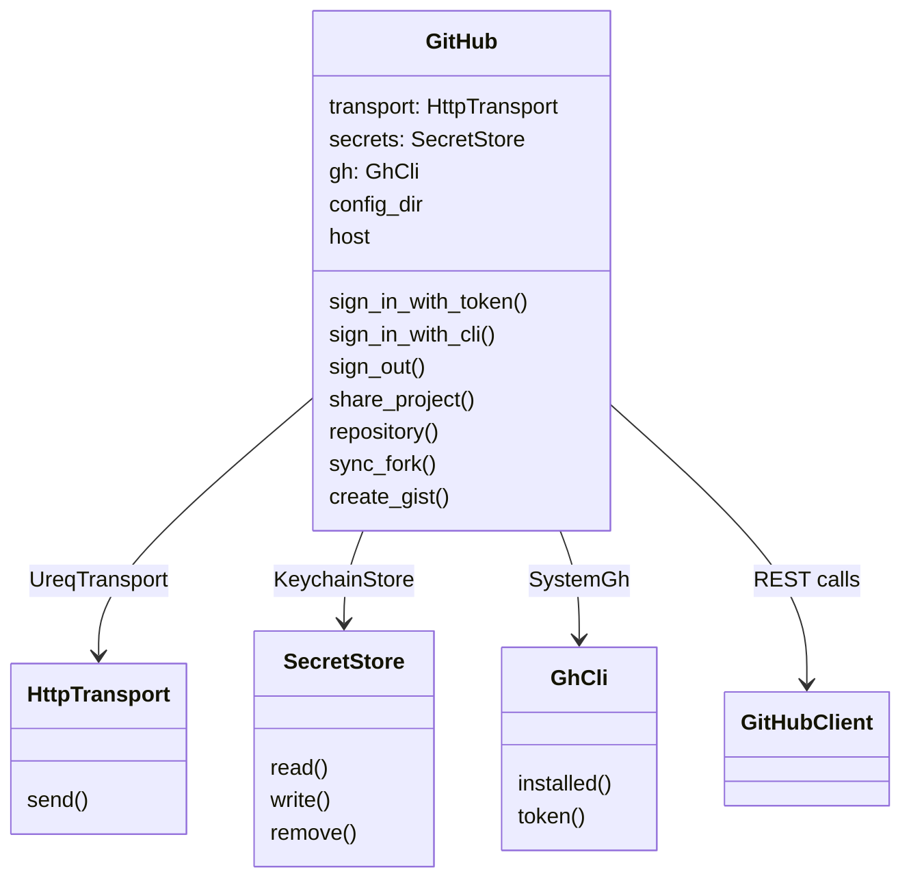
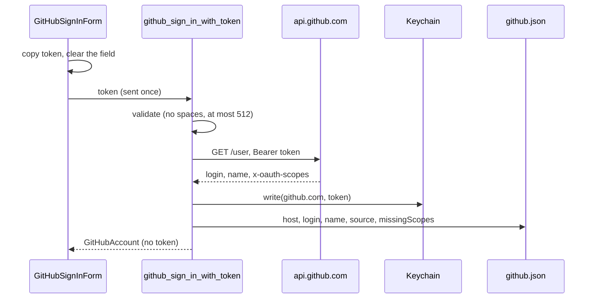

# How GitHub Works

Git Manager signs in to GitHub with a personal access token kept in the system keychain, or with the GitHub CLI's login, and uses the REST API for three actions: Share Project on GitHub, Sync Fork and Create Gist. For the user side, see [GitHub](../usage/GitHub.md).

## Why we need it

Git cannot create a repository, sync a fork or post a gist: those are GitHub API calls, and JetBrains users expect them in the Git menu. The hard part is the token: it must never land in a file, a log, the Git Console or an error, and the UI must not keep it.

## How it works

The Rust side lives in `src-tauri/src/github/`. Everything goes through one `GitHub` service struct whose outside world is passed in as traits, so every path is tested against fakes:

`commands.rs` builds the real one (`with_github`): `UreqTransport`, `KeychainStore`, `SystemGh` and `~/.gitmanager`, host `github.com`.

### Signing in

- **Token.** `secrets.rs` stores it with the `keyring` crate: service `com.shibbir.gitmanager.github`, account = the host. macOS uses the Keychain and Windows the Credential Manager. Other platforms refuse to save a token (they say to use the GitHub CLI) rather than fall back to a file. If saving `github.json` fails, the token is removed again.
- **GitHub CLI.** `gh.rs` finds `gh` in the Homebrew and system folders first (GUI apps start with a short `PATH`), then on `PATH`, and runs `gh auth token --hostname github.com` with `GH_PROMPT_DISABLED=1` and a 15 second timeout. It is asked each time a token is needed and never stored. This runs outside `git/cli.rs`, so it never reaches the Git Console.
- **Who is signed in.** `account.rs` keeps `~/.gitmanager/github.json` with `host`, `login`, `name`, `source` (`token` or `ghCli`) and `missingScopes`. `github_account` reads only this file: no keychain read and no network, so opening Settings is free. A missing or unreadable file means signed out.
- **Scopes.** Classic tokens report `x-oauth-scopes`; `missing_scopes` lists `repo` and `gist` when absent. Fine-grained tokens report none, so nothing is flagged.

### HTTP

`http.rs` wraps a blocking `ureq` agent on the system TLS stack (`native-tls`, platform root certificates), with a 10 second connect and 60 second overall timeout, at most 5 redirects, and the Authorization header kept only on same-host redirects. Error statuses are returned, not thrown, so `client.rs` can read GitHub's message. `HttpRequest` has no `Debug`, because its headers carry the token. Every call sends `Accept: application/vnd.github+json`, `X-GitHub-Api-Version: 2022-11-28` and a `GitManager/<version>` user agent.

`api_error` turns failures into plain sentences: 401 asks to sign in again, 403 or 429 with rate limit headers says when to try again, other 403s mention the scopes, 404 says the token may not see the repository, 422 shows GitHub's detail, 5xx says GitHub is having trouble, and no response says "Could not reach GitHub".

### The three actions

| Action | Calls | Then |
| --- | --- | --- |
| Share Project | `POST /user/repos` (`auto_init: false`) | `git remote add <remote> <clone_url>`, then the UI pushes with upstream |
| Sync Fork | `GET /repos/{owner}/{repo}`, `POST /repos/{owner}/{repo}/merge-upstream` | Fetch All; 409 becomes a "conflict" outcome with a compare link |
| Create Gist | `POST /gists` with one file | Result dialog with the link |

Share checks everything before touching anything: a valid name (GitHub's rules, also in `githubModel.ts`), a free remote name, a checked-out branch and a token. Only then does an unborn repository get its first commit (`git add --all` and `git commit -F -`), and only then is the repository created. The push uses `api.pushWithOptions`, which is the git CLI with git's own credentials, not the app token.

Sync Fork picks the branch with `syncForkBranch`: the current branch when it tracks the same name on the fork's remote, else the default branch. On a conflict, `forkCompareUrl` builds the compare page from the upstream branch into the fork.

Create Gist reads the active editor's selection, or the whole document, from CodeMirror; it refuses empty content, slashes in the name and anything over 5 MB.

### The UI

`githubActions.ts` holds the three menu actions. Each calls `requireAccount`, which opens `GitHubSignInDialog` with the action's name when signed out and runs the action again once signed in. Dialogs are opened through `githubDialogs.ts` and rendered by `GitHubDialogHost.svelte`. `GitHubSignInForm.svelte` is shared by Settings > GitHub and the dialog. `githubAccount.svelte.ts` holds the account and the `gh` status, never a token.

## Where the code lives

| File | What it does |
| --- | --- |
| `src-tauri/src/github/commands.rs` | The nine `github_*` commands |
| `src-tauri/src/github/service.rs` | `GitHub`: sign in and out, share, sync, gist, validation |
| `src-tauri/src/github/client.rs` | REST calls, response types, `api_error` |
| `src-tauri/src/github/http.rs` | `HttpTransport`, `UreqTransport` |
| `src-tauri/src/github/secrets.rs` | `SecretStore`, `KeychainStore`, an in-memory store for tests |
| `src-tauri/src/github/gh.rs` | `GhCli`, `SystemGh` |
| `src-tauri/src/github/account.rs` | `github.json`, `api_base_for`, `missing_scopes` |
| `src/lib/views/github/` | Actions, dialogs, sign-in form, account store, `githubModel.ts` |
| `src/lib/menu/menuSpec.ts`, `menuState.ts` | The Git > GitHub submenu and when each item is enabled |

## Design decisions

**Keychain only.** A token in `settings.json` would be readable by any process and easy to leak in a bug report. Refusing on platforms without a keychain backend is better than a silent file.

**The token goes one way.** The frontend sends it once and gets back only the account. No command returns a token, so a bug in the UI cannot show it.

**git keeps its own credentials.** Pushing with the API token would mean writing it into a URL or a credential helper. Leaving pushes to git keeps behavior identical to the terminal.

**Ready for GitHub Enterprise.** `api_base_for` maps other hosts to `https://<host>/api/v3`, and the keychain account is the host. The UI only offers github.com for now.

## Tests

- `src-tauri/src/github/tests.rs`: every sign-in path (the token only in the keychain, rejected or malformed tokens never stored, offline, the CLI storing nothing), sign out, signed-out calls making no request, Enterprise API roots, Share (including an existing remote refused before anything is created and the first commit of an empty repository), name rules, every Sync Fork outcome, gists, readable API errors, malformed bodies, and the real `UreqTransport` against a local server.
- `src/lib/views/github/githubModel.test.ts`: names, remotes, gist names, the sync branch, titles, the compare URL, initials and the scope warning.

## Keeping this page in sync

- Update this page when anything in `src-tauri/src/github/` or `src/lib/views/github/` changes.
- Update [GitHub](../usage/GitHub.md) for any change to Settings > GitHub or the dialogs, and retake the `github-*` screenshots.
- The commands are listed in [Commands and Events](Commands-and-Events.md). Link items of the GitHub submenu are in [How the Git Menu Works](How-the-Git-Menu-Works.md).

## Bugs we fixed

None yet.
