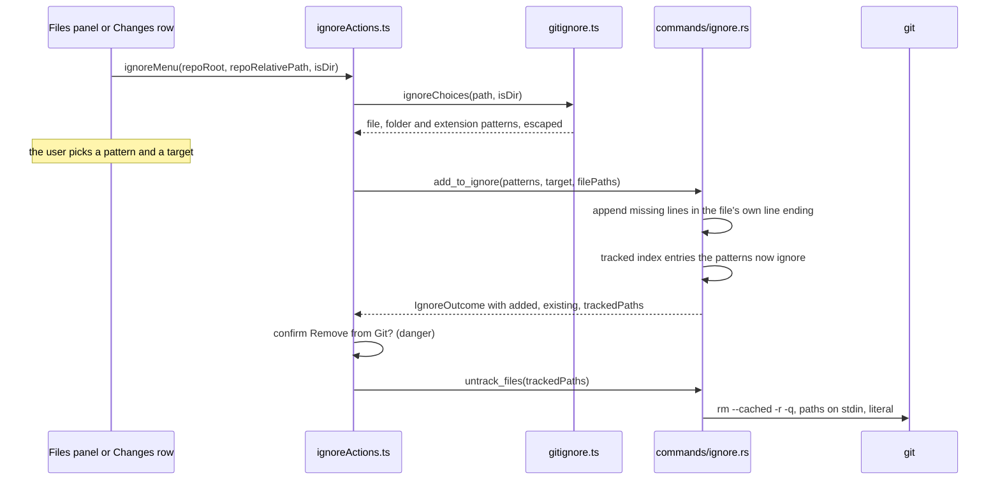

# How ignoring files works

**Add to .gitignore** in the Files panel and the Changes list writes an ignore pattern for a file, its folder or its extension, to the shared `.gitignore` or to the local `.git/info/exclude`, and offers to stop tracking files the pattern now matches. **Edit .gitignore** opens the file. The user side is in [Ignoring Files](../usage/Ignoring-Files.md).

## Why we need it

Writing a correct pattern by hand is easy to get wrong: a pattern without a leading `/` matches at every depth, and characters like `*`, `[` or a leading `#` change its meaning. People also expect an ignored file to disappear from Changes, but git keeps tracking a file that is already committed. JetBrains IDEs solve both from a right-click; this is the same.

## How it works

### Building the patterns

`src/lib/ignore/gitignore.ts` is pure. `ignoreChoices` returns, for a file, `filePattern` (`/src/wishlist.ts`), `folderPattern` of its parent (`/src/`, skipped at the root) and `extensionPattern` (`*.ts`, skipped for names like `Makefile` or `.env`). A folder gets only its own `folderPattern`. The repository root gets nothing, so `ignoreMenu` returns `null` and the menu leaves the item out.

`escapeIgnoreText` makes a path literal for gitignore(5): a backslash before `*`, `?`, `[` and `\`, before a leading `#` or `!` when the text starts the line (the menu's patterns start with `/` or `*.`, so there they stay plain), and before trailing spaces, which git would drop. A name with a line break cannot be a pattern, so it is left out.

### Writing the file

`run_add_to_ignore` in `src-tauri/src/commands/ignore.rs` checks the patterns (no empty or multi-line ones), resolves every scope path with `safe_join`, and picks the file: the work tree's `.gitignore`, or `info/exclude` under `commondir()` so linked worktrees share it. `append_patterns` adds only the lines that are missing, in CRLF when the file already uses CRLF, and adds a newline first when the file does not end with one. The outcome lists what was added and what was there already, which the toast reports.

### Tracked files

A pattern does not untrack anything. `tracked_matches` opens a fresh repository handle (so the new patterns are read), walks the index, keeps entries inside the scope paths or with a `*.ext` pattern's literal extension, and asks git2's `status_should_ignore` whether git now ignores them. At most `MAX_TRACKED` (1000) are returned. If any are, `offerUntrack` asks with a danger confirm, then `untrack_files` runs `git --literal-pathspecs rm --cached -r -q --pathspec-from-file=- --pathspec-file-nul`, so the list never hits the command line limit and a `*` in a name is never a glob.

**Edit .gitignore** calls `ensure_ignore_file`, which creates an empty file when there is none and returns its path, and opens it pinned in an editor tab.

## Where the code lives

| File | What it does |
| --- | --- |
| `src/lib/ignore/gitignore.ts` | Pure escaping and pattern choices, `KIND_HINTS` |
| `src/lib/ignore/ignoreActions.ts` | `ignoreMenu`, `addToIgnore`, `offerUntrack`, `editIgnoreFile` |
| `src-tauri/src/commands/ignore.rs` | `add_to_ignore`, `ensure_ignore_file`, `untrack_files`, `append_patterns` |
| `src/lib/views/files/FileExplorer.svelte` | Adds the submenu to file and folder menus (not for deleted rows) |
| `src/lib/views/changes/RepoSection.svelte` | Adds it to Changes and Staged rows (not to conflicts) |

## Design decisions

**Anchored patterns.** A leading `/` ignores exactly the thing you right-clicked. An unanchored `wishlist.ts` would also ignore a file of that name in every folder, which surprises people. The extension choice is the one deliberate "everywhere" pattern.

**Only the root `.gitignore`.** Nested ignore files are valid, but one file per repository is easier to find and to review. Patterns are relative to it, so they stay correct.

**Ask before untracking.** `git rm --cached` shows up as a deletion for everyone who pulls it, so it is never done silently, and the dialog says the files stay on disk.

**The UI escapes, the backend validates.** Patterns are text the user picks from a menu, so escaping lives with the menu and is tested there. The backend still refuses anything that would break the file.

## Tests

- `src/lib/ignore/gitignore.test.ts`: plain paths and unicode, glob characters and backslashes, a leading `#` or `!` and trailing spaces, names a line cannot hold, anchored file and folder patterns, extensions but not dotfiles, and the choices per file and folder.
- `src-tauri/src/commands/ignore.rs`: `appends_once_with_a_newline_in_the_files_own_style`, `reads_literal_extensions`, `adds_to_gitignore_and_reports_tracked_matches`, `adds_to_info_exclude_and_creates_files_for_editing`, `untracks_names_with_glob_characters_literally`, `refuses_patterns_that_would_break_the_file`.

## Keeping this page in sync

- Update this page and [Ignoring Files](../usage/Ignoring-Files.md) when a choice, a target or the untrack step changes, with a test on the matching side.
- Retake `gitignore-menu.png` when the submenu changes.
- The menus are documented in [Files Panel](../usage/Files-Panel.md) and [Changes and Commits](../usage/Changes-and-Commits.md).

## Bugs we fixed

None yet.
