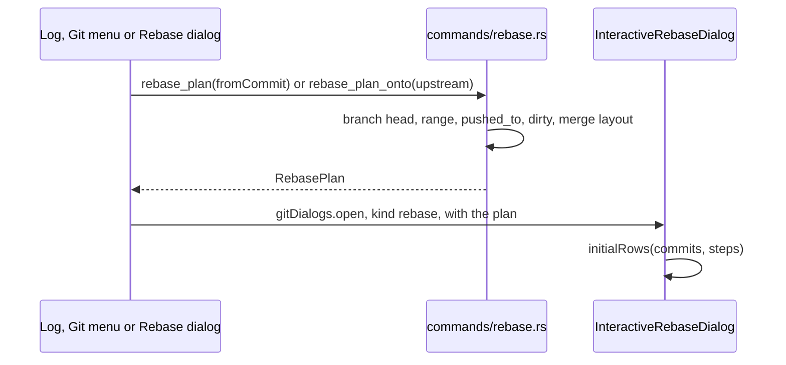
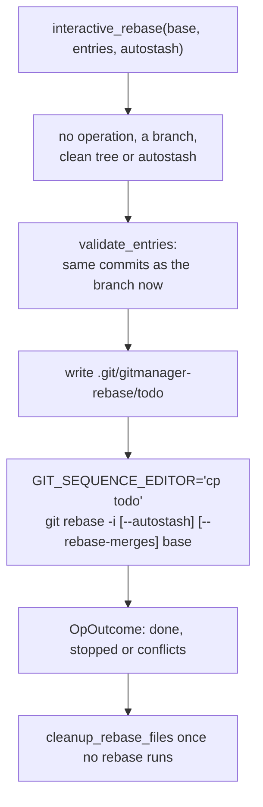

# How interactive rebase works

Interactive rebase lets the user reorder, reword, edit, squash, fix up and drop commits in a dialog, like JetBrains. The dialog edits a list; the backend turns it into git's todo and runs `git rebase -i` without ever opening an editor. The user side is in [Interactive Rebase](../usage/Interactive-Rebase.md).

## Why we need it

Cleaning up commits before a push is a daily task, but `git rebase -i` means editing a text todo in an editor, and a GUI cannot answer git's editor at all: every git call runs with `GIT_EDITOR=true` and `GIT_SEQUENCE_EDITOR=true` (`git/cli.rs`) so nothing ever blocks. So the app owns the todo: the dialog builds the list, and Rust writes the file git reads.

## How it works

### Opening the dialog



`rebase_plan` takes the commits from `fromCommit` (included) to HEAD; `rebase_plan_onto` takes `upstream..HEAD`, for the Rebase dialog's `--interactive`. Both need a checked-out branch. The `RebasePlan` holds:

- `commits`, oldest first (a topological, reversed revwalk that hides the base);
- `base`, the commit they go onto (none means from the root), and `ontoName` for the title;
- `pushedTo`: the upstream, else any remote branch, that already has the oldest commit, so the dialog can warn about a force push;
- `dirty`: tracked changes in the working tree;
- `steps`: the `--rebase-merges` layout when the range has merge commits, else empty.

### Editing the list

`rebaseModel.ts` is pure and holds every rule:

- `REBASE_ACTIONS` with their letter keys, and `setAction`, which prefills a reword with the commit's message and a squash with `combinedMessage` (the target's message and every squashed one, like git; fixups add nothing).
- `targetIndex`: a squash or fixup joins the nearest kept row above it; dropped rows in between do not break the group. `isMessageSquash` marks the last squash of a group as the one that carries the message.
- `moveRow`, `rowsChanged` and `validateRows` (one commit must remain, the first kept row cannot meld, messages cannot be empty).
- `rebaseEntries`: the rows in order, with a message only on the rows that carry one.

### Running it



`validate_entries` checks the rows against the branch as it is now; if a commit was added or removed meanwhile it fails with "The branch changed since the dialog opened". `TodoWriter::write_run` then writes the todo:

```text
pick 1a2b3c4
exec git commit --amend --allow-empty --cleanup=verbatim -F '/path/to/repo/.git/gitmanager-rebase/message-1.txt'
pick 5d6e7f8
fixup 9a0b1c2
fixup 3c4d5e6
exec git commit --amend --allow-empty --cleanup=verbatim -F '/path/to/repo/.git/gitmanager-rebase/message-2.txt'
drop 7f8a9b0
```

- **Reword** is a `pick` followed by an `exec` that amends the commit with the new message from a file.
- **Squash** is written as `fixup`, and the group's combined message is set by one amend at the end of the group, so git never asks for a message.
- **Edit**, **Fixup** and **Drop** map to git's own verbs.

git runs the sequence editor through its own shell, so `cp` copies the prepared todo over git's. That works on macOS, Linux and Git for Windows (which bundles `sh` and `cp`), and under the tests. The message files live in the git dir because later `exec` lines run after an Edit stop or a conflict; `cleanup_rebase_files` removes them once no rebase is in progress, also after Continue, Abort and Skip (`commands/merge.rs`).

### Merge commits

With merges in the range, `rebase_merges::layout` lays out the todo like git's `--rebase-merges`: `label onto`, then one segment per branch that starts with `reset`, holds `pick` lines, labels the commits other segments need (`gm-` plus 12 hex digits) and recreates merges with `merge -C <commit> <labels>`. The dialog's rows follow those steps: picks move and meld only inside a run (between two label, reset or merge lines), a merge is picked or dropped as a unit, and `deadCommits` greys the segments that only fed a dropped merge. `rebase_merges::validate` checks the same rules in Rust. A range from the root with merges is refused (`ROOT_REFUSAL`).

## Where the code lives

| File | What it does |
| --- | --- |
| `src-tauri/src/commands/rebase.rs` | `rebase_plan`, `rebase_plan_onto`, `interactive_rebase`, the todo writer |
| `src-tauri/src/commands/rebase_merges.rs` | The `--rebase-merges` layout, validation and todo |
| `src/lib/views/git/rebaseModel.ts` | Pure list rules |
| `src/lib/views/git/InteractiveRebaseDialog.svelte` | The dialog: keys, drag and drop, confirmations |
| `src/lib/views/git/gitMenuActions.ts` | `startInteractiveRebase`, `interactiveRebaseFromMenu` |
| `src/lib/views/git/RebaseBranchDialog.svelte` | `--interactive` and Next... |
| `src/lib/views/LogView.svelte` | Interactively Rebase from Here... |

## Design decisions

**No editor, ever.** Messages go through `exec git commit --amend --cleanup=verbatim -F`, so they are kept exactly, lines starting with `#` included.

**Copy the todo with `cp`.** Setting `GIT_SEQUENCE_EDITOR` for this one call overrides the `true` that `cli::command` sets, needs no extra launch mode of the app, and works on every platform.

**Check twice.** The frontend validates for instant feedback, the backend again against the live branch, so a stale dialog cannot rewrite the wrong commits.

**Warn before rewriting pushed commits, offer autostash.** Both are confirmations in the dialog (`pushedTo`, `dirty`), never silent.

**Keep merges instead of refusing.** Flattening merges would silently change history; `--rebase-merges` keeps the shape.

## Bugs we fixed

None yet.

## Tests

- `src-tauri/src/commands/rebase.rs`: `reorders_and_drops`, `squash_takes_the_edited_message_and_fixup_keeps_the_target`, `reword_keeps_hash_lines_and_blank_lines_exactly`, `edit_stops_at_its_commit`, `a_conflict_stops_and_abort_cleans_up`, `autostash_keeps_local_changes`, `refuses_bad_plans`, `plan_lists_the_range_and_where_it_was_pushed`, `plan_onto_takes_the_commits_missing_from_the_upstream`, `rebases_from_the_root`, `todo_puts_group_messages_at_the_end_of_the_group`, and the merge tests (`plan_lays_out_merges_like_rebase_merges`, `keeps_merges_reorders_within_a_run_and_rewords`, `dropping_a_merge_drops_the_branch_it_brought_in`, `a_branch_point_inside_the_range_keeps_both_branches_on_it`, `merge_rows_only_pick_or_drop_and_squashes_need_a_commit_above`).
- `src/lib/views/git/rebaseModel.test.ts`: rows, keys, combined messages, reorder, validation, entries, and runs and merges.
- `src/lib/views/git/integrateOptions.test.ts`: `--interactive` kept apart from the options it does not take.

Drag and drop and the keys need a manual check. See [Testing](Testing.md).

## Keeping this page in sync

- Update this page when the plan, the todo format or the list rules change, with a test on both sides.
- Update [Interactive Rebase](../usage/Interactive-Rebase.md) and retake `interactive-rebase-dialog.png` and `interactive-rebase-merges.png`. See [Docs and Screenshots](Docs-and-Screenshots.md).
