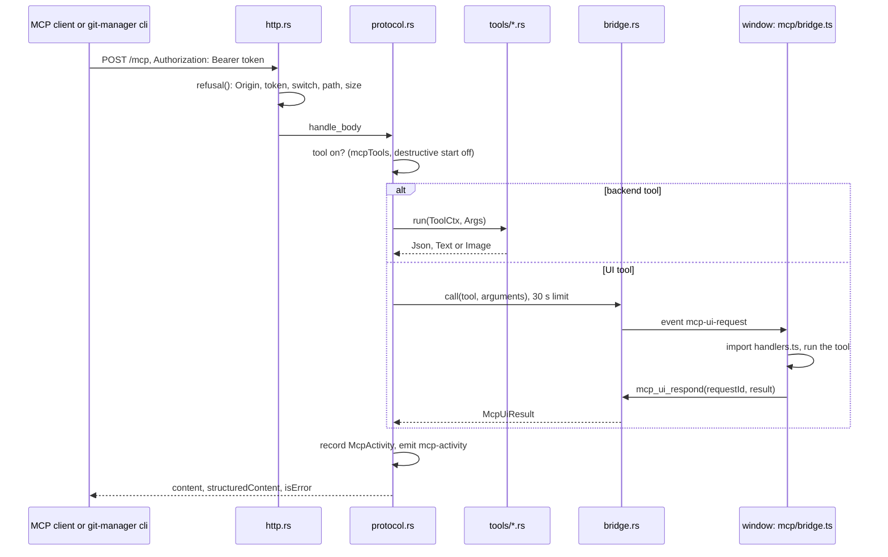

# How MCP and the CLI Work

Git Manager has a built-in MCP server (Model Context Protocol) and a command line client of that server, `git-manager cli`. AI harnesses and scripts use them to read and change the open repositories, drive the window and measure memory. The user side is in [MCP Server and Command Line Tool](../usage/MCP-and-CLI.md).

## Why we need it

- **Agents can use the app like a person.** They see what the user sees (`get_app_state`), click any menu item (`run_menu_command`) and use the same git functions as the UI.
- **Debugging the real app.** Memory and rendering problems only show in the real WebKit window, and the performance tools measure them while an agent drives the UI. See [Debugging with MCP](Debugging-with-MCP.md).
- **Memory is a feature.** So it is off by default, and while both switches are off no port is open and no thread runs.

## How it works

The server speaks MCP's Streamable HTTP transport with JSON answers only (every tool returns once, so no event streams): one `POST /mcp` per JSON-RPC 2.0 message or batch, on `127.0.0.1:<mcpPort>` (default 48731). It answers `initialize` (protocol versions 2025-06-18, 2025-03-26 and 2024-11-05), `notifications/initialized` (202 with no body), `ping`, `tools/list` and `tools/call`.

### Security

`http::refusal` turns a request away before its body is read:

1. Any `Origin` header: 403. Browsers send it and harnesses do not, so this blocks web pages and DNS rebinding.
2. A missing or wrong `Authorization: Bearer` token: 401. The token is 32 random bytes in hex, compared in constant time.
3. The wrong switch: requests with `X-Git-Manager-Client: cli` need `cliEnabled`, all others need `mcpEnabled` (403).
4. A path other than `/mcp` (404), a method other than POST (405), no `Content-Length` (411), or a body over 1 MB (413).

At most 8 connections are open at once (503 after that) and idle ones close after 60 seconds. A tool that takes a `repoPath`, `filePath` or `folderPath` resolves it (symlinks included, `..` refused) and must land inside a workspace folder the window pushed with `mcp_set_workspace` (`paths.rs`). UI tools check the same with `folderFor`. A tool that is off is left out of `tools/list` and a call to it fails with "This tool is turned off in Git Manager (Help > Available MCP Tools)."

The token lives in `~/.gitmanager/mcp.json` with mode 0600, never in settings.json, events or logs. While the server runs, the file also holds `port` and `pid`, which is how the CLI finds it.

### The CLI

`lib.rs` checks for `cli` as the first argument before Tauri starts, so `git-manager cli ...` never opens a window. `mcp/cli.rs` reads `mcp.json`, sends MCP requests to 127.0.0.1 with the CLI header, and prints results. It has `status`, `tools`, `describe`, `call`, `screenshot` and `memory` (which calls `get_memory_usage` every interval and prints one line per sample). Exit codes: 0 ok, 1 tool error, 2 unreachable, switched off or bad usage. `install.rs` links `~/.local/bin/git-manager` to the running binary, never with sudo.

### The memory recorder

`tools/recorder.rs` keeps one optional recording: a thread that samples `memory::usage()` every `intervalMs` (default 250, at least 100) until `stop_memory_recording` or `maxSeconds` (default 600, at most 3600). It keeps up to 7,200 samples and 200 marks. `read_memory_recording` returns only samples after `sinceMs`, the peak and per-process statistics. Stopping the server stops the recording too.

## Where the code lives

| File | What it does |
| --- | --- |
| `src-tauri/src/mcp/mod.rs` | `Mcp`: switches, start and stop, token, status |
| `src-tauri/src/mcp/http.rs` | Listener, connection limits, `refusal` |
| `src-tauri/src/mcp/protocol.rs` | JSON-RPC, `initialize`, `tools/list`, `tools/call` |
| `src-tauri/src/mcp/registry.rs` | Backend plus UI tools with their on or off state |
| `src-tauri/src/mcp/bridge.rs`, `host.rs` | UI calls through the window, events, the macOS screenshot (`screencapture -l`) |
| `src-tauri/src/mcp/paths.rs`, `token.rs`, `activity.rs` | Path safety, `mcp.json`, the last 50 calls |
| `src-tauri/src/mcp/cli.rs`, `install.rs` | The command line tool and its link |
| `src-tauri/src/mcp/tools/` | The 56 backend tools, by area, and the recorder |
| `src-tauri/src/commands/mcp.rs` | `mcp_*` and `cli_install` / `cli_uninstall` commands |
| `src/lib/mcp/toolDefs.ts` | The 30 UI tools with their schemas |
| `src/lib/mcp/bridge.ts`, `handlers.ts` | Answers `mcp-ui-request`; handlers load on the first call |
| `src/lib/mcp/appState.ts`, `menuCommands.ts`, `perf.ts`, `args.ts` | What the UI tools read, run and check |
| `src/lib/mcp/fileTools.ts` | The file operation tools |
| `src/lib/mcp/mcpStore.svelte.ts`, `McpToolsDialog.svelte`, `connect.ts`, `toolStates.ts` | Settings, Automation and Help > Available MCP Tools |

`src/lib/App.svelte` calls `mcpStore.configure` with `mcpEnabled`, `cliEnabled`, `mcpPort` and `mcpTools` whenever they change (it invokes `mcp_configure`), registers the UI tools and sends the workspace folders. Only the main window does this: a git mergetool window would fight over the port.

## Design decisions

**HTTP on localhost, not stdio.** The app is already running with the user's state. A stdio server would be a second process without that state.

**Backend tools call the app's own functions.** `git_commit` uses the same `git/cli.rs` path as the Commit button, so hooks, signing and credentials behave the same.

**UI tools run in the window.** Opening a file or reading the editor text needs the stores, so Rust forwards the call. `run_menu_command` reuses the menu's own handlers, so every menu feature is reachable without one tool per feature.

**File operations are UI tools**, so they refuse unsaved edits and move or close tabs like the Files panel ([details](How-File-Operations-Work.md#ai-agents-and-the-cli)). `file_ops.rs` still checks every path.

**Destructive tools start off.** Settings store only the tools that differ from the default, so new tools get the safe default.

**Two switches.** A user may want scripts in a terminal without giving an AI harness access, or the other way round.

## Tests

- `src-tauri/src/mcp/tests.rs`: a real server on a free port: protocol versions, JSON-RPC errors and batches, token and Origin checks, keep-alive, switches per client, `mcp.json`, busy and low ports, UI calls with timeouts and no window, paths outside the workspace, git tools over HTTP, and the CLI against the running server.
- Unit tests in `token.rs`, `install.rs`, `paths.rs`, `registry.rs`, `tools/recorder.rs` and `tools/performance.rs`.
- Vitest: `src/lib/mcp/args.test.ts`, `connect.test.ts`, `fileTools.test.ts`, `menuCommands.test.ts`, `perfModel.test.ts`, `toolDefs.test.ts`, `toolStates.test.ts`.

## Keeping this page in sync

- A new feature that people use from the menus is reachable through `run_menu_command` already. Add a dedicated tool when an agent needs data back, in `tools/` (backend) or `toolDefs.ts` plus `handlers.ts` (UI).
- `FRONTEND_TOOLS` in `registry.rs` (the test list of UI tool names no backend tool may take) must match `UI_TOOLS` in `toolDefs.ts`; `toolDefs.test.ts` fails when they differ. Keep the tool counts here and on the usage page right too.
- New commands go in [Commands and Events](Commands-and-Events.md); settings in [How Settings Work](How-Settings-Work.md).
- Retake `mcp-settings.png`, `mcp-tools-dialog.png` and `mcp-cli-settings.png` when Settings, Automation or the dialog change.

## Bugs we fixed

**The clash check missed `inspect_elements`.**
- **The issue:** a backend tool could have taken the name `inspect_elements` without a test failing.
- **Why it happened:** `FRONTEND_TOOLS`, the list the Rust clash test checks, was typed by hand with a fixed length of 23, and nobody added the 24th UI tool to it.
- **The fix and why we chose it:** the list is now a slice with every UI tool, and a Vitest test in `toolDefs.test.ts` reads `registry.rs` and compares it with the real `UI_TOOLS` names. Reading the Rust file from TypeScript checks the list the app actually registers, not a parse of `toolDefs.ts`.
