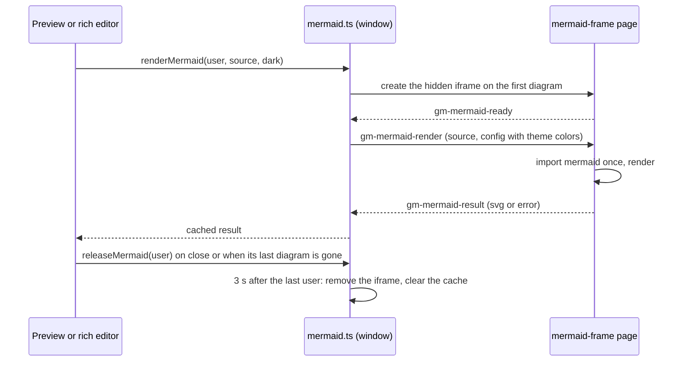

# How Markdown diagrams work

This chapter explains how mermaid diagrams in the Markdown preview and the rich editor are drawn, and why the mermaid library leaves memory when the last document with diagrams closes. The rest of the Markdown editor is in [How the Markdown Editor Works](How-the-Markdown-Editor-Works.md).

## Why we need it

Mermaid is the largest library the app uses. Imported into the window, it stays until the app quits, because JavaScript cannot unload a module. People open a few documents with diagrams, close them and keep working, so the library should go with them.

## How it works

Mermaid is never imported by the window. It runs in a hidden frame:

- **The frame page** is `src/routes/mermaid-frame/+page.svelte`, prerendered as `mermaid-frame.html`. It imports `mermaidFrame.ts`, the only module that imports mermaid, and draws one diagram per message.
- **Users.** Every `MarkdownPreviewDom` and `RichMarkdownEditor` that asks for a diagram becomes a user. `releaseMermaid` runs from their `destroy` and when a preview renders without diagrams. A hidden tab unmounts its preview, so switching to a tab without diagrams also lets go.
- **Unloading.** When the last user goes, `RELEASE_DELAY_MS` (3 s) passes, so moving a tab or switching the Markdown view does not reload the frame. Then the iframe is removed, the cache cleared and the queue reset. A request still queued gets `Diagram closed` instead of bringing the frame back (`generation`).
- **Theme colors** are read in the window, where the CSS tokens are, and sent with each request as mermaid config.
- **Messages** use `postMessage(..., "*")`, and both sides check the sending window (`event.source`) instead of the origin, which `tauri://` pages may report as `null`. A reply that cannot be sent still answers with an error, and the window gives up after 30 s, so one bad diagram never blocks the others.

The drawn SVG is sanitized by `sanitizeSvg` in the window like before; the frame only produces text.

## Memory

Measured on the release app: four Markdown files with four diagrams each, closed after scrolling, then 60 s of waiting. With mermaid in the window the app kept 342 MB (median of three); with the frame it kept 264 MB, and the frame was gone every time. Part of what remains is WebKit keeping freed memory, which only [Clear Cache](How-Clear-Cache-Works.md) gives back.

## Where the code lives

| File | What it does |
| --- | --- |
| `src/lib/markdown/mermaid.ts` | Users, the frame backend, the cache, unloading |
| `src/lib/markdown/mermaidFrame.ts` | Draws in the frame |
| `src/routes/mermaid-frame/` | The frame page |
| `src/lib/markdown/previewDom.ts`, `richEditor.ts` | Ask for diagrams and release them |
| `src/lib/mcp/perf.ts` | `mermaidLoaded` and `markdownDiagramErrors` in `get_ui_performance` |

## Design decisions

**A frame instead of a worker.** Mermaid measures text in a real document, which a worker does not have.

**A short delay before unloading.** Three seconds covers moving a tab between groups and switching Editor and Preview, which unmount and mount a preview right away.

**Results are strings.** Only text crosses between the frame and the window, so nothing in the window keeps the frame's objects alive after it is removed.

## Bugs we fixed

**Memory stayed high after closing Markdown files with diagrams.**
- **The issue:** opening a few documents with mermaid diagrams took the app from about 125 MB to over 400 MB, and closing all of them still left about 340 MB.
- **Why it happened:** mermaid was imported into the window, and an imported module stays until the app quits; its drawn diagrams were cached there too.
- **The fix and why we chose it:** mermaid moved into a frame that is removed with its cache when the last document with diagrams closes. An earlier try with the single-file build in headless Chrome had not freed memory, so this one was measured in the app's real WebKit before it was kept.

## Tests

`src/lib/markdown/mermaid.test.ts`: nothing loads before the first diagram, each source draws once, the frame and cache go after the last user, a quick redraw keeps the frame, releasing an unknown user does nothing, and a queued request does not bring the frame back. The frame itself was checked in the release app with `get_ui_performance` (`mermaidLoaded`, `markdownDiagrams`, `markdownDiagramErrors`).

## Keeping this page in sync

- Update this page when `mermaid.ts`, the frame page or the release rules change, and [Markdown Editor](../usage/Markdown-Editor.md) if users notice.
