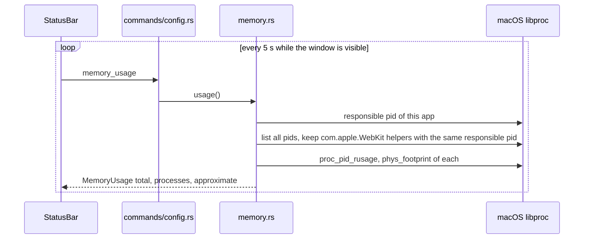
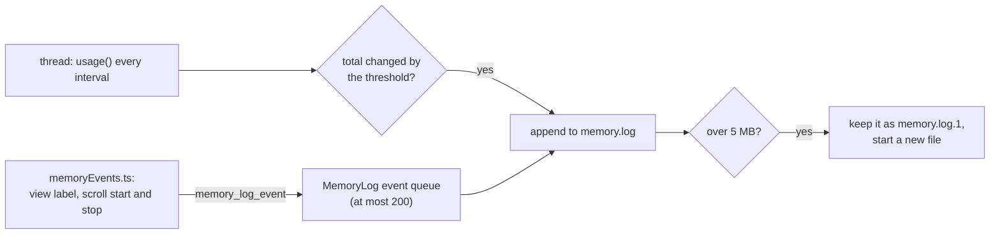

# How Memory Is Measured

Memory is a feature of Git Manager (see [Architecture](Architecture.md)), so the app measures itself in three ways: the readout in the status bar, a debug memory log in a file, and a live recording that AI tools and the command line tool can start. All three use the same function, `memory::usage()`. The user side is in [Memory Use](../usage/Memory-Use.md).

## Why we need it

- **Honest numbers.** On macOS the interface runs in WebKit helper processes, and Activity Monitor charges them to the app. Counting only our own process would hide most of the memory.
- **Causes, not just totals.** A number alone does not say what made it grow. The memory log writes what was on screen and when scrolling started next to every change.
- **Measuring while something happens.** Fast scrolling or opening a big file makes short peaks that a 5 second poll misses. The recorder samples every 250 ms and takes marks.

## The readout

`memory.rs` calls `responsibility_get_pid_responsible_for_pid` for our own process, then keeps every `com.apple.WebKit*` process with the same responsible process, and sums `phys_footprint` from `proc_pid_rusage`. That is Activity Monitor's "Memory" column. Each process gets a label: Git Manager (app), Web content (UI), Graphics and Networking.

When the app is started from a terminal (as `bun tauri dev` does), macOS makes the **terminal** the responsible process, so its other WebKit helpers would match too. Then `approximate` is set and a helper must also have started after our process (`proc_start_abstime`). The popover says so. Polling stops on `visibilitychange` while the window is hidden. On other platforms `usage()` returns zero and the item is hidden.

### GPU acceleration in the popup

The popup also shows whether the GPU is used. `probeWebgl` (`src/lib/ui/webglProbe.ts`) asks the web view for a WebGL 2 context each time the popup opens, reads the renderer name, and releases the context with `WEBGL_lose_context` at once, so the check holds no GPU memory. Each terminal reports how it draws to `gpuRenderers` (`src/lib/terminal/gpuRenderers.svelte.ts`): `TerminalAddons` calls back with `gpu` when the WebGL addon loads, `fallback` when it fails or loses its context, and `normal` when GPU drawing is off; a closed terminal is forgotten. `terminalDrawingSummary` in `gpuStatus.ts` turns that and the two settings (GPU acceleration, font ligatures) into one line. GPU drawing costs about 70 MB for the first terminal ([Measuring Setting Memory](Measuring-Setting-Memory.md)). The Graphics row above is the memory of WebKit's GPU process.

## The memory log

Settings, Automation, Memory log sets `memoryLogEnabled`, `memoryLogIntervalMs` (default 500) and `memoryLogThresholdMb` (default 5). `src/lib/App.svelte` passes them to `memoryLog.configure` (`debug/memoryLog.svelte.ts`), which invokes `memory_log_configure`.

`memory_log.rs` runs one thread while the log is on and none while it is off. A reading line is `2026-10-02T04:20:31.512Z total 400.0 MB (+50.0) | Web content 300.0 | ...` in UTC; an event line is `<time> event <label>`. The window reports events through `src/lib/debug/memoryEvents.ts`: `viewLabel` describes the view, tab, Markdown mode, sidebar and bottom panel when they change, and `watchScrolling` reports "scroll start in markdown preview" and "scroll stop in ... (N events)" after 400 ms without scrolling (`SCROLL_STOP_MS`). The file is `~/.gitmanager/logs/memory.log`; the MCP tool `read_memory_log` returns its last lines.

## The live recorder

`start_memory_recording`, `read_memory_recording`, `mark_memory_recording` and `stop_memory_recording` (in `src-tauri/src/mcp/tools/recorder.rs`) keep one recording in memory: samples every 250 ms by default, at most 7,200 samples and 200 marks, stopped after `maxSeconds` (600 by default) or when the MCP server stops. `git-manager cli memory` prints live readings from `get_memory_usage` instead. See [How MCP and the CLI work](How-MCP-and-CLI-Work.md) and [Debugging with MCP](Debugging-with-MCP.md).

## Where the code lives

| File | What it does |
| --- | --- |
| `src-tauri/src/memory.rs` | macOS process memory, WebKit helper matching, labels |
| `src-tauri/src/memory_log.rs` | The log thread, line format, rotation, `read_tail` |
| `src-tauri/src/commands/config.rs` | `memory_usage`, `memory_log_configure`, `memory_log_event` |
| `src/lib/debug/memoryEvents.ts`, `memoryLog.svelte.ts` | UI events for the log, the Settings state |
| `src/lib/views/StatusBar.svelte` | The readout and its popover |
| `src-tauri/src/mcp/tools/performance.rs`, `recorder.rs` | `get_memory_usage`, `sample_memory`, the recorder |

## Design decisions

**Count the WebKit helpers.** Most memory is the web view, and matching Activity Monitor lets users check the number.

**Poll only while visible.** A 5 second poll is cheap, and skipping it in the background keeps idle CPU at zero.

**Log changes, not every reading.** A line per reading would bury the few changes that matter; the threshold keeps the file short. 0 MB is there when every reading is wanted.

**Nothing runs while it is off.** The log thread and the recorder exist only while in use, and the log file is capped at two files of 5 MB.

## Bugs we fixed

**The dev build found no WebKit helpers.**
- **The issue:** the first memory probe found no WebKit helpers for the dev build, so only the app process was counted.
- **Why it happened:** the dev build starts from a terminal, and macOS made the terminal the responsible process, so no helper pointed at our pid.
- **The fix and why we chose it:** match helpers on whatever process is responsible for us, and when that is not us, also require a later start time and mark the result approximate. A Finder launch, what users run, stays exact.

## Tests

- `src/lib/terminal/gpuStatus.test.ts`: the GPU lines for every terminal state and setting, and the WebGL label.

- `src-tauri/src/memory.rs`: `labels_web_kit_helpers` checks the role names; `measures_the_current_process` (macOS only) checks that our pid comes first and has memory.
- `src-tauri/src/memory_log.rs`: UTC timestamps, the line format, and a run that logs changes and events, then stops.
- `src/lib/debug/memoryEvents.test.ts`: `viewLabel` names the view, the tab file and the panels. `scrollAreaName` and `watchScrolling` have no unit test yet.
- `src-tauri/src/mcp/tools/recorder.rs`: a recording with marks, new samples only, and stop.

## Keeping this page in sync

- Update this page when `memory.rs`, the log format or the recorder change, and [Memory Use](../usage/Memory-Use.md) for visible changes.
- The memory marks in Settings and how each setting was measured are in [Measuring Setting Memory](Measuring-Setting-Memory.md).
- Retake `status-bar.png` and `memory-log-settings.png` when they change (`memory-log-settings.png` belongs to the memory feature in `features.json`).
