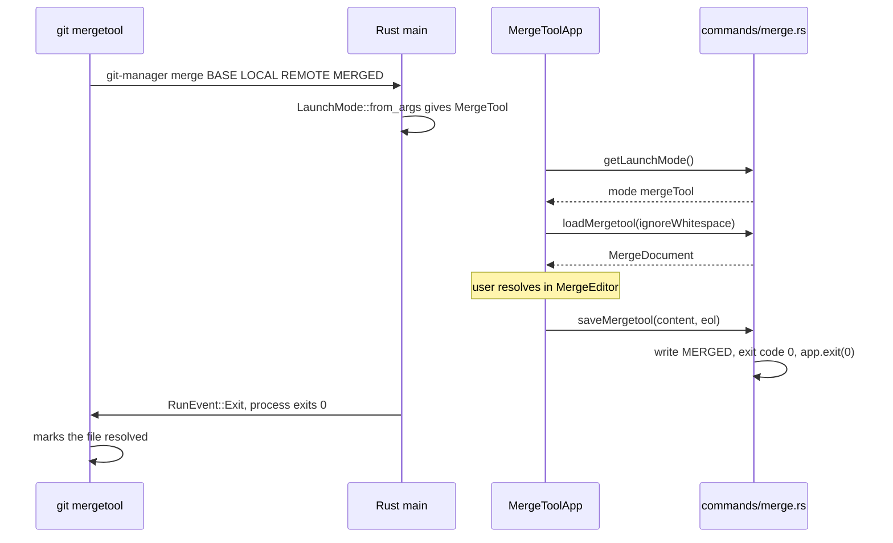
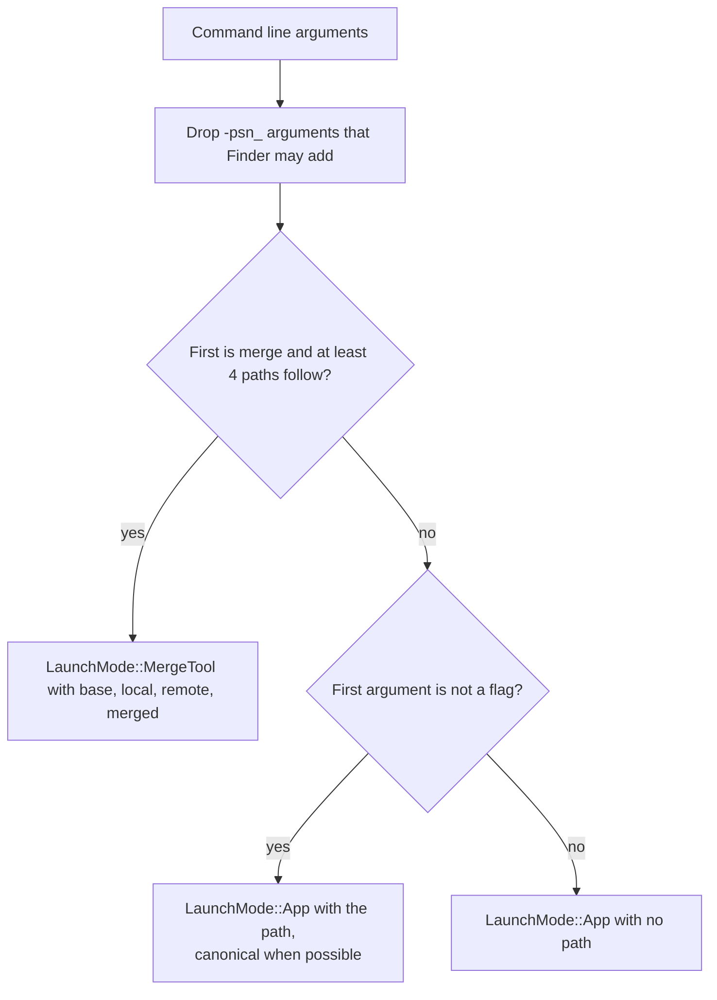
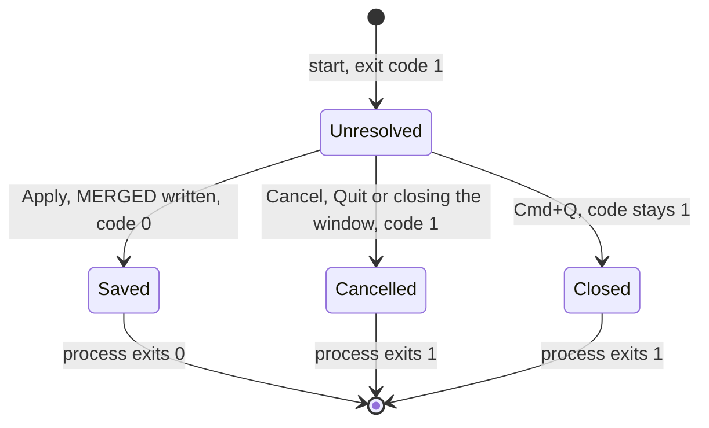

# How mergetool mode works

Git Manager can be the merge tool that `git mergetool` opens for each conflicted file. In this mode its window shows only the three-pane merge tool, writes the result and tells git through its exit code whether the file is resolved. For the user side, see [Git Mergetool](../usage/Git-Mergetool.md).

## Why we need it

Many people resolve conflicts from the terminal, or from another tool that calls `git mergetool`. They should get the same merge tool without opening a repository in the full app. Git's contract for external tools is simple: it passes four file paths, waits for the process to exit, and with `trustExitCode` it treats exit status 0 as "resolved" and anything else as "not resolved".

## How it works

Git runs the command from the user's config:

```sh
git config --global merge.tool gitmanager
git config --global mergetool.gitmanager.cmd "\"$APP\" merge \"\$BASE\" \"\$LOCAL\" \"\$REMOTE\" \"\$MERGED\""
git config --global mergetool.gitmanager.trustExitCode true
```



### Choosing the mode

`LaunchMode::from_args` in `state.rs` reads the command line once at start:



`merge` with fewer than four paths is not mergetool mode, so a typo opens the normal app instead of a broken merge window. `AppState` stores the mode and a `mergetool_exit_code` (`AtomicI32`) that starts at **1**.

On the frontend, `App.svelte` calls `api.getLaunchMode()` after `settings.init()`. For `mode: "mergeTool"` it renders `MergeToolApp.svelte` and nothing else: no workspace, no watcher, no sidebars. The settings still load; the update store sees the mergetool mode and schedules no update check and shows no What's New.

### Loading the files

`load_mergetool` calls `conflicts::load_files(base, local, remote, merged, ignore_whitespace)`. It reads the three input files directly from the paths git gave, not from a repository index. An empty or missing BASE means both sides added the file, so the kind is `BothAdded`. The panes are labeled "Local (yours)" and "Remote (theirs)". The result goes through the same `build_document` as an in-repo conflict, so the chunks, conflicts and binary check are identical. A binary file shows a notice with a Quit button. Any input file that cannot be read loads as empty text, not only BASE.

`MergeToolApp` sets the window title to `Merge <file name>` and passes the document to `MergeEditor.svelte`, the same component the full app uses. Toggling "ignore whitespace" saves the setting and reloads the document.

### Exiting with the right code



- `save_mergetool(content, eol)` writes MERGED with the document's line endings (`eol.apply`), stores 0 and calls `app.exit(0)`.
- `cancel_mergetool` stores 1 and calls `app.exit(1)`.
- In `lib.rs`, the `RunEvent::Exit` handler calls `std::process::exit` with the stored code whenever the app runs as a mergetool.

That last step is what makes quitting safe. The red close button goes through Cancel (`onCloseRequested` in `MergeToolApp`), but Cmd+Q never calls our commands, so without the handler the process would exit normally. The stored code is the single source of truth, and it only becomes 0 after an explicit save.

## Where the code lives

| File | What it does |
| --- | --- |
| `src-tauri/src/state.rs` | `LaunchMode`, `from_args`, `AppState.mergetool_exit_code` |
| `src-tauri/src/lib.rs` | `RunEvent::Exit` handler that exits with the stored code |
| `src-tauri/src/commands/merge.rs` | `load_mergetool`, `save_mergetool`, `cancel_mergetool` |
| `src-tauri/src/commands/repo.rs` | `get_launch_mode` |
| `src-tauri/src/git/conflicts.rs` | `load_files`, shared `build_document` |
| `src/lib/App.svelte` | Picks `MergeToolApp` for the mergetool mode |
| `src/lib/merge/MergeToolApp.svelte` | The standalone window: load, apply, cancel, the close request |
| `src/lib/merge/MergeEditor.svelte` | The three-pane merge tool, shared with the full app |

## Design decisions

**Exit code as the only signal.** This is git's contract, so no files, sockets or flags are needed. Starting at 1 means every path except a real save leaves the file unresolved, which is the safe default.

**Write MERGED directly, do not stage.** In the full app, `save_resolution` writes the file and then stages it with `git add`. Here git itself runs the tool and stages the file when we exit with 0, so staging it ourselves would only do the same work twice.

**Same merge engine and editor.** A second, lighter merge UI would drift from the main one. Reusing `build_document` and `MergeEditor` means a fix in one place helps both.

**Read the command line in Rust.** The mode is known before any web view loads, and the frontend only asks for it, so the arguments are parsed and tested in one place.

## Bugs we fixed

**Closing the window dropped your work.**
- **The issue:** in git mergetool mode, closing the window with the red button threw away an edited result without asking, although Cancel and Esc asked first.
- **Why it happened:** nothing listened for the close request, so the window closed and the app exited with the unresolved code.
- **The fix and why we chose it:** `MergeToolApp` listens with `onCloseRequested`, always keeps the window open, and runs the same cancel as the Cancel button. If you confirm, `cancel_mergetool` exits with code 1 as before. We never destroy the window from the frontend, so no extra window permission is needed.

**Update checks ran in mergetool mode.** Every window git mergetool opened also started the timed update check. `updates.init()` now skips it in this mode; see [How Updates Work](How-Updates-Work.md).

One change to know about: when the app was renamed from Git Merger to Git Manager, the tool name in the README became `gitmanager` and the binary `git-manager`, so an old `gitmerger` config must be set up again with the new lines.

## Tests

- `src-tauri/src/state.rs`: `merge_arguments_select_mergetool_mode` (also with a `-psn_` argument), `incomplete_merge_arguments_are_not_mergetool_mode`, `repo_path_argument_is_canonicalized`, `no_args_flags_and_psn_open_nothing`.
- `src-tauri/src/git/tests.rs`: `load_files_with_empty_base_is_both_added`.
- The merge logic itself is covered by the merge tests, see [How the Merge Tool Works](How-the-Merge-Tool-Works.md).

`save_mergetool` and the exit handler are not unit tested, because they end the process. To check them by hand, run the built binary with `merge` and four sample files and `echo $?` after Apply, after closing the window and after Cmd+Q. A pure test for writing MERGED with the right line endings would be a good addition.

## Keeping this page in sync

- Update this page when `LaunchMode`, the mergetool commands or the exit handler change.
- Update [Git Mergetool](../usage/Git-Mergetool.md) and the README when the command line or tool name changes.
- Retake `mergetool-mode.png` when the standalone window looks different.
- Related: [How Conflict Resolution Works](How-Conflict-Resolution-Works.md), [Backend](Backend.md).
