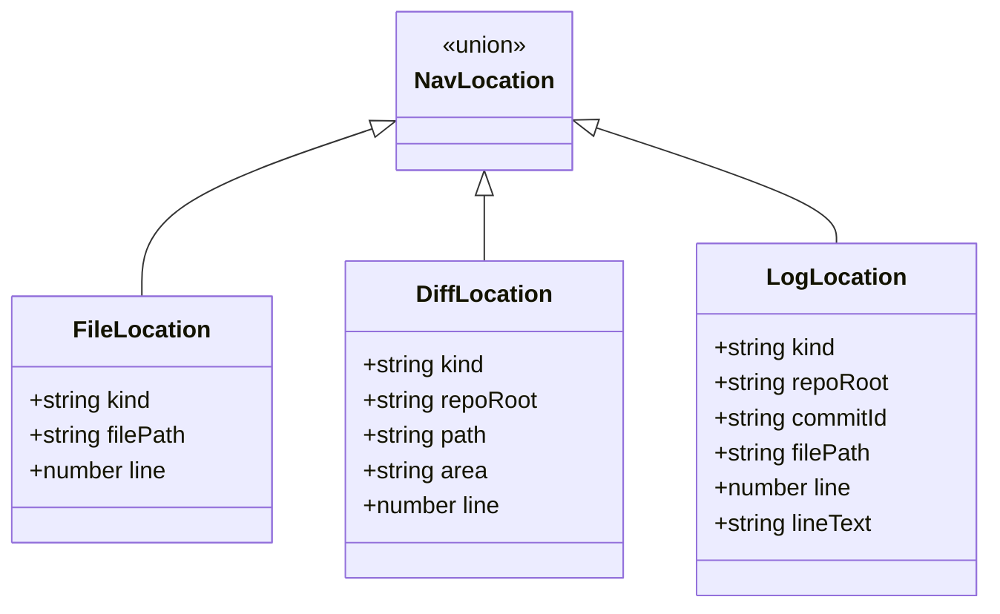
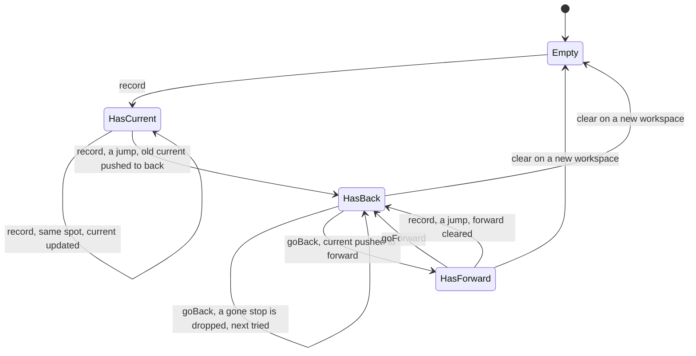
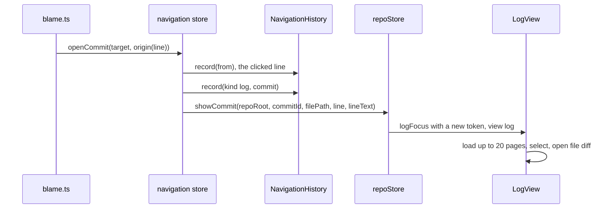

# How navigation works

Back and Forward take you through places you have been (a file line, a change's diff, a commit in the Log), like VS Code's Go Back and Go Forward. The user side is in [Navigation](../usage/Navigation.md).

## Why we need it

Reading code means jumping around and going back. The history must record real jumps, not every keystroke.

## How it works

`navHistory.ts` is pure, tested logic; `navigation.svelte.ts` is the reactive store that connects it to the views.

`kind` is `"file"` (or missing), `"diff"` or `"log"`. A Log step's `filePath` may be null and its `line` is optional. `lineText` is the text of the blamed line, used to find it in the commit when `line` is only a guess. `FileLocation.filePath` is absolute, like every file tab; `DiffLocation.path` and `LogLocation.filePath` are repo-relative.

### Recording

`NavigationHistory` keeps a `back` stack, a `current` location and a `forward` stack. `record(location)` first refuses a file location whose path is a pseudo tab (`isPseudoTab`: a terminal, commit, Git or branch tab), then asks `sameSpot(current, location)`:

- Same file within `JUMP_LINES` (10) lines: only `current` moves.
- Same diff (repository, path, area) within 10 lines: same.
- Same commit in the same repository, with the same file or no file on either side: same. `refine` keeps the recorded file and line when the new step names no file.
- Anything else is a jump: `current` goes onto `back`, `forward` is cleared, and the new place becomes `current`. `back` holds at most `MAX_ENTRIES` (50) places.

Places are recorded by `FileView.svelte` (selection or text changes, and when a file opens), `ChangesView.svelte` (a click in Changes, `kind: "diff"`, line 0) and `editor/blame.ts` (blame clicks).

`recentFilePaths()` lists the visited files, newest first and each once (current, then forward, then back), for Recent Files in [Search Everywhere](How-Search-Everywhere-Works.md). A search result opens through `navigation.openFileAt(filePath, line, column)`: it sets a reveal request with a 0-based line and column and `focus: true`, then opens the file. `FileView` applies it, focuses the editor, and records the new place as usual.

### Blame jumps

A blame click records two steps: the clicked line, built by the blame state's `origin(line)` callback (gutter clicks may not be on the cursor line), and the Log step.

### Going back and forward

`goBack()` calls `history.travel("back", go)`. `go(target)` returns a `StopOutcome`: "shown", "cancelled" or "gone".

- **file**: checks the file exists (open tabs are trusted; other files are read once, and `isMissingFileError` spots "not found"), sets `reveal` with a token and calls `repoStore.openFile`. `FileView` calls `takeReveal(filePath)` when ready; a request with `line: null` only focuses.
- **diff**: checks with `buildSections` and `findFile` that the change still exists, sets `diffReveal`, then `changesSelection.pick`. `ChangesDiff.svelte` calls `takeDiffReveal`.
- **log**: gone when the repository left the workspace, else `repoStore.showCommit(...)`.

A cancelled step leaves the history as it was. A gone stop is dropped (for a file, `forget` drops all its stops) and the next one tried; if none is left, a toast says "Nothing left to go back to".

The triggers are the arrow buttons in `Header.svelte`, Ctrl+- and Ctrl+Shift+- (`workspaceShortcut`), and mouse buttons 3 and 4. A new workspace calls `navigation.clear()`.

## Where the code lives

| File | What it does |
| --- | --- |
| `src/lib/stores/navHistory.ts` | Pure history: `sameSpot`, `refine`, `record`, `travel`, `forget`, `isMissingFileError` |
| `src/lib/stores/navigation.svelte.ts` | Reactive store: `openCommit`, `go`, reveal requests |
| `src/lib/views/Header.svelte` | Back and Forward buttons |
| `src/lib/views/Workspace.svelte` | Keys and mouse side buttons |
| `src/lib/views/files/FileView.svelte` | Records file places, applies `takeReveal`, calls `forget` when its file is gone |
| `src/lib/views/ChangesView.svelte` | Records diff places |
| `src/lib/views/changes/ChangesDiff.svelte` | Applies `takeDiffReveal` |
| `src/lib/editor/blame.ts` | Blame clicks through `navigation.openCommit` |

## Design decisions

**Pure history, thin store.** All rules live in `NavigationHistory`, each with a unit test; the store only turns places into UI actions.

**Small moves update, big moves record.** Recording every cursor move would fill the 50 entries in seconds.

**Reveal requests with tokens.** The editor may not exist yet when Back opens a file, so the view takes the request when ready; the token lets repeat jumps fire.

**Undo a cancelled step, skip a gone one.** The history never points somewhere you are not, or somewhere that no longer exists.

## Bugs we fixed

**Back and Forward were hard to find.**
- **The issue:** the user asked for Back and Forward after they were built.
- **Why it happened:** the buttons sat in the file editor's title row.
- **The fix and why we chose it:** they moved to the top bar, always visible.

**Back did not return to the clicked blame line.**
- **The issue:** after clicking blame to reach the Log, Back skipped the clicked line.
- **Why it happened:** only file places were history steps.
- **The fix and why we chose it:** `LogLocation` was added, and blame records the clicked line first. Changes diffs became steps too (`DiffLocation`).

**Two Log entries for one commit.**
- **The issue:** a Log step with no file no longer merged with a later click on the same commit that named a file.
- **Why it happened:** the new rule compared `filePath` strictly.
- **The fix and why we chose it:** a missing file on either side counts as the same commit.

**Long branch names covered the buttons.**
- **The issue:** long branch names overlapped the Back and Forward buttons.
- **Why it happened:** the buttons sat after the branch name, and the header's left side could not shrink.
- **The fix and why we chose it:** they moved to the far left, and long names now shorten with an ellipsis.

**Back went to files that no longer exist.**
- **The issue:** after deleting a file or committing a change, Back and Forward still stopped there, again and again.
- **Why it happened:** `forget` existed but nothing called it, and a failed step was undone with the dead stop still in the history.
- **The fix and why we chose it:** the file tab calls `navigation.forget` when its file is gone, and `NavigationHistory.travel` drops a gone stop (with every other stop of a missing file) and tries the next at once, like a browser. Only a cancelled step leaves the history as it was.

**A Log step lost its file.**
- **The issue:** a later step for the same commit with no file replaced a Log step and forgot its file and line, and the test meant to catch it checked another case.
- **Why it happened:** `record` replaced the current entry whenever `sameSpot` matched, and the test recorded a different file instead of no file.
- **The fix and why we chose it:** `refine` keeps the existing entry when the new one names no file, and a new test covers the real case.

## Tests

`src/lib/stores/navHistory.test.ts` covers small moves versus jumps, back and forward, the cap and `forget`, Log and diff steps, refusing pseudo tabs, `recentFilePaths`, `travel` (skipping gone stops, cancelling) and `isMissingFileError`. Any new location kind or rule needs a case here first.

## Keeping this page in sync

- Update this page when `navHistory.ts`, `navigation.svelte.ts` or the views that record places change.
- Update [Navigation](../usage/Navigation.md) and [Keyboard Shortcuts](../usage/Keyboard-Shortcuts.md) when keys or buttons change.
- Retake `back-forward.png` when the header buttons move.
- Related: [How Blame Works](How-Blame-Works.md), [How the Log Works](How-the-Log-Works.md).
