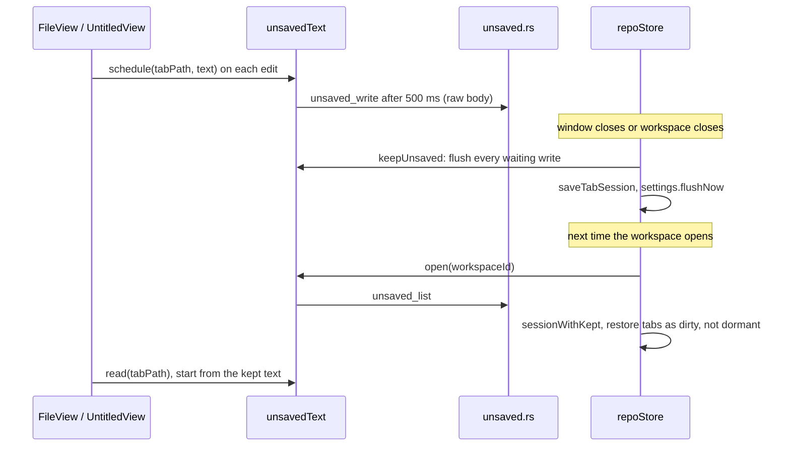

# How New File and unsaved changes work

This chapter explains Untitled tabs (File > New File, Cmd+N) and Remember unsaved changes, the hot exit that keeps unsaved text across restarts. The user side is in [New File and Unsaved Changes](../usage/New-File-and-Unsaved-Changes.md); tabs in general are in [How the editor works](How-the-Editor-Works.md).

## Why we need it

Editors like Sublime Text let you type into a new tab without picking a file first, and never lose that text or unsaved edits when you quit. Before this, every tab was a file, and closing the window asked you to throw unsaved edits away (Cmd+Q did not even ask). People use the editor as a scratch pad, so both gaps hurt.

## How it works

Two parts work together: a pseudo tab for text without a file, and a small store that copies unsaved text to disk.

### Untitled tabs

An Untitled tab is a pseudo tab (see `pseudoTabs.ts`), like terminal and commit tabs. Its path is `untitled:` plus a short id from the time and a random suffix (`newUntitledPath` in `src/lib/stores/untitledTabs.ts`), so it never looks like a file and never clashes across windows or restarts. Being a pseudo tab, it is skipped by the tab limit, Unload hidden tabs, the Files panel and Back / Forward without any special code.

`Workspace.svelte` renders `UntitledView.svelte` for it: a CodeMirror editor with the base extensions and word wrap, no Git features. It registers with `fileCommands` like `FileView`, so File > Save, Save All, Revert and the MCP text tools reach it. The tab is dirty while it has text. The tab strip shows `unsavedText.title(path)`, the first line with text (`untitledTitle`).

Saving opens the native save dialog (`plugin-dialog`), suggesting `suggestedFileName(text)`. The text is written with the existing `write_worktree_file` command: inside a workspace folder relative to that folder, outside it relative to the chosen file's parent. Inside, `repoStore.replaceUntitledTab` swaps the tab's path for the file's (`replaceTabPath` in `tabs.ts`), so a `FileView` takes its place and reads the file. Outside, the tab closes.

### Keeping unsaved text

- **Writing.** On every edit that leaves a tab dirty, the editor calls `unsavedText.schedule`. After 500 ms the text goes to `unsaved_write` as a raw body (one JSON line, then the text), the same format `line_change_marks` uses, so large texts cross the bridge without JSON escaping.
- **Forgetting.** `repoStore.setDirty(path, false)` (save, revert, editing back to the saved text) and closing a tab by hand call `unsavedText.discard`. Writes and removals of one tab run in a promise chain, so a slow write never brings back text that was just saved.
- **Leaving.** `confirmCloseWindow` and `confirmDiscardAll` go through `confirmLeave`. With the setting on, `keepUnsaved` writes everything waiting (and any dirty tab never written, for edits made before the setting was on), saves the tab session and flushes settings, then lets the window or workspace go without asking. Clear Cache calls `keepUnsaved` too. Cmd+Q ends the app without asking the page, which is why writes happen during typing and not only at the end.
- **Restoring.** `restoreTabs` asks `unsavedText.open(workspace.id)` for the kept tabs: Untitled tabs filed under this workspace (or listed in its saved session) and files inside its folders. `keptTabs` turns a file that no longer exists into a new Untitled tab with its text (`moveToUntitled`). `sessionWithKept` (pure, in `tabSession.ts`) merges them into the saved session; with Reopen tabs on start off, only kept tabs stay. Kept tabs come back dirty and not dormant, so Save All reaches them. `FileView.load` reads the kept text and starts the editor from it, with the file on disk as the baseline, so the tab is dirty against the real file.
- **The workspace id.** Adding or removing a folder, or Save Workspace As, changes the workspace id; `workspaceIdChanged` rewrites the open Untitled tabs under the new id.

### The store on disk

`src-tauri/src/unsaved.rs` keeps one file per tab in `~/.gitmanager/unsaved/`, named by the SHA-1 of the tab path (`git2::Oid::hash_object`, as Local History does). Each file is the raw body as it arrived, with `savedAt` added: a JSON line, a newline, the text. `list` reads only the first line of each file. Writes go through a temporary file and a rename. Paths must be absolute or `untitled:<id>`; texts over 16 MB or not UTF-8 are refused.

## Where the code lives

| File | What it does |
| --- | --- |
| `src/lib/stores/untitledTabs.ts` | Untitled paths, titles and suggested file names (pure) |
| `src/lib/stores/unsavedText.svelte.ts` | Scheduling, ordered writes, flush, titles, parked text for moved tabs |
| `src/lib/views/files/UntitledView.svelte` | The Untitled editor and Save |
| `src/lib/views/files/FileView.svelte` | Starts from kept text, schedules writes |
| `src/lib/stores/repo.svelte.ts` | `newUntitledTab`, `replaceUntitledTab`, `confirmLeave`, `keepUnsaved`, `keptTabs`, session save and restore |
| `src/lib/stores/tabSession.ts` | `isSessionTabPath`, `sessionWithKept` |
| `src/lib/stores/tabs.ts` | `replaceTabPath`, the Untitled label |
| `src-tauri/src/unsaved.rs`, `src-tauri/src/commands/unsaved.rs` | The store and its four commands |
| `src/lib/menu/*` | `file.newFile` (Cmd+N), Save All saving Untitled tabs one by one |
| `src/lib/mcp/handlers.ts`, `appState.ts` | `untitled:` paths accepted by the editor tools, `"kind": "untitled"`, `save_file` asking without waiting |

## Design decisions

**A pseudo tab, not a temporary file.** A real file in a temp folder would show up in Git, the Files panel and search, and need cleaning up. A pseudo path keeps every file-only feature away for free.

**A separate, small editor.** `FileView` is built around a file on disk: loading, reloading on outside changes, blame and change marks. Guarding each of those for "no file" would make it harder to follow than a short `UntitledView`.

**Write while typing.** The page cannot delay Cmd+Q, so waiting for the close would lose text. A 500 ms debounce costs one small write per pause.

**Files on disk, not state.json.** Texts can be large, and `state.json` is rewritten often and shared between windows. One file per tab means a write touches only that tab.

**Closing a tab by hand still asks.** That is a clear choice to drop the text; keeping it silently would surprise people, and Sublime Text asks too.

**Restore by folder for files, by workspace for Untitled tabs.** A file's edits belong to the file, so they come back in any workspace holding it. Untitled text has no other home than the workspace it was typed in.

## Tests

- `src-tauri/src/unsaved.rs`: write, read, replace and remove; exact texts; listing order and skipping foreign or broken files; bad paths, big and non-UTF-8 texts.
- `src/lib/stores/untitledTabs.test.ts`: paths, titles and suggested names.
- `src/lib/stores/tabSession.test.ts`: Untitled tabs in a saved session, `sessionWithKept`.
- `src/lib/stores/tabs.test.ts`: `replaceTabPath` and the Untitled label.
- `src/lib/menu/menuSpec.test.ts`, `menuState.test.ts`: New File on Cmd+N, and no Compare or Local History for an Untitled tab.
- `src/lib/stores/settingsData.test.ts`: the `rememberUnsaved` default.

## Bugs we fixed

None yet.

## Keeping this page in sync

- Update this page and the user page when the save flow, the restore rules or the store format change.
- Retake `new-file-untitled.png` when the tab strip changes, and `settings-remember-unsaved.png` when the Saving rows change.
- `scripts/screenshots.ts` answers the `unsaved_*` commands in the page, so screenshots never write to your own `~/.gitmanager/unsaved`; keep that in step with new commands.
