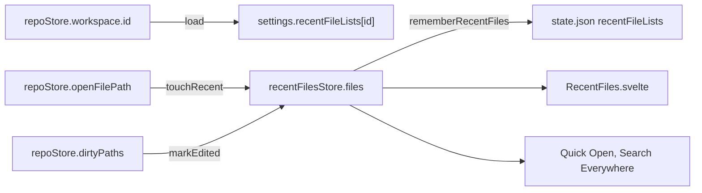

# How Recent Files works

This chapter explains how the Recent Files popup (Cmd+E) keeps its list, saves it per workspace and shows it. The user side is in [Recent Files](../usage/Recent-Files.md).

## Why we need it

JetBrains users press Cmd+E all day to jump between the files they work on, and the user asked for the same popup. Before it, Quick Open and Search Everywhere built their "recent" sections from the Back and Forward history. That history is a list of places, not of files: going back reorders it, and it is empty after a restart. A real most recently used list fixes both and gives the three popups one source.

## How it works

### The list

The list is an array of `RecentFile` (`filePath`, `edited`), newest first. The rules live in the pure module `src/lib/stores/recentFiles.ts`:

- `touchRecent` moves a file to the top, or adds it there, keeping its `edited` flag. Pseudo tabs (terminal, commit, Git and compare tabs) are ignored. The list is capped at `MAX_RECENT_FILES` (50), JetBrains' default.
- `markEdited` sets `edited` without moving the file.
- `removeRecent` drops a file.
- Each returns the same array when nothing changed, so the store can skip a save.

### Following the editor

`recentFilesStore.follow()` in `src/lib/recentFiles/recentFilesStore.svelte.ts` is called once from `Workspace.svelte`, so it lives exactly as long as a workspace is open. It runs three effects:

- A new workspace id loads that workspace's saved list and closes the popup.
- A change of `openFilePath` (the focused group's active tab) touches that file. A file outside the workspace folders is skipped, so a tab left over from the previous workspace never lands in the new list.
- Every path in `dirtyPaths` (tabs with unsaved edits) is marked edited. That is what "Show edited only" filters on.

### Saving

Each change calls `settings.rememberRecentFiles(workspaceId, files)`, which stores the list under the `recentFileLists` key of `state.json` (see [How Settings Work](How-Settings-Work.md)). `withRecentFiles` moves the workspace to the end and keeps the newest `MAX_TAB_SESSIONS` (30) workspaces, like the saved tabs. On load, `parseRecentFiles` keeps only absolute paths that `isSavablePath` accepts, drops repeats and pseudo tabs, and caps each list. The settings store's own debounce turns a burst of tab switches into one write.

### The popup

`RecentFiles.svelte` is loaded with a dynamic import the first time it opens, and unmounted when it closes. The pure part is `recentFilesModel.ts`:

- `recentFileRows(files, folders, query, editedOnly)` turns paths into rows with `pathRows` (so files outside the workspace drop out and multi-folder workspaces lead with the folder name), then filters with `matchRecentRow` from Quick Open's model. Unlike Quick Open, the rows keep their recent order instead of sorting by score, like JetBrains' speed search.
- `initialRecentSelection` picks row 1 when row 0 is the file on screen and there is no query, so Cmd+E, Enter goes to the previous file.

The component adds the git tones of `views/files/tones.ts` (shared with the Files panel), the unsaved dot from `repoStore.isDirty`, and the keys: arrows and Ctrl+N/P, Enter and Cmd+Enter (to the side), Esc, the Recent Files shortcut again to toggle edited only, and Delete (Cmd+Backspace on a Mac with an empty filter) to remove a row.

Opening a row first checks `navigation.fileExists`. A file that is gone is removed from the list with a toast instead of opening an error tab. Otherwise `navigation.openFileAt(filePath, null, null, { pin: true, toSide })` opens it and focuses its editor.

### The setting

**Settings > Editor > Recent Files** (`recentFiles` in `settings.json`, on by default) turns the feature off. The store's effects read it, so with it off `load(null)` empties the list, nothing is touched or marked, and nothing is written. The lists in `state.json` stay untouched, so turning it on again loads them back. The saved lists use their own key, `recentFileLists`, because the settings store applies `settings.json` and `state.json` to the same object and the two names must not meet.

With it off, `openRecentFiles` in `workspaceActions.ts` shows an info toast with an **Open Settings** button (`settings.openDialog("editor")`) instead of the popup, so Cmd+E never seems to do nothing. Quick Open and Search Everywhere get an empty list and fall back to the open tabs.

### The key

`edit.recentFiles` is an Edit menu item with `CmdOrCtrl+E` and a window command (`WINDOW_COMMANDS` in `workspaceShortcuts.ts`), so it works from the editor and, on macOS, the terminal. The commit message box handles Cmd+E first for its message history and calls `preventDefault`, so `windowCommand` skips the key there. `shortcutsBlocked` and `overlayOpen` in `workspaceActions.ts` include the popup, so it never opens over another popup and other window shortcuts wait while it is up. The MCP `close_dialog` tool knows it as `recentFiles`.

## Where the code lives

| File | What it does |
| --- | --- |
| `src/lib/stores/recentFiles.ts` | The list rules, parsing and saving per workspace |
| `src/lib/recentFiles/recentFilesStore.svelte.ts` | The open workspace's list, following the editor, popup open state |
| `src/lib/recentFiles/recentFilesModel.ts` | Popup rows, filtering, the first selected row |
| `src/lib/recentFiles/RecentFiles.svelte` | The popup |
| `src/lib/stores/settingsData.ts`, `settings.svelte.ts` | The `recentFiles` setting and the `recentFileLists` key of `state.json` |
| `src/lib/views/SettingsDialog.svelte`, `views/settings/memoryCost.ts` | The Settings row and its memory mark |
| `src/lib/menu/menuSpec.ts`, `menuState.ts`, `menuActions.ts` | Edit > Recent Files |
| `src/lib/views/workspaceShortcuts.ts`, `workspaceActions.ts` | The window key and the open guard |
| `src/lib/quickOpen/QuickOpen.svelte`, `src/lib/search/FileSearch.svelte` | Their recent sections read the same list |

## Design decisions

**A list of files, not of places.** Back and Forward stay a history of places ([How Navigation Works](How-Navigation-Works.md)). Recent Files only cares which files, in which order, which is simpler to keep and to save.

**Saved per workspace.** JetBrains keeps recent files per project. Keying by workspace id matches the saved tabs, and 50 paths per workspace is a few kilobytes at most.

**Recent order while filtering.** The list is short and you usually want a file you just saw, so the order you know beats a fuzzy score.

**Edited means unsaved edits seen.** The editor already reports dirty tabs, so marking from `dirtyPaths` needs no new hook into the editors.

## Tests

- `src/lib/stores/recentFiles.test.ts`: moving to the top, the cap, edited marks, removal, same-array returns, parsing bad `state.json` values, and the per-workspace cap.
- `src/lib/recentFiles/recentFilesModel.test.ts`: rows in order with folders, edited only, filtering with highlights, multi-folder names, and the first selected row.
- `settingsData.test.ts`, `registry.test.ts`, `menuState.test.ts` and `workspaceShortcuts.test.ts`: the `state.json` key, the menu item and Cmd+E, also that a key the commit box handled is skipped.

## Keeping in sync

- A new kind of non-file tab must be covered by `isPseudoTab`, or it would join the list.
- Changing the popup's keys: update `help/shortcuts.ts` and the [Recent Files](../usage/Recent-Files.md) page.
- Another popup that lists recent files should read `recentFilesStore.filePaths()`.
