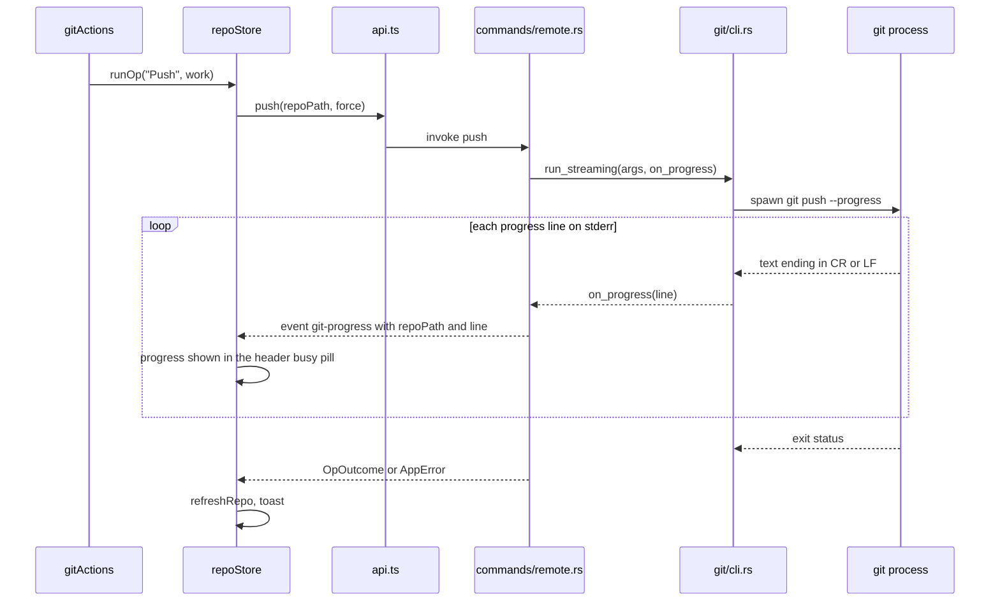
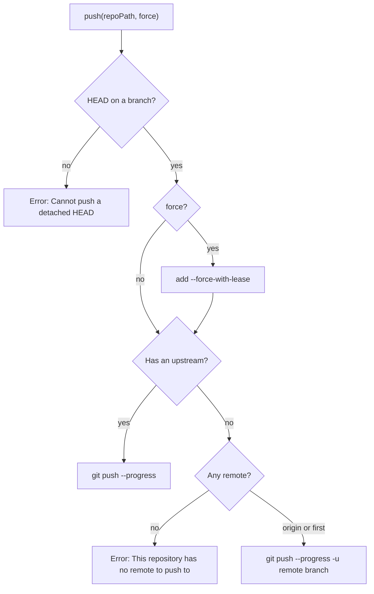

# How remotes work

Fetch, Pull and Push are the git actions that talk to the network. They run the real git command line, stream its progress into the header, and refresh the repository when they finish. For the user side, see [Remotes](../usage/Remotes.md).

## Why we need it

Syncing with a server is where GUI Git clients most often go wrong. Credentials, SSH keys, hooks and signing all live in the user's setup; doing our own networking would mean rebuilding all of it. A slow push also needs feedback, so we show git's own progress lines as they arrive.

## How it works

The actions live in `src/lib/views/gitActions.ts`: `fetchRemote`, `fetchAll`, `pull`, `push`, `publishBranch`, `pushTags` and `syncRepo`. Two places call them:

- **The Git menu** (`menu/menuActions.ts`) calls them without a repository, so they act on the active one. Its Pull... and Push... open dialogs that call `pull_with_options` and `push_with_options`; see [How the Git Menu Works](How-the-Git-Menu-Works.md).
- **The repository rows in Changes** pass their own `repoRoot`: the Sync button, and the **...** > **Pull, Push** submenu. See [How Repository Actions Work](How-Repository-Actions-Work.md).

Each action calls `repoStore.runOp(label, work, successMessage, repoRoot)`. `runOp` wraps `run`, which sets `repoStore.busy`, clears `repoStore.progress`, shows an error toast on failure and refreshes that repository afterwards.

### The commands

- **`fetch_all`** runs `git fetch --progress --all --prune`; **`fetch`** runs `git fetch --progress`, with `--prune` when asked, so git picks the branch's remote (or `origin`).
- **`pull`** runs `git pull --progress`, plus `--rebase` for Pull (Rebase). Its result goes through `outcome()`, so a pull that stops on conflicts returns `OpOutcome { conflicts: true }` instead of an error. `runOp` then shows a "stopped with conflicts" toast, makes the repository active and opens the Conflicts dialog. A plain pull adds no `--rebase` or `--ff` flag, so the user's `pull.rebase` and `pull.ff` config decide.
- **`push`** reads the current branch first. A detached HEAD is refused with a clear message. When the branch has no upstream, `default_remote` picks `origin`, or the first remote, and adds `-u <remote> <branch>`; that is also Publish Branch. Force Push asks first and then adds `--force-with-lease`, never a plain `--force`.
- **`push_tags`** runs `git push --progress --tags`, naming the default remote when the branch has no upstream (git would fall back to `origin`, which may not exist).

`syncRepo` chains them: pull when behind, count `ahead` again, push when ahead, then one toast such as "Pulled 2 commits and pushed 1".

### Streaming progress

`cli::run_streaming` reads git's stderr in small chunks. Git redraws its progress line with a carriage return, so every `\r` or `\n` ends a line and calls `on_progress`. Only lines ending in `\n` are kept in the error text, so a failure is not buried under "Receiving objects" redraws. Stdout is read on its own thread so neither pipe can block git.

Each command is a thin wrapper around a `run_*` function (`run_fetch`, `run_pull`, `run_push`, `run_pull_with_options`...) that takes an `OnProgress` callback. The Tauri commands pass `emitter`, which turns each line into a `git-progress` event with `repoPath` and `line`; the MCP tools pass a quiet one (see [How MCP and CLI Work](How-MCP-and-CLI-Work.md)). `onGitProgress` in `api.ts` listens, and `repoStore` keeps the line only when it belongs to the active repository. The header's busy pill shows it; for another repository it shows the label, such as "Fetch...".

### The git environment

Every git command, not only remote ones, is built by `cli::command`:

- **The git binary** is the first of `/opt/homebrew/bin/git`, `/usr/local/bin/git` and `/usr/bin/git` that exists, else `git`.
- **`PATH`** comes from the login shell: an app started from Finder gets a minimal `PATH`, which breaks hooks that need node. `user_path()` asks `$SHELL -l -c` once, with a 3 second deadline.
- **`GIT_TERMINAL_PROMPT=0`** makes git fail instead of waiting for a password. Authentication relies on the credential helper (for example the macOS keychain) or ssh-agent.
- **`GIT_EDITOR=true`** and **`GIT_SEQUENCE_EDITOR=true`** stop git from opening an editor.
- **stdin is closed** unless `run_with_stdin` passes text (commit messages, hunk staging), so nothing hangs.
- **Every run is recorded** for the Git Console when that setting is on (`git_console::record`); see [How the Git Console Works](How-the-Git-Console-Works.md).

### Ahead and behind

The arrows in the header, the status bar and the Sync button come from the status call (`head_info` in `git/status.rs`) and, per branch, from `refs::read`. Both use git2's `graph_ahead_behind` against the upstream. They update after fetch because `run` refreshes the repository.

## Where the code lives

| File | What it does |
| --- | --- |
| `src-tauri/src/commands/remote.rs` | `fetch`, `fetch_all`, `pull`, `push`, `push_tags`, `default_remote`, the `run_*` functions and the `git-progress` event |
| `src-tauri/src/git/cli.rs` | `command`, `run`, `run_streaming`, `user_path`, git binary lookup |
| `src-tauri/src/commands/mod.rs` | `OpOutcome`, `outcome`, `run_op`, `blocking` |
| `src/lib/api.ts` | `fetch`, `fetchAll`, `pull`, `push`, `pushTags`, `onGitProgress` |
| `src/lib/stores/repo.svelte.ts` | `run`, `runOp`, `busy`, `progress` |
| `src/lib/views/gitActions.ts` | The shared actions, the force push confirm, `syncRepo` |
| `src/lib/views/changes/sync.ts` | Sync plans and their texts |
| `src/lib/views/Header.svelte` | The busy pill |
| `src/lib/ui/toast.svelte.ts`, `src/lib/ui/Toasts.svelte` | The success, info and error toasts that `run` and `runOp` show |

## Design decisions

**Use the git CLI, not libgit2, for the network.** git2 would need its own credential callbacks, SSH setup and hook runner, and would still miss user config.

**Fail fast on prompts.** A missing credential gives a clear error toast instead of a frozen app. An in-app password dialog would mean handling secrets, which we avoid.

**`--force-with-lease` behind a confirm.** A force push is its own item, asks in a danger dialog, and the lease refuses to overwrite commits you have not seen.

**No network buttons in the header.** The header had Fetch, Pull, Push and Stash for the active repository only. The Git menu now covers that case and each repository row covers the others, so the buttons were removed.

**Conflicts are an outcome, not an error.** Pull, merge and rebase can stop halfway on purpose. Returning `OpOutcome` lets the UI guide the user to the conflicts instead of showing a red failure toast.

## Bugs we fixed

None yet.

## Tests

- `src-tauri/src/git/tests.rs`: `run_streaming_push_and_fetch_against_local_remote` pushes and fetches against a local bare remote and checks that progress lines arrive; `run_streaming_failure_carries_git_message` checks that git's error reaches the user; `run_reports_failure_and_stdin_is_passed`; `status_head_ahead_and_behind_upstream`.
- `src-tauri/src/commands/remote.rs`: `pull_merges_or_rebases_as_asked`, `pull_rebase_reports_conflicts`, `fetch_with_prune_drops_deleted_remote_branches`, `fetch_all_remotes_reads_every_remote`, `push_tags_sends_local_tags`, `push_tags_without_upstream_uses_the_only_remote`, `push_publishes_a_branch_without_upstream`, plus the Pull and Push dialog tests.
- `src/lib/views/changes/sync.test.ts`: sync plans, tooltips and the toast text.

Remote tests use a local bare repository from `test_support.rs`, so no network is needed.

## Keeping this page in sync

- Update this page when `commands/remote.rs` or the environment in `git/cli.rs` changes.
- Update [Remotes](../usage/Remotes.md) and [Troubleshooting](../usage/Troubleshooting.md) when errors or buttons change.
- Retake `git-progress.png` when the progress pill changes, and `remotes-pull-push-menu.png` when the **Pull, Push** submenu changes.
- Related: [Backend](Backend.md), [How Branches and Tags Work](How-Branches-and-Tags-Work.md).
